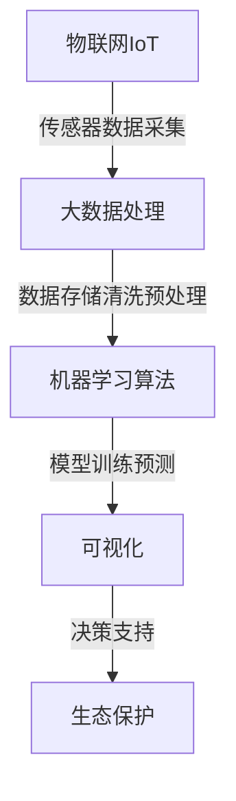
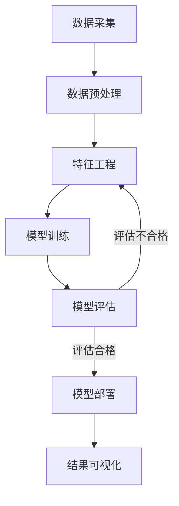

# PredictiveMaintenance技术在生态系统监测领域的应用

## 1.背景介绍

### 1.1 生态系统监测的重要性

生态系统是一个复杂的有机整体,涵盖了地球上所有生物与非生物环境之间的相互关系和相互作用。维护生态系统的平衡与健康对于确保地球可持续发展至关重要。然而,由于人类活动、气候变化和自然灾害等因素的影响,生态系统正面临着前所未有的压力和威胁。

为了有效保护生态系统,我们需要对其进行持续、准确的监测,及时发现问题并采取相应的保护措施。传统的生态系统监测方法通常依赖于人工采样和现场观测,这种方法不仅费时费力,而且难以实现大范围、高频率的监测。因此,我们亟需一种更加智能、高效的生态系统监测技术。

### 1.2 PredictiveMaintenance技术概述

PredictiveMaintenance(预测性维护)技术是一种基于数据分析和机器学习的智能化维护方法。它通过持续收集和分析设备的运行数据,利用机器学习算法预测设备的健康状态和故障风险,从而实现对设备的预防性维护,避免故障发生。

PredictiveMaintenance技术最初被广泛应用于工业领域,用于监测和维护工厂设备。近年来,随着物联网、大数据和人工智能技术的快速发展,PredictiveMaintenance技术也开始在其他领域得到应用,生态系统监测便是其中一个重要的应用场景。

## 2.核心概念与联系  

### 2.1 生态系统监测中的PredictiveMaintenance

将PredictiveMaintenance技术应用于生态系统监测,其核心思想是将生态系统视为一个复杂的"系统",通过部署各种传感器收集生态环境数据,并利用机器学习算法对这些数据进行分析和建模,从而实时监测生态系统的健康状态,预测潜在的生态风险,并为生态保护提供决策支持。

这种基于数据驱动的智能化监测方法,可以克服传统监测方法的诸多不足,实现对生态系统的全天候、大范围、高精度的监测,提高生态保护的效率和质量。

### 2.2 核心概念

实现生态系统PredictiveMaintenance涉及以下几个核心概念:

1. **物联网(IoT)**: 通过部署各种环境传感器(如温度、湿度、噪音、空气质量等)收集生态环境数据,构建生态系统的物联网。

2. **大数据处理**: 由于生态环境数据量巨大、种类繁多,需要采用大数据技术对数据进行存储、清洗和预处理。

3. **机器学习算法**: 利用机器学习算法(如神经网络、决策树等)对生态环境数据进行建模和分析,实现对生态系统状态的实时监测和预测。

4. **可视化**: 将分析结果以直观的方式呈现,如仪表盘、地理信息系统(GIS)等,为生态保护决策提供支持。

这些概念相互关联、环环相扣,共同构建了生态系统PredictiveMaintenance的完整解决方案。



## 3.核心算法原理具体操作步骤

生态系统PredictiveMaintenance的核心是利用机器学习算法对生态环境数据进行建模和分析,以实现对生态系统状态的实时监测和预测。这个过程可以分为以下几个主要步骤:

### 3.1 数据采集

利用物联网技术部署各种环境传感器,收集生态环境数据,包括:

- 气象数据:温度、湿度、降水量、风速等
- 水质数据:pH值、溶解氧、电导率等
- 土壤数据:湿度、养分含量等
- 生物数据:物种分布、数量等
- 其他数据:噪音、空气质量等

### 3.2 数据预处理

由于生态环境数据通常存在噪声、缺失值、异常值等问题,需要进行数据清洗和预处理,包括:

- 数据清洗:去除异常值和重复值
- 缺失值处理:使用插值、均值等方法填补缺失值
- 数据标准化:将数据转换到相同的量纲和分布
- 数据降维:使用PCA、LDA等方法降低数据维度

### 3.3 特征工程

从预处理后的数据中提取有意义的特征,作为机器学习模型的输入。常用的特征包括:

- 时间特征:小时、天、月、季节等
- 统计特征:均值、方差、峰值等
- 频域特征:傅里叶变换后的频率分量
- 其他领域知识特征:专家经验、先验知识等

### 3.4 模型训练

选择合适的机器学习算法,使用标记好的历史数据对模型进行训练,得到能够准确预测生态系统状态的模型。常用算法包括:

- 监督学习:回归、决策树、随机森林等
- 非监督学习:聚类、异常检测等
- 深度学习:卷积神经网络、循环神经网络等

### 3.5 模型评估

使用保留的测试数据对训练好的模型进行评估,计算模型的性能指标,如准确率、精确率、召回率、F1分数等。如果模型性能不理想,需要重新进行特征工程和模型选择。

### 3.6 模型部署

将评估合格的模型部署到生产环境中,实时接收新的传感器数据,对生态系统状态进行实时预测和监控。同时,需要定期对模型进行重新训练,以适应生态环境的变化。

### 3.7 结果可视化

将模型预测结果以直观的方式呈现,如仪表盘、GIS地理信息系统等,为生态保护决策提供支持。同时,可以将异常情况设置预警,提醒相关人员及时采取行动。



## 4.数学模型和公式详细讲解举例说明

在生态系统PredictiveMaintenance中,常用的数学模型和算法包括线性回归、决策树、随机森林、支持向量机、神经网络等。下面以线性回归和决策树为例,详细介绍它们的数学原理和公式。

### 4.1 线性回归

线性回归是一种常用的监督学习算法,它试图找到一个最佳拟合的线性方程,使得输入特征值 $X$ 和目标值 $y$ 之间的残差平方和最小。

对于一个包含 $n$ 个样本和 $m$ 个特征的数据集,线性回归模型可以表示为:

$$y = \theta_0 + \theta_1x_1 + \theta_2x_2 + \cdots + \theta_mx_m$$

其中 $\theta_0, \theta_1, \cdots, \theta_m$ 是需要求解的模型参数。

我们定义代价函数(Cost Function)为:

$$J(\theta) = \frac{1}{2m}\sum_{i=1}^{m}(h_\theta(x^{(i)}) - y^{(i)})^2$$

其中 $h_\theta(x)$ 是模型的预测值,目标是找到能够最小化代价函数的参数 $\theta$。

通过梯度下降法,我们可以迭代地更新参数值:

$$\theta_j := \theta_j - \alpha\frac{\partial}{\partial\theta_j}J(\theta)$$

其中 $\alpha$ 是学习率,决定了每次迭代的步长。

对于线性回归,代价函数关于参数 $\theta_j$ 的偏导数为:

$$\frac{\partial}{\partial\theta_j}J(\theta) = \frac{1}{m}\sum_{i=1}^{m}(h_\theta(x^{(i)}) - y^{(i)})x_j^{(i)}$$

通过不断迭代,我们可以找到使代价函数最小的参数值,得到最佳拟合的线性回归模型。

### 4.2 决策树

决策树是一种常用的监督学习算法,它通过不断划分特征空间,构建一个树状决策结构,用于对新的数据样本进行分类或回归。

决策树的构建过程可以看作是一个递归的特征选择和数据划分的过程。在每个节点,算法会选择一个最优特征,根据该特征的不同取值将数据划分到不同的子节点,直到满足某个停止条件(如最大深度、最小样本数等)。

常用的特征选择标准包括信息增益(Information Gain)和基尼指数(Gini Index)。以信息增益为例,对于一个特征 $A$,其信息增益定义为:

$$\text{Gain}(D, A) = \text{Ent}(D) - \sum_{v=1}^{V}\frac{|D^v|}{|D|}\text{Ent}(D^v)$$

其中 $D$ 是当前数据集, $V$ 是特征 $A$ 的取值个数, $D^v$ 是 $D$ 根据特征 $A$ 取值 $v$ 划分的子集, $\text{Ent}(D)$ 是数据集 $D$ 的信息熵:

$$\text{Ent}(D) = -\sum_{i=1}^{c}p_i\log_2p_i$$

其中 $c$ 是类别个数, $p_i$ 是第 $i$ 类样本在 $D$ 中的比例。

在每个节点,算法会选择信息增益最大的特征进行数据划分,从而最大限度地减少了不确定性。

决策树构建完成后,对于一个新的数据样本,只需要根据特征值从树根遍历到叶子节点,即可得到该样本的预测结果。

通过调整决策树的深度、节点分裂条件等超参数,我们可以控制模型的复杂度,避免过拟合或欠拟合的情况。

## 5.项目实践: 代码实例和详细解释说明

为了更好地理解生态系统PredictiveMaintenance的实现过程,我们以预测某地区的空气质量为例,提供一个基于Python的代码实例。

### 5.1 数据采集和预处理

我们使用来自UCI机器学习数据库的"Air Quality Data Set"数据集,其中包含了意大利一个高度污染的城市在2004年5月至2005年4月期间的空气质量数据。

```python
import pandas as pd

# 读取数据
data = pd.read_csv('AirQualityUCI.csv', delimiter=';')

# 处理缺失值
data = data.dropna()

# 特征选择
features = ['PT08.S1(CO)', 'PT08.S2(NMHC)', 'PT08.S3(NOx)', 'PT08.S4(NO2)',
            'PT08.S5(O3)', 'T', 'RH', 'AH']
target = 'C6H6(GT)'

X = data[features]
y = data[target]
```

### 5.2 特征工程

我们从原始数据中提取一些统计特征,如均值、方差、最大值等,作为模型的输入特征。

```python
from tsfresh import extract_features

extracted_features = extract_features(X, column_id='id', column_sort='time')
```

### 5.3 模型训练和评估

我们使用随机森林回归算法对空气质量进行预测,并使用10折交叉验证评估模型性能。

```python
from sklearn.ensemble import RandomForestRegressor
from sklearn.model_selection import cross_val_score

rf = RandomForestRegressor(n_estimators=100, random_state=42)
scores = cross_val_score(rf, extracted_features, y, cv=10, scoring='neg_mean_squared_error')
print('Random Forest MSE: ', -scores.mean())
```

### 5.4 模型部署

对于新的传感器数据,我们可以使用训练好的模型进行预测。

```python
new_data = ... # 新的传感器数据

new_features = extract_features(new_data, column_id='id', column_sort='time')
predictions = rf.predict(new_features)
```

### 5.5 结果可视化

我们可以将预测结果以时间序列