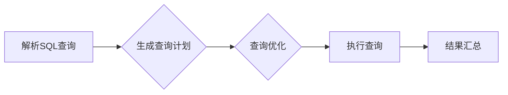

# Presto原理与代码实例讲解

## 1. 背景介绍

随着大数据时代的到来，数据处理和分析需求日益增长。在传统的数据库管理系统（DBMS）中，对于大规模数据的处理往往存在性能瓶颈。为了解决这一问题，Presto应运而生。Presto是一种分布式执行引擎，它能够以非常高的性能处理复杂的SQL查询，同时支持多种数据源，如Hive、Cassandra、关系数据库等。

Presto由Facebook于2013年开源，并迅速在业界得到广泛应用。它具备以下特点：

- **高性能**：Presto能够在亚秒级内完成大规模数据的查询。
- **易用性**：Presto支持标准的SQL语法，易于使用。
- **灵活性**：Presto可以连接多种数据源，如Hive、Cassandra、关系数据库等。
- **可扩展性**：Presto集群可以通过增加节点来水平扩展。

## 2. 核心概念与联系

Presto的核心概念包括：

- **查询执行引擎**：Presto的核心组件，负责解析SQL查询并执行。
- **查询计划**：Presto根据SQL查询生成查询计划，包括执行顺序、数据来源等。
- **分布式计算**：Presto将查询任务分发到集群中的多个节点上并行执行。
- **数据源**：Presto可以连接多种数据源，如Hive、Cassandra、关系数据库等。

Presto的这些核心概念相互联系，共同构成了Presto的高性能和灵活性。

## 3. 核心算法原理具体操作步骤

Presto的核心算法原理如下：

1. **解析SQL查询**：Presto将SQL查询解析成AST（抽象语法树）。
2. **生成查询计划**：根据AST生成查询计划，包括执行顺序、数据来源等。
3. **查询优化**：Presto根据查询计划和数据源的特性进行查询优化。
4. **执行查询**：Presto将查询任务分发到集群中的多个节点上并行执行。
5. **结果汇总**：Presto将各个节点返回的结果进行汇总，生成最终结果。

以下是一个简单的Mermaid流程图，展示了Presto的核心算法步骤：



## 4. 数学模型和公式详细讲解举例说明

Presto在查询优化过程中，会使用一些数学模型和公式，以下是一些常用的例子：

- **代价模型**：Presto使用代价模型来评估不同查询计划的代价，以选择最佳查询计划。
- **代价函数**：Presto定义了代价函数来评估查询计划中的各个操作的成本。
- **缓存策略**：Presto使用缓存策略来优化查询性能，例如LRU（最近最少使用）算法。

以下是一个代价函数的例子：

$$
Cost = \\sum_{i=1}^{n} (Cost_i \\times Prob_i)
$$

其中，$Cost_i$表示第$i$个操作的成本，$Prob_i$表示第$i$个操作发生的概率。

## 5. 项目实践：代码实例和详细解释说明

以下是一个使用Presto查询Hive表的示例：

```sql
SELECT * FROM mydatabase.mytable WHERE mycolumn > 100;
```

在这个示例中，我们查询了名为`mydatabase`的数据库中`mytable`表的`mycolumn`列，并且条件为`mycolumn > 100`。

以下是Presto执行这个查询的步骤：

1. **解析SQL查询**：Presto将SQL查询解析成AST。
2. **生成查询计划**：Presto生成查询计划，包括执行顺序、数据来源等。
3. **查询优化**：Presto根据查询计划和Hive表的特性进行查询优化。
4. **执行查询**：Presto将查询任务分发到集群中的多个节点上并行执行。
5. **结果汇总**：Presto将各个节点返回的结果进行汇总，生成最终结果。

## 6. 实际应用场景

Presto在实际应用中具有广泛的应用场景，以下是一些常见的应用场景：

- **大数据分析**：Presto可以用于对大规模数据进行实时分析和查询。
- **数据仓库**：Presto可以作为数据仓库的查询引擎，支持多种数据源的连接。
- **实时数据处理**：Presto可以用于实时数据处理和查询。

## 7. 工具和资源推荐

以下是一些与Presto相关的工具和资源：

- **Presto官方文档**：https://prestodb.io/docs/current/
- **Presto社区**：https://prestodb.io/community/
- **Presto生态圈**：https://prestodb.io/technology/

## 8. 总结：未来发展趋势与挑战

随着大数据和云计算的发展，Presto在未来将面临以下发展趋势和挑战：

- **支持更多数据源**：Presto将支持更多类型的数据源，如图数据库、区块链等。
- **优化查询性能**：Presto将继续优化查询性能，以满足更多用户的需求。
- **提高易用性**：Presto将继续提高易用性，使其更加易于使用。

## 9. 附录：常见问题与解答

以下是一些关于Presto的常见问题与解答：

**Q：Presto与Hive有什么区别？**

A：Presto和Hive都是用于处理大规模数据的查询引擎。Presto在查询性能上具有优势，但Hive支持更丰富的数据存储格式。

**Q：如何安装Presto？**

A：可以在Presto官网下载安装包，然后按照安装说明进行安装。

**Q：Presto如何与Hive连接？**

A：可以通过配置Presto的连接参数来连接Hive，例如`-- catalogs hive default_catalog=hive catalog_name=hive metastore_uri=thrift://localhost:9083`。

作者：禅与计算机程序设计艺术 / Zen and the Art of Computer Programming