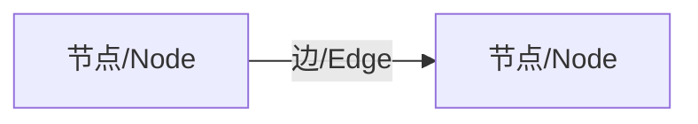
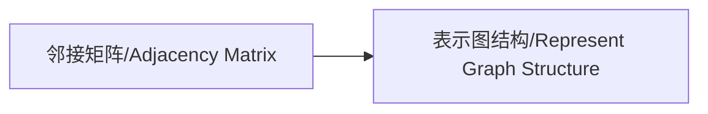
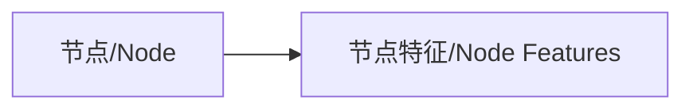
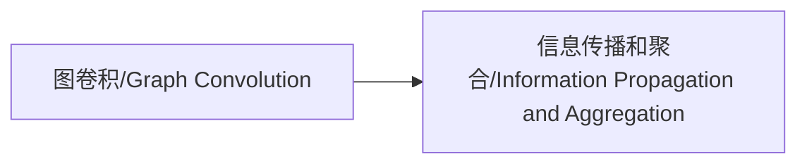
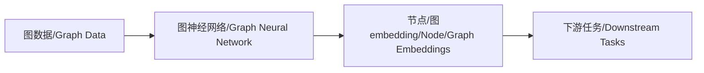
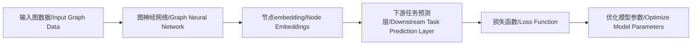

# Python机器学习实战：实战图神经网络(GNN)在社交网络分析中的应用

## 1.背景介绍

### 1.1 社交网络分析的重要性

在当今时代,社交网络已经无处不在,它们影响着我们的生活、工作和社交方式。随着社交媒体平台(如Facebook、Twitter和LinkedIn)的兴起,人们可以轻松地建立和维护联系。然而,这些网络中蕴含着大量有价值的信息,需要进行深入分析来发现隐藏的模式和趋势。

社交网络分析(SNA)是一种研究社会实体(如个人或组织)及其相互关系的方法。它可以帮助我们了解网络结构、识别关键影响者、检测社区和群集等。这种分析在许多领域都有应用,例如:

- **营销**:识别潜在客户,优化营销策略
- **犯罪调查**:揭示犯罪网络和串通关系
- **社会学研究**:研究人际关系和社会动态
- **推荐系统**:基于用户关系提供个性化推荐

### 1.2 图神经网络(GNN)在社交网络分析中的作用

传统的社交网络分析方法通常依赖于手工提取的特征,难以捕捉复杂的网络结构和模式。而图神经网络(GNN)作为一种新兴的深度学习模型,专门用于处理图结构数据,在社交网络分析领域展现出巨大潜力。

GNN可以自动学习节点和边的表示,捕捉网络拓扑结构和节点属性信息。它通过信息传播机制在图上传递和聚合邻居节点的表示,从而生成节点级别和图级别的embedding,捕捉复杂的结构模式。

利用GNN进行社交网络分析,可以解决诸多挑战性任务,例如:

- 节点分类(如用户角色识别)
- 链接预测(如推荐好友关系) 
- 图分类(如检测虚假社交网络)
- 图聚类(如发现社区和群集)

GNN为社交网络分析提供了一种强大而灵活的工具,有望推动这一领域的发展和创新。

## 2.核心概念与联系

在深入探讨GNN在社交网络分析中的应用之前,我们需要先了解一些核心概念和它们之间的联系。

### 2.1 图(Graph)

图是一种非欧几里得数据结构,由节点(Node)和连接节点的边(Edge)组成。在社交网络中,节点可以表示用户,边则表示用户之间的关系(如好友关系)。



### 2.2 邻接矩阵(Adjacency Matrix)

邻接矩阵是表示图结构的一种常用方式。对于一个有N个节点的图,邻接矩阵是一个N×N的矩阵,其中元素A[i,j]表示节点i和节点j之间是否有边连接。



### 2.3 节点特征(Node Features)

除了图结构信息,节点还可以携带额外的特征信息,例如在社交网络中的用户属性(如年龄、性别等)。这些特征对于学习节点表示非常重要。



### 2.4 图卷积(Graph Convolution)

图卷积是GNN中的核心操作,它定义了如何在图上传播和聚合邻居节点的信息。不同的GNN模型采用不同的图卷积方式,例如基于谱域的卷积和基于空间域的卷积。



### 2.5 图神经网络(GNN)

GNN是一种端到端的深度学习模型,可以直接处理图结构数据。它通过堆叠多层图卷积层,学习节点和图的embedding表示,从而完成下游任务(如节点分类、链接预测等)。



这些概念相互关联,共同构建了GNN在社交网络分析中的应用框架。接下来,我们将详细探讨GNN的核心算法原理和实际应用。

## 3.核心算法原理具体操作步骤

图神经网络(GNN)的核心思想是学习节点的embedding表示,这种表示应该能够同时捕捉节点的属性信息和结构信息。为了实现这一目标,GNN采用了一种称为"邻居聚合"(Neighbor Aggregation)的策略。

具体来说,GNN通过以下步骤学习节点的embedding表示:

### 3.1 初始化节点embedding

首先,我们需要为每个节点分配一个初始embedding向量,这个向量可以是随机初始化的,也可以是基于节点属性(如用户信息)计算得到的。

$$\mathbf{h}_v^{(0)} = \mathbf{x}_v$$

其中,$\mathbf{h}_v^{(0)}$表示节点v的初始embedding,$\mathbf{x}_v$表示节点v的属性向量。

### 3.2 邻居聚合

接下来,我们需要聚合每个节点的邻居节点的embedding,以捕捉结构信息。这个过程可以通过图卷积操作来实现。

在第k层图卷积中,节点v的embedding更新如下:

$$\mathbf{h}_v^{(k)} = \gamma\left(\mathbf{h}_v^{(k-1)}, \square_{\mathclap{\mathop{}\limits_{u \in \mathcal{N}(v)}}}\phi\left(\mathbf{h}_u^{(k-1)}, \mathbf{h}_v^{(k-1)}\right)\right)$$

其中:
- $\mathcal{N}(v)$表示节点v的邻居节点集合
- $\phi$是一个可微分函数,用于计算节点v和其邻居节点u之间的消息
- $\square$是一个permutation-invariant函数,用于聚合所有邻居节点的消息
- $\gamma$是一个更新函数,用于根据节点v的上一层embedding和聚合后的邻居消息来更新当前层的embedding

不同的GNN模型采用不同的$\phi$、$\square$和$\gamma$函数,例如:

- **图卷积网络(GCN)**:$\phi$为线性变换,$\square$为求和,$\gamma$为非线性激活函数
- **图注意力网络(GAT)**:$\phi$为线性变换,$\square$为注意力加权求和,$\gamma$为非线性激活函数

### 3.3 堆叠多层图卷积

为了捕捉更高阶的邻居关系,我们可以堆叠多层图卷积。在每一层,节点的embedding都会被邻居节点的embedding所影响,从而逐渐整合局部和全局的结构信息。

$$\mathbf{h}_v^{(K)} = \text{GNN}_\theta\left(\mathbf{h}_v^{(0)}, \mathcal{G}\right)$$

其中,$\mathbf{h}_v^{(K)}$表示经过K层图卷积后节点v的最终embedding,$\theta$是GNN模型的可训练参数,$\mathcal{G}$是输入图结构。

### 3.4 预测和优化

最后,我们可以将学习到的节点embedding输入到下游任务的预测层(如分类器或回归器),并根据监督信号优化GNN模型的参数$\theta$。



通过上述步骤,GNN可以端到端地学习图结构数据的embedding表示,从而完成各种下游任务。在社交网络分析中,这些任务包括但不限于节点分类(如用户角色识别)、链接预测(如好友关系预测)、图分类(如虚假网络检测)和图聚类(如社区发现)等。

## 4.数学模型和公式详细讲解举例说明

在上一节中,我们介绍了GNN的核心算法原理和操作步骤。现在,让我们通过一个具体的数学模型和公式来进一步深入理解GNN的工作机制。

我们将以**图卷积网络(GCN)**为例,这是一种广为人知的GNN模型。GCN的核心思想是通过谱域卷积来传播和聚合邻居节点的信息。

### 4.1 图卷积的数学定义

给定一个无向图$\mathcal{G} = (\mathcal{V}, \mathcal{E})$,其中$\mathcal{V}$是节点集合,$\mathcal{E}$是边集合。我们定义图的邻接矩阵为$\mathbf{A}$,度矩阵为$\mathbf{D}$,其中$\mathbf{D}_{ii} = \sum_j \mathbf{A}_{ij}$。

图卷积操作可以定义为:

$$\mathbf{H}^{(l+1)} = \sigma\left(\widetilde{\mathbf{D}}^{-\frac{1}{2}}\widetilde{\mathbf{A}}\widetilde{\mathbf{D}}^{-\frac{1}{2}}\mathbf{H}^{(l)}\mathbf{W}^{(l)}\right)$$

其中:
- $\mathbf{H}^{(l)}$是第l层的节点embedding矩阵,每一行对应一个节点的embedding向量
- $\widetilde{\mathbf{A}} = \mathbf{A} + \mathbf{I}$是加入自连接的邻接矩阵,确保每个节点至少与自己相连
- $\widetilde{\mathbf{D}}$是$\widetilde{\mathbf{A}}$对应的度矩阵
- $\mathbf{W}^{(l)}$是第l层的可训练权重矩阵
- $\sigma$是一个非线性激活函数,如ReLU

这个公式描述了如何通过邻居节点的embedding来更新当前节点的embedding。具体来说:

1. 首先,将邻接矩阵$\mathbf{A}$归一化,得到$\widetilde{\mathbf{D}}^{-\frac{1}{2}}\widetilde{\mathbf{A}}\widetilde{\mathbf{D}}^{-\frac{1}{2}}$。这一步可以防止梯度爆炸或消失。
2. 将归一化后的邻接矩阵与上一层的节点embedding矩阵$\mathbf{H}^{(l)}$相乘,得到每个节点邻居embedding的加权和。
3. 将加权和乘以可训练权重矩阵$\mathbf{W}^{(l)}$,进行线性变换。
4. 对线性变换的结果应用非线性激活函数$\sigma$,得到当前层的节点embedding矩阵$\mathbf{H}^{(l+1)}$。

通过堆叠多层这样的图卷积操作,GCN可以逐步整合局部和全局的结构信息,学习出高质量的节点embedding表示。

### 4.2 实例说明

为了更好地理解GCN的工作原理,让我们来看一个简单的例子。

假设我们有一个小型社交网络,包含5个用户(节点),如下图所示:

```mermaid
graph LR
A[Alice] -- B[Bob]
B -- C[Charlie]
B -- D[David]
C -- E[Eve]
```

我们将用GCN来学习每个用户的embedding表示,以便进行下游任务(如用户角色识别)。

首先,我们初始化每个节点的embedding向量,假设为随机值:

$$
\begin{aligned}
\mathbf{h}_\text{Alice}^{(0)} &= [0.1, -0.2] \\
\mathbf{h}_\text{Bob}^{(0)} &= [-0.3, 0.4] \\
\mathbf{h}_\text{Charlie}^{(0)} &= [0.5, -0.1] \\
\mathbf{h}_\text{David}^{(0)} &= [-0.2, 0.3] \\
\mathbf{h}_\text{Eve}^{(0)} &= [0.4, -0.4]
\end{aligned}
$$

接下来,我们进行第一层图卷积操作。对于Bob这个节点,我们需要聚合它的邻居节点(Alice、Charlie和David)的embedding,并与自身的embedding相结合。具体计算