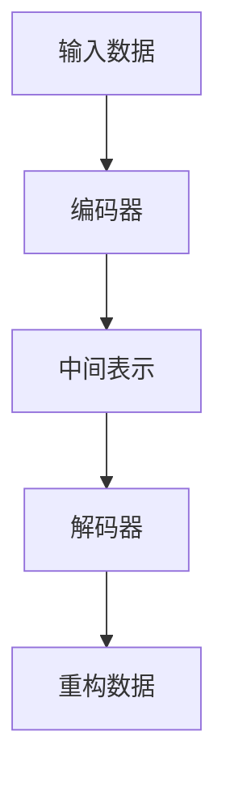

## 1.背景介绍

在大数据时代，我们经常需要处理高维度的数据。然而，高维度数据的处理通常会带来“维度诅咒”的问题，这使得数据处理变得困难。因此，数据降维成为了一种必要的技术。自动编码器（Autoencoder）是一种有效的数据降维方法。它是一种无监督的学习算法，主要通过重构输入数据来学习数据的内在结构。本文将详细介绍自动编码器的原理，并通过Python进行实践。

## 2.核心概念与联系

自动编码器是一种神经网络，它的目标是通过训练学习一个能够重构输入数据的函数。自动编码器由编码器和解码器两部分组成。编码器将输入数据编码为一个低维度的中间表示，解码器则将这个中间表示解码为原始数据。



## 3.核心算法原理具体操作步骤

自动编码器的训练过程可以分为以下几个步骤：

1. 初始化自动编码器的参数。这些参数包括编码器和解码器的权重和偏置。
2. 将输入数据通过编码器编码为中间表示。
3. 将中间表示通过解码器解码为重构数据。
4. 计算重构数据和原始数据之间的差异，这个差异称为重构损失。
5. 通过反向传播算法，根据重构损失更新自动编码器的参数。
6. 重复步骤2到步骤5，直到自动编码器的参数收敛。

## 4.数学模型和公式详细讲解举例说明

自动编码器的重构损失通常使用均方误差（MSE）来计算。假设我们的输入数据是$x$，重构数据是$\hat{x}$，那么重构损失$L$可以表示为：

$$
L = \frac{1}{n}\sum_{i=1}^{n}(x_i - \hat{x_i})^2
$$

其中，$n$是数据的维度。通过最小化重构损失，我们可以训练自动编码器来学习数据的内在结构。

## 5.项目实践：代码实例和详细解释说明

接下来，我们将使用Python和深度学习库Keras来实现一个简单的自动编码器。我们将使用MNIST数据集来训练我们的自动编码器。

首先，我们需要导入必要的库：

```python
import keras
from keras import layers
from keras.datasets import mnist
import numpy as np
```

然后，我们定义我们的自动编码器：

```python
encoding_dim = 32

input_img = keras.Input(shape=(784,))
encoded = layers.Dense(encoding_dim, activation='relu')(input_img)
decoded = layers.Dense(784, activation='sigmoid')(encoded)

autoencoder = keras.Model(input_img, decoded)
```

接着，我们编译我们的模型，并加载MNIST数据集：

```python
autoencoder.compile(optimizer='adam', loss='binary_crossentropy')

(x_train, _), (x_test, _) = mnist.load_data()

x_train = x_train.astype('float32') / 255.
x_test = x_test.astype('float32') / 255.
x_train = x_train.reshape((len(x_train), np.prod(x_train.shape[1:])))
x_test = x_test.reshape((len(x_test), np.prod(x_test.shape[1:])))
```

最后，我们训练我们的自动编码器：

```python
autoencoder.fit(x_train, x_train,
                epochs=50,
                batch_size=256,
                shuffle=True,
                validation_data=(x_test, x_test))
```

## 6.实际应用场景

自动编码器可以应用在许多领域，包括图像降噪、异常检测和推荐系统等。在图像降噪中，自动编码器可以学习图像的内在结构，从而重构出没有噪声的图像。在异常检测中，自动编码器可以通过学习正常数据的内在结构，从而检测出与正常数据有显著差异的异常数据。在推荐系统中，自动编码器可以通过学习用户的行为模式，从而预测用户的未来行为。

## 7.工具和资源推荐

如果你对自动编码器有兴趣，我推荐你查看以下资源：

- Keras: 一个易于使用的深度学习库，有丰富的文档和教程。
- TensorFlow: 一个强大的机器学习库，有许多高级功能，如自动微分和分布式计算。
- PyTorch: 一个灵活的深度学习库，许多研究者都在使用它。

## 8.总结：未来发展趋势与挑战

随着深度学习的发展，自动编码器的应用也越来越广泛。然而，自动编码器也面临一些挑战。首先，自动编码器的训练通常需要大量的数据和计算资源。其次，自动编码器的性能受到编码器和解码器结构的影响，设计一个好的编码器和解码器并不容易。最后，自动编码器的理论理解还不完全，这使得自动编码器的训练和优化变得困难。

## 9.附录：常见问题与解答

**问：自动编码器和PCA有什么区别？**

答：自动编码器和PCA都是数据降维的方法。PCA是一种线性降维方法，它通过找到数据的主成分来降低数据的维度。自动编码器是一种非线性降维方法，它通过训练一个神经网络来学习数据的内在结构。

**问：自动编码器的编码器和解码器需要相同的结构吗？**

答：不需要。自动编码器的编码器和解码器的结构可以不同。然而，如果编码器和解码器的结构相同，那么自动编码器就是一个对称的自动编码器，这样的自动编码器通常更容易训练。

**问：自动编码器可以用于分类任务吗？**

答：可以。自动编码器可以用于分类任务的特征提取。首先，我们可以训练一个自动编码器来学习数据的内在结构。然后，我们可以使用自动编码器的编码器部分来提取数据的特征。最后，我们可以使用这些特征来训练一个分类器。

作者：禅与计算机程序设计艺术 / Zen and the Art of Computer Programming