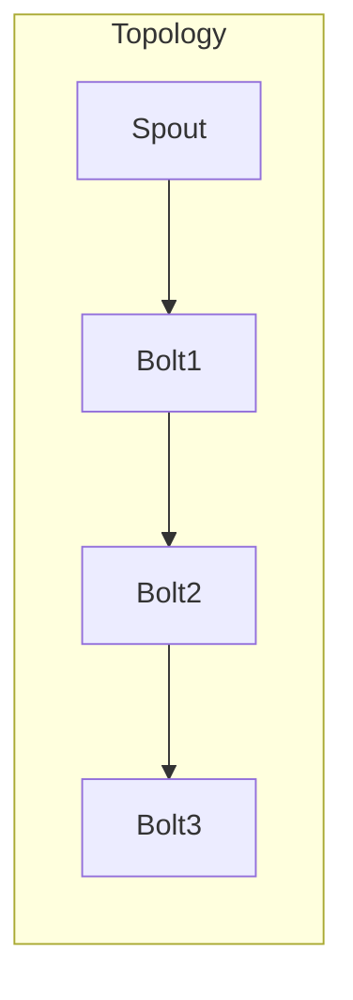
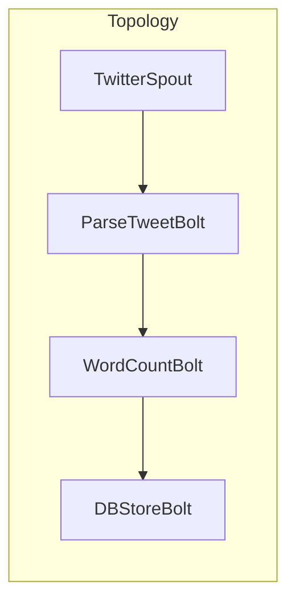

# Storm Topology原理与代码实例讲解

## 1.背景介绍

Apache Storm是一个免费开源的分布式实时计算系统,用于实时处理大量的流数据。它最初由Nathan Marz和团队开发,后捐赠给Apache软件基金会。Storm被设计用于处理大量的高速持续流数据,并且能够在数据到达时进行实时分析和处理。

Storm的应用场景包括实时分析、在线机器学习、持续计算、分布式RPC、ETL等。它具有高可靠性、高可伸缩性、高性能等特点,可以保证数据流的连续性,并提供了可靠的消息处理能力。

Storm Topology是Storm中最核心的概念,它定义了数据从源头到最终目的地的整个流转过程。Topology由Spout(数据源)和Bolt(数据处理单元)组成,数据从Spout发出,经过一个或多个Bolt处理,最终达到目的地。

## 2.核心概念与联系

### 2.1 Topology

Topology是Storm作业的核心抽象,它定义了数据流的流向。一个完整的Topology包含Spout、Bolt、分组策略以及数据流向。



### 2.2 Spout

Spout是Topology的数据源,它从外部系统(如Kafka、分布式文件系统等)读取数据,并将其发送给Topology中的下一个组件。

### 2.3 Bolt  

Bolt是Topology中的处理单元,它对从Spout或其他Bolt发送过来的数据流进行处理,处理完成后可以将结果发送给另一个Bolt,也可以将结果写入外部系统(如HDFS、数据库等)。

### 2.4 分组策略(Stream Grouping)

分组策略定义了Bolt如何从上游组件(Spout或Bolt)接收数据。Storm提供了多种分组策略,如Shuffle分组、Fields分组、All分组等。

### 2.5 Task

Task是Spout或Bolt在执行时的实例。一个Spout或Bolt可能会有多个Task实例在运行。

### 2.6 Worker

Worker是运行Topology组件(Spout或Bolt)任务的JVM进程。一个Worker可能会运行多个Spout或Bolt的Task。

## 3.核心算法原理具体操作步骤

Storm Topology的核心算法原理包括数据流分发、Task调度、容错机制等。下面将详细介绍这些原理及其具体操作步骤。

### 3.1 数据流分发

数据流分发是指将Spout发出的数据流分发给下游Bolt进行处理。Storm采用了一种称为输入流分组(Stream Grouping)的机制来实现这一功能。

输入流分组定义了如何将一个组件的输出流分发给另一个组件的Task。Storm提供了以下几种分组策略:

1. **Shuffle Grouping**:这是默认的分组方式。它将数据流随机均匀地分发给下游Bolt的Task。

2. **Fields Grouping**:根据Tuple中指定的一个或多个字段的值,将相同值的Tuple分发给同一个Task。

3. **All Grouping**:将一个组件的所有输出流复制一份,分发给下游组件的每一个Task。

4. **Global Grouping**:与Fields Grouping类似,但是只有一个Task会处理具有相同字段值的所有Tuple。

5. **Direct Grouping**:这是一种低级分组方式,由发送者决定将Tuple发送给下游组件的哪个Task。

6. **Local or Shuffle Grouping**:如果目标Bolt在同一个Worker进程中,则采用Shuffle方式;否则就使用Fields方式。

下面是一个Shuffle Grouping的示例代码:

```java
TopologyBuilder builder = new TopologyBuilder();

// 定义Spout
builder.setSpout("word-reader",new RandomSentenceSpout(), 2);

// 定义Bolt,并设置Shuffle Grouping
builder.setBolt("word-normalizer", new WordNormalizer())
        .shuffleGrouping("word-reader");
```

### 3.2 Task调度

Storm将Topology中的每个Spout或Bolt实例化为一个或多个Task。这些Task会被分配到集群中的Worker进程上执行。Task调度的目标是实现负载均衡和容错。

Storm采用了一种称为资源空间隔离调度器(Resource Aware Scheduler)的调度算法。这种算法会考虑每个Worker的可用Slot数量,以及Task对CPU、内存等资源的需求,从而实现高效的Task分配。

调度器的工作流程如下:

1. 获取集群的资源情况,包括Worker的可用Slot数量。
2. 获取Topology的组件信息,包括每个组件的并行度(Task数量)、资源需求等。
3. 将Task分配到具有足够资源的Worker进程上。
4. 如果资源不足,则等待Worker资源释放或增加Worker节点。
5. 监控Task的执行情况,如果发生失败则在其他Worker上重新启动该Task。

### 3.3 容错机制

Storm采用了一种称为Tuple树(Tuple Tree)的机制来实现容错。Tuple树记录了每个Tuple在Topology中的处理路径,以及每个Task对该Tuple执行的操作。

当一个Task失败时,Storm会根据Tuple树重新计算并重新发送那些被该Task处理过的Tuple,从而保证了数据的完整性和处理的正确性。

容错机制的具体步骤如下:

1. 每个Bolt在处理一个Tuple时,都会向其他Task发送确认信息(Ack)。
2. 如果一个Task失败,那么它处理过的所有Tuple都会被重新发送给另一个Task进行处理。
3. 新的Task会根据Tuple树中记录的信息,重新执行相应的操作。
4. 如果某个Tuple已经被完全处理,那么它就不会被重新处理。

通过这种机制,Storm可以保证数据流处理的可靠性和容错性。

## 4.数学模型和公式详细讲解举例说明

在Storm Topology中,一些关键概念和算法可以用数学模型和公式来描述和分析。下面将详细讲解这些模型和公式。

### 4.1 并行度(Parallelism)

并行度是指一个Spout或Bolt的Task实例数量。在Storm中,并行度决定了组件的处理能力和容错能力。

如果一个组件的并行度为N,那么它将有N个Task实例在运行。每个Task实例都会独立处理一部分数据流。

假设一个Spout的输出速率为R(条/秒),那么每个Task实例的平均处理速率为:

$$\frac{R}{N}$$

如果我们希望提高Spout的总体处理能力,可以增加它的并行度N。但是,过高的并行度也可能导致过多的资源消耗和调度开销。

对于Bolt组件,并行度也决定了它的容错能力。如果一个Bolt的并行度为N,那么即使有N-1个Task实例失败,Topology也可以继续运行(尽管处理能力会下降)。

因此,确定合适的并行度是Storm Topology设计中一个重要的决策。这需要权衡处理能力、容错能力和资源消耗等因素。

### 4.2 有向无环图(DAG)模型

我们可以将一个Storm Topology看作是一个有向无环图(Directed Acyclic Graph,DAG),其中Spout是源点,Bolt是中间节点或终点。

假设一个Topology有M个Spout和N个Bolt,我们可以用一个有向图G(V,E)来表示,其中:

- V是所有Spout和Bolt的集合,即$V = \{s_1, s_2, ..., s_M, b_1, b_2, ..., b_N\}$。
- E是所有数据流的集合,即$E = \{(u, v) | u \in V, v \in V, u向v发送数据流\}$。

在这个有向图模型中,我们可以分析Topology的一些性质,如:

- 每个Bolt的入度表示它接收数据流的数量。
- 每个Spout的出度表示它发送数据流的数量。
- 一个Bolt的入度为0,表示它是一个Sink(终点),不会将数据发送给其他Bolt。
- 一条路径的长度表示数据流经过的Bolt数量。

有向图模型可以帮助我们更好地理解和优化Topology的结构和数据流向。

### 4.3 资源分配模型

Storm集群中的资源(CPU、内存等)需要在Worker进程和Topology组件之间合理分配,以实现高效的运行。

假设一个Worker进程有C个CPU核心和M兆内存,而一个Topology组件(Spout或Bolt)的Task实例需要$c_i$个CPU核心和$m_i$兆内存。我们可以构建如下资源分配模型:

$$
\begin{aligned}
\max \quad & \sum_{i=1}^{N} x_i \\
\text{s.t.} \quad & \sum_{i=1}^{N} c_i x_i \leq C \\
& \sum_{i=1}^{N} m_i x_i \leq M \\
& x_i \in \mathbb{Z}^+, \forall i \in \{1, 2, ..., N\}
\end{aligned}
$$

其中:

- $x_i$表示第i个组件的Task实例数量。
- 目标函数$\sum_{i=1}^{N} x_i$表示要最大化总的Task实例数量。
- 约束条件$\sum_{i=1}^{N} c_i x_i \leq C$和$\sum_{i=1}^{N} m_i x_i \leq M$分别表示CPU和内存资源的限制。

通过求解这个整数规划问题,我们可以得到一种最优的资源分配方案,使得在资源约束下,Topology的总体并行度最大化。

这只是一个简化的资源分配模型,在实际场景中可能需要考虑更多的因素,如网络带宽、磁盘I/O等。

## 5.项目实践:代码实例和详细解释说明

为了更好地理解Storm Topology的原理和使用方法,我们将通过一个实际项目案例来进行讲解。这个项目是一个基于Storm的实时Twitter数据处理系统。

### 5.1 项目概述

该项目的目标是从Twitter的流数据API获取实时推文数据,对推文内容进行实时分析和统计,并将结果存储到数据库中。

整个Topology的结构如下:



其中:

- `TwitterSpout`从Twitter API获取实时推文数据,作为数据源。
- `ParseTweetBolt`对推文内容进行解析和清洗,提取出单词。
- `WordCountBolt`统计每个单词出现的次数。
- `DBStoreBolt`将单词计数结果存储到数据库中。

### 5.2 代码实现

下面是该项目的核心代码,我们将逐步解释每个组件的实现。

#### 5.2.1 TwitterSpout

`TwitterSpout`是一个实现了`IRichSpout`接口的Spout,它从Twitter API获取实时推文数据,并将其作为Tuple发送出去。

```java
public class TwitterSpout extends BaseRichSpout {
    // Twitter API相关配置
    // ...

    public void nextTuple() {
        // 从Twitter API获取推文数据
        Status status = getNextTweetFromTwitterAPI();
        
        // 将推文数据封装为Tuple
        List<Object> tweetData = new ArrayList<Object>();
        tweetData.add(status.getUser().getScreenName());
        tweetData.add(status.getText());
        
        // 发送Tuple
        Utils.sleep(100);
        collector.emit(new Values(tweetData));
    }

    // 其他方法...
}
```

在`nextTuple()`方法中,我们从Twitter API获取一条推文数据,将其封装为一个包含用户名和推文内容的Tuple,并使用`collector.emit()`方法发送出去。

#### 5.2.2 ParseTweetBolt

`ParseTweetBolt`是一个实现了`IRichBolt`接口的Bolt,它接收`TwitterSpout`发送的推文数据,对推文内容进行解析和清洗,提取出单词。

```java
public class ParseTweetBolt extends BaseRichBolt {
    public void execute(Tuple input) {
        // 获取推文内容
        String tweet = input.getString(1);
        
        // 对推文内容进行解析和清洗
        List<String> words = parseAndCleanTweet(tweet);
        
        // 将单词发送给下游Bolt
        for (String word : words) {
            collector.emit(new Values(word));
        }
        
        // 确认Tuple已处理
        collector.ack(input);
    }

    // 其他方法...
}
```

在`execute()`方法中,我们从输入的Tuple中获取推文内容