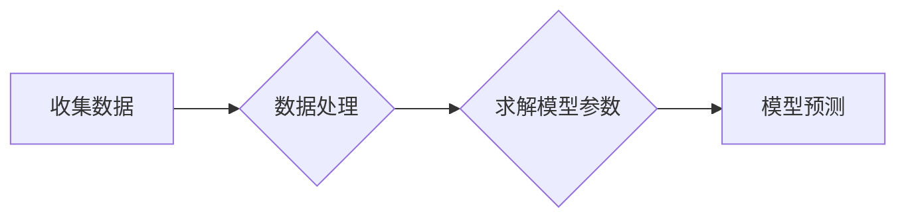

# Supervised Learning

## 1. 背景介绍

监督学习（Supervised Learning）是机器学习领域中的一种重要方法，它通过学习具有标签的训练数据来构建模型，从而实现对新数据的预测或分类。随着大数据时代的到来，监督学习在各个领域得到了广泛应用，如图像识别、自然语言处理、推荐系统等。

本文将深入探讨监督学习的基本概念、核心算法原理、数学模型、项目实践、实际应用场景、工具和资源推荐，以及未来发展趋势与挑战。

## 2. 核心概念与联系

### 2.1 监督学习的基本概念

监督学习是一种通过学习带有标签的训练数据来构建模型的方法。在这种方法中，训练数据包括输入特征和对应的输出标签。

### 2.2 监督学习的联系

监督学习与其他机器学习方法有着密切的联系，如：

- 无监督学习：无监督学习通过学习未标记的数据来发现数据中的模式，与监督学习不同，无监督学习不需要标签信息。
- 强化学习：强化学习通过与环境的交互来学习策略，使其能够最大化长期奖励。

## 3. 核心算法原理具体操作步骤

### 3.1 线性回归

线性回归是一种常用的监督学习算法，其基本原理是通过学习线性模型来预测目标变量的值。

- 模型公式：$$y = w_0 + w_1x_1 + w_2x_2 + \\ldots + w_nx_n$$
- 操作步骤：
  1. 收集训练数据，包括输入特征和输出标签。
  2. 使用最小二乘法求解线性模型参数。
  3. 使用训练好的模型进行预测。

### 3.2 逻辑回归

逻辑回归是一种常用的分类算法，其基本原理是通过学习逻辑模型来预测目标变量的概率。

- 模型公式：$$P(y=1|x) = \\frac{1}{1 + e^{-\\beta_0 + \\beta_1x_1 + \\beta_2x_2 + \\ldots + \\beta_nx_n}}$$
- 操作步骤：
  1. 收集训练数据，包括输入特征和输出标签。
  2. 使用最大似然估计求解逻辑模型参数。
  3. 使用训练好的模型进行预测。

### 3.3 支持向量机（SVM）

支持向量机是一种常用的分类和回归算法，其基本原理是在特征空间中找到最优的超平面来分隔数据。

- 模型公式：$$f(x) = \\text{sign}(\\beta_0 + \\beta_1x_1 + \\beta_2x_2 + \\ldots + \\beta_nx_n)$$
- 操作步骤：
  1. 收集训练数据，包括输入特征和输出标签。
  2. 使用支持向量机算法求解模型参数。
  3. 使用训练好的模型进行预测。

## 4. 数学模型和公式详细讲解举例说明

### 4.1 线性回归

以房价预测为例，假设我们有以下数据：

| 输入特征 | 输出标签 |
| :----: | :----: |
| 面积 | 价格 |
| 100 | 5000 |
| 200 | 12000 |
| 300 | 18000 |
| 400 | 25000 |

使用线性回归算法来预测房价。首先，我们需要将数据转换为 Mermaid 流程图：



接下来，使用最小二乘法求解线性模型参数：

$$w_1 = \\frac{\\sum{(x_i - \\bar{x})(y_i - \\bar{y})}}{\\sum{(x_i - \\bar{x})^2}}$$
$$w_0 = \\bar{y} - w_1\\bar{x}$$

其中，$\\bar{x}$ 和 $\\bar{y}$ 分别为输入特征和输出标签的均值。

最后，使用训练好的模型进行预测：

$$y = w_0 + w_1x$$

### 4.2 逻辑回归

以性别分类为例，假设我们有以下数据：

| 输入特征 | 输出标签 |
| :----: | :----: |
| 年龄 | 性别 |
| 25 | 男 |
| 30 | 女 |
| 35 | 男 |
| 40 | 女 |

使用逻辑回归算法来分类性别。首先，我们需要将数据转换为 Mermaid 流程图：


接下来，使用最大似然估计求解逻辑模型参数：

$$\\theta = \\arg\\max_{\\theta} \\prod{(P(y|x; \\theta)^{I(y=1)} \\cdot P(y|x; \\theta)^{1-I(y=1)})}$$

其中，$I(y=1)$ 表示输出标签为 1 的指示函数。

最后，使用训练好的模型进行预测：

$$P(y=1|x) = \\frac{1}{1 + e^{-\\theta^T x}}$$

## 5. 项目实践：代码实例和详细解释说明

### 5.1 线性回归

以下是一个使用 Python 和 scikit-learn 库实现的线性回归代码示例：

```python
from sklearn.linear_model import LinearRegression
import numpy as np

# 收集数据
X = np.array([[100], [200], [300], [400]])
y = np.array([5000, 12000, 18000, 25000])

# 求解模型参数
model = LinearRegression()
model.fit(X, y)

# 模型预测
y_pred = model.predict(X)

print(\"预测结果：\", y_pred)
```

### 5.2 逻辑回归

以下是一个使用 Python 和 scikit-learn 库实现的逻辑回归代码示例：

```python
from sklearn.linear_model import LogisticRegression
import numpy as np

# 收集数据
X = np.array([[25], [30], [35], [40]])
y = np.array([1, 0, 1, 0])

# 求解模型参数
model = LogisticRegression()
model.fit(X, y)

# 模型预测
y_pred = model.predict(X)

print(\"预测结果：\", y_pred)
```

## 6. 实际应用场景

监督学习在各个领域都有广泛的应用，以下是一些常见的应用场景：

- 图像识别：使用卷积神经网络（CNN）进行图像分类、目标检测等。
- 自然语言处理：使用循环神经网络（RNN）进行文本分类、情感分析等。
- 推荐系统：使用协同过滤算法进行商品推荐、电影推荐等。
- 医疗诊断：使用深度学习算法进行疾病诊断、药物研发等。

## 7. 工具和资源推荐

### 7.1 工具

- Python：一种广泛应用于机器学习领域的编程语言。
- scikit-learn：一个包含各种机器学习算法的 Python 库。
- TensorFlow：一个用于机器学习的开源框架，支持深度学习。
- PyTorch：另一个用于机器学习的开源框架，具有灵活的动态计算图。

### 7.2 资源

- Coursera：提供各种机器学习课程的平台。
- Udacity：提供各种在线课程和纳米学位。
- fast.ai：提供深度学习课程和资源。
- arXiv：一个包含最新研究论文的预印本平台。

## 8. 总结：未来发展趋势与挑战

随着人工智能技术的不断发展，监督学习在未来将面临以下发展趋势与挑战：

- 深度学习：深度学习在监督学习中的应用越来越广泛，未来将继续推动监督学习的发展。
- 集成学习：集成学习方法可以将多个模型的预测结果进行融合，提高预测准确率。
- 可解释性：提高模型的可解释性，使模型更加透明、可靠。
- 模型压缩：降低模型的复杂度，使其能够应用于资源受限的设备。

## 9. 附录：常见问题与解答

### 9.1 为什么要使用监督学习？

监督学习可以有效地从训练数据中学习到有价值的模式，从而实现对新数据的预测或分类。

### 9.2 监督学习有哪些常见算法？

监督学习有许多常见算法，如线性回归、逻辑回归、支持向量机、决策树、随机森林等。

### 9.3 如何评估监督学习模型的性能？

可以使用交叉验证、准确率、召回率、F1 分数等指标来评估监督学习模型的性能。

作者：禅与计算机程序设计艺术 / Zen and the Art of Computer Programming