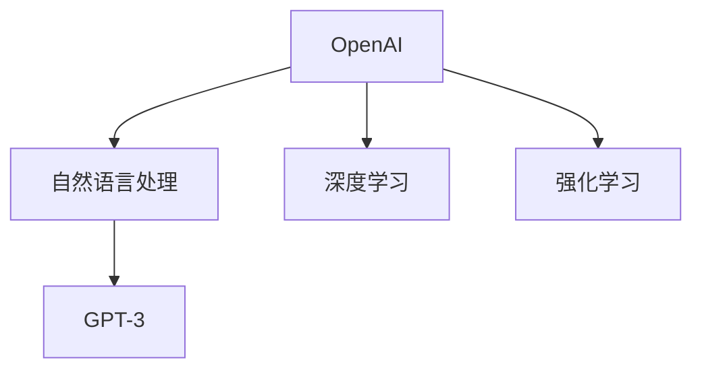

## 1.背景介绍

OpenAI，这家成立于2015年的独立非营利人工智能研究机构，以其开放、协作的研究风格和卓越的科研成果在全球范围内享有盛誉。OpenAI的使命是确保人工智能的广泛应用能够造福全人类，避免任何有害的用途或者不公平的资源分配。OpenAI的主要产品包括GPT-3、DALL-E、CLIP等，这些产品在语言处理、图像生成、多模态学习等方面都展现出了强大的能力。

## 2.核心概念与联系

OpenAI的研究领域主要集中在自然语言处理、深度学习、强化学习等领域。其中，GPT-3是OpenAI最为人所知的产品之一，它是一个基于Transformer架构的大规模自然语言处理模型，能够生成极为逼真的人类语言。



## 3.核心算法原理具体操作步骤

GPT-3的核心算法是基于Transformer的自回归语言模型。它的训练过程包括以下几个步骤：

1. 数据准备：收集大量的文本数据，这些数据可以来自互联网上的各种公开资源。
2. 预处理：将文本数据转化为模型可以处理的形式，包括分词、编码等步骤。
3. 模型训练：使用Transformer架构和自回归的训练方式，训练模型预测下一个词的概率分布。
4. 微调：根据特定任务的需要，对模型进行微调，使其能够更好地完成任务。

## 4.数学模型和公式详细讲解举例说明

GPT-3的数学模型主要基于Transformer架构。Transformer架构中的核心是自注意力机制（Self-Attention Mechanism），其数学表达式如下：

$$
\text{Attention}(Q, K, V) = \text{softmax}\left(\frac{QK^T}{\sqrt{d_k}}\right)V
$$

其中，$Q$、$K$、$V$分别代表查询（Query）、键（Key）、值（Value），$d_k$是键的维度。这个公式表达了自注意力机制的基本思想：通过计算查询和键的点积来得到权重，然后用这个权重对值进行加权求和。

## 5.项目实践：代码实例和详细解释说明

在实际项目中，我们可以使用OpenAI提供的API来调用GPT-3模型。以下是一个简单的示例：

```python
import openai

openai.api_key = 'your-api-key'

response = openai.Completion.create(
  engine="text-davinci-002",
  prompt="Translate the following English text to French: '{}'",
  max_tokens=60
)

print(response.choices[0].text.strip())
```

这段代码首先设置了API密钥，然后调用了`Completion.create`方法来生成一段文本。在这个例子中，我们让GPT-3将一段英文翻译成法文。

## 6.实际应用场景

OpenAI的产品在很多场景中都有应用，例如：

1. 自动文本生成：使用GPT-3生成文章、诗歌、故事等。
2. 机器翻译：使用GPT-3进行语言之间的翻译。
3. 图像生成：使用DALL-E生成各种风格的图片。
4. 游戏AI：使用强化学习训练游戏AI。

## 7.工具和资源推荐

1. OpenAI API：OpenAI提供的API，可以方便地调用他们的模型。
2. Hugging Face Transformers：一个包含了大量预训练模型的库，包括GPT-3。
3. PyTorch：一个强大的深度学习框架，可以用来训练自己的模型。

## 8.总结：未来发展趋势与挑战

OpenAI在人工智能领域的研究和应用无疑是领先的，但也面临着一些挑战，例如如何确保AI的公平性、如何避免AI的滥用等。未来，OpenAI将继续致力于开发更先进的AI技术，并且将这些技术用于造福全人类。

## 9.附录：常见问题与解答

1. Q: OpenAI的模型可以用于商业用途吗？
   A: OpenAI的模型可以用于商业用途，但需要遵守OpenAI的使用协议。

2. Q: GPT-3的训练需要多少数据？
   A: GPT-3的训练需要大量的文本数据，具体数量取决于训练的目标和需求。

作者：禅与计算机程序设计艺术 / Zen and the Art of Computer Programming