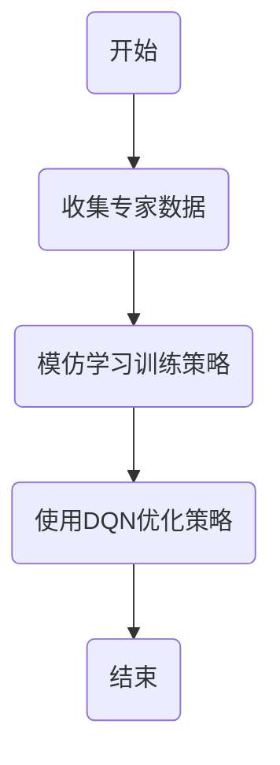

## 1.背景介绍

在人工智能领域，深度强化学习（DRL）已经在许多任务中表现出色，例如在游戏、机器人控制以及自动驾驶等方面。然而，尽管DRL在许多任务中取得了巨大的成功，但它仍然面临着许多挑战，如样本效率低、需要大量的探索等。为了解决这些问题，模仿学习（Imitation Learning，IL）被引入到DRL中。

模仿学习是一种监督学习方法，它试图通过模仿专家的行为来学习策略。这种方法可以有效地利用专家的知识，提高学习效率，减少探索的需要。本文将深入探讨DQN和模仿学习的结合，以及如何利用专家知识进行训练。

## 2.核心概念与联系

### 2.1 深度Q网络（DQN）

深度Q网络是一种结合了深度学习和Q学习的方法，它使用深度神经网络来近似Q函数。DQN的主要优点是它可以处理高维度和连续的状态空间，而传统的Q学习方法无法处理这样的问题。

### 2.2 模仿学习

模仿学习是一种通过模仿专家的行为来学习策略的方法。在模仿学习中，我们首先收集专家的行为数据，然后训练一个模型来模仿这些行为。这种方法可以有效地利用专家的知识，提高学习效率，减少探索的需要。

### 2.3 DQN与模仿学习的结合

DQN和模仿学习可以结合在一起，形成一种新的学习方法。在这种方法中，我们首先使用模仿学习来初始化策略，然后使用DQN来优化这个策略。这种方法可以有效地利用专家的知识，提高学习效率，同时还能利用DQN的优点，处理高维度和连续的状态空间。

下面是这种结合方法的Mermaid流程图：



## 3.核心算法原理具体操作步骤

### 3.1 收集专家数据

首先，我们需要收集专家的行为数据。这些数据可以是专家在执行任务时的状态和动作，也可以是专家的决策过程。

### 3.2 模仿学习训练策略

然后，我们使用这些专家数据来训练一个模型，这个模型的目标是尽可能地模仿专家的行为。这个模型可以是一个神经网络，也可以是其他的模型。

### 3.3 使用DQN优化策略

在模仿学习训练出的策略的基础上，我们使用DQN来进一步优化这个策略。这个过程可以看作是一个强化学习的过程，我们通过不断地和环境交互，不断地更新我们的策略，使得我们的策略可以在环境中获得更好的回报。

## 4.数学模型和公式详细讲解举例说明

### 4.1 DQN的数学模型

在DQN中，我们使用一个深度神经网络$Q(s,a;\theta)$来近似Q函数，其中$s$是状态，$a$是动作，$\theta$是神经网络的参数。我们的目标是找到一组参数$\theta$，使得我们的神经网络可以尽可能地近似真实的Q函数。这个问题可以通过最小化以下的损失函数来解决：

$$
L(\theta) = E_{s,a,r,s'}[(r + \gamma \max_{a'} Q(s',a';\theta^-) - Q(s,a;\theta))^2]
$$

其中$r$是奖励，$s'$是下一个状态，$a'$是在状态$s'$下可能的动作，$\gamma$是折扣因子，$\theta^-$是目标网络的参数。

### 4.2 模仿学习的数学模型

在模仿学习中，我们的目标是训练一个模型$f(s;\phi)$来模仿专家的行为，其中$s$是状态，$\phi$是模型的参数。这个问题可以通过最小化以下的损失函数来解决：

$$
L(\phi) = E_{s,a^*}[(a^* - f(s;\phi))^2]
$$

其中$a^*$是专家在状态$s$下的动作。

## 5.项目实践：代码实例和详细解释说明

在实际的项目中，我们可以使用Python和深度学习框架（如TensorFlow或PyTorch）来实现DQN和模仿学习的结合。以下是一个简单的示例：

```python
# 收集专家数据
expert_data = collect_expert_data()

# 模仿学习训练策略
policy = imitation_learning(expert_data)

# 使用DQN优化策略
optimized_policy = dqn_optimization(policy)
```

在这个示例中，`collect_expert_data`函数用于收集专家数据，`imitation_learning`函数用于模仿学习训练策略，`dqn_optimization`函数用于使用DQN优化策略。这只是一个简单的示例，实际的项目可能会更复杂。

## 6.实际应用场景

DQN和模仿学习的结合在许多实际应用中都有广泛的应用，例如在游戏、机器人控制以及自动驾驶等方面。在游戏中，我们可以使用模仿学习来学习专家的策略，然后使用DQN来优化这个策略，使得我们的策略可以在游戏中获得更好的分数。在机器人控制中，我们可以使用模仿学习来学习专家的控制策略，然后使用DQN来优化这个策略，使得我们的机器人可以更好地完成任务。在自动驾驶中，我们可以使用模仿学习来学习专家的驾驶策略，然后使用DQN来优化这个策略，使得我们的自动驾驶系统可以更好地驾驶汽车。

## 7.工具和资源推荐

在实际的项目中，我们可以使用以下的工具和资源来帮助我们实现DQN和模仿学习的结合：

- Python：Python是一种广泛用于科学计算和人工智能的编程语言，它有许多用于深度学习和强化学习的库和框架。
- TensorFlow和PyTorch：TensorFlow和PyTorch是两种广泛用于深度学习的框架，它们都有许多用于实现DQN和模仿学习的功能。
- OpenAI Gym：OpenAI Gym是一个用于强化学习的环境库，它有许多预定义的环境，我们可以在这些环境中训练和测试我们的策略。

## 8.总结：未来发展趋势与挑战

DQN和模仿学习的结合是一个有前景的研究方向，它结合了DQN的优点和模仿学习的优点，可以有效地利用专家的知识，提高学习效率，处理高维度和连续的状态空间。然而，这个方法仍然面临着许多挑战，例如如何收集高质量的专家数据，如何有效地结合DQN和模仿学习，如何处理大规模的状态空间和动作空间等。这些问题需要我们在未来的研究中进一步探讨和解决。

## 9.附录：常见问题与解答

Q：DQN和模仿学习的结合有什么优点？

A：DQN和模仿学习的结合可以有效地利用专家的知识，提高学习效率，处理高维度和连续的状态空间。

Q：DQN和模仿学习的结合在什么场景下有用？

A：DQN和模仿学习的结合在许多场景下都有用，例如在游戏、机器人控制以及自动驾驶等方面。

作者：禅与计算机程序设计艺术 / Zen and the Art of Computer Programming