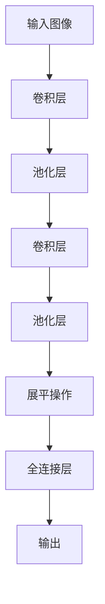

# 一切皆是映射：卷积神经网络(CNNs)在图像处理中的应用

## 1.背景介绍

### 1.1 图像处理的重要性

在当今数字时代,图像处理已经无处不在,从智能手机拍照到医疗影像诊断,从自动驾驶汽车到卫星遥感,图像处理技术扮演着关键角色。有效地从图像中提取有价值的信息对于诸多领域都具有重要意义。

### 1.2 传统图像处理方法的局限性  

早期的图像处理方法主要依赖于手工设计的特征提取算法和分类器,如霍夫变换、SIFT等。这些方法需要大量的领域知识和人工参与,并且难以很好地处理复杂的图像数据。随着图像数据的快速增长和复杂性的提高,传统方法遇到了瓶颈。

### 1.3 深度学习的兴起

近年来,深度学习技术在计算机视觉领域取得了巨大成功,尤其是卷积神经网络(Convolutional Neural Networks, CNNs)在图像处理任务中表现出色。CNNs能够自动从数据中学习特征表示,并对复杂的视觉模式进行建模,从而极大地推动了图像处理的发展。

## 2.核心概念与联系

### 2.1 卷积神经网络的基本结构

卷积神经网络是一种专门用于处理网格数据(如图像)的深度神经网络。它主要由以下几个关键组件构成:

1. **卷积层(Convolutional Layer)**: 通过滑动卷积核在输入数据上执行卷积操作,提取局部特征。
2. **池化层(Pooling Layer)**: 对卷积层的输出进行下采样,减小特征图的维度,提高计算效率。
3. **全连接层(Fully Connected Layer)**: 将特征图展平,并与传统的神经网络层相连,用于分类或回归任务。

这些组件按照一定的顺序堆叠,形成了端到端的卷积神经网络模型。



### 2.2 卷积操作:局部连接与权值共享

卷积操作是CNN的核心,它通过滑动卷积核在输入数据上执行元素级乘积和求和操作,提取局部特征。这种操作具有两个关键属性:

1. **局部连接(Local Connectivity)**: 每个神经元仅与输入数据的局部区域相连,从而捕捉局部模式。
2. **权值共享(Weight Sharing)**: 在同一个卷积核内,神经元共享相同的权值,大大减少了需要学习的参数数量。

这两个属性使得CNN能够有效地捕捉空间和时间上的局部相关性,并具有一定的平移不变性。

### 2.3 池化层:特征映射

池化层通过对卷积层的输出进行下采样,减小特征图的维度,从而提高计算效率并增强模型的鲁棒性。常见的池化操作包括最大池化(Max Pooling)和平均池化(Average Pooling)。

池化层实现了一种特征映射(Feature Mapping),将低级特征映射到更高级、更抽象的特征表示,使得网络能够逐层捕捉更加复杂的视觉模式。

## 3.核心算法原理具体操作步骤

### 3.1 卷积层的前向传播

卷积层的前向传播过程包括以下步骤:

1. 初始化卷积核的权值,通常使用小的随机值。
2. 对输入数据(如图像)进行零填充(Zero-Padding),以控制输出特征图的空间维度。
3. 将卷积核滑动到输入数据的每个位置,执行元素级乘积和求和操作,得到一个输出特征图(Feature Map)。
4. 对输出特征图施加激活函数(如ReLU),增加非线性。
5. 重复步骤3和4,使用多个不同的卷积核,得到多个输出特征图。

数学上,卷积操作可以表示为:

$$
(I * K)(i, j) = \sum_{m} \sum_{n} I(i+m, j+n) K(m, n)
$$

其中 $I$ 是输入数据, $K$ 是卷积核, $(i, j)$ 是输出特征图的位置坐标。

### 3.2 池化层的前向传播

池化层的前向传播过程包括以下步骤:

1. 将输入特征图划分为多个不重叠的小区域(如2x2)。
2. 对每个小区域执行池化操作(如最大池化或平均池化),得到一个输出值。
3. 将所有输出值组合成一个下采样后的特征图。

数学上,最大池化操作可以表示为:

$$
\text{max_pool}(X)_{i,j} = \max_{m=0, \dots, f-1 \\ n=0, \dots, f-1} X_{i \times s + m, j \times s + n}
$$

其中 $X$ 是输入特征图, $f$ 是池化窗口大小, $s$ 是步长。

### 3.3 全连接层的前向传播

全连接层的前向传播过程与传统的神经网络相似:

1. 将输入特征图展平为一维向量。
2. 对输入向量执行矩阵乘法操作,得到输出向量。
3. 对输出向量施加激活函数(如Softmax),得到最终的输出。

数学上,全连接层的计算可以表示为:

$$
y = f(Wx + b)
$$

其中 $x$ 是输入向量, $W$ 是权重矩阵, $b$ 是偏置向量, $f$ 是激活函数。

### 3.4 反向传播和权值更新

CNN的训练过程采用反向传播算法,通过计算损失函数对权值的梯度,并使用优化算法(如随机梯度下降)更新权值,从而minimizeimize损失函数。

反向传播的核心思想是链式法则,通过对计算图进行反向传播,计算每个参数对最终损失的梯度。然后,根据梯度更新参数,使得损失函数最小化。

## 4.数学模型和公式详细讲解举例说明

### 4.1 卷积层的数学模型

卷积层的数学模型可以表示为:

$$
y_{ij}^l = f\left(\sum_{a=0}^{F_h-1} \sum_{b=0}^{F_w-1} w_{ab}^{l} x_{i+a, j+b}^{l-1} + b^l\right)
$$

其中:

- $y_{ij}^l$ 是第 $l$ 层的输出特征图在位置 $(i, j)$ 处的值
- $x^{l-1}$ 是第 $l-1$ 层的输入特征图
- $w^l$ 是第 $l$ 层的卷积核权值
- $b^l$ 是第 $l$ 层的偏置项
- $F_h, F_w$ 分别是卷积核的高度和宽度
- $f$ 是激活函数,通常使用ReLU: $f(x) = \max(0, x)$

例如,对于一个 $5 \times 5$ 的输入特征图和一个 $3 \times 3$ 的卷积核,卷积操作的计算过程如下:

```
输入特征图:
[[ 0  1  2  3  4]
 [ 5  6  7  8  9]
 [10 11 12 13 14]
 [15 16 17 18 19]
 [20 21 22 23 24]]

卷积核:
[[1 0 1]
 [0 1 0]
 [1 0 1]]

输出特征图:
[[ 6  9 12 21 16]
 [21 27 33 45 39]
 [36 45 54 69 62]
 [51 63 75 93 85]
 [36 45 54 69 62]]
```

在上面的例子中,输出特征图的每个元素是通过将卷积核滑动到输入特征图的对应位置,执行元素级乘积和求和操作得到的。

### 4.2 池化层的数学模型

池化层的数学模型取决于使用的池化操作。对于最大池化,模型可以表示为:

$$
y_{ij}^l = \max_{a=0, \dots, F_h-1 \\ b=0, \dots, F_w-1} x_{i \times s + a, j \times s + b}^{l-1}
$$

其中:

- $y_{ij}^l$ 是第 $l$ 层的输出特征图在位置 $(i, j)$ 处的值
- $x^{l-1}$ 是第 $l-1$ 层的输入特征图
- $F_h, F_w$ 分别是池化窗口的高度和宽度
- $s$ 是池化窗口的步长

例如,对于一个 $4 \times 4$ 的输入特征图,使用 $2 \times 2$ 的最大池化窗口和步长为 2,池化操作的计算过程如下:

```
输入特征图:
[[ 1  2  3  4]
 [ 5  6  7  8]
 [ 9 10 11 12]
 [13 14 15 16]]

输出特征图:
[[ 6  8]
 [14 16]]
```

在上面的例子中,输出特征图的每个元素是通过在输入特征图的对应区域内取最大值得到的。

### 4.3 全连接层的数学模型

全连接层的数学模型与传统的神经网络相同,可以表示为:

$$
y = f(Wx + b)
$$

其中:

- $y$ 是输出向量
- $x$ 是输入向量
- $W$ 是权重矩阵
- $b$ 是偏置向量
- $f$ 是激活函数,通常使用Softmax函数进行分类任务

例如,对于一个二分类问题,输入向量维度为 $1024$,输出维度为 $2$,全连接层的计算过程如下:

```
输入向量 x: [0.1, 0.2, ..., 0.9]  # 维度为 1024

权重矩阵 W: [[0.1, 0.2, ..., 0.9],
             [0.2, 0.3, ..., 0.8]]  # 维度为 1024 x 2

偏置向量 b: [0.1, 0.2]  # 维度为 2

输出向量 y = f(Wx + b)
           = Softmax([0.1 * 0.1 + 0.2 * 0.2 + ... + 0.9 * 0.9 + 0.1,
                      0.1 * 0.2 + 0.2 * 0.3 + ... + 0.9 * 0.8 + 0.2])
           = [0.51, 0.49]
```

在上面的例子中,输出向量 $y$ 的两个元素分别表示输入样本属于两个类别的概率。通过对 $y$ 应用 Softmax 函数,可以将其转换为合法的概率分布。

## 5.项目实践:代码实例和详细解释说明

为了更好地理解卷积神经网络的工作原理,我们将使用 PyTorch 框架构建一个简单的 CNN 模型,并在 MNIST 手写数字识别任务上进行训练和测试。

### 5.1 导入所需库

```python
import torch
import torch.nn as nn
import torch.optim as optim
from torchvision import datasets, transforms
```

### 5.2 定义 CNN 模型

```python
class CNN(nn.Module):
    def __init__(self):
        super(CNN, self).__init__()
        self.conv1 = nn.Conv2d(1, 16, kernel_size=3, padding=1)
        self.pool1 = nn.MaxPool2d(2, 2)
        self.conv2 = nn.Conv2d(16, 32, kernel_size=3, padding=1)
        self.pool2 = nn.MaxPool2d(2, 2)
        self.fc1 = nn.Linear(32 * 7 * 7, 128)
        self.fc2 = nn.Linear(128, 10)

    def forward(self, x):
        x = self.pool1(torch.relu(self.conv1(x)))
        x = self.pool2(torch.relu(self.conv2(x)))
        x = x.view(-1, 32 * 7 * 7)
        x = torch.relu(self.fc1(x))
        x = self.fc2(x)
        return x
```

在上面的代码中,我们定义了一个简单的 CNN 模型,包含两个卷积层、两个池化层和两个全连接层。

- `nn.Conv2d` 定义了一个二维卷积层,参数分别是输入通道数、输出通道