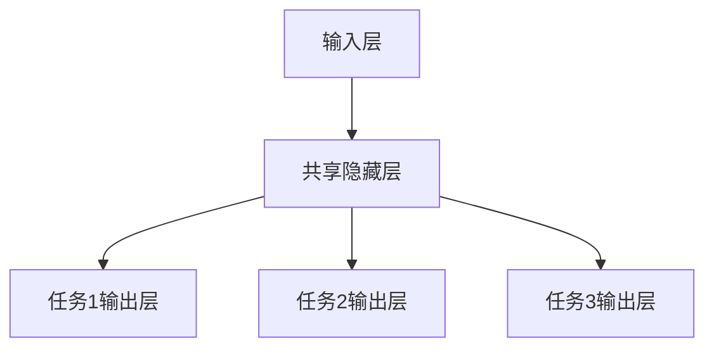
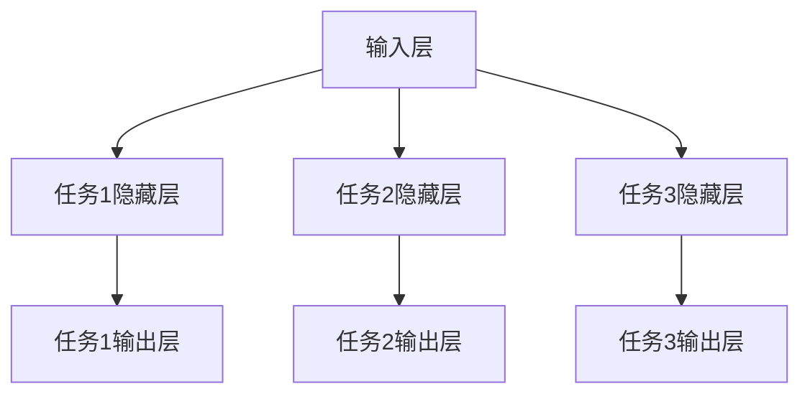
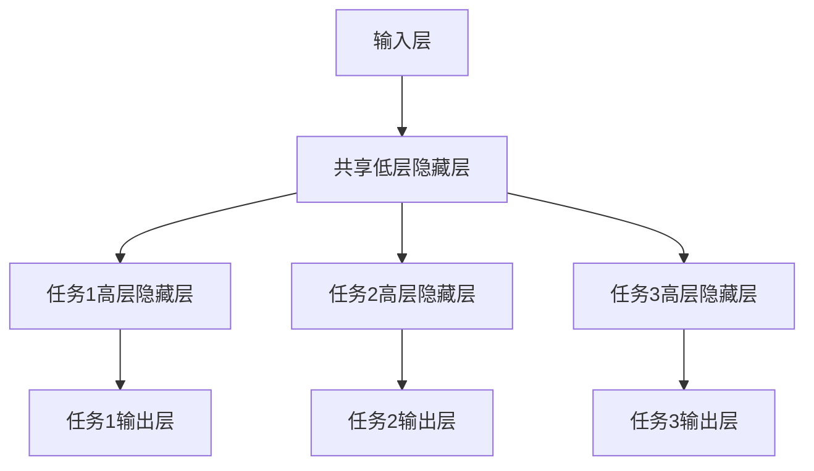
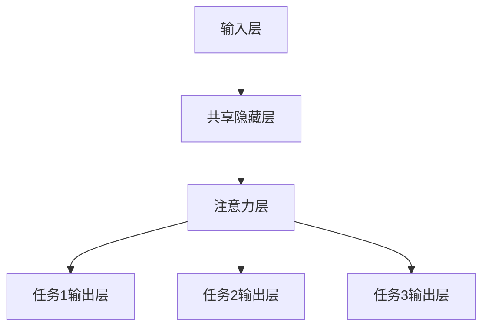

# 一切皆是映射：多任务学习与神经网络的协同训练

## 1. 背景介绍

### 1.1 人工智能的新时代

在过去的几十年里，人工智能领域取得了长足的进步。从最初的专家系统和机器学习算法,到近年来深度学习的崛起,人工智能技术已经渗透到我们生活的方方面面。然而,传统的机器学习方法往往专注于解决单一任务,这种"一个模型对应一个任务"的范式在实际应用中存在一些局限性。

### 1.2 多任务学习的兴起

随着数据量的激增和计算能力的提高,研究人员开始探索能够同时解决多个相关任务的机器学习模型。这种被称为"多任务学习"(Multi-Task Learning, MTL)的范式旨在利用不同任务之间的相关性,提高模型的泛化能力和数据利用效率。多任务学习的核心思想是:通过在相关任务之间共享表示层,模型可以捕捉到不同任务之间的共性,从而提高了学习效率和模型性能。

### 1.3 神经网络的协同训练

在深度学习时代,神经网络成为了多任务学习的理想选择。神经网络具有强大的表示学习能力,能够自动从数据中提取出有用的特征表示。通过在不同任务之间共享部分网络层,神经网络可以实现多任务学习的协同训练。这种协同训练方式不仅能够提高模型的泛化能力,还能够减少计算资源的消耗,提高训练效率。

## 2. 核心概念与联系

### 2.1 多任务学习的形式化定义

在形式化定义中,多任务学习可以被描述为:给定 $N$ 个相关的监督学习任务 $\{T_i\}_{i=1}^N$,其中每个任务 $T_i$ 由一个训练数据集 $D_i$ 和一个学习目标 $f_i$ 组成。多任务学习的目标是通过在这些任务之间共享表示层或模型参数,学习一组函数 $\{f_i\}_{i=1}^N$,使得在所有任务上的总体性能优于单独训练每个任务的模型。

### 2.2 多任务学习的优势

相比于独立地训练多个单任务模型,多任务学习具有以下优势:

1. **数据利用效率提高**: 通过在相关任务之间共享表示层,多任务学习可以更有效地利用数据,提高了数据的利用效率。
2. **泛化能力增强**: 由于不同任务之间存在一定的相关性,共享表示层可以捕捉到这些任务之间的共性,从而提高了模型的泛化能力。
3. **计算资源节省**: 多任务学习只需要训练一个模型,而不是为每个任务分别训练一个模型,从而节省了计算资源。
4. **知识迁移**: 在多任务学习过程中,不同任务之间会发生知识迁移,有利于提高模型在数据稀缺任务上的性能。

### 2.3 多任务学习与迁移学习的关系

多任务学习与迁移学习(Transfer Learning)是两个密切相关但又有所区别的概念。迁移学习旨在利用在源域(source domain)上学习到的知识,来提高在目标域(target domain)上的学习效果。而多任务学习则是在多个相关任务之间共享表示层或模型参数,实现协同训练。

在某些情况下,多任务学习可以被视为一种特殊的迁移学习形式,其中源域和目标域分别对应于不同的任务。但是,多任务学习更强调在多个任务之间的相互促进和知识共享,而不是单向的知识迁移。

## 3. 核心算法原理具体操作步骤

### 3.1 硬参数共享

硬参数共享是多任务学习中最直接的方法。在这种方法中,不同任务共享整个神经网络的隐藏层参数,只有输出层的参数是特定于每个任务的。这种方法的优点是简单高效,但缺点是假设所有任务都共享相同的表示,这可能会限制模型在某些任务上的表现。

### 3.2 软参数共享

软参数共享是一种更加灵活的方法。在这种方法中,每个任务都有自己的隐藏层参数,但是这些参数受到一个正则化项的约束,使得它们彼此之间保持相似性。这种方法允许每个任务学习到特定于自己的表示,同时也能够从其他任务中获益。

### 3.3 层级共享

层级共享是一种折中的方法。在这种方法中,神经网络被分为几个层级,低层次的层级是共享的,而高层次的层级是特定于每个任务的。这种方法假设不同任务在低层次上共享相似的表示,而在高层次上则有所不同。

### 3.4 注意力机制

除了上述共享参数的方法之外,注意力机制也被广泛应用于多任务学习中。注意力机制可以自适应地为不同任务分配不同的权重,从而实现更加灵活的表示共享。

### 3.5 损失函数设计

在多任务学习中,损失函数的设计也是一个关键问题。最常见的方法是将不同任务的损失函数加权求和,作为整个模型的损失函数。权重可以是预先设定的固定值,也可以是根据任务的重要性或难易程度动态调整的。

$$
\mathcal{L}_{total} = \sum_{i=1}^{N} \lambda_i \mathcal{L}_i(f_i(x), y_i)
$$

其中 $\mathcal{L}_i$ 是第 $i$ 个任务的损失函数, $\lambda_i$ 是对应的权重系数。

另一种方法是引入一个额外的正则化项,鼓励不同任务之间的表示相似性。这种方法可以促进知识在任务之间的迁移,但也可能过度约束模型,影响其在单个任务上的表现。

## 4. 数学模型和公式详细讲解举例说明

### 4.1 硬参数共享模型

硬参数共享模型是多任务学习中最简单的模型之一。假设我们有 $N$ 个相关的监督学习任务 $\{T_i\}_{i=1}^N$,每个任务 $T_i$ 由一个训练数据集 $D_i = \{(x_j^i, y_j^i)\}_{j=1}^{m_i}$ 和一个学习目标 $f_i$ 组成。硬参数共享模型可以表示为:

$$
f_i(x) = g_i(h(x; \theta_h); \theta_{g_i})
$$

其中 $h(x; \theta_h)$ 是共享的隐藏层函数,参数为 $\theta_h$; $g_i(\cdot; \theta_{g_i})$ 是特定于任务 $i$ 的输出层函数,参数为 $\theta_{g_i}$。

在训练过程中,我们需要最小化所有任务的总损失函数:

$$
\mathcal{L}_{total}(\theta_h, \{\theta_{g_i}\}_{i=1}^N) = \sum_{i=1}^{N} \sum_{j=1}^{m_i} \mathcal{L}_i(f_i(x_j^i), y_j^i)
$$

其中 $\mathcal{L}_i$ 是第 $i$ 个任务的损失函数。

硬参数共享模型的优点是简单高效,但缺点是假设所有任务都共享相同的表示,这可能会限制模型在某些任务上的表现。

### 4.2 软参数共享模型

软参数共享模型是一种更加灵活的多任务学习模型。在这种模型中,每个任务都有自己的隐藏层参数,但是这些参数受到一个正则化项的约束,使得它们彼此之间保持相似性。

具体来说,软参数共享模型可以表示为:

$$
f_i(x) = g_i(h_i(x; \theta_{h_i}); \theta_{g_i})
$$

其中 $h_i(x; \theta_{h_i})$ 是第 $i$ 个任务的隐藏层函数,参数为 $\theta_{h_i}$; $g_i(\cdot; \theta_{g_i})$ 是第 $i$ 个任务的输出层函数,参数为 $\theta_{g_i}$。

在训练过程中,我们需要最小化所有任务的总损失函数,同时加入一个正则化项,鼓励不同任务之间的隐藏层参数相似:

$$
\mathcal{L}_{total}(\{\theta_{h_i}, \theta_{g_i}\}_{i=1}^N) = \sum_{i=1}^{N} \sum_{j=1}^{m_i} \mathcal{L}_i(f_i(x_j^i), y_j^i) + \lambda \sum_{i=1}^{N} \sum_{j=i+1}^{N} \Omega(\theta_{h_i}, \theta_{h_j})
$$

其中 $\Omega(\cdot, \cdot)$ 是一个度量不同参数之间差异的函数,例如 $L_2$ 范数; $\lambda$ 是正则化项的权重系数。

软参数共享模型允许每个任务学习到特定于自己的表示,同时也能够从其他任务中获益。但是,这种模型也会增加计算复杂度和内存消耗。

### 4.3 层级共享模型

层级共享模型是一种折中的多任务学习模型。在这种模型中,神经网络被分为几个层级,低层次的层级是共享的,而高层次的层级是特定于每个任务的。

具体来说,层级共享模型可以表示为:

$$
f_i(x) = g_i(h_i(h_0(x; \theta_0); \theta_{h_i}); \theta_{g_i})
$$

其中 $h_0(x; \theta_0)$ 是共享的低层隐藏层函数,参数为 $\theta_0$; $h_i(\cdot; \theta_{h_i})$ 是第 $i$ 个任务的高层隐藏层函数,参数为 $\theta_{h_i}$; $g_i(\cdot; \theta_{g_i})$ 是第 $i$ 个任务的输出层函数,参数为 $\theta_{g_i}$。

在训练过程中,我们需要最小化所有任务的总损失函数:

$$
\mathcal{L}_{total}(\theta_0, \{\theta_{h_i}, \theta_{g_i}\}_{i=1}^N) = \sum_{i=1}^{N} \sum_{j=1}^{m_i} \mathcal{L}_i(f_i(x_j^i), y_j^i)
$$

层级共享模型假设不同任务在低层次上共享相似的表示,而在高层次上则有所不同。这种模型在一定程度上平衡了模型复杂度和表示能力。

## 5. 项目实践: 代码实例和详细解释说明

在这一部分,我们将通过一个具体的项目实践来演示如何使用PyTorch实现多任务学习模型。我们将基于一个自然语言处理任务,同时解决文本分类和序列标注两个任务。

### 5.1 数据准备

我们使用一个包含产品评论的数据集,其中每个评论都有一个情感标签(正面或负面)和一个命名实体标注序列。我们将情