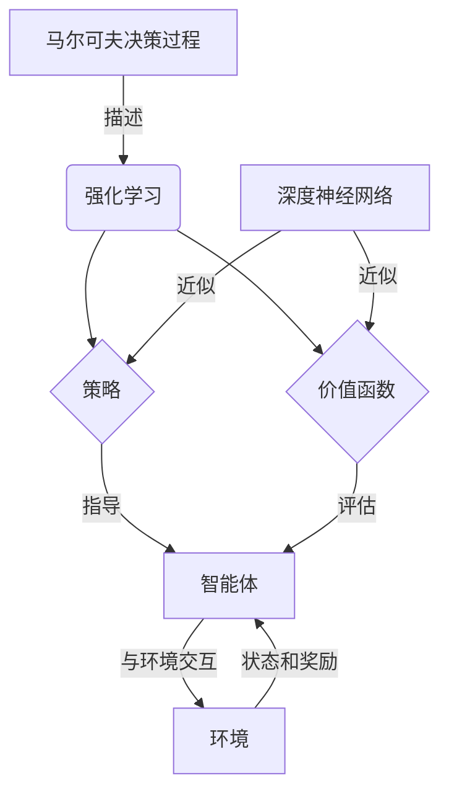

# 一切皆是映射：强化学习基础及其与深度学习的结合

## 1. 背景介绍

### 1.1 人工智能的发展历程

人工智能(Artificial Intelligence, AI)是当代科技发展的重要领域,其目标是开发能够模拟人类智能的理论、方法、技术及应用系统。自20世纪50年代诞生以来,人工智能经历了多个发展阶段,从早期的专家系统、机器学习,到近年来的深度学习等,不断推动着技术的进步和应用的扩展。

### 1.2 强化学习的重要性

在人工智能的多个分支中,强化学习(Reinforcement Learning, RL)是一种基于环境交互的机器学习方法,旨在让智能体(Agent)通过试错学习,获得最优策略以实现特定目标。强化学习具有广阔的应用前景,如机器人控制、游戏AI、自动驾驶、智能调度等领域。

### 1.3 深度学习的兴起

近年来,以深度神经网络为核心的深度学习(Deep Learning)技术取得了突破性进展,在计算机视觉、自然语言处理等领域展现出卓越的性能。深度学习能够从大量数据中自动学习特征表示,极大提高了机器学习模型的性能。

### 1.4 强化学习与深度学习的结合

强化学习和深度学习的结合,被称为深度强化学习(Deep Reinforcement Learning, DRL),是当前人工智能研究的前沿领域。深度强化学习利用深度神经网络来近似强化学习中的策略或值函数,从而提高了学习效率和性能,扩展了强化学习的应用范围。

## 2. 核心概念与联系

### 2.1 马尔可夫决策过程

马尔可夫决策过程(Markov Decision Process, MDP)是强化学习的数学基础,描述了智能体与环境之间的交互过程。MDP由状态集合、动作集合、状态转移概率和奖励函数组成,用于建模序列决策问题。

### 2.2 策略和价值函数

策略(Policy)是智能体在各个状态下选择行动的规则,而价值函数(Value Function)则用于评估状态或状态-行动对的长期回报。强化学习的目标是找到一个最优策略,使得智能体能够获得最大的累积奖励。

### 2.3 深度神经网络

深度神经网络(Deep Neural Network, DNN)是深度学习的核心模型,由多层神经元组成,能够自动从数据中学习特征表示。常见的深度神经网络包括卷积神经网络(CNN)、循环神经网络(RNN)和transformer等。

### 2.4 深度强化学习

深度强化学习将深度神经网络应用于强化学习中,用于近似策略或价值函数。通过端到端的训练,深度神经网络可以直接从原始输入(如图像、语音等)中学习特征,从而提高了强化学习的性能和泛化能力。



## 3. 核心算法原理具体操作步骤

### 3.1 强化学习算法框架

强化学习算法通常遵循以下框架:

1. 初始化智能体和环境
2. 对于每个时间步:
   - 智能体根据当前状态和策略选择行动
   - 环境根据行动转移到新状态,并返回奖励
   - 智能体观察新状态和奖励,更新策略或价值函数
3. 直到达到终止条件

### 3.2 价值函数近似

由于状态空间通常很大,无法精确表示价值函数。因此,我们使用函数近似器(如深度神经网络)来近似价值函数。常见的算法包括:

- Q-Learning: 使用Q函数(状态-行动值函数)近似,通过贝尔曼方程进行迭代更新。
- Deep Q-Network (DQN): 使用深度神经网络来近似Q函数,通过经验回放和目标网络提高稳定性。

### 3.3 策略梯度算法

另一种方法是直接学习策略,使用策略梯度算法来优化策略参数,最大化累积奖励的期望。常见算法包括:

- REINFORCE: 使用蒙特卡罗策略梯度进行更新。
- Actor-Critic: 同时学习策略(Actor)和价值函数(Critic),利用价值函数的优势来减小策略梯度的方差。
- Proximal Policy Optimization (PPO): 通过约束新旧策略的差异来提高稳定性和样本效率。

### 3.4 探索与利用权衡

在强化学习中,智能体需要在探索(尝试新的行动以获取更多信息)和利用(根据已有知识选择最佳行动)之间进行权衡。常用的探索策略包括ε-greedy和软更新等。

### 3.5 经验回放和目标网络

为了提高数据利用率和算法稳定性,深度强化学习中常采用经验回放(Experience Replay)和目标网络(Target Network)等技术。经验回放存储过去的经验,以便重复利用;目标网络则用于计算目标值,减小相关更新的variance。

## 4. 数学模型和公式详细讲解举例说明

### 4.1 马尔可夫决策过程

马尔可夫决策过程可以用元组 $(S, A, P, R, \gamma)$ 来表示,其中:

- $S$ 是状态集合
- $A$ 是行动集合
- $P(s'|s,a)$ 是状态转移概率,表示在状态 $s$ 下执行行动 $a$ 后转移到状态 $s'$ 的概率
- $R(s,a,s')$ 是奖励函数,表示在状态 $s$ 下执行行动 $a$ 后转移到状态 $s'$ 时获得的奖励
- $\gamma \in [0,1)$ 是折现因子,用于平衡即时奖励和长期奖励

### 4.2 价值函数

在强化学习中,我们定义了状态值函数 $V(s)$ 和状态-行动值函数 $Q(s,a)$,分别表示在状态 $s$ 下遵循某策略 $\pi$ 所能获得的累积折现奖励的期望值:

$$V^{\pi}(s) = \mathbb{E}_{\pi}\left[\sum_{t=0}^{\infty}\gamma^t r_{t+1} | s_0=s\right]$$
$$Q^{\pi}(s,a) = \mathbb{E}_{\pi}\left[\sum_{t=0}^{\infty}\gamma^t r_{t+1} | s_0=s, a_0=a\right]$$

其中,价值函数满足贝尔曼方程:

$$V^{\pi}(s) = \sum_{a}\pi(a|s)\sum_{s'}P(s'|s,a)\left[R(s,a,s') + \gamma V^{\pi}(s')\right]$$
$$Q^{\pi}(s,a) = \sum_{s'}P(s'|s,a)\left[R(s,a,s') + \gamma \sum_{a'}\pi(a'|s')Q^{\pi}(s',a')\right]$$

### 4.3 策略梯度

策略梯度算法直接优化策略参数 $\theta$,使累积折现奖励的期望值最大化:

$$\max_{\theta} J(\theta) = \mathbb{E}_{\tau \sim \pi_{\theta}}\left[\sum_{t=0}^{\infty}\gamma^t r_t\right]$$

其中,$ \tau = (s_0, a_0, r_0, s_1, a_1, r_1, ...)$ 是一个轨迹序列。根据策略梯度定理,我们可以计算梯度:

$$\nabla_{\theta}J(\theta) = \mathbb{E}_{\tau \sim \pi_{\theta}}\left[\sum_{t=0}^{\infty}\nabla_{\theta}\log\pi_{\theta}(a_t|s_t)Q^{\pi_{\theta}}(s_t,a_t)\right]$$

### 4.4 Q-Learning

Q-Learning 是一种基于价值函数的强化学习算法,通过迭代更新来近似 $Q^*$ 函数:

$$Q(s_t,a_t) \leftarrow Q(s_t,a_t) + \alpha\left[r_{t+1} + \gamma\max_{a'}Q(s_{t+1},a') - Q(s_t,a_t)\right]$$

其中,$ \alpha $ 是学习率,$ r_{t+1} $ 是立即奖励,$ \gamma\max_{a'}Q(s_{t+1},a') $ 是估计的最大未来奖励。

在深度 Q-Learning 中,我们使用深度神经网络来近似 $Q$ 函数,通过最小化损失函数进行训练:

$$L(\theta) = \mathbb{E}_{(s,a,r,s')\sim D}\left[\left(r + \gamma\max_{a'}Q(s',a';\theta^-) - Q(s,a;\theta)\right)^2\right]$$

其中,$ D $ 是经验回放池,$ \theta^- $ 是目标网络的参数。

## 5. 项目实践:代码实例和详细解释说明

以下是一个使用 PyTorch 实现的简单 Deep Q-Network (DQN) 示例,用于解决 CartPole 问题。

```python
import torch
import torch.nn as nn
import torch.optim as optim
import gym
import random
import collections

# 定义 DQN 网络
class DQN(nn.Module):
    def __init__(self, state_dim, action_dim):
        super(DQN, self).__init__()
        self.fc1 = nn.Linear(state_dim, 64)
        self.fc2 = nn.Linear(64, action_dim)

    def forward(self, x):
        x = torch.relu(self.fc1(x))
        return self.fc2(x)

# 定义 DQN 算法
class DQNAgent:
    def __init__(self, state_dim, action_dim):
        self.action_dim = action_dim
        self.q_net = DQN(state_dim, action_dim)
        self.target_q_net = DQN(state_dim, action_dim)
        self.optimizer = optim.Adam(self.q_net.parameters(), lr=0.001)
        self.replay_buffer = collections.deque(maxlen=10000)
        self.gamma = 0.99
        self.epsilon = 1.0
        self.epsilon_decay = 0.995

    def get_action(self, state):
        if random.random() < self.epsilon:
            return random.randint(0, self.action_dim - 1)
        else:
            state = torch.tensor(state, dtype=torch.float32).unsqueeze(0)
            q_values = self.q_net(state)
            return torch.argmax(q_values).item()

    def update(self, transition):
        state, action, next_state, reward, done = transition
        self.replay_buffer.append(transition)

        if len(self.replay_buffer) < 1000:
            return

        minibatch = random.sample(self.replay_buffer, 64)
        state_batch = torch.tensor([data[0] for data in minibatch])
        action_batch = torch.tensor([data[1] for data in minibatch])
        next_state_batch = torch.tensor([data[2] for data in minibatch])
        reward_batch = torch.tensor([data[3] for data in minibatch])
        done_batch = torch.tensor([data[4] for data in minibatch], dtype=torch.float32)

        q_values = self.q_net(state_batch).gather(1, action_batch.unsqueeze(1)).squeeze(1)
        next_q_values = self.target_q_net(next_state_batch).max(1)[0]
        expected_q_values = reward_batch + self.gamma * next_q_values * (1 - done_batch)

        loss = nn.MSELoss()(q_values, expected_q_values)
        self.optimizer.zero_grad()
        loss.backward()
        self.optimizer.step()

        if self.epsilon > 0.05:
            self.epsilon *= self.epsilon_decay

        if len(self.replay_buffer) % 1000 == 0:
            self.target_q_net.load_state_dict(self.q_net.state_dict())

# 训练 DQN agents
env = gym.make('CartPole-v1')
state_dim = env.observation_space.shape[0]
action_dim = env.action_space.n
agent = DQNAgent(state_dim, action_dim)

for episode in range(1000):
    state = env.reset()
    total_reward = 0
    done = False

    while not done:
        action = agent.get_action(state)
        next_state, reward, done, _ = env.step(action)
        agent.update((state, action, next_state, reward, done))
        state = next_state
        total_reward += reward

    print(f'Episode {episode}, Total Reward: {total_reward}')
```

在这个示例中,我们首先定义了一个简单的全连接深度神经网络 `DQN` 作为