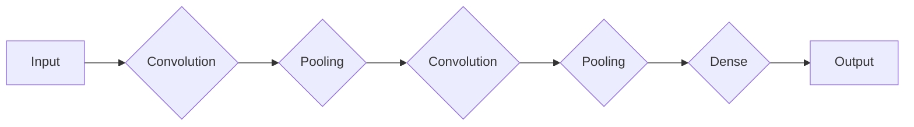

# 云计算环境中AI代理工作流的设计与执行

## 1. 背景介绍

随着云计算技术的飞速发展，其在各行各业中的应用越来越广泛。人工智能（AI）作为一种强大的技术手段，与云计算的结合，使得AI代理工作流在数据处理、业务流程优化等方面展现出巨大的潜力。本文将深入探讨云计算环境中AI代理工作流的设计与执行，以期为相关领域的研究和实践提供参考。

## 2. 核心概念与联系

### 2.1 云计算

云计算是一种基于互联网的计算模式，它将计算资源（如服务器、存储、网络等）集中部署在云端，用户可以通过互联网按需获取所需的资源和服务。云计算具有高度的可扩展性、弹性和灵活性，能够满足大规模、实时数据处理的需求。

### 2.2 人工智能

人工智能是指模拟、延伸和扩展人的智能的理论、方法、技术及应用。AI在图像识别、自然语言处理、机器学习等领域取得了显著成果，为各行各业带来了变革。

### 2.3 AI代理工作流

AI代理工作流是指在云计算环境中，通过人工智能技术实现自动化处理业务流程的一种方式。它包括数据采集、数据处理、模型训练、模型推理、结果分析等环节，旨在提高工作效率、降低成本、提升业务品质。

## 3. 核心算法原理具体操作步骤

### 3.1 数据采集

数据采集是AI代理工作流的第一步，主要涉及从各种数据源获取所需数据。具体操作步骤如下：

1. 确定数据来源，如数据库、文件、传感器等；
2. 设计数据采集方案，包括数据格式、采集频率等；
3. 实现数据采集程序，使用Python、Java等编程语言；
4. 对采集到的数据进行预处理，如清洗、去重、标准化等。

### 3.2 数据处理

数据处理是对采集到的原始数据进行分析、转换和整合的过程。具体操作步骤如下：

1. 根据业务需求选择合适的数据处理方法，如机器学习、深度学习等；
2. 使用Python、R、Scala等编程语言进行数据处理；
3. 对处理后的数据进行可视化分析，以便更好地理解数据特征。

### 3.3 模型训练

模型训练是指使用算法对数据进行训练，以建立预测模型。具体操作步骤如下：

1. 选择合适的机器学习或深度学习算法；
2. 准备训练数据集，包括特征和标签；
3. 使用TensorFlow、PyTorch等框架进行模型训练；
4. 评估模型性能，如准确率、召回率等。

### 3.4 模型推理

模型推理是指在已训练好的模型基础上，对新的数据进行预测。具体操作步骤如下：

1. 对新数据进行预处理；
2. 使用训练好的模型进行预测；
3. 将预测结果输出，如文字、图像等。

### 3.5 结果分析

结果分析是对模型推理得到的预测结果进行评估和解释的过程。具体操作步骤如下：

1. 对预测结果进行可视化分析，如柱状图、折线图等；
2. 分析预测结果的准确性和可靠性；
3. 根据分析结果对模型进行优化。

## 4. 数学模型和公式详细讲解举例说明

### 4.1 机器学习模型

机器学习模型是AI代理工作流中的核心部分。以下以线性回归模型为例进行讲解：

设输入特征为 \\( x \\)，标签为 \\( y \\)，线性回归模型可表示为：

$$ y = \\theta_0 + \\theta_1 \\cdot x $$

其中，\\( \\theta_0 \\) 和 \\( \\theta_1 \\) 为模型参数，通过最小化损失函数 \\( L(\\theta) \\) 来求解：

$$ L(\\theta) = \\frac{1}{2} \\sum_{i=1}^{n} (y_i - \\theta_0 - \\theta_1 \\cdot x_i)^2 $$

### 4.2 深度学习模型

深度学习模型在图像识别、自然语言处理等领域具有广泛应用。以下以卷积神经网络（CNN）为例进行讲解：

CNN的模型结构主要由卷积层、池化层、全连接层等组成。以下为一个简单的CNN模型示例：



## 5. 项目实践：代码实例和详细解释说明

以下以Python语言实现一个简单的线性回归模型为例：

```python
import numpy as np

def linear_regression(x, y):
    # 添加截距项
    X = np.hstack((np.ones((len(x), 1)), x))
    # 求解最小二乘法
    theta = np.linalg.inv(X.T @ X) @ X.T @ y
    return theta

# 测试数据
x = np.array([1, 2, 3, 4, 5])
y = np.array([2, 4, 5, 4, 5])

# 训练模型
theta = linear_regression(x, y)

# 预测
x_predict = np.array([6])
X_predict = np.hstack((np.ones((1, 1)), x_predict))
y_predict = theta[0] + theta[1] * x_predict

print(\"预测结果：\", y_predict)
```

## 6. 实际应用场景

AI代理工作流在实际应用中具有广泛的应用场景，以下列举几个典型场景：

1. **金融领域**：通过AI代理工作流进行风险评估、客户信用评估、股票预测等；
2. **医疗领域**：利用AI代理工作流进行疾病诊断、药物研发、患者护理等；
3. **工业领域**：通过AI代理工作流进行设备故障预测、生产流程优化、供应链管理等；
4. **交通领域**：利用AI代理工作流进行交通流量预测、交通信号控制、智能驾驶等。

## 7. 工具和资源推荐

### 7.1 开发工具

1. **编程语言**：Python、Java、Scala等；
2. **机器学习框架**：TensorFlow、PyTorch、Keras等；
3. **云计算平台**：阿里云、华为云、腾讯云等。

### 7.2 数据资源

1. **公共数据集**：Keras、UCI机器学习库等；
2. **在线教程**：百度AI开放平台、CSDN、GitHub等。

## 8. 总结：未来发展趋势与挑战

随着云计算和人工智能技术的不断发展，AI代理工作流在各个领域将发挥越来越重要的作用。未来发展趋势如下：

1. **计算能力提升**：云计算平台将提供更强大的计算能力，支持更大规模的数据处理和模型训练；
2. **模型轻量化**：为了适应移动端和边缘计算等场景，模型将朝着轻量化的方向发展；
3. **跨领域融合**：AI代理工作流将在不同领域进行融合，形成跨领域解决方案。

与此同时，AI代理工作流仍面临一些挑战：

1. **数据安全和隐私**：如何确保数据安全和用户隐私是AI代理工作流需要解决的问题；
2. **模型可解释性**：提高模型的可解释性，使决策过程更加透明；
3. **算法偏见和公平性**：避免算法偏见，确保模型的公平性。

## 9. 附录：常见问题与解答

### 9.1 问题1：什么是云计算？

答：云计算是一种基于互联网的计算模式，它将计算资源集中部署在云端，用户可以通过互联网按需获取所需的资源和服务。

### 9.2 问题2：什么是人工智能？

答：人工智能是指模拟、延伸和扩展人的智能的理论、方法、技术及应用。

### 9.3 问题3：如何设计AI代理工作流？

答：设计AI代理工作流主要涉及数据采集、数据处理、模型训练、模型推理、结果分析等环节，需要根据具体业务需求进行设计。

作者：禅与计算机程序设计艺术 / Zen and the Art of Computer Programming