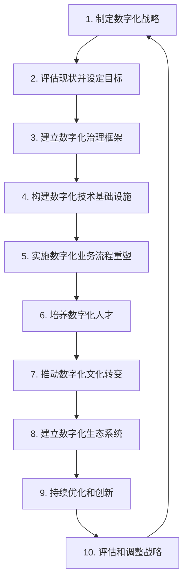

# 企业数字化项目从1-10建设方案

## 1. 背景介绍

在当今快速发展的数字时代，企业面临着前所未有的机遇和挑战。数字化转型已经成为企业保持竞争力和实现可持续发展的关键因素。企业需要制定全面的数字化战略,以充分利用新兴技术的力量,提高运营效率、优化客户体验并开拓新的商业模式。

企业数字化项目从1到10的建设方案,旨在为企业提供一个系统性的指导,帮助它们有序地规划和实施数字化转型。这个方案涵盖了从战略制定到技术实施的各个方面,确保企业能够高效、有序地完成数字化转型。

## 2. 核心概念与联系

在探讨企业数字化项目从1到10的建设方案之前,我们需要了解一些核心概念及其相互关系。

### 2.1 数字化转型 (Digital Transformation)

数字化转型是指利用数字技术来彻底改造业务模式、运营流程和客户体验的过程。它不仅涉及技术层面的变革,还包括组织文化、员工技能和业务战略的转变。

### 2.2 数字化战略 (Digital Strategy)

数字化战略是企业实现数字化转型的总体规划和指导方针。它明确了企业的数字化目标、优先领域、资源分配以及实施路线图。

### 2.3 数字化技术 (Digital Technologies)

数字化技术是推动企业数字化转型的关键驱动力。它包括云计算、大数据、人工智能、物联网、区块链等新兴技术。企业需要根据自身需求选择合适的技术组合。

### 2.4 数字化生态系统 (Digital Ecosystem)

数字化生态系统是指企业与合作伙伴、供应商、客户等利益相关方之间的互联互通网络。在这个生态系统中,各方通过数字技术实现高效协作和价值创造。

### 2.5 数字化文化 (Digital Culture)

数字化文化是企业数字化转型成功的关键因素之一。它体现在员工的思维模式、工作方式和价值观中,需要企业进行持续的培养和加强。

## 3. 核心算法原理具体操作步骤

企业数字化项目从1到10的建设方案包含以下核心步骤:

### 3.1 制定数字化战略

第一步是制定企业的数字化战略。这个战略应该与企业的整体战略保持一致,明确数字化转型的目标、优先领域、资源分配以及实施路线图。

在制定数字化战略时,需要考虑以下几个方面:

1. **业务目标**: 数字化转型的最终目标是什么?是提高运营效率、优化客户体验,还是开拓新的收入来源?
2. **优先领域**: 哪些业务领域或流程应该优先进行数字化转型?
3. **技术路线图**: 企业需要采用哪些数字化技术?它们的实施顺序和时间表是什么?
4. **资源规划**: 数字化转型需要投入多少资金?如何分配人力和技术资源?
5. **风险评估**: 数字化转型可能面临哪些风险和挑战?如何应对和缓解这些风险?

### 3.2 评估现状并设定目标

在制定数字化战略之后,企业需要评估当前的数字化现状,并设定具体的目标和关键绩效指标 (KPI)。这个步骤有助于企业了解自身的优势和不足,并为后续的实施工作提供明确的方向和衡量标准。

评估现状时,可以考虑以下几个方面:

1. **技术基础设施**: 现有的 IT 基础设施是否足以支持数字化转型?需要进行哪些升级或更新?
2. **数据管理**: 企业是否拥有高质量的数据资产?数据是否得到有效管理和利用?
3. **业务流程**: 现有的业务流程是否效率低下或存在瓶颈?哪些流程需要优化或重塑?
4. **员工技能**: 员工是否具备足够的数字化技能?需要进行哪些培训和提升?
5. **组织文化**: 企业的组织文化是否有利于数字化转型?需要进行哪些文化变革?

根据评估结果,企业可以设定具体的目标和 KPI,如提高运营效率、降低成本、增加收入、改善客户体验等。这些目标应该具体、可衡量、可实现、相关和有时限。

### 3.3 建立数字化治理框架

为了确保数字化转型的顺利实施,企业需要建立一个有效的数字化治理框架。这个框架应该明确各个利益相关方的职责和决策权限,并制定相应的政策和流程。

数字化治理框架通常包括以下几个方面:

1. **组织结构**: 建立专门的数字化转型团队或委员会,负责整个项目的规划、协调和监督。
2. **决策机制**: 制定明确的决策流程,确保数字化转型的重大决策得到及时和有效的执行。
3. **政策和标准**: 制定数据管理、信息安全、技术采购等方面的政策和标准,确保一致性和合规性。
4. **绩效管理**: 建立绩效评估和报告机制,跟踪数字化转型的进展和成果。
5. **变更管理**: 制定变更管理流程,以有效应对数字化转型过程中的变化和挑战。

### 3.4 构建数字化技术基础设施

数字化技术是企业数字化转型的关键支撑。企业需要构建一个灵活、可扩展的技术基础设施,以支持各种数字化应用和服务的部署和运行。

构建数字化技术基础设施通常包括以下几个步骤:

1. **评估现有基础设施**: 评估现有的 IT 基础设施,包括硬件、软件、网络和数据中心等,确定需要升级或更新的部分。
2. **选择适当的技术**: 根据企业的需求和战略,选择合适的数字化技术,如云计算、大数据、人工智能、物联网等。
3. **规划和设计**: 规划和设计新的技术架构,确保它能够满足当前和未来的业务需求。
4. **实施和部署**: 逐步实施和部署新的技术基础设施,包括硬件、软件、网络和数据中心等。
5. **集成和测试**: 将新的技术基础设施与现有系统进行集成和测试,确保整体运行的稳定性和可靠性。
6. **持续优化**: 持续监控和优化技术基础设施的性能,以满足不断变化的业务需求。

### 3.5 实施数字化业务流程重塑

数字化转型不仅涉及技术层面的变革,还需要对企业的业务流程进行重塑和优化。通过利用数字化技术,企业可以简化和自动化流程,提高效率和响应速度。

实施数字化业务流程重塑通常包括以下几个步骤:

1. **流程分析**: 对现有的业务流程进行全面分析,识别低效、重复或手动操作的环节。
2. **流程重塑**: 根据数字化技术的特点,重新设计和优化业务流程,消除瓶颈并提高自动化程度。
3. **系统集成**: 将重塑后的业务流程与相关的数字化系统和应用进行集成,实现无缝协作。
4. **流程自动化**: 利用工作流引擎、机器人流程自动化 (RPA) 等技术,实现流程的自动化和智能化。
5. **流程监控**: 建立流程监控和报告机制,持续跟踪和优化流程的执行情况。
6. **持续改进**: 根据业务需求的变化,持续优化和改进数字化业务流程。

### 3.6 培养数字化人才

数字化转型不仅需要技术支持,还需要培养具备数字化技能的人才。企业应该制定全面的人才发展战略,通过培训、招聘和合作等方式,确保拥有足够的数字化人才储备。

培养数字化人才通常包括以下几个方面:

1. **技能评估**: 评估现有员工的数字化技能水平,识别技能缺口和培训需求。
2. **内部培训**: 为员工提供相关的数字化技能培训,包括技术培训和思维模式转变等。
3. **外部招聘**: 根据需求,从外部招聘具备数字化技能的人才,补充内部人才储备。
4. **合作和外包**: 与专业的数字化服务提供商合作,或者将部分工作外包,以获取所需的专业技能。
5. **激励机制**: 建立合理的激励机制,吸引和留住优秀的数字化人才。
6. **持续学习**: 鼓励员工持续学习和提升数字化技能,以适应不断变化的技术环境。

### 3.7 推动数字化文化转变

数字化转型不仅涉及技术和流程的变革,还需要推动企业文化的转变。企业需要培养一种数字化思维模式,鼓励创新、协作和敏捷性,以适应数字化时代的需求。

推动数字化文化转变通常包括以下几个步骤:

1. **领导层支持**: 确保企业高层领导对数字化转型的重视和支持,树立良好的示范作用。
2. **沟通和宣传**: 通过各种渠道向员工传达数字化转型的重要性和必要性,增强他们的认同感。
3. **培训和教育**: 为员工提供数字化思维模式和工作方式的培训,帮助他们适应新的文化。
4. **激励和奖励**: 建立激励和奖励机制,鼓励员工拥抱数字化文化,表彰优秀的数字化实践。
5. **协作和反馈**: 鼓励员工之间的协作和反馈,共同推进数字化文化的发展。
6. **持续改进**: 持续监测和评估数字化文化的发展情况,并根据需要进行调整和改进。

### 3.8 建立数字化生态系统

在数字化时代,企业需要与合作伙伴、供应商、客户等利益相关方建立紧密的数字化生态系统。通过数字化技术的支持,各方可以实现高效的协作和价值创造。

建立数字化生态系统通常包括以下几个步骤:

1. **识别关键利益相关方**: 确定哪些合作伙伴、供应商、客户等利益相关方对企业的数字化转型至关重要。
2. **建立数字化平台**: 构建一个统一的数字化平台,作为各方之间协作和交互的基础。
3. **整合数据和系统**: 实现数据和系统的集成,确保信息在生态系统内部流动顺畅。
4. **制定协作机制**: 制定明确的协作机制和规则,规范各方在数字化生态系统中的行为和责任。
5. **培养生态系统文化**: 培养一种开放、协作和创新的生态系统文化,促进各方之间的信任和合作。
6. **持续优化和扩展**: 根据业务需求的变化,持续优化和扩展数字化生态系统的范围和功能。

### 3.9 持续优化和创新

数字化转型是一个持续的过程,而不是一次性的项目。企业需要持续优化和创新,以适应不断变化的技术和市场环境。

持续优化和创新通常包括以下几个步骤:

1. **监测和评估**: 持续监测数字化转型的进展和成果,评估是否达到预期目标。
2. **收集反馈**: 收集来自员工、客户和合作伙伴的反馈,了解存在的问题和改进空间。
3. **优化和调整**: 根据监测和反馈