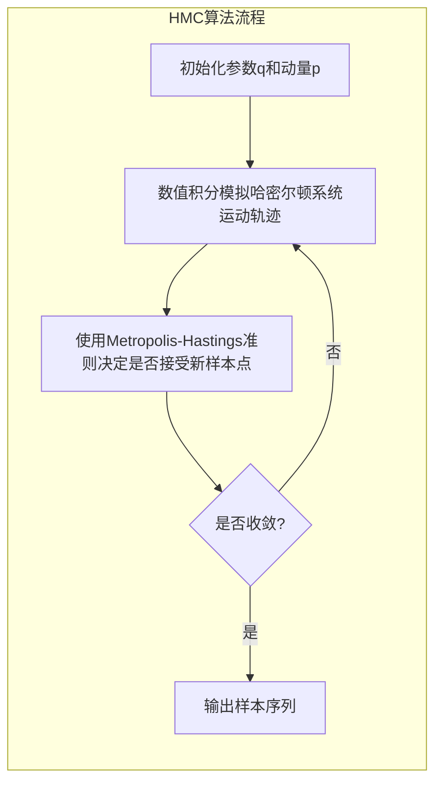

# 哈密尔顿蒙特卡罗(HMC)原理与代码实战案例讲解

## 1.背景介绍

### 1.1 蒙特卡罗方法概述

蒙特卡罗方法是一种广泛应用于各个领域的计算统计方法。它利用随机取样的方式来近似求解复杂的数值计算问题。通过大量的随机实验,根据概率统计理论来估计所求解问题的解。

蒙特卡罗方法具有以下优点:

- 思路简单直观,易于理解和编程实现
- 适用于高维复杂问题,弥补了其他数值方法的不足
- 可以有效评估和控制求解精度

因此,蒙特卡罗方法在科学计算、计算物理、计算金融、计算生物等诸多领域有着广泛的应用。

### 1.2 马尔可夫链蒙特卡罗方法(MCMC)

马尔可夫链蒙特卡罗方法(Markov Chain Monte Carlo, MCMC)是蒙特卡罗方法的一个重要分支。它通过构造一个满足细致平稳条件的马尔可夫链,从而获得目标分布的样本。

MCMC方法的基本思路是:从一个任意的初始分布出发,通过构造一个渐进收敛于目标分布的马尔可夫链,使得最终收敛到目标分布。这种方法克服了经典蒙特卡罗方法对目标分布需要有解析表达式的限制,使得对于无法直接采样的复杂分布也可以进行采样模拟。

### 1.3 哈密尔顿蒙特卡罗方法(HMC)

哈密尔顿蒙特卡罗方法(Hamiltonian Monte Carlo, HMC)是MCMC方法中的一种,它利用哈密尔顿动力学系统进行采样。HMC方法具有以下优点:

1. 高效采样,能有效应对高维、复杂、多峰目标分布
2. 避免随机游走,能有效减少相关性
3. 易于并行化,可提高采样效率

因此,HMC方法在机器学习、贝叶斯统计等领域有着广泛的应用。

## 2.核心概念与联系

### 2.1 哈密尔顿动力学系统

哈密尔顿动力学系统是描述质点在保守力场中运动的经典力学理论。它由哈密尔顿方程组成:

$$
\begin{aligned}
\frac{dq}{dt} &= \frac{\partial H}{\partial p} \\
\frac{dp}{dt} &= -\frac{\partial H}{\partial q}
\end{align}
$$

其中:

- $q$为广义坐标
- $p$为广义动量 
- $H(q, p)$为哈密尔顿量,等于系统的总能量

通过数值积分哈密尔顿方程,可以模拟出质点在相空间中的运动轨迹。

### 2.2 HMC中的哈密尔顿动力学系统

在HMC算法中,我们将目标分布$\pi(q)$等效为如下哈密尔顿系统:

$$
\begin{aligned}
H(q, p) &= U(q) + K(p) \\
U(q) &= -\log \pi(q) \\
K(p) &= \frac{1}{2}p^T M^{-1} p
\end{aligned}
$$

其中:

- $q$为参数变量
- $p$为动量变量,服从标准高斯分布
- $U(q)$为位能,等于目标分布的负对数
- $K(p)$为动能,与动量有关
- $M$为质量矩阵,一般取为对角阵

通过模拟该哈密尔顿系统的运动,我们可以获得目标分布$\pi(q)$的样本。

### 2.3 HMC算法流程

HMC算法的基本流程如下:

1. 初始化参数$q$和动量$p$
2. 通过数值积分模拟哈密尔顿动力学系统在一段时间内的运动轨迹
3. 使用MetropolisHastings准则决定是否接受新的样本点
4. 重复上述过程,直到收敛

其中,第2步是HMC算法的核心,它决定了样本的质量和效率。常用的数值积分方法有:

- 欧拉法
- 隐式欧拉法
- Leapfrog积分法



## 3.核心算法原理具体操作步骤

### 3.1 Leapfrog积分法

Leapfrog积分法是HMC算法中常用的数值积分方法,它具有可逆性和对称性,能有效抑制误差的累积。

Leapfrog积分法的步骤如下:

1. 给定初始状态$(q_0, p_0)$,积分步长$\epsilon$和模拟时间$\tau$
2. 计算中间动量: $p(t+\epsilon/2) = p(t) + (\epsilon/2)\frac{\partial U}{\partial q}(q(t))$
3. 更新位置: $q(t+\epsilon) = q(t) + \epsilon M^{-1}p(t+\epsilon/2)$
4. 更新动量: $p(t+\epsilon) = p(t+\epsilon/2) + (\epsilon/2)\frac{\partial U}{\partial q}(q(t+\epsilon))$
5. 重复步骤2-4,直到模拟时间达到$\tau$

上述过程可以用如下伪代码表示:

```python
def leapfrog(q, p, dUdq, epsilon, n_steps):
    for i in range(n_steps):
        p = p + epsilon * dUdq(q) / 2  # Add half of momentum adjustment
        q = q + epsilon * p            # Update position
        p = p + epsilon * dUdq(q) / 2  # Add remaining half of momentum adjustment
    return q, p
```

### 3.2 HMC算法伪代码

综合上述内容,HMC算法的伪代码如下:

```python
def hmc(q0, log_prob_fn, grad_log_prob_fn, epsilon, n_leapfrog_steps, n_samples):
    samples = []
    q = q0
    for i in range(n_samples):
        p = np.random.randn(len(q0))  # Draw initial momentum
        q, p = leapfrog(q, p, grad_log_prob_fn, epsilon, n_leapfrog_steps)
        
        # Metropolis-Hastings acceptance step
        curr_log_prob = log_prob_fn(q)
        prop_log_prob = log_prob_fn(q0)
        curr_kinetic = np.sum(p**2) / 2
        prop_kinetic = np.sum(p0**2) / 2
        accept_prob = min(1, np.exp(curr_log_prob - prop_log_prob + prop_kinetic - curr_kinetic))
        
        if np.random.rand() < accept_prob:
            q0 = q
        samples.append(q0)
    return samples
```

其中:

- `q0`为初始参数
- `log_prob_fn`为目标分布的对数概率密度函数
- `grad_log_prob_fn`为对数概率密度函数的梯度
- `epsilon`为Leapfrog积分步长
- `n_leapfrog_steps`为Leapfrog积分模拟步数
- `n_samples`为需要采样的样本数量

## 4.数学模型和公式详细讲解举例说明

### 4.1 HMC采样的数学模型

在HMC算法中,我们构造了一个辅助的动力学系统,其哈密尔顿量为:

$$H(q, p) = U(q) + K(p)$$

其中:

- $U(q) = -\log\pi(q)$为位能,等于目标分布$\pi(q)$的负对数
- $K(p) = \frac{1}{2}p^TM^{-1}p$为动能,与动量$p$和质量矩阵$M$有关

根据统计力学,该系统在相空间的分布密度为:

$$\pi(q, p) \propto \exp(-H(q, p)) = \pi(q)\exp(-K(p))$$

由于动量$p$服从标准高斯分布,因此$\exp(-K(p))$是一个常数。所以,对$q$而言,该联合分布的边缘分布仍为目标分布$\pi(q)$。

### 4.2 Metropolis-Hastings准则

在HMC算法中,我们使用Metropolis-Hastings准则来决定是否接受新的样本点。

假设当前状态为$(q_0, p_0)$,通过模拟哈密尔顿动力学系统,我们得到了新的状态$(q, p)$。根据Metropolis-Hastings准则,接受新状态的概率为:

$$\alpha = \min\left(1, \frac{\pi(q, p)}{\pi(q_0, p_0)}\right)$$

由于动量$p$服从标准高斯分布,因此上式可以简化为:

$$\alpha = \min\left(1, \exp(U(q_0) - U(q) + K(p_0) - K(p))\right)$$

其中:

- $U(q_0)$和$U(q)$分别为当前状态和新状态的位能
- $K(p_0)$和$K(p)$分别为当前状态和新状态的动能

如果接受新状态,则令$q_0 = q$;否则,保持当前状态不变。

### 4.3 举例说明

假设我们要从一个二维正态分布$\mathcal{N}(\mu, \Sigma)$中采样,其概率密度函数为:

$$\pi(q) = \frac{1}{2\pi|\Sigma|^{1/2}}\exp\left(-\frac{1}{2}(q-\mu)^T\Sigma^{-1}(q-\mu)\right)$$

对应的对数概率密度函数及其梯度为:

$$
\begin{aligned}
\log\pi(q) &= -\frac{1}{2}(q-\mu)^T\Sigma^{-1}(q-\mu) - \frac{1}{2}\log(2\pi) - \frac{1}{2}\log|\Sigma| \\
\nabla\log\pi(q) &= -\Sigma^{-1}(q-\mu)
\end{aligned}
$$

我们可以使用HMC算法从该分布中采样,伪代码如下:

```python
def log_prob(q, mu, Sigma):
    return -0.5 * np.dot(q - mu, np.linalg.solve(Sigma, q - mu)) - 0.5 * np.log(2 * np.pi * np.linalg.det(Sigma))

def grad_log_prob(q, mu, Sigma):
    return np.linalg.solve(Sigma, mu - q)

mu = np.array([1.0, 2.0])
Sigma = np.array([[1.0, 0.5], [0.5, 2.0]])
q0 = np.zeros(2)

samples = hmc(q0, 
              lambda q: log_prob(q, mu, Sigma),
              lambda q: grad_log_prob(q, mu, Sigma),
              epsilon=0.1, n_leapfrog_steps=20, n_samples=1000)
```

上述代码将从一个二维正态分布$\mathcal{N}([1.0, 2.0], [[1.0, 0.5], [0.5, 2.0]])$中采样1000个样本。

## 5.项目实践：代码实例和详细解释说明

在这一节,我们将通过一个实际的代码示例来演示如何使用HMC算法从一个复杂的多元正态分布中采样。

### 5.1 导入所需库

```python
import numpy as np
import matplotlib.pyplot as plt
%matplotlib inline
```

### 5.2 定义目标分布

我们定义一个二维的"香蕉"形状的多元正态分布,其均值向量为$\mu = (0, 0)$,协方差矩阵为:

$$\Sigma = \begin{bmatrix}
1 & 0.9 \\
0.9 & 1
\end{bmatrix}$$

对应的概率密度函数为:

$$\pi(x, y) = \frac{1}{2\pi\sqrt{1-0.9^2}}\exp\left(-\frac{1}{2(1-0.9^2)}(x^2 - 2\times0.9xy + y^2)\right)$$

```python
mu = np.array([0.0, 0.0])
Sigma = np.array([[1.0, 0.9], [0.9, 1.0]])
```

### 5.3 定义对数概率密度函数及其梯度

```python
def log_prob(q):
    delta = q - mu
    return -0.5 * np.dot(delta, np.linalg.solve(Sigma, delta)) - 0.5 * np.log(2 * np.pi * np.linalg.det(Sigma))

def grad_log_prob(