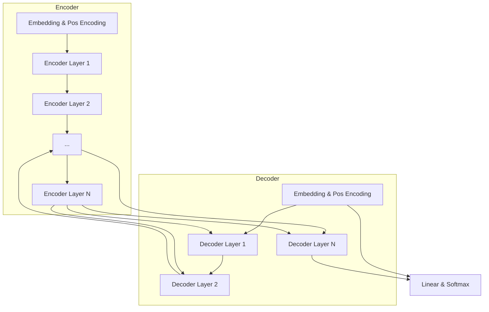

# 多模态大模型：技术原理与实战 GPT-4多模态大模型核心技术介绍

## 1.背景介绍

### 1.1 人工智能的发展历程

人工智能(Artificial Intelligence, AI)是当代科技发展的核心驱动力之一,自20世纪50年代问世以来,已经经历了数次重大突破和发展浪潮。早期的人工智能系统主要基于规则和逻辑推理,但受到知识库有限和推理能力较弱的制约。

21世纪初,机器学习和深度学习技术的兴起,特别是在大数据和强大算力的支持下,推动了人工智能的飞速发展。深度神经网络能够从海量数据中自主学习特征模式,在计算机视觉、自然语言处理、语音识别等领域取得了突破性进展。

### 1.2 大模型的崛起

随着算力、数据和算法的持续演进,人工智能模型的规模和能力不断扩大。2018年,谷歌发布了Transformer模型,在机器翻译等任务上取得了卓越表现,奠定了大模型的基础。2020年,OpenAI推出GPT-3大型语言模型,通过自监督学习在海量文本数据上训练,展现出惊人的文本生成和理解能力,开启了大模型的新时代。

大模型具有参数量大、训练数据规模大、计算资源消耗大等特点,能够捕捉更丰富的语义和知识,在自然语言处理、计算机视觉、多模态等领域展现出强大的能力。随后,各大科技公司和研究机构纷纷加入大模型的研发和应用,大模型已成为人工智能发展的主流方向。

### 1.3 多模态大模型的兴起

传统的人工智能模型通常专注于单一模态,如自然语言处理(NLP)或计算机视觉(CV)。然而,人类的认知和交互往往涉及多种模态,如文本、图像、视频、语音等。为了更好地模拟和支持人类的多模态交互,多模态人工智能模型应运而生。

多模态大模型旨在统一处理不同模态的信息,实现跨模态的表示学习和推理,从而支持复杂的多模态任务,如视觉问答、图文生成、多模态对话等。这种模型通过统一的架构和训练方式,能够捕捉和融合不同模态之间的关联,提高模型的泛化能力和适应性。

2021年,OpenAI发布了DALL-E模型,能够根据自然语言描述生成相应的图像,展现出多模态生成的强大能力。2022年,OpenAI又推出了GPT-3的多模态版本InstructGPT,支持文本、图像和其他模态的输入和输出。随后,谷歌、Meta等公司也相继发布了自己的多模态大模型。

多模态大模型正在成为人工智能发展的新热点和前沿方向,有望推动人机交互、内容生成、智能辅助等领域的重大突破。

## 2.核心概念与联系

### 2.1 多模态表示学习

多模态表示学习(Multimodal Representation Learning)是多模态大模型的核心概念之一。它旨在学习统一的表示空间,将不同模态的输入(如文本、图像、视频等)映射到同一个连续的向量空间中,从而捕捉不同模态之间的相关性和关联。

在传统的单模态模型中,每种模态都有自己独立的表示空间,缺乏跨模态的关联性。而多模态表示学习通过共享的表示空间,使得不同模态之间的信息可以相互流动和融合,模型能够学习到更丰富和通用的表示,从而提高了模型的泛化能力和适应性。

多模态表示学习的关键在于设计合适的模型架构和损失函数,将不同模态的输入融合到统一的表示空间中。常见的方法包括:

1. **早期融合**:将不同模态的输入在底层就进行拼接或融合,通过共享的编码器提取统一的表示。
2. **晚期融合**:先分别对每种模态进行编码,然后在高层将不同模态的表示进行融合。
3. **交互式融合**:在编码过程中,不同模态之间的表示会进行多次交互和融合,实现深度的跨模态建模。

多模态表示学习能够充分利用不同模态之间的互补性和关联性,提高模型的表现力和泛化能力,是实现强大的多模态建模和推理的基础。

### 2.2 多任务学习

多任务学习(Multi-Task Learning)是另一个与多模态大模型密切相关的核心概念。它指的是在同一个模型中同时学习多个不同但相关的任务,利用不同任务之间的关联性和知识共享,提高模型的泛化能力和效率。

在传统的单任务学习中,模型只专注于一个特定的任务,缺乏对其他相关任务的建模和迁移能力。而多任务学习通过在同一个模型中同时优化多个任务的目标函数,使得模型能够捕捉不同任务之间的共性和关联,从而提高了模型的泛化能力和数据利用效率。

多任务学习在多模态大模型中扮演着重要角色。由于多模态大模型需要处理多种模态和多种任务,如文本生成、图像分类、视频理解等,通过多任务学习的方式,模型能够在不同任务之间共享知识和表示,提高了模型的性能和效率。

多任务学习的实现方式包括:

1. **硬参数共享**:不同任务共享模型的部分或全部参数,实现参数级别的知识共享。
2. **软参数共享**:通过正则化约束或注意力机制,使不同任务的参数保持相似性,实现隐式的知识共享。
3. **层级多任务**:在不同层次上进行多任务学习,低层捕捉通用特征,高层专注于特定任务。

多任务学习能够提高模型的数据利用效率,缓解数据不足的问题,并增强模型的泛化能力,是实现通用智能和多模态建模的重要手段。

### 2.3 自监督学习

自监督学习(Self-Supervised Learning)是多模态大模型训练的核心范式之一。与传统的监督学习需要大量人工标注数据不同,自监督学习能够利用大规模的未标注数据进行有效学习,从而获取丰富的表示和知识。

自监督学习的核心思想是,通过设计合适的预测任务,使模型从原始数据中自主学习有用的表示和模式,而无需人工标注的监督信号。常见的自监督学习策略包括:

1. **蒙版语言模型**:在文本中随机掩蔽部分词语,模型需要根据上下文预测被掩蔽的词语。
2. **图像去噪自编码**:将噪声添加到图像中,模型需要从噪声图像中重建原始图像。
3. **对比学习**:通过最大化正样本对的相似度,最小化负样本对的相似度,学习数据的discriminative表示。

自监督学习能够充分利用海量的未标注数据,使模型获取丰富的表示和知识,从而提高模型的泛化能力和适应性。在多模态大模型中,自监督学习是实现大规模预训练的关键手段,能够有效捕捉不同模态之间的关联和共性。

### 2.4 注意力机制

注意力机制(Attention Mechanism)是多模态大模型中的核心技术之一,它能够有效捕捉不同模态之间的长程依赖关系,实现高效的信息融合和建模。

传统的序列模型(如RNN)由于存在梯度消失和计算效率低下等问题,难以有效处理长序列数据。注意力机制通过计算查询(Query)与键(Key)之间的相关性分数,对值(Value)进行加权求和,从而能够直接捕捉任意距离的依赖关系,克服了RNN的局限性。

在多模态大模型中,注意力机制扮演着至关重要的角色。由于不同模态的输入具有不同的结构和维度,注意力机制能够灵活地捕捉跨模态之间的关联,实现高效的信息融合和交互。常见的多模态注意力机制包括:

1. **跨模态注意力**:计算不同模态之间的注意力分数,实现模态间的信息融合。
2. **自注意力**:在同一模态内计算注意力分数,捕捉模态内部的依赖关系。
3. **交叉注意力**:计算一个模态对另一模态的注意力分数,实现单向的跨模态建模。

注意力机制使得多模态大模型能够灵活地融合和建模不同模态之间的关联,提高了模型的表现力和适应性,是实现强大的多模态表示学习和推理的关键技术。

### 2.5 模型压缩与加速

由于多模态大模型通常具有巨大的参数量和计算复杂度,因此模型压缩和加速技术也成为了重要的研究课题,以实现高效的模型部署和推理。常见的模型压缩和加速技术包括:

1. **量化**:将原始的浮点数参数和计算量化为低比特表示,降低模型的存储和计算开销。
2. **剪枝**:通过剪去模型中的冗余参数和计算,压缩模型的大小和计算量。
3. **知识蒸馏**:利用一个大型教师模型指导一个小型学生模型的训练,使学生模型逼近教师模型的性能。
4. **并行计算**:利用GPU、TPU等加速硬件,实现模型计算的并行化和加速。
5. **模型分片**:将大型模型分割为多个子模块,分布式地部署和计算,降低单机的计算压力。

通过上述技术的综合应用,可以显著降低多模态大模型的存储和计算开销,实现高效的模型部署和推理,满足实际应用的需求。

## 3.核心算法原理具体操作步骤

### 3.1 Transformer模型

Transformer是多模态大模型的核心架构之一,它基于自注意力机制,能够有效捕捉长程依赖关系,成为了序列建模和多模态融合的主流模型。Transformer的基本架构如下:



1. **Embedding层**:将输入序列(如文本或图像特征)映射为连续的向量表示。
2. **位置编码(Positional Encoding)**:引入位置信息,使模型能够捕捉序列的顺序和位置关系。
3. **编码器(Encoder)**:由多个编码器层组成,每个层包含多头自注意力(Multi-Head Self-Attention)和前馈神经网络(Feed-Forward Network),用于捕捉输入序列内部的依赖关系。
4. **解码器(Decoder)**:由多个解码器层组成,每个层包含多头自注意力、多头交叉注意力(对编码器输出的注意力)和前馈神经网络,用于生成目标序列。
5. **残差连接(Residual Connection)**:在每个子层之后,将输入和输出相加,以缓解梯度消失问题。
6. **层归一化(Layer Normalization)**:对每个子层的输出进行归一化,提高模型的稳定性和收敛速度。

Transformer架构通过自注意力机制,能够直接捕捉任意距离的依赖关系,克服了RNN的局限性。它已广泛应用于自然语言处理、计算机视觉和多模态建模等领域,成为了大模型的核心架构之一。

### 3.2 Vision Transformer

Vision Transformer(ViT)是将Transformer应用于计算机视觉任务的典型模型,它直接对图像进行分块线性投影,将图像patch序列输入到Transformer架构中进行建模。ViT的基本流程如下:

```mermai