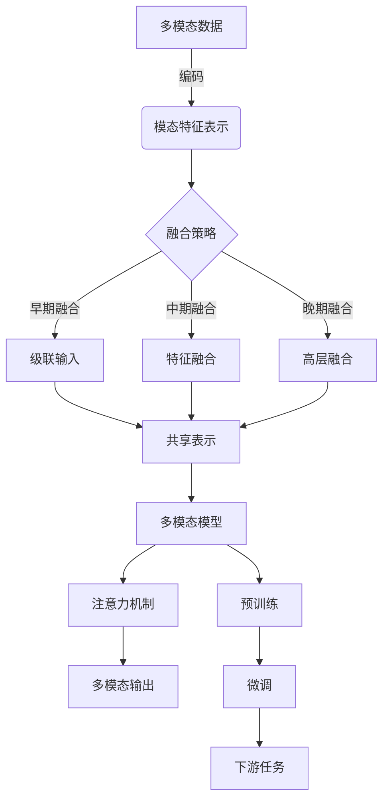

# 多模态大模型：技术原理与实战部署流程

## 1.背景介绍

在人工智能领域,大模型已经成为一个炙手可热的话题。随着计算能力和数据量的不断增长,训练大规模神经网络模型成为可能,这些大模型展现出了令人惊叹的性能表现。然而,传统的大模型主要关注单一模态数据,如自然语言或图像。现实世界中,信息通常以多种形式存在,如文本、图像、视频、音频等。为了更好地理解和处理这种多模态数据,多模态大模型(Multimodal Large Models)应运而生。

多模态大模型旨在融合不同模态的信息,实现跨模态的理解和生成能力。它们可以同时处理文本、图像、视频等多种模态输入,并生成相应的多模态输出。这种多模态能力使得模型可以在更广泛的场景下发挥作用,如视觉问答、图文生成、多模态对话等,极大扩展了人工智能的应用范围。

## 2.核心概念与联系

### 2.1 多模态表示学习

多模态表示学习是多模态大模型的核心概念之一。它旨在学习不同模态数据的联合表示,捕捉不同模态之间的相关性和交互作用。通过共享的表示空间,模型可以更好地融合多模态信息,实现跨模态的理解和生成。

典型的多模态表示学习方法包括:

1. **早期融合**:将不同模态的原始数据级联,构建共享的输入表示。
2. **中期融合**:首先分别对每种模态进行编码,然后将编码后的特征进行融合。
3. **晚期融合**:先分别对每种模态进行独立建模,然后将各模态的高层表示进行融合。

不同的融合策略适用于不同的场景,需要根据具体任务和数据特征进行选择。

### 2.2 注意力机制

注意力机制在多模态大模型中发挥着关键作用。它允许模型动态地聚焦于不同模态之间的相关部分,捕捉模态间的交互作用。常见的注意力机制包括:

1. **自注意力**:捕捉同一模态内部的依赖关系。
2. **交叉注意力**:捕捉不同模态之间的依赖关系。
3. **多头注意力**:并行地学习多种注意力表示。

注意力机制使得模型可以更好地关注输入数据的关键部分,提高了模型的性能和解释能力。

### 2.3 预训练与微调

与单模态大模型类似,多模态大模型也采用了预训练与微调的范式。首先在大规模多模态数据集上进行自监督预训练,学习通用的多模态表示。然后在特定任务上进行微调,将预训练模型迁移到下游任务。

预训练策略包括:

1. **蒸馏**:利用单模态教师模型指导多模态学生模型的训练。
2. **对比学习**:最大化不同视图(模态)之间的相似性,最小化同一视图的不相似性。
3. **自监督任务**:设计多模态自监督任务,如遮蔽语言建模、图像文本对比等。

通过大规模预训练,模型可以学习丰富的多模态知识,为下游任务提供强大的初始化,提高泛化能力。



## 3.核心算法原理具体操作步骤

多模态大模型的核心算法原理可以概括为以下几个关键步骤:

1. **模态编码**:将不同模态的原始数据编码为对应的特征表示。常见的编码方式包括:
   - 文本:使用Transformer编码器或BERT等预训练语言模型。
   - 图像:使用CNN或Vision Transformer等视觉编码器。
   - 视频:使用3D CNN或视频Transformer等时序编码器。
   - 音频:使用1D CNN或Transformer等序列编码器。

2. **模态融合**:根据具体任务和数据特征,选择合适的融合策略,将不同模态的特征表示融合到共享的表示空间中。常见的融合方式包括:
   - 早期融合:将不同模态的原始数据级联,构建共享的输入表示。
   - 中期融合:首先分别对每种模态进行编码,然后将编码后的特征进行融合。
   - 晚期融合:先分别对每种模态进行独立建模,然后将各模态的高层表示进行融合。

3. **注意力建模**:在融合的多模态表示上应用注意力机制,捕捉不同模态之间的相关性和交互作用。常见的注意力机制包括:
   - 自注意力:捕捉同一模态内部的依赖关系。
   - 交叉注意力:捕捉不同模态之间的依赖关系。
   - 多头注意力:并行地学习多种注意力表示。

4. **预训练**:在大规模多模态数据集上进行自监督预训练,学习通用的多模态表示。常见的预训练策略包括:
   - 蒸馏:利用单模态教师模型指导多模态学生模型的训练。
   - 对比学习:最大化不同视图(模态)之间的相似性,最小化同一视图的不相似性。
   - 自监督任务:设计多模态自监督任务,如遮蔽语言建模、图像文本对比等。

5. **微调**:在特定下游任务上,对预训练的多模态大模型进行微调,将通用的多模态表示迁移到目标任务。微调过程通常包括:
   - 数据准备:构建适合目标任务的多模态数据集。
   - 损失函数设计:根据任务目标设计合适的损失函数,如分类损失、回归损失等。
   - 优化训练:使用适当的优化算法和超参数,在目标数据集上对模型进行微调。

通过上述步骤,多模态大模型可以有效地融合不同模态的信息,实现跨模态的理解和生成能力,为各种多模态任务提供强大的解决方案。

## 4.数学模型和公式详细讲解举例说明

在多模态大模型中,数学模型和公式扮演着重要的角色,用于形式化地描述模型的结构和行为。以下是一些常见的数学模型和公式,以及它们在多模态大模型中的应用。

### 4.1 注意力机制

注意力机制是多模态大模型中的关键组成部分,它允许模型动态地聚焦于不同模态之间的相关部分,捕捉模态间的交互作用。

自注意力机制的数学表示如下:

$$
\mathrm{Attention}(Q, K, V) = \mathrm{softmax}\left(\frac{QK^T}{\sqrt{d_k}}\right)V
$$

其中,
- $Q$为查询(Query)矩阵,表示需要关注的部分。
- $K$为键(Key)矩阵,表示被关注的部分。
- $V$为值(Value)矩阵,表示被关注部分的值。
- $d_k$为缩放因子,用于防止点积过大导致梯度饱和。

交叉注意力机制用于捕捉不同模态之间的依赖关系,其数学表示类似于自注意力,但查询和键来自不同的模态。

多头注意力机制则是将多个注意力头并行计算,然后将它们的结果拼接起来,数学表示如下:

$$
\mathrm{MultiHead}(Q, K, V) = \mathrm{Concat}(\mathrm{head}_1, \ldots, \mathrm{head}_h)W^O
$$

其中,
- $\mathrm{head}_i = \mathrm{Attention}(QW_i^Q, KW_i^K, VW_i^V)$
- $W_i^Q, W_i^K, W_i^V$为每个注意力头的线性投影矩阵。
- $W^O$为最终的线性变换矩阵。

注意力机制赋予了多模态大模型强大的建模能力,使其能够动态地关注输入数据的关键部分,提高了模型的性能和解释能力。

### 4.2 对比学习

对比学习是多模态大模型预训练的一种常见策略,它通过最大化不同视图(模态)之间的相似性,最小化同一视图的不相似性,来学习有效的多模态表示。

对比学习的目标函数可以表示为:

$$
\mathcal{L}_\mathrm{contrastive} = -\mathbb{E}_{(x, x^+)} \left[\log \frac{\exp(\mathrm{sim}(f(x), f(x^+)) / \tau)}{\sum_{x^-} \exp(\mathrm{sim}(f(x), f(x^-)) / \tau)}\right]
$$

其中,
- $x$和$x^+$为同一个样本的不同视图(模态)。
- $x^-$为其他样本的视图。
- $f(\cdot)$为编码器函数,将输入映射到表示空间。
- $\mathrm{sim}(\cdot, \cdot)$为相似性函数,如点积或余弦相似度。
- $\tau$为温度超参数,控制相似性分布的平滑程度。

通过最小化对比损失函数,模型可以学习到能够捕捉不同模态之间相关性的表示,从而提高多模态建模的性能。

### 4.3 自监督任务

除了对比学习,多模态大模型还可以通过设计自监督任务来进行预训练。常见的自监督任务包括:

1. **遮蔽语言建模(Masked Language Modeling, MLM)**:在文本模态中随机遮蔽部分词元,要求模型根据上下文和其他模态信息预测被遮蔽的词元。

2. **图像文本对比(Image-Text Contrastive, ITM)**:给定一个图像-文本对,要求模型判断它们是否匹配。

3. **视频问答(Video Question Answering, VideoQA)**:给定一段视频和相关问题,要求模型根据视频内容回答问题。

这些自监督任务的目标函数通常采用交叉熵损失或对比损失的形式,具体取决于任务的性质。通过预训练,模型可以学习到有效的多模态表示,为下游任务提供强大的初始化。

上述数学模型和公式为多模态大模型提供了理论基础,帮助模型有效地融合不同模态的信息,实现跨模态的理解和生成能力。在实际应用中,这些模型和公式往往需要与具体的模型架构和任务目标相结合,以获得最佳的性能表现。

## 5.项目实践:代码实例和详细解释说明

为了更好地理解多模态大模型的实现细节,我们将提供一个基于PyTorch的代码示例,并对关键部分进行详细解释。

### 5.1 模型架构

我们将构建一个简单的多模态模型,它可以同时处理文本和图像输入,并生成相应的多模态输出。模型的整体架构如下:

```python
import torch
import torch.nn as nn

class MultimodalModel(nn.Module):
    def __init__(self, text_encoder, image_encoder, fusion_method, output_dim):
        super(MultimodalModel, self).__init__()
        self.text_encoder = text_encoder
        self.image_encoder = image_encoder
        self.fusion_method = fusion_method
        self.classifier = nn.Linear(fusion_method.output_dim, output_dim)

    def forward(self, text_input, image_input):
        text_features = self.text_encoder(text_input)
        image_features = self.image_encoder(image_input)
        fused_features = self.fusion_method(text_features, image_features)
        output = self.classifier(fused_features)
        return output
```

在这个模型中,我们使用了两个独立的编码器分别处理文本和图像输入,然后使用一个融合模块将两种模态的特征融合在一起。最后,我们将融合后的特征输入到一个分类器中,生成最终的输出。

### 5.2 模态编码

对于文本编码器,我们可以使用预训练的BERT模型:

```python