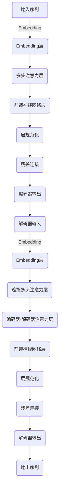

# 大语言模型原理与工程实践：大语言模型的关键技术

## 1.背景介绍

### 1.1 大语言模型的兴起

近年来,随着人工智能技术的快速发展,大型语言模型(Large Language Models, LLMs)成为了自然语言处理领域的一股重要力量。大语言模型是一种基于深度学习的模型,能够从大规模语料库中学习语言的统计规律,并生成看似人类写作的连贯文本。

大语言模型的出现源于两个关键驱动力:一是计算能力的飞速提升,二是海量文本数据的积累。强大的计算能力使得训练包含数十亿甚至上百亿参数的大型神经网络模型成为可能,而互联网时代所产生的海量文本数据为这些模型提供了丰富的学习资源。

### 1.2 大语言模型的典型代表

大语言模型家族中,有几个典型代表模型具有里程碑式的影响力:

- GPT(Generative Pre-trained Transformer):由OpenAI开发,是第一个展示出强大语言生成能力的大型预训练语言模型。GPT-3更是以其惊人的1750亿参数规模,在多项自然语言任务上取得了超越人类的表现。

- BERT(Bidirectional Encoder Representations from Transformers):由Google发布,是第一个大规模的双向预训练语言表示模型,在自然语言理解任务上取得了突破性进展。

- T5(Text-to-Text Transfer Transformer):由Google发布,是一种将所有自然语言问题统一转化为"Text-to-Text"形式的预训练模型,在多种自然语言任务上表现出色。

- GPT-3、ChatGPT、PaLM、Chinchilla等也是近年来备受关注的大型语言模型。

### 1.3 大语言模型的重要性

大语言模型的出现对自然语言处理领域产生了深远影响,它们在多项自然语言任务上展现出超越人类的能力,推动了人工智能技术在自然语言处理领域的快速发展。大语言模型已广泛应用于机器翻译、文本摘要、问答系统、内容生成等多个领域,为提升人机交互体验、降低重复劳动强度做出了重要贡献。

然而,大语言模型也面临着一些挑战,如模型公平性、安全性、可解释性等问题亟待解决。全面理解大语言模型的原理和实践,对于充分发挥其潜力、规避其风险都具有重要意义。

## 2.核心概念与联系

### 2.1 自然语言处理基础

自然语言处理(Natural Language Processing, NLP)是人工智能的一个重要分支,旨在使计算机能够理解和生成人类语言。它包括以下几个核心任务:

- **语言理解(Language Understanding)**:让计算机理解人类语言的含义,如文本分类、命名实体识别、关系抽取等。
- **语言生成(Language Generation)**:让计算机生成符合人类语言规范的文本,如机器翻译、文本摘要、对话系统等。  
- **语音识别(Speech Recognition)**:将人类语音转录为文本。
- **语音合成(Speech Synthesis)**:将文本转化为自然语音。

传统的NLP系统通常采用基于规则的方法或统计机器学习方法。而现代NLP系统则主要基于深度学习技术,利用大量数据训练神经网络模型来学习语言知识。

### 2.2 神经网络语言模型

神经网络语言模型(Neural Network Language Model, NNLM)是一种利用神经网络对语言建模的方法。它将文本表示为一系列离散词元(token),并使用神经网络从大量语料中学习词元之间的联系,进而对语言的统计规律进行建模。

早期的NNLM通常采用前馈神经网络或循环神经网络(RNN)结构。随着Transformer模型的出现,基于Self-Attention的Transformer结构逐渐成为NNLM的主流选择。

Transformer模型的关键创新在于完全放弃了RNN的序列结构,使用Self-Attention机制来直接建模输入和输出之间的长程依赖关系,显著提升了并行计算能力。这使得训练大型Transformer模型成为可能,为大语言模型的兴起奠定了基础。

### 2.3 大语言模型

大语言模型(Large Language Model, LLM)是一种基于Transformer结构的大规模预训练语言模型。它们通常包含数十亿甚至上百亿个参数,在海量语料库上进行无监督预训练,学习语言的深层次统计规律和语义知识。

大语言模型的核心思想是"预训练+微调"范式:

1. **预训练(Pre-training)**:在大规模无标注语料库上进行自监督学习,获取通用的语言知识。
2. **微调(Fine-tuning)**:将预训练模型在有标注的特定任务数据上进行进一步训练,使模型适应特定的下游任务。

通过预训练获得的通用语言知识,为下游任务提供了强大的迁移学习能力,从而显著提升了模型的性能表现。

### 2.4 大语言模型与小语言模型

与传统的小型语言模型相比,大语言模型具有以下显著优势:

1. **更强的语言理解和生成能力**:通过在大规模语料上预训练,大语言模型能够学习到更丰富、更深层次的语言知识,从而在语言理解和生成任务上表现出更强的能力。

2. **更好的迁移学习能力**:预训练模型所学习到的通用语言知识,能够很好地迁移到各种下游任务,从而减少了对大量标注数据的需求,降低了模型微调的难度。

3. **更广泛的应用场景**:大语言模型展现出了在多个自然语言处理任务上的出色表现,可应用于机器翻译、文本摘要、问答系统、对话系统等多个领域。

4. **更强的多任务学习能力**:大语言模型能够同时在多个不同的任务上进行训练,形成通用的语言表示,从而具备更强的多任务学习能力。

然而,大语言模型也存在一些需要解决的挑战,如模型公平性、安全性、可解释性、能耗等问题。

## 3.核心算法原理具体操作步骤  

### 3.1 Transformer模型

Transformer是大语言模型的核心架构,它完全放弃了RNN的序列结构,使用Self-Attention机制来直接建模输入和输出之间的长程依赖关系。Transformer模型主要由编码器(Encoder)和解码器(Decoder)两部分组成。

#### 3.1.1 编码器(Encoder)

编码器的主要作用是将输入序列编码为一系列连续的表示向量,称为上下文向量。编码器由多个相同的层组成,每一层包含两个子层:

1. **多头注意力层(Multi-Head Attention)**:对输入序列进行Self-Attention操作,捕捉不同位置词元之间的相关性。
2. **前馈神经网络层(Feed-Forward Neural Network)**:对每个词元的表示进行非线性变换,提取更高层次的特征。

每个子层之后都会进行层规范化(Layer Normalization)和残差连接(Residual Connection)操作,以保持梯度稳定和信息传递。

#### 3.1.2 解码器(Decoder)  

解码器的作用是根据编码器的输出和输入序列,生成目标输出序列。解码器也由多个相同的层组成,每一层包含三个子层:

1. **遮挡多头注意力层(Masked Multi-Head Attention)**:对输入序列进行Self-Attention操作,但遮挡掉当前位置之后的词元,以保持自回归特性。
2. **编码器-解码器注意力层(Encoder-Decoder Attention)**:将解码器的输出和编码器的输出进行注意力计算,融合编码器的上下文信息。
3. **前馈神经网络层(Feed-Forward Neural Network)**:对每个词元的表示进行非线性变换,提取更高层次的特征。

同样地,每个子层之后也会进行层规范化和残差连接操作。

#### 3.1.3 Self-Attention机制

Self-Attention是Transformer模型的核心机制,它能够直接捕捉输入序列中任意两个位置的词元之间的关系。具体来说,对于输入序列中的每个词元,Self-Attention会计算它与其他所有词元的注意力权重,然后根据这些权重对所有词元的表示进行加权求和,得到该词元的注意力表示向量。

Self-Attention的计算过程可以概括为以下三个步骤:

1. **计算注意力分数(Attention Scores)**:将查询向量(Query)与所有键向量(Keys)进行点积,得到未缩放的注意力分数。
2. **缩放和软max(Softmax)**:将注意力分数除以缩放因子的平方根,然后对每个查询向量对应的注意力分数向量进行softmax操作,得到注意力权重向量。
3. **加权求和(Weighted Sum)**:使用注意力权重向量对所有值向量(Values)进行加权求和,得到注意力表示向量。

为了进一步提高模型的表达能力,Transformer采用了多头注意力(Multi-Head Attention)机制,将注意力计算过程分成多个并行的"头"进行计算,最后将所有头的结果拼接在一起作为最终的注意力表示。

### 3.2 大语言模型预训练

大语言模型的预训练过程是在大规模无标注语料库上进行自监督学习,获取通用的语言知识。常见的预训练目标包括:

1. **蒙版语言模型(Masked Language Modeling, MLM)**: 随机将输入序列中的一部分词元用特殊的[MASK]标记替换,然后让模型根据上下文预测被掩码的词元。
2. **下一句预测(Next Sentence Prediction, NSP)**: 判断两个句子是否为连续的句子对。
3. **因果语言模型(Causal Language Modeling, CLM)**: 根据之前的上下文预测下一个词元。
4. **序列到序列(Sequence-to-Sequence)**: 将输入序列映射到目标输出序列,常用于机器翻译等任务。

预训练过程通常采用自回归(Auto-Regressive)方式,即模型根据之前的输出预测当前的输出,逐步生成整个序列。训练目标是最大化预测的条件概率,常用的优化算法包括随机梯度下降(SGD)、Adam等。

为了加速训练过程,通常会采用并行化策略,如数据并行(Data Parallelism)、模型并行(Model Parallelism)、流水线并行(Pipeline Parallelism)等。

### 3.3 大语言模型微调

经过预训练后,大语言模型获得了通用的语言知识。但为了将其应用于特定的下游任务,还需要进行微调(Fine-tuning)操作。

微调的过程是在有标注的特定任务数据上,对预训练模型进行进一步的监督式训练。根据不同的任务类型,微调时可以采用不同的训练目标和损失函数,如:

- **分类任务**:交叉熵损失(Cross-Entropy Loss)
- **序列标注任务**:条件随机场损失(Conditional Random Field Loss)
- **生成任务**:最大似然估计损失(Maximum Likelihood Estimation Loss)

在微调过程中,通常会冻结预训练模型的大部分参数,只对最后几层或者注意力层的参数进行优化,以避免破坏预训练得到的语言知识。同时,也可以采用不同的学习率调度策略,如线性衰减(Linear Decay)、余弦退火(Cosine Annealing)等,来加速模型收敛。

微调后的模型通常能够在特定任务上取得比预训练模型更好的性能表现,同时也保留了预训练模型的通用语言知识,具有更强的泛化