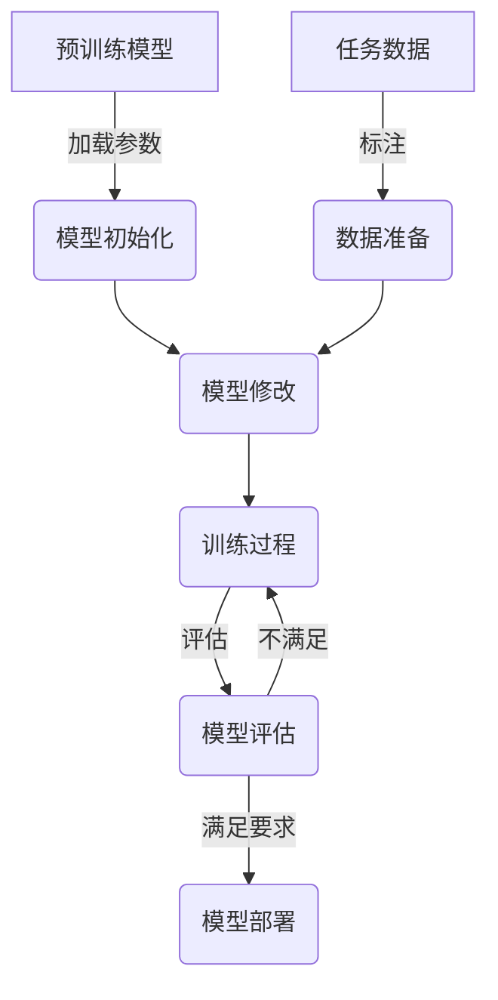

# 大语言模型原理与工程实践：挖掘大语言模型潜能：有监督微调

## 1. 背景介绍

在自然语言处理(NLP)领域,大型语言模型(LLM)近年来取得了令人瞩目的进展。这些模型通过在海量文本数据上进行预训练,学习了丰富的语言知识和上下文关系,展现出惊人的泛化能力。然而,直接使用预训练模型对于特定任务的性能往往不尽如人意,因此需要进行进一步的微调(fine-tuning)以适应特定任务。

有监督微调是一种常见的微调方法,它利用标注的任务数据对预训练模型进行针对性的调整,使其在特定任务上表现出色。本文将深入探讨有监督微调在大语言模型中的原理、实践和挑战,为读者提供全面的理解和实用的指导。

### 1.1 大语言模型的发展历程

大语言模型的发展经历了从统计语言模型到神经网络语言模型,再到基于Transformer的大型预训练语言模型的演进过程。统计语言模型依赖于n-gram统计特征,而神经网络语言模型则能够学习分布式词向量表示。2018年,Transformer模型在机器翻译任务中取得了突破性的成绩,随后GPT、BERT等基于Transformer的大型预训练语言模型应运而生,展现出强大的语言理解和生成能力。

### 1.2 大语言模型的应用场景

大语言模型在自然语言处理的各个领域都有广泛的应用,包括但不限于:

- 文本生成:新闻报道、故事创作、对话系统等
- 文本分类:情感分析、垃圾邮件检测、主题分类等
- 问答系统:基于知识库的问答、开放域问答等
- 机器翻译:多语种之间的文本翻译
- 信息抽取:命名实体识别、关系抽取、事件抽取等
- 文本摘要:新闻摘要、文献摘要等

## 2. 核心概念与联系

### 2.1 预训练与微调

预训练(Pre-training)是指在大规模无标注文本数据上训练语言模型,使其学习通用的语言知识和上下文表示。常见的预训练目标包括掩码语言模型(Masked Language Modeling)和下一句预测(Next Sentence Prediction)等。

微调(Fine-tuning)是指在特定任务的标注数据上,进一步调整预训练模型的参数,使其适应该任务的特征和要求。微调过程通常只需要调整模型的部分参数,而保留大部分预训练得到的参数,从而实现了知识迁移和快速收敛。

### 2.2 有监督微调

有监督微调是指利用带标签的训练数据对预训练模型进行微调。根据任务的不同,标签可以是文本分类标签、span标注、序列到序列的目标输出等。在有监督微调过程中,模型会根据输入和标签计算损失函数,并通过反向传播算法更新参数,逐步减小损失,提高任务性能。

有监督微调的关键步骤包括:

1. 数据准备:收集并标注任务相关的训练数据
2. 模型初始化:加载预训练模型的参数作为初始值
3. 模型修改:根据任务需求修改模型的输入、输出和损失函数
4. 训练过程:在训练数据上进行多轮迭代训练,更新模型参数
5. 模型评估:在验证集或测试集上评估模型性能

### 2.3 迁移学习与领域适应性

有监督微调实际上是一种迁移学习(Transfer Learning)的方法,它将预训练模型在大规模数据上学习到的通用知识迁移到特定任务上。这种迁移学习策略能够显著提高模型的学习效率和性能表现。

然而,不同任务和领域之间存在着语料分布的差异,因此需要考虑领域适应性(Domain Adaptation)的问题。一些常见的领域适应性方法包括:

- 领域特定语料预训练:在目标领域的语料上进行额外的预训练
- 领域混合预训练:将通用语料和目标领域语料混合进行预训练
- 领域标记:在输入中添加领域标记,帮助模型区分不同领域的数据

### 2.4 Mermaid流程图

以下是有监督微调过程的Mermaid流程图:



## 3. 核心算法原理具体操作步骤

有监督微调的核心算法原理可以概括为以下几个步骤:

### 3.1 预训练模型加载

首先,需要加载预训练好的大语言模型,如BERT、GPT、T5等。这些模型的参数通常是在海量无标注文本数据上训练得到的,包含了丰富的语言知识和上下文表示。

### 3.2 模型修改

根据具体的任务需求,需要对预训练模型进行适当的修改,主要包括以下几个方面:

1. **输入表示**:根据任务的输入格式,修改模型的输入层,将输入数据转换为模型可接受的表示形式。例如,对于文本分类任务,可以将输入文本拼接上特殊的分类标记[CLS]。

2. **输出层**:根据任务的输出格式,修改模型的输出层。例如,对于文本分类任务,可以在输出层添加一个分类头(Classification Head),将[CLS]对应的输出向量映射到类别空间。

3. **损失函数**:设计合适的损失函数,用于计算模型预测和标签之间的差异。常见的损失函数包括交叉熵损失(Cross-Entropy Loss)、均方误差(Mean Squared Error)等。

### 3.3 数据准备

准备任务相关的标注数据集,包括训练集、验证集和测试集。数据集需要经过适当的预处理,如分词、填充、标注等,以满足模型的输入要求。

### 3.4 训练过程

在训练过程中,模型会逐批次读取训练数据,并进行前向传播计算输出,然后根据损失函数计算预测和标签之间的差异。接着,通过反向传播算法计算参数梯度,并使用优化器(如Adam、SGD等)更新模型参数,以减小损失。

训练过程通常需要多轮迭代,直到模型在验证集上的性能不再提升或达到预期要求。可以采用一些技巧来加速训练过程,如梯度裁剪(Gradient Clipping)、学习率调度(Learning Rate Scheduling)等。

### 3.5 模型评估

在训练结束后,需要在测试集上评估模型的性能,计算相关的评估指标,如准确率(Accuracy)、F1分数(F1 Score)、困惑度(Perplexity)等。根据评估结果,可以决定是否需要进一步调整模型或训练策略。

### 3.6 模型部署

如果模型性能满足要求,就可以将其部署到实际的应用系统中,为用户提供服务。在部署过程中,需要考虑模型的inference效率、资源占用、安全性等因素,以确保系统的稳定性和可扩展性。

## 4. 数学模型和公式详细讲解举例说明

在有监督微调过程中,常见的数学模型和公式包括:

### 4.1 交叉熵损失函数

交叉熵损失函数(Cross-Entropy Loss)是一种常用的损失函数,适用于分类任务。它衡量了模型预测概率分布与真实标签分布之间的差异。对于二分类问题,交叉熵损失函数的公式如下:

$$
\mathcal{L}(y, \hat{y}) = -[y \log(\hat{y}) + (1 - y) \log(1 - \hat{y})]
$$

其中,y是真实标签(0或1),\hat{y}是模型预测的概率值。

对于多分类问题,交叉熵损失函数的公式为:

$$
\mathcal{L}(Y, \hat{Y}) = -\sum_{i=1}^{C} y_i \log(\hat{y}_i)
$$

其中,C是类别数量,Y是真实标签的one-hot编码,\hat{Y}是模型预测的概率分布。

在训练过程中,我们希望最小化交叉熵损失函数,使模型预测的概率分布尽可能接近真实标签分布。

### 4.2 序列到序列模型

对于序列到序列(Sequence-to-Sequence)任务,如机器翻译、文本摘要等,常采用基于Transformer的编码器-解码器(Encoder-Decoder)架构。

编码器将输入序列X映射为上下文表示C:

$$
C = \text{Encoder}(X)
$$

解码器则根据上下文表示C和已生成的部分输出序列Y<sub>1:t-1</sub>,预测下一个标记y<sub>t</sub>的概率分布:

$$
P(y_t | Y_{1:t-1}, C) = \text{Decoder}(Y_{1:t-1}, C)
$$

在训练过程中,通常采用最大似然估计(Maximum Likelihood Estimation),最小化输出序列Y与目标序列Y*之间的负对数似然损失:

$$
\mathcal{L}(Y, Y^*) = -\sum_{t=1}^{T} \log P(y_t^* | Y_{1:t-1}^*, C)
$$

其中,T是目标序列的长度。

### 4.3 注意力机制

注意力机制(Attention Mechanism)是Transformer模型的核心组件,它允许模型在编码和解码过程中动态地关注输入序列的不同部分,捕捉长距离依赖关系。

给定查询向量q、键向量k和值向量v,缩放点积注意力(Scaled Dot-Product Attention)的公式如下:

$$
\text{Attention}(Q, K, V) = \text{softmax}\left(\frac{QK^T}{\sqrt{d_k}}\right)V
$$

其中,d<sub>k</sub>是缩放因子,用于防止内积过大导致softmax函数的梯度变小。

多头注意力(Multi-Head Attention)则是将多个注意力头的结果拼接在一起:

$$
\text{MultiHead}(Q, K, V) = \text{Concat}(\text{head}_1, \dots, \text{head}_h)W^O
$$

其中,head<sub>i</sub> = Attention(QW<sub>i</sub><sup>Q</sup>, KW<sub>i</sub><sup>K</sup>, VW<sub>i</sub><sup>V</sup>),W<sub>i</sub><sup>Q</sup>、W<sub>i</sub><sup>K</sup>和W<sub>i</sub><sup>V</sup>是投影矩阵,W<sup>O</sup>是输出线性层的权重矩阵。

注意力机制赋予了模型动态关注不同位置的能力,是Transformer模型取得卓越性能的关键所在。

### 4.4 实例说明

以文本分类任务为例,假设我们有一个二分类问题,需要判断一段文本的情感极性(正面或负面)。我们可以使用BERT模型进行有监督微调,具体步骤如下:

1. 加载预训练的BERT模型参数
2. 修改BERT的输出层,添加一个二分类头(Binary Classification Head)
3. 准备标注的文本数据集,将文本拼接上[CLS]标记
4. 定义交叉熵损失函数作为目标函数
5. 在训练集上进行多轮迭代训练,使用Adam优化器更新参数
6. 在验证集上评估模型性能,计算准确率等指标
7. 在测试集上进行最终评估,如果性能满足要求,则部署模型

通过有监督微调,我们可以让BERT模型专门学习情感分类任务,提高在该任务上的性能表现。

## 5. 项目实践:代码实例和详细解释说明

在这一部分,我们将提供一个基于Hugging Face的Transformers库实现有监督微调的代码示例,并对关键步骤进行详细解释。

### 5.1 导入必要的库

```python
import torch
from transformers import BertTokenizer, BertForSequenceClassification
from transformers import TrainingArguments, Trainer
from datasets import load_dataset
```

我们导入了PyTorch、Transformers库和Datasets库,分别用于