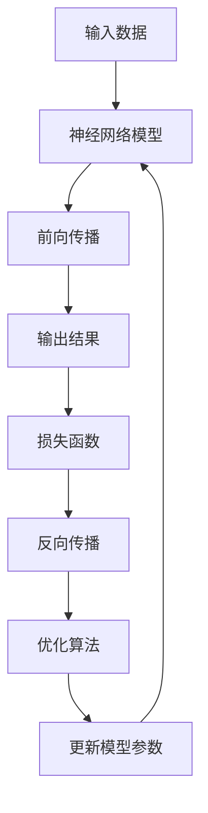

# 深度学习基础原理与代码实战案例讲解

## 1.背景介绍

深度学习作为机器学习的一个新的研究热点,近年来取得了令人瞩目的进展,在计算机视觉、自然语言处理、语音识别等领域展现出了强大的能力。深度学习的核心思想是通过构建深层次的神经网络模型,利用大量数据进行训练,自动学习数据的特征表示,从而完成各种预测和决策任务。

与传统的机器学习方法相比,深度学习具有以下优势:

1. 自动学习特征表示,不需要人工设计特征
2. 端到端的训练方式,简化了流程
3. 具有强大的泛化能力,可以处理复杂的非线性问题
4. 利用大量数据进行训练,性能可以不断提高

深度学习技术的快速发展,得益于大数据时代海量数据的积累、算力的飞速提升,以及一些突破性的算法创新,如卷积神经网络、长短期记忆网络等。目前,深度学习已经广泛应用于计算机视觉、自然语言处理、语音识别、推荐系统等诸多领域,并取得了超越人类水平的成绩。

## 2.核心概念与联系

深度学习的核心概念主要包括:

1. **神经网络(Neural Network)**:深度学习模型的基础架构,由多层神经元组成,每层对输入进行非线性变换。
2. **前向传播(Forward Propagation)**:输入数据从输入层经过隐藏层,计算得到输出层的结果。
3. **反向传播(Backpropagation)**:根据输出层的误差,计算每层参数的梯度,通过优化算法更新参数。
4. **激活函数(Activation Function)**:引入非线性,增强神经网络的表达能力,如Sigmoid、ReLU等。
5. **损失函数(Loss Function)**:衡量模型输出与真实值之间的差异,如均方误差、交叉熵等。
6. **优化算法(Optimization Algorithm)**:根据损失函数的梯度,更新模型参数,如梯度下降、Adam等。
7. **正则化(Regularization)**:防止过拟合,提高模型的泛化能力,如L1、L2正则、Dropout等。
8. **批量归一化(Batch Normalization)**:加快训练收敛速度,提高模型性能。

这些概念相互关联、环环相扣,构成了深度学习的理论基础和核心框架。



## 3.核心算法原理具体操作步骤

### 3.1 前向传播算法

前向传播是深度学习模型的核心运算过程,它将输入数据通过神经网络层层传递,计算得到最终的输出结果。具体步骤如下:

1. 初始化网络权重和偏置参数
2. 输入层接收输入数据
3. 对每一隐藏层:
    - 计算加权输入: $z = W^T x + b$
    - 通过激活函数计算输出: $a = f(z)$
    - 将输出作为下一层的输入
4. 输出层计算最终结果

其中,W为权重矩阵,b为偏置向量,f为激活函数。

### 3.2 反向传播算法

反向传播是深度学习模型训练的关键算法,它根据输出层的误差,计算每层参数的梯度,并通过优化算法更新参数,以减小损失函数的值。具体步骤如下:

1. 计算输出层的误差: $\delta^L = \nabla_a C \odot f'(z^L)$
2. 对每一隐藏层 l (从输出层往回传播):
    - 计算梯度: $\delta^l = ((W^{l+1})^T \delta^{l+1}) \odot f'(z^l)$
    - 计算权重梯度: $\nabla_W C = \delta^l (a^{l-1})^T$
    - 计算偏置梯度: $\nabla_b C = \delta^l$
3. 使用优化算法(如梯度下降)更新权重和偏置

其中,C为损失函数,$\delta$为误差项,f'为激活函数的导数,$\odot$为元素wise乘积运算。

通过不断迭代前向传播和反向传播,模型可以逐步减小损失函数的值,提高预测的准确性。

## 4.数学模型和公式详细讲解举例说明

### 4.1 神经网络模型

神经网络模型可以看作是一个由多层组成的函数复合:

$$
f(x) = f^L \circ f^{L-1} \circ ... \circ f^1(x)
$$

其中,x为输入,$f^l$为第l层的变换函数。每一层的变换函数可以表示为:

$$
f^l(z^{l-1}) = g(W^l z^{l-1} + b^l)
$$

这里,$z^{l-1}$为前一层的输出,W和b分别为该层的权重和偏置参数,g为激活函数。

常用的激活函数包括Sigmoid函数:

$$
\sigma(x) = \frac{1}{1 + e^{-x}}
$$

和ReLU函数:

$$
\text{ReLU}(x) = \max(0, x)
$$

### 4.2 损失函数

损失函数用于衡量模型输出与真实值之间的差异,是模型训练的关键。常用的损失函数有:

- 均方误差(Mean Squared Error):

$$
\text{MSE}(y, \hat{y}) = \frac{1}{n} \sum_{i=1}^n (y_i - \hat{y}_i)^2
$$

- 交叉熵(Cross Entropy):

$$
\text{CE}(y, \hat{y}) = - \frac{1}{n} \sum_{i=1}^n [y_i \log(\hat{y}_i) + (1 - y_i) \log(1 - \hat{y}_i)]
$$

其中,y为真实值,$\hat{y}$为模型输出,n为样本数量。

### 4.3 优化算法

优化算法的目标是找到能够最小化损失函数的模型参数。常用的优化算法包括:

- 梯度下降(Gradient Descent):

$$
\theta_{t+1} = \theta_t - \eta \nabla_\theta J(\theta_t)
$$

其中,$\theta$为模型参数,$\eta$为学习率,J为损失函数。

- 动量梯度下降(Momentum):

$$
v_{t+1} = \gamma v_t + \eta \nabla_\theta J(\theta_t) \\
\theta_{t+1} = \theta_t - v_{t+1}
$$

其中,$\gamma$为动量参数,用于加速收敛。

- Adam优化器:

$$
m_{t+1} = \beta_1 m_t + (1 - \beta_1) \nabla_\theta J(\theta_t) \\
v_{t+1} = \beta_2 v_t + (1 - \beta_2) (\nabla_\theta J(\theta_t))^2 \\
\hat{m}_{t+1} = \frac{m_{t+1}}{1 - \beta_1^{t+1}} \\
\hat{v}_{t+1} = \frac{v_{t+1}}{1 - \beta_2^{t+1}} \\
\theta_{t+1} = \theta_t - \eta \frac{\hat{m}_{t+1}}{\sqrt{\hat{v}_{t+1}} + \epsilon}
$$

其中,$\beta_1$和$\beta_2$为指数衰减率,$\epsilon$为一个很小的常数,用于数值稳定性。

通过选择合适的优化算法,可以加快模型收敛的速度,提高训练效率。

## 5.项目实践:代码实例和详细解释说明 

以下是一个使用PyTorch实现的简单前馈神经网络示例,用于对MNIST手写数字数据集进行分类。

```python
import torch
import torch.nn as nn
import torchvision
import torchvision.transforms as transforms

# 定义网络结构
class Net(nn.Module):
    def __init__(self):
        super(Net, self).__init__()
        self.fc1 = nn.Linear(28 * 28, 512)
        self.fc2 = nn.Linear(512, 256)
        self.fc3 = nn.Linear(256, 10)

    def forward(self, x):
        x = x.view(-1, 28 * 28)
        x = torch.relu(self.fc1(x))
        x = torch.relu(self.fc2(x))
        x = self.fc3(x)
        return x

# 加载数据集
transform = transforms.Compose([transforms.ToTensor(), transforms.Normalize((0.5,), (0.5,))])
trainset = torchvision.datasets.MNIST(root='./data', train=True, download=True, transform=transform)
trainloader = torch.utils.data.DataLoader(trainset, batch_size=64, shuffle=True)

# 定义模型、损失函数和优化器
net = Net()
criterion = nn.CrossEntropyLoss()
optimizer = torch.optim.Adam(net.parameters(), lr=0.001)

# 训练模型
for epoch in range(10):
    running_loss = 0.0
    for i, data in enumerate(trainloader, 0):
        inputs, labels = data
        optimizer.zero_grad()
        outputs = net(inputs)
        loss = criterion(outputs, labels)
        loss.backward()
        optimizer.step()
        running_loss += loss.item()
        if i % 100 == 99:
            print('[%d, %5d] loss: %.3f' % (epoch + 1, i + 1, running_loss / 100))
            running_loss = 0.0

print('Finished Training')
```

代码解释:

1. 定义网络结构:该网络包含三个全连接层,第一层将输入的28x28图像展平为784维向量,然后经过两个隐藏层(512和256个神经元),最后输出10个logits,对应10个数字类别。
2. 加载MNIST数据集:使用torchvision提供的数据集加载器,对图像进行标准化处理。
3. 定义模型、损失函数和优化器:实例化网络模型,使用交叉熵损失函数,Adam优化器。
4. 训练模型:进行10个epoch的训练,每100批次输出当前损失值。在每个batch中,执行前向传播计算输出和损失,反向传播计算梯度,优化器根据梯度更新模型参数。

通过这个简单示例,你可以了解到构建深度学习模型的基本流程,包括定义网络结构、加载数据、计算损失、反向传播和优化等关键步骤。在实际应用中,你可以根据具体问题构建更加复杂的网络结构,使用更多的技巧(如正则化、批量归一化等)来提高模型性能。

## 6.实际应用场景

深度学习技术在许多领域得到了广泛的应用,下面列举了一些典型的应用场景:

1. **计算机视觉**:图像分类、目标检测、语义分割、人脸识别等,如自动驾驶、医疗影像诊断等。
2. **自然语言处理**:机器翻译、文本生成、情感分析、问答系统等,如智能助手、客服机器人等。
3. **语音识别**:语音转文本、语音合成、语音助手等,如智能音箱、语音导航等。
4. **推荐系统**:个性化推荐、协同过滤等,如电商、视频网站等的个性化推荐。
5. **金融**:风险评估、欺诈检测、量化交易等。
6. **医疗健康**:医疗影像分析、药物发现、疾病预测等。
7. **游戏**:人工智能对手、游戏内容生成等。
8. **物理学**:粒子加速器数据分析、新材料发现等。

总的来说,深度学习技术可以应用于任何需要从复杂数据中提取有价值信息的领域,展现出了强大的潜力和广阔的前景。

## 7.工具和资源推荐

学习和使用深度学习技术,需要掌握一些常用的工具和资源,下面列举了一些推荐:

1. **深度学习框架**:
    - PyTorch: https://pytorch.org/
    - TensorFlow: https://www.tensorflow.org/
    - Keras: https://keras.io/

2. **数据集**:
    - MNIST手写数字: http://yann.lecun.com/exdb/mnist/
    - ImageNet图像数据库: http://www.image-net.org/
    - COCO数据集: https://cocodataset.org/
    - Penn Treebank语料库: https://catalog.ldc.upenn.edu/LDC99T42

3. **在线课程**:
    - 吴恩达深度学习课程(Coursera): https://www.coursera