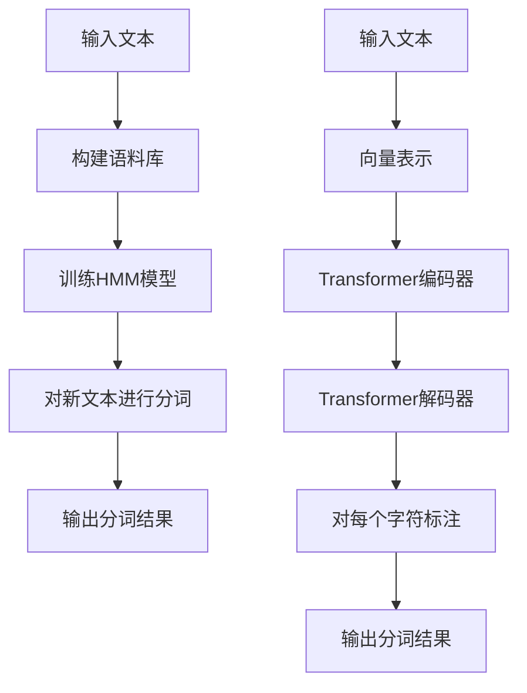

# "词"是什么，如何"分词"

## 1.背景介绍

在自然语言处理(NLP)领域中,"分词"是一个基础且关键的任务。所谓"分词",就是将一个文本序列按照某种策略划分成有语义单元的"词"序列。这个看似简单的任务,实际上对于不同语种来说,存在着不同的挑战。

对于英语等西方语种来说,词与词之间通常由空格分隔,分词相对容易。但对于中文、日语、泰语等东亚语种来说,词与词之间没有明确的分隔符,整个句子是一个连续的字符流,这使得分词任务变得异常困难。以"我爱北京天安门"为例,究竟应该分成"我/爱/北京天安门"还是"我/爱北京/天安门",抑或是"我爱/北京/天安门"?这就需要结合语义和语法来判断。

分词的效果直接影响到后续的NLP任务,如机器翻译、信息检索、词性标注、命名实体识别等。高质量的分词结果可以为后续任务奠定良好的基础。因此,分词任务一直是NLP领域的重要研究课题。

## 2.核心概念与联系

### 2.1 词语本身的概念

在深入探讨分词之前,我们首先需要明确"词"的概念。所谓"词",通常指具有一定语义单位的最小语素序列。词是构成句子和表达思想的基本单位。

不同的语言对"词"有不同的定义。在英语中,一个词通常由字母构成,以空格作为分隔符。而在汉语中,一个词可以由一个或多个汉字组成,词与词之间没有明确的分隔符。

此外,词还可以根据结构划分为单词和复合词。单词是最基本的词,如"学"、"生"等。复合词则是由两个或多个单词构成的新词,如"学生"、"图书馆"等。

### 2.2 分词任务的重要性

分词作为NLP的基础任务,对于后续的各种NLP任务都有着重要影响。以机器翻译为例,如果分词效果不佳,可能会导致翻译结果出现"硬伤"。比如将"我爱北京天安门"错误地分为"我/爱北京/天安门",在英译中就会将"北京天安门"视为一个整体,从而产生"I love Beijing Tian'anmen"的翻译结果,显然与原意"I love Beijing and Tian'anmen"有很大出入。

再以信息检索为例,如果查询词"北京天安门"没有被正确分词,那么当用户输入该查询词时,就无法正确匹配相关文档,检索效果将受到严重影响。

因此,分词作为NLP的基石,其质量对后续任务的影响至关重要。

### 2.3 分词任务的挑战

尽管分词看似简单,但由于不同语种的特点,分词任务实际上面临着诸多挑战:

1. **无分隔符挑战**:如前所述,中文等东亚语种缺乏明确的词语分隔符,给分词带来了极大困难。

2. **新词识别挑战**:随着时间推移,自然语言中会不断出现新的词语,如何识别和学习新词是分词面临的一大挑战。

3. **歧义消解挑战**:存在大量的词语歧义现象,如"北京大学"中的"北京"是地名还是形容词?这需要结合上下文语义来判断。

4. **领域差异挑战**:不同领域的文本中词语的使用习惯可能不同,如IT领域的"拉取(pull)"和"推送(push)"在一般领域就没有这样的意义。

5. **多粒度需求挑战**:有时候需要针对不同的粒度进行分词,如"复旦大学"可以分为"复旦/大学"的两个词,也可以作为一个整体词语。

这些挑战使得分词任务错综复杂,需要采用各种策略和技术来应对。

## 3.核心算法原理具体操作步骤

### 3.1 基于规则的分词方法

最早期的分词方法是基于规则的,通过人工总结一系列规则,然后对文本进行匹配分词。这种方法的核心思想是:

1. 构建一个词典,词典中收录常用词语。

2. 对于输入文本,从左到右扫描,尽可能匹配较长的词语。

3. 如果无法匹配较长词语,则匹配较短词语。

4. 对于无法匹配的字符,则作为单字成词处理。

这种基于规则的分词方法可以用有限状态自动机(FSA)或者最大匹配(MM)算法来实现。

#### 3.1.1 有限状态自动机(FSA)

有限状态自动机是一种从左到右扫描文本,进行状态转移和输出的模型。其核心思想是:

1. 初始状态为0。

2. 对于每个输入字符,根据当前状态和字符,按照状态转移表进行状态转移。

3. 当转移到某个终止状态时,就输出对应的词语。

4. 然后从终止状态重新开始,进入下一个状态循环。

FSA的优点是思路简单,高效快速。缺点是需要人工维护词典和状态转移表,无法学习新词,且无法处理歧义。

#### 3.1.2 最大匹配(MM)算法

最大匹配算法的核心思想是:

1. 从左到右扫描文本。

2. 对于当前位置,尽可能匹配最长的词语。

3. 如果有多个词语可供匹配,则选择词频最高的那个。

4. 匹配到词语后,移动到该词语之后继续匹配。

5. 如果无法匹配任何词语,则单字成词。

最大匹配算法的优点是思路简单,可以较好地处理歧义。缺点是无法学习新词,且对于字典的依赖性较强。

### 3.2 基于统计的分词方法

随着机器学习的发展,基于统计的分词方法应运而生。这种方法的核心思想是:

1. 构建一个包含词频信息的语料库。

2. 基于语料库,利用统计学习方法自动学习词语模型。

3. 对于输入文本,使用学习到的词语模型进行分词。

常见的统计分词模型有隐马尔可夫模型(HMM)、条件随机场(CRF)等。

#### 3.2.1 隐马尔可夫模型(HMM)

隐马尔可夫模型将分词问题视为一个序列标注问题。其核心思想是:

1. 将每个字符看作是一个观测状态。

2. 将每个词语看作是一个隐藏状态。

3. 通过训练语料,学习字符序列与词语序列之间的转移概率和发射概率。

4. 在分词时,对于给定的字符序列,使用维特比算法求解最可能的词语序列。

HMM模型的优点是思路简单,可以自动学习新词。缺点是假设了字符与字符之间是条件独立的,这与实际情况有出入。

#### 3.2.2 条件随机场(CRF)

条件随机场是一种无向无环图模型,可以更好地捕捉字符之间的关联关系。其核心思想是:

1. 将每个字符看作是一个节点。

2. 通过特征函数来定义节点之间的关联关系。

3. 通过训练语料,学习特征函数的权重。

4. 在分词时,对于给定的字符序列,使用维特比算法求解最可能的词语序列标注。

CRF模型的优点是能够有效利用上下文信息,捕捉字符之间的关联关系。缺点是需要人工设计特征函数,且计算复杂度较高。

### 3.3 基于深度学习的分词方法

近年来,随着深度学习技术的飞速发展,基于深度学习的分词方法也逐渐兴起,取得了卓越的成绩。这种方法的核心思想是:

1. 将文本序列转换为向量表示。

2. 使用神经网络模型自动学习文本序列的特征表示。

3. 在神经网络的输出层,对每个字符进行词语边界标注。

常见的深度学习分词模型有基于窗口的神经网络、基于序列到序列的模型、基于 Transformer 的模型等。

#### 3.3.1 基于窗口的神经网络

这种方法的核心思想是:

1. 对于每个字符,构造一个固定窗口大小的上下文窗口。

2. 将窗口内的字符序列转换为向量表示,输入到神经网络中。

3. 神经网络自动学习特征,在输出层对每个字符进行词语边界标注。

4. 在训练时,使用标注好的语料,通过反向传播算法学习网络参数。

这种方法的优点是思路简单,可以自动学习特征表示。缺点是无法利用全局信息,且对长距离依赖的建模能力较差。

#### 3.3.2 基于序列到序列的模型

这种方法的核心思想是:

1. 将原始文本序列作为编码器的输入。

2. 使用循环神经网络(RNN)或者卷积神经网络(CNN)作为编码器,对文本序列进行编码。

3. 将编码后的序列作为解码器的输入。

4. 使用另一个RNN或CNN作为解码器,在输出层对每个字符进行词语边界标注。

5. 在训练时,使用标注好的语料,最小化编码器和解码器的损失函数。

这种方法的优点是可以捕捉全局信息和长距离依赖关系。缺点是训练过程复杂,容易出现梯度消失或爆炸问题。

#### 3.3.3 基于 Transformer 的模型

Transformer 模型是近年来在 NLP 领域取得巨大成功的一种全新架构,它完全摒弃了 RNN 结构,使用注意力机制来捕捉长距离依赖关系。基于 Transformer 的分词模型的核心思想是:

1. 将原始文本序列转换为向量表示,作为 Transformer 编码器的输入。

2. 使用多头注意力机制和位置编码,在 Transformer 编码器中对文本序列进行编码。

3. 将编码后的序列作为 Transformer 解码器的输入。

4. 在解码器的输出层,对每个字符进行词语边界标注。

5. 在训练时,使用标注好的语料,最小化编码器和解码器的损失函数。

基于 Transformer 的分词模型可以有效捕捉长距离依赖关系,且并行计算能力强,训练速度快。目前,这种模型在分词任务上取得了最先进的性能。

### 3.4 分词算法流程图

以上介绍了几种主流的分词算法原理和具体操作步骤,下面使用 Mermaid 流程图来直观地展示基于统计模型(以 HMM 为例)和基于深度学习模型(以 Transformer 为例)的分词算法流程:

## 4.数学模型和公式详细讲解举例说明

在分词算法中,常常需要使用一些数学模型和公式来量化和优化分词效果。下面将详细介绍几种常用的数学模型和公式。

### 4.1 隐马尔可夫模型(HMM)

在隐马尔可夫模型中,我们需要计算给定观测序列的条件概率 $P(O|M)$,也就是在模型 $M$ 下观测到序列 $O$ 的概率。根据贝叶斯公式,我们有:

$$P(O|M) = \frac{P(O,M)}{P(M)} = \frac{P(O,M)}{\sum_{M'}P(O,M')}$$

其中,$P(O,M)$ 表示联合概率分布,可以借助前向算法高效计算。在 HMM 中,联合概率可以分解为:

$$P(O,M) = \pi_{q_0}b_0(o_0)\prod_{