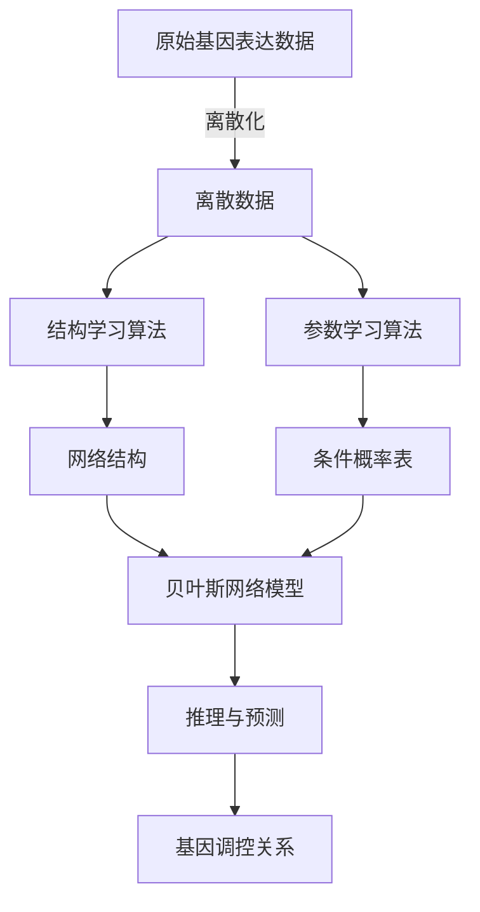

# 贝叶斯网络与生物信息学的应用与研究

## 1.背景介绍

生物信息学是一门涉及生物学、计算机科学和统计学的交叉学科,旨在利用计算机技术和数学模型来分析和解释生物数据。随着高通量实验技术的发展,生物数据的数量和复杂性都在快速增长,传统的数据分析方法已经无法满足研究需求。因此,需要引入新的计算模型和算法来处理这些海量数据。

贝叶斯网络(Bayesian Network)作为一种强大的概率图模型,在生物信息学领域得到了广泛应用。它能够有效地表示复杂的因果关系,并基于观测数据进行推理和预测。贝叶斯网络在基因调控网络构建、疾病风险预测、蛋白质结构预测等领域发挥着重要作用。

## 2.核心概念与联系

### 2.1 贝叶斯网络的定义

贝叶斯网络是一种概率图模型,由两个部分组成:有向无环图(Directed Acyclic Graph, DAG)和条件概率表(Conditional Probability Table, CPT)。

- 有向无环图描述了变量之间的因果关系,每个节点代表一个随机变量,边表示变量之间的依赖关系。
- 条件概率表定义了每个变量在给定其父节点取值情况下的条件概率分布。

通过将有向无环图和条件概率表相结合,贝叶斯网络可以有效地表示复杂的联合概率分布,并支持各种推理任务,如预测、诊断和解释等。

### 2.2 生物信息学中的应用

在生物信息学领域,贝叶斯网络被广泛应用于以下任务:

1. **基因调控网络构建**: 利用基因表达数据和先验知识构建基因调控网络,揭示基因之间的调控关系。
2. **疾病风险预测**: 根据患者的基因型、表型和环境因素预测疾病风险,为个体化医疗提供支持。
3. **蛋白质结构预测**: 利用蛋白质序列和已知结构信息预测蛋白质的三维结构。
4. **系统生物学建模**: 将不同层次的生物数据整合到一个统一的概率模型中,揭示生物系统的整体行为。

## 3.核心算法原理具体操作步骤

构建贝叶斯网络的主要步骤包括:

1. **数据预处理**: 对原始数据进行清洗、标准化和离散化等预处理,以满足贝叶斯网络的输入要求。

2. **结构学习**: 根据数据和先验知识,使用搜索和评分算法来确定网络结构(有向无环图)。常用算法包括Hill-Climbing、K2、约束基算法等。

3. **参数学习**: 在给定网络结构的情况下,根据数据估计每个变量的条件概率表。常用的参数学习算法有最大似然估计、贝叶斯估计等。

4. **推理和预测**: 利用构建好的贝叶斯网络,执行各种推理任务,如预测、诊断和解释等。常用算法有变量消除、连接树算法等。

以基因调控网络构建为例,具体步骤如下:



## 4.数学模型和公式详细讲解举例说明

### 4.1 贝叶斯网络的数学模型

设 $X = \{X_1, X_2, \ldots, X_n\}$ 是一组随机变量,它们的联合概率分布可以表示为:

$$P(X_1, X_2, \ldots, X_n) = \prod_{i=1}^n P(X_i | \text{Parents}(X_i))$$

其中,$ \text{Parents}(X_i)$ 表示变量 $X_i$ 在有向无环图中的父节点集合。

根据链式法则,联合概率分布可以分解为条件概率的乘积。这种分解方式使得复杂的联合概率分布可以通过局部条件概率分布来表示,从而大大简化了计算和存储。

### 4.2 条件概率表

条件概率表(CPT)定义了每个变量在给定其父节点取值情况下的条件概率分布。对于离散变量,CPT可以用一个条件概率矩阵来表示。

例如,对于一个二值变量 $X$ 和两个父节点 $Y$ 和 $Z$,其条件概率表如下:

$$
\begin{array}{c|cc}
P(X|Y,Z) & Y=0 & Y=1 \\
\hline
Z=0 & P(X=1|Y=0,Z=0) & P(X=1|Y=1,Z=0) \\
Z=1 & P(X=1|Y=0,Z=1) & P(X=1|Y=1,Z=1)
\end{array}
$$

通过估计这些条件概率,我们就可以完全定义贝叶斯网络。

### 4.3 参数学习

参数学习的目标是根据观测数据估计每个变量的条件概率表。常用的参数学习算法包括:

1. **最大似然估计(MLE)**: 通过最大化数据的似然函数来估计参数值。对于完全数据,MLE有解析解。

2. **贝叶斯估计**: 在MLE的基础上引入先验分布,根据贝叶斯公式估计后验分布。常用的先验分布包括Dirichlet先验和BDe先验。

3. **EM算法**: 用于处理存在缺失数据的情况。通过迭代计算期望值和最大化似然函数,逐步优化参数估计。

以MLE为例,对于变量 $X$ 和父节点集合 $\text{Parents}(X)$,条件概率 $P(X=x_k|\text{Parents}(X)=\pi_l)$ 的估计为:

$$\hat{P}(X=x_k|\text{Parents}(X)=\pi_l) = \frac{N_{x_k,\pi_l}}{N_{\pi_l}}$$

其中,$ N_{x_k,\pi_l}$ 是在观测数据中,$ X=x_k$ 且 $\text{Parents}(X)=\pi_l$ 的实例数量,$ N_{\pi_l}$ 是 $\text{Parents}(X)=\pi_l$ 的实例总数。

## 5.项目实践:代码实例和详细解释说明

以下是使用Python和pgmpy库构建贝叶斯网络并进行推理的示例代码:

```python
from pgmpy.models import BayesianModel
from pgmpy.estimators import MaximumLikelihoodEstimator
from pgmpy.inference import VariableElimination

# 定义网络结构
model = BayesianModel([('Cloudy', 'Sprinkler'), ('Sprinkler', 'WetGrass'),
                       ('Cloudy', 'Rain'), ('Rain', 'WetGrass')])

# 输入训练数据
data = pd.DataFrame(data={'Cloudy': [0, 1, 0, 1], 'Sprinkler': [1, 0, 1, 0],
                          'Rain': [0, 1, 0, 1], 'WetGrass': [1, 0, 1, 1]})

# 学习网络参数
model.fit(data, estimator=MaximumLikelihoodEstimator)

# 执行推理
infer = VariableElimination(model)
print(f"P(Sprinkler=1) = {infer.query(variables=['Sprinkler'])['Sprinkler'].values}")
print(f"P(WetGrass=1|Sprinkler=0,Cloudy=1) = {infer.query(variables=['WetGrass'],
                                                          evidence={'Sprinkler': 0, 'Cloudy': 1})['WetGrass'].values}")
```

上述代码执行了以下步骤:

1. 定义了一个包含4个节点的贝叶斯网络模型,描述了"云层"、"草坪喷水器"、"下雨"和"草坪湿"之间的关系。
2. 输入了一个包含4个样本的训练数据。
3. 使用最大似然估计算法学习网络参数(条件概率表)。
4. 创建了一个变量消除推理器,用于执行各种推理任务。
5. 计算了"喷水器打开"的边际概率,以及在"无喷水器且有云层"的证据下,"草坪湿"的条件概率。

通过这个示例,你可以了解如何使用Python和pgmpy库来构建、学习和推理贝叶斯网络模型。

## 6.实际应用场景

贝叶斯网络在生物信息学领域有广泛的应用,以下是一些典型场景:

### 6.1 基因调控网络构建

基因调控网络描述了基因之间的调控关系,对于理解基因功能、预测基因表达和设计药物靶点等具有重要意义。通过整合基因表达数据和先验知识,贝叶斯网络可以有效地重构基因调控网络。

例如,Friedman等人利用贝叶斯网络成功推断出包括53个基因的调控网络,揭示了这些基因在细胞周期中的作用。该研究为后续的基因功能研究提供了重要线索。

### 6.2 疾病风险预测

通过整合患者的基因型、表型和环境因素,贝叶斯网络可以准确预测患者患某种疾病的风险。这为个体化医疗和早期干预提供了依据。

例如,Sebastiani等人构建了一个贝叶斯网络模型,通过整合多种风险因素来预测老年人患阿尔茨海默症的风险。该模型的预测准确性高于传统的线性模型,为临床诊断和治疗提供了有力支持。

### 6.3 蛋白质结构预测

蛋白质的三维结构决定了其功能,准确预测蛋白质结构对于理解生命过程和设计新药物具有重要意义。贝叶斯网络可以利用蛋白质序列和已知结构信息来预测未知蛋白质的三维结构。

例如,Boomsma等人提出了一种基于贝叶斯网络的蛋白质结构预测方法,通过建模蛋白质残基之间的相互作用,实现了较高的预测精度。该方法为蛋白质结构预测提供了一种新的思路。

## 7.工具和资源推荐

以下是一些常用的贝叶斯网络工具和资源:

### 7.1 Python库

- **pgmpy**: 一个开源的Python库,提供了贝叶斯网络的构建、学习、推理和采样等功能。
- **pomegranate**: 另一个Python库,支持贝叶斯网络和其他概率模型。
- **BNlearn**: 一个R包,提供了贝叶斯网络的各种学习算法和推理方法。

### 7.2 GUI工具

- **GeNIe**: 一款商业软件,提供了直观的图形界面和强大的建模功能。
- **SamIam**: 一款免费的GUI工具,支持贝叶斯网络的构建、推理和敏感性分析。

### 7.3 在线课程和教材

- **Coursera上的"概率图模型"课程**: 由斯坦福大学开设,详细介绍了贝叶斯网络和马尔可夫网络的理论和应用。
- **《贝叶斯网络:概率推理和决策》**: 由Finn V. Jensen和Thomas D. Nielsen所著,是一本权威的贝叶斯网络入门教材。

### 7.4 论文和数据集

- **BNLearn数据集**: 包含了多个真实世界的数据集,可用于贝叶斯网络的学习和评估。
- **Bayesian Network Repository**: 一个收集了许多贝叶斯网络相关论文和数据集的在线资源库。

通过利用这些工具和资源,研究人员可以更高效地构建、学习和应用贝叶斯网络模型。

## 8.总结:未来发展趋势与挑战

贝叶斯网络在生物信息学领域取得了广泛的应用,但仍然面临一些挑战和发展方向:

### 8.1 大规模网络学习

随着数据量的不断增加,如何高效地学习大规模贝叶斯网络成为一个重要挑战。需要开发新的结构学习算法和并行计算技术,以提高学习效率。

### 8.2