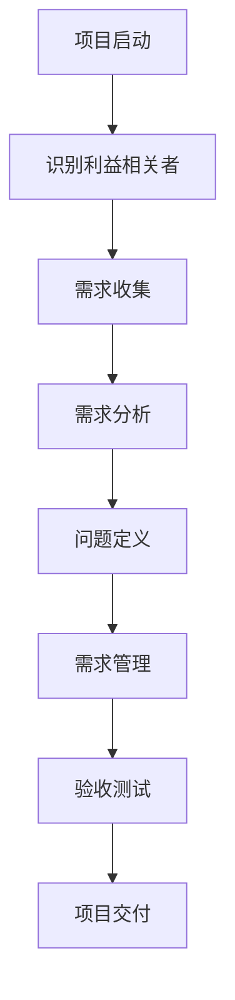

# 需求分析与问题定义原理与代码实战案例讲解

## 1. 背景介绍

在软件开发过程中,需求分析和问题定义是一个至关重要的初始阶段。它为整个项目奠定了基础,确保开发团队对客户需求有清晰的理解,并将问题准确地定义和框架化。这一阶段的成功与否直接影响着后续开发的效率和产品的质量。

需求分析涉及收集、分析和定义客户需求的过程。它包括与利益相关者(如客户、用户和其他相关方)进行沟通,以了解他们的需求和期望。同时,还需要考虑业务目标、技术限制和其他相关因素。

问题定义则是将收集到的需求转化为可操作的问题陈述。它明确定义了需要解决的问题,并为开发团队提供了一个清晰的目标和范围。良好的问题定义有助于避免范围蔓延和需求变更,从而提高开发效率。

本文将深入探讨需求分析和问题定义的原理和最佳实践,并通过实际案例讲解如何在代码层面实现这些原理。我们将介绍各种技术和工具,以帮助您更好地理解和应用这些概念。

## 2. 核心概念与联系

需求分析和问题定义涉及多个核心概念,它们相互关联,共同构建了一个完整的框架。以下是一些关键概念:

### 2.1 利益相关者

利益相关者是指对项目成果有利益关系的个人或组织。他们可能包括客户、用户、开发团队、管理层等。识别和管理利益相关者对于收集全面的需求至关重要。

### 2.2 需求收集技术

需求收集是获取客户需求的过程,通常涉及多种技术,如访谈、调查、观察、文档分析等。选择合适的技术对于获取准确和完整的需求信息至关重要。

### 2.3 需求分析

需求分析是对收集到的需求进行审查、整理和优先级排序的过程。它包括识别冲突、缺失和模糊的需求,并对它们进行澄清和协调。

### 2.4 问题定义

问题定义是将需求转化为可操作的问题陈述的过程。它明确定义了需要解决的问题,包括目标、范围、约束条件和成功标准。

### 2.5 需求管理

需求管理是对需求进行跟踪、控制和维护的过程,以确保需求的一致性和可追溯性。它涉及需求变更控制、版本控制和需求跟踪等活动。

### 2.6 验收测试

验收测试是根据已定义的需求和成功标准,对开发的解决方案进行评估和验证的过程。它确保解决方案满足客户需求。

这些概念相互关联,共同构建了一个完整的需求分析和问题定义框架。理解它们之间的关系对于有效地管理和实施这一过程至关重要。

## 3. 核心算法原理具体操作步骤

需求分析和问题定义过程可以概括为以下几个主要步骤:



### 3.1 项目启动

在项目启动阶段,需要明确项目的背景、目标和范围。这为后续的需求收集和分析奠定了基础。

### 3.2 识别利益相关者

识别所有与项目相关的利益相关者,包括客户、用户、开发团队、管理层等。了解他们的需求和期望对于需求收集至关重要。

### 3.3 需求收集

利用多种技术(如访谈、调查、观察等)收集利益相关者的需求。需求收集应该是一个迭代和持续的过程,以确保获取全面和准确的需求信息。

### 3.4 需求分析

对收集到的需求进行审查、整理和优先级排序。需要识别和解决任何冲突、缺失或模糊的需求。此步骤的目标是获得一组清晰、一致和可实现的需求。

### 3.5 问题定义

根据分析后的需求,明确定义需要解决的问题。问题定义应该包括目标、范围、约束条件和成功标准。这为后续的开发工作提供了明确的指导。

### 3.6 需求管理

在整个项目生命周期中,需要对需求进行跟踪、控制和维护。这包括需求变更控制、版本控制和需求跟踪等活动,以确保需求的一致性和可追溯性。

### 3.7 验收测试

根据已定义的需求和成功标准,对开发的解决方案进行评估和验证。验收测试确保解决方案满足客户需求,并为项目交付做好准备。

### 3.8 项目交付

在满足所有需求和验收标准后,将解决方案交付给客户。这可能包括培训、文档和支持等活动。

这些步骤并非严格线性的,在实际应用中可能会存在迭代和反馈循环。需要根据项目的具体情况进行调整和优化。

## 4. 数学模型和公式详细讲解举例说明

在需求分析和问题定义过程中,可能需要使用一些数学模型和公式来量化和优化需求。以下是一些常见的模型和公式:

### 4.1 Kano 模型

Kano 模型是一种用于分类和优先级排序需求的模型。它将需求分为五类:基本需求、期望需求、激励需求、无差异需求和反向需求。这有助于开发团队集中精力满足最重要的需求。

$$
CS = \sum_{i=1}^{n} w_i \cdot S_i
$$

其中,CS 表示客户满意度,w_i 表示第 i 个需求的权重,S_i 表示第 i 个需求的满足程度。

### 4.2 需求优先级模型

需求优先级模型用于确定需求的相对重要性,以便进行有效的资源分配。一种常见的模型是基于价值、成本和风险的优先级模型:

$$
P = \frac{V}{C \cdot R}
$$

其中,P 表示需求的优先级,V 表示需求的价值,C 表示实现需求的成本,R 表示与需求相关的风险。

### 4.3 需求冲突解决模型

当存在冲突需求时,可以使用需求冲突解决模型来协调和解决这些冲突。一种常见的模型是基于需求的重要性和相关性的模型:

$$
C_i = \sum_{j=1}^{n} w_j \cdot r_{ij}
$$

其中,C_i 表示第 i 个需求的冲突程度,w_j 表示第 j 个需求的重要性,r_ij 表示第 i 个需求与第 j 个需求之间的相关性。

### 4.4 需求可追溯性模型

需求可追溯性模型用于跟踪需求与其他项目工件(如设计、代码和测试用例)之间的关系。这有助于确保需求的一致性和完整性。一种常见的模型是基于需求跟踪矩阵的模型:

$$
T_{ij} = \begin{cases}
1, & \text{如果需求 i 与工件 j 相关} \\
0, & \text{否则}
\end{cases}
$$

其中,T_ij 表示需求 i 与工件 j 之间的跟踪关系。

这些数学模型和公式为需求分析和问题定义过程提供了量化和优化的工具。它们有助于开发团队做出更明智的决策,并确保解决方案满足客户需求。

## 5. 项目实践: 代码实例和详细解释说明

为了更好地理解需求分析和问题定义的原理,让我们通过一个实际案例来探讨如何在代码层面实现这些概念。

### 5.1 案例背景

假设我们正在开发一个在线购物网站。客户提出了以下需求:

1. 用户能够浏览和搜索产品
2. 用户能够将产品添加到购物车
3. 用户能够进行在线支付
4. 用户能够查看订单历史记录
5. 管理员能够管理产品目录
6. 管理员能够查看销售报告

### 5.2 需求收集和分析

我们可以使用 Python 中的 `pandas` 库来存储和分析收集到的需求。

```python
import pandas as pd

# 创建需求数据框
requirements = pd.DataFrame({
    'ID': [1, 2, 3, 4, 5, 6],
    'Description': [
        '用户能够浏览和搜索产品',
        '用户能够将产品添加到购物车',
        '用户能够进行在线支付',
        '用户能够查看订单历史记录',
        '管理员能够管理产品目录',
        '管理员能够查看销售报告'
    ],
    'Priority': [1, 1, 1, 2, 1, 2],
    'Stakeholder': ['用户', '用户', '用户', '用户', '管理员', '管理员']
})

# 分析需求优先级
high_priority = requirements[requirements['Priority'] == 1]
print('高优先级需求:')
print(high_priority)
```

输出:

```
高优先级需求:
   ID                     Description  Priority Stakeholder
0   1            用户能够浏览和搜索产品          1         用户
1   2           用户能够将产品添加到购物车          1         用户
2   3               用户能够进行在线支付          1         用户
4   5             管理员能够管理产品目录          1      管理员
```

### 5.3 问题定义

根据需求分析的结果,我们可以定义需要解决的问题。

```python
# 定义问题
problem_statement = """
开发一个在线购物网站,满足以下需求:
1. 用户能够浏览和搜索产品
2. 用户能够将产品添加到购物车
3. 用户能够进行在线支付
4. 用户能够查看订单历史记录
5. 管理员能够管理产品目录
6. 管理员能够查看销售报告

目标:
- 提供一个直观、用户友好的在线购物体验
- 确保系统的安全性和可靠性
- 支持多种付款方式
- 提供完整的订单管理和销售报告功能

约束条件:
- 需要与现有的库存管理系统集成
- 需要符合相关的法律法规和隐私政策
- 需要在6个月内完成开发和上线

成功标准:
- 用户满意度评分达到4.5分(满分5分)
- 月销售额达到预期目标的80%
- 系统的可用性和响应时间符合服务级别协议(SLA)的要求
"""

print(problem_statement)
```

输出:

```
开发一个在线购物网站,满足以下需求:
1. 用户能够浏览和搜索产品
2. 用户能够将产品添加到购物车
3. 用户能够进行在线支付
4. 用户能够查看订单历史记录
5. 管理员能够管理产品目录
6. 管理员能够查看销售报告

目标:
- 提供一个直观、用户友好的在线购物体验
- 确保系统的安全性和可靠性
- 支持多种付款方式
- 提供完整的订单管理和销售报告功能

约束条件:
- 需要与现有的库存管理系统集成
- 需要符合相关的法律法规和隐私政策
- 需要在6个月内完成开发和上线

成功标准:
- 用户满意度评分达到4.5分(满分5分)
- 月销售额达到预期目标的80%
- 系统的可用性和响应时间符合服务级别协议(SLA)的要求
```

### 5.4 需求管理和跟踪

在开发过程中,我们需要对需求进行管理和跟踪,以确保它们得到正确实现。我们可以使用 `traceability_matrix` 函数来建立需求与代码之间的可追溯性关系。

```python
def traceability_matrix(requirements, code_files):
    """
    构建需求与代码文件之间的可追溯性矩阵
    
    Args:
        requirements (pandas.DataFrame): 需求数据框
        code_files (list): 代码文件列表
        
    Returns:
        pandas.DataFrame: 可追溯性矩阵
    """
    matrix = pd.DataFrame(0,