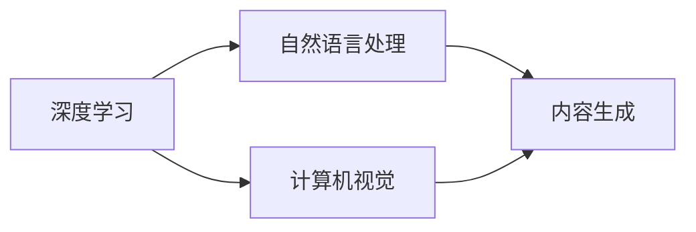
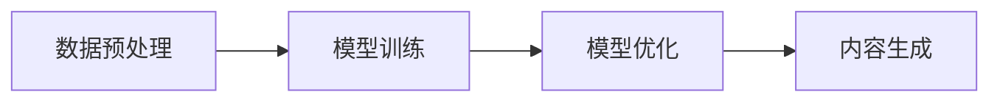

# AIGC从入门到实战：启动：AIGC 工具中的明星产品 Midjourney

## 1.背景介绍
在人工智能的黄金时代，AIGC（人工智能生成内容）技术正以前所未有的速度发展。Midjourney作为AIGC领域的明星产品，它的出现不仅仅是技术的飞跃，更是对创造力和生产力的一次革命性提升。Midjourney利用深度学习算法，能够在文本、图像、音频等多个维度生成高质量的内容，为内容创造者提供了前所未有的便利。

## 2.核心概念与联系
AIGC技术的核心在于利用人工智能模拟、扩展甚至超越人类在内容创作方面的能力。Midjourney作为其中的代表，其核心概念包括深度学习、自然语言处理、计算机视觉等。这些技术相互联系，共同构成了Midjourney的技术基础。



## 3.核心算法原理具体操作步骤
Midjourney的核心算法原理基于深度神经网络，特别是变分自编码器（VAE）和生成对抗网络（GAN）。操作步骤通常包括数据预处理、模型训练、模型优化和内容生成。



## 4.数学模型和公式详细讲解举例说明
以变分自编码器为例，其核心数学模型是基于以下公式：

$$
\log P(X) = D_{KL}(Q(Z|X)||P(Z)) + \mathbb{E}_{Q(Z|X)}[\log P(X|Z)]
$$

其中，$D_{KL}$ 表示Kullback-Leibler散度，$Q(Z|X)$ 是编码器输出的概率分布，$P(Z)$ 是先验分布，$P(X|Z)$ 是解码器输出的概率分布。

## 5.项目实践：代码实例和详细解释说明
在实际项目中，我们可以使用Python和TensorFlow来实现一个简单的VAE模型。以下是一个简化的代码示例：

```python
import tensorflow as tf

# 编码器网络
encoder = tf.keras.Sequential([
    tf.keras.layers.InputLayer(input_shape=(784,)),
    tf.keras.layers.Dense(256, activation='relu'),
    tf.keras.layers.Dense(z_dim*2)
])

# 解码器网络
decoder = tf.keras.Sequential([
    tf.keras.layers.InputLayer(input_shape=(z_dim,)),
    tf.keras.layers.Dense(256, activation='relu'),
    tf.keras.layers.Dense(784, activation='sigmoid')
])
```

## 6.实际应用场景
Midjourney在多个领域都有广泛的应用，包括但不限于新闻文章生成、社交媒体内容创作、游戏开发、电影脚本编写等。

## 7.工具和资源推荐
为了更好地使用Midjourney，以下是一些推荐的工具和资源：
- TensorFlow和PyTorch：两个主流的深度学习框架。
- OpenAI GPT-3：强大的自然语言处理模型。
- DALL·E：OpenAI开发的图像生成模型。

## 8.总结：未来发展趋势与挑战
AIGC技术的未来发展趋势将更加注重多模态、交互式和个性化的内容生成。同时，技术的可解释性、伦理和安全性也将成为重要的挑战。

## 9.附录：常见问题与解答
Q1: AIGC技术是否会取代人类创作者？
A1: AIGC技术更多是作为人类创作者的辅助工具，而非取代者。

Q2: Midjourney生成的内容的版权归谁所有？
A2: 这是一个复杂的法律问题，通常取决于使用Midjourney的具体协议和当地的版权法律。

作者：禅与计算机程序设计艺术 / Zen and the Art of Computer Programming