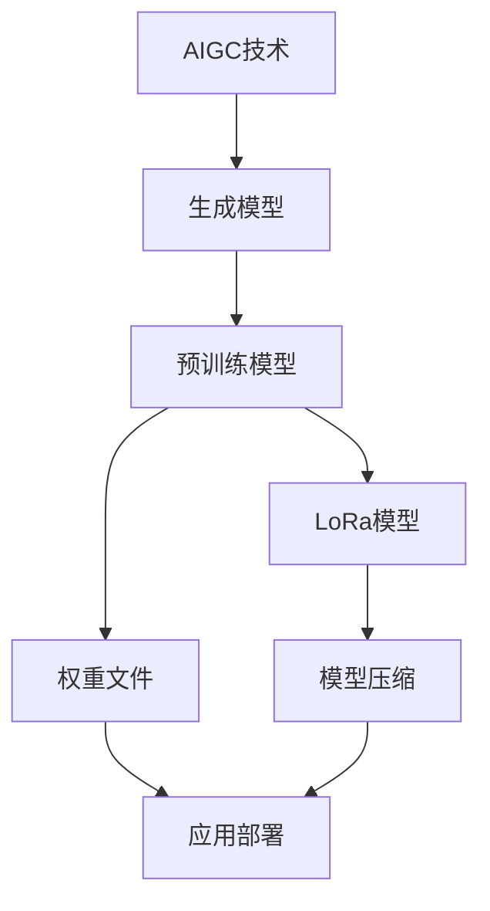
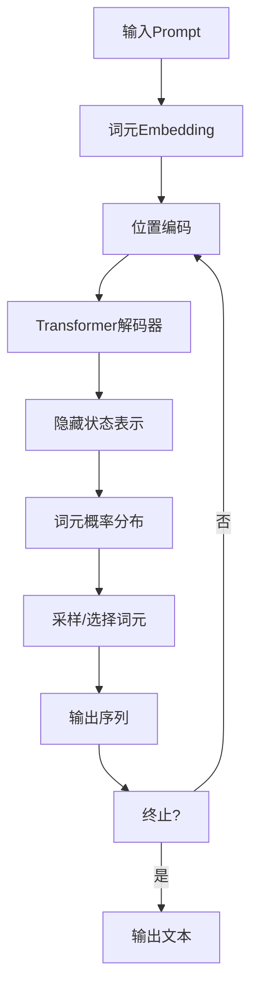
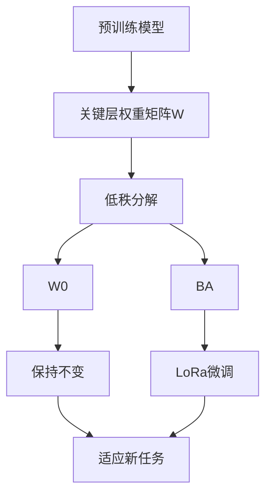

# AIGC从入门到实战：安装权重文件和 LoRa 模型文件

## 1.背景介绍

### 1.1 AIGC的兴起

近年来,人工智能生成内容(AIGC)技术取得了长足进展,引发了广泛关注。AIGC技术可以基于大规模训练数据和强大的深度学习模型,生成高质量的文本、图像、音频和视频等多种形式的内容。这种技术的兴起,为内容创作和生产带来了全新的可能性,同时也对传统的内容生产方式提出了挑战。

### 1.2 大型语言模型的重要性

大型语言模型是AIGC技术的核心驱动力之一。这些模型通过在海量文本数据上进行训练,学习了丰富的语言知识和上下文关联能力,可以生成流畅、连贯、富有内容的文本输出。著名的大型语言模型包括GPT-3、BERT、XLNet等。

### 1.3 权重文件和LoRa模型

要使用这些大型语言模型,需要下载和安装相应的权重文件。权重文件包含了模型在训练过程中学习到的参数值,是模型生成高质量输出的关键。另一种常用的模型形式是LoRa(Low-Rank Adaptation),它是一种模型压缩和微调技术,可以在保持原始大模型性能的同时,大幅降低所需的计算资源和存储空间。

## 2.核心概念与联系

### 2.1 AIGC的核心概念

AIGC技术的核心概念包括:

- **生成模型**: 基于深度学习的模型,可以生成新的、前所未见的内容,如文本、图像、音频等。
- **预训练**: 在大规模数据上对模型进行初始训练,使其获得通用的知识和能力。
- **微调**: 在特定任务数据上对预训练模型进行进一步调整,使其适应特定场景。
- **生成质量**: 评估生成内容的质量,包括流畅性、连贯性、相关性等指标。

### 2.2 权重文件和LoRa模型的关系

权重文件和LoRa模型都是存储和应用大型语言模型参数的两种形式:

- **权重文件**: 包含完整的模型参数,通常体积较大,但使用方便。
- **LoRa模型**: 是一种模型压缩形式,只存储少量的调整参数,体积小,但需要与原始模型结合使用。

两者的选择取决于具体的应用场景和资源限制。权重文件更适合资源充足的情况,而LoRa模型则更适合资源受限的环境。



## 3.核心算法原理具体操作步骤

### 3.1 生成式预训练转移Transformer

生成式预训练转移Transformer(Generative Pre-trained Transformer,GPT)是一种常用的生成式语言模型,它的核心原理是自回归(Auto-Regressive)语言建模。具体来说,GPT模型会基于给定的文本前缀(Prompt),预测下一个最可能出现的词元(Token),并将其附加到输出序列中,重复这一过程直到生成完整的文本输出。

#### 3.1.1 输入表示

GPT模型将输入文本序列表示为一系列词元(Token)的embeddings,并通过位置编码(Positional Encoding)来捕获词元在序列中的位置信息。

#### 3.1.2 Transformer解码器

GPT模型的核心是Transformer解码器(Decoder),它由多个相同的解码器层(Decoder Layer)组成。每个解码器层包含以下几个主要子层:

1. **多头自注意力(Multi-Head Self-Attention)**:计算当前位置的词元与之前所有位置词元的注意力权重,捕获序列内的长程依赖关系。
2. **前馈神经网络(Feed-Forward Neural Network)**:对每个位置的表示进行非线性变换,提取更高层次的特征。
3. **残差连接(Residual Connection)**:将子层的输入和输出相加,以缓解梯度消失问题。
4. **层归一化(Layer Normalization)**:对每个子层的输出进行归一化,加速训练收敛。

#### 3.1.3 生成过程

在生成过程中,GPT模型会根据给定的Prompt,预测下一个最可能出现的词元。具体步骤如下:

1. 将Prompt表示为词元embeddings序列,并通过位置编码。
2. 将embeddings输入到Transformer解码器,经过多层解码器层的计算,得到每个位置的隐藏状态表示。
3. 对最后一个位置的隐藏状态进行线性变换和Softmax操作,得到词元的概率分布。
4. 从概率分布中采样(或选择概率最大)的词元,附加到输出序列。
5. 将新的输出序列作为输入,重复步骤2-4,直到达到终止条件(如生成指定长度或遇到终止符)。

通过这种自回归的方式,GPT模型可以生成连贯、富有内容的文本输出。



### 3.2 LoRa算法原理

LoRa(Low-Rank Adaptation)是一种模型压缩和微调技术,它可以在保持原始大模型性能的同时,大幅降低所需的计算资源和存储空间。LoRa的核心思想是通过在预训练模型的关键层中引入少量的可训练参数,来适应特定的下游任务,而不需要微调整个大模型。

#### 3.2.1 低秩矩阵分解

LoRa的关键是将需要微调的大型矩阵(如Transformer层中的权重矩阵)进行低秩矩阵分解,从而将高维参数空间映射到低维子空间。具体来说,对于一个大型矩阵$W \in \mathbb{R}^{m \times n}$,LoRa将其分解为两个低秩矩阵的乘积:

$$W \approx W_0 + BA$$

其中,$W_0$是预训练模型中的原始权重矩阵,$B \in \mathbb{R}^{m \times r}$和$A \in \mathbb{R}^{r \times n}$是需要学习的低秩投影矩阵,秩$r \ll \min(m, n)$。通过这种分解,LoRa只需要存储和优化$B$和$A$两个低秩矩阵,从而大幅减少了参数量和计算开销。

#### 3.2.2 LoRa微调过程

在LoRa微调过程中,预训练模型的大部分参数保持不变,只有关键层(如Transformer的自注意力层和前馈层)中的权重矩阵被分解为低秩形式。然后,在下游任务的训练数据上,只优化低秩投影矩阵$B$和$A$的参数,而不改变$W_0$。这种方式可以快速地将预训练模型适应到新的任务,同时避免了完全微调带来的计算开销。



通过LoRa技术,我们可以在保持大模型性能的同时,显著降低模型存储和计算资源需求,使得在资源受限的环境中也能够部署和使用大型语言模型。

## 4.数学模型和公式详细讲解举例说明

在上一节中,我们介绍了LoRa算法的核心思想——低秩矩阵分解。现在,让我们通过一个具体的数学示例,深入理解LoRa的数学原理。

假设我们有一个大型矩阵$W \in \mathbb{R}^{768 \times 3072}$,需要对其进行微调以适应新的任务。传统的方法是直接优化$W$中的所有参数,但这需要大量的计算资源和存储空间。

现在,我们使用LoRa技术,将$W$分解为两个低秩矩阵的乘积:

$$W \approx W_0 + BA$$

其中,$W_0$是预训练模型中的原始权重矩阵,$B \in \mathbb{R}^{768 \times r}$和$A \in \mathbb{R}^{r \times 3072}$是需要学习的低秩投影矩阵,秩$r$远小于$768$和$3072$。

假设我们选择$r=16$,那么$B$和$A$的参数量分别为:

- $B$:$768 \times 16 = 12,288$个参数
- $A$:$16 \times 3072 = 49,152$个参数

总共只有$12,288 + 49,152 = 61,440$个参数需要优化,而原始矩阵$W$有$768 \times 3072 = 2,359,296$个参数。LoRa技术将参数量减少了约$38$倍,大大降低了计算和存储开销。

在实际的微调过程中,我们只需要优化$B$和$A$的参数,而保持$W_0$不变。具体来说,对于输入$X$,我们有:

$$Y = XW = X(W_0 + BA)$$

其中,$X$是输入,$Y$是输出。我们可以先计算$X W_0$,再加上$X B A$的结果,从而避免了直接计算$X W$的巨大开销。

通过这种方式,LoRa技术既保留了大模型的性能,又极大地减少了计算和存储资源的需求,使得在资源受限的环境中也能够部署和使用大型语言模型。

## 5.项目实践:代码实例和详细解释说明

在本节中,我们将通过一个实际的代码示例,演示如何使用Hugging Face的Transformers库来加载和微调LoRa模型。

### 5.1 安装依赖库

首先,我们需要安装所需的Python库,包括Transformers、datasets和accelerate等:

```bash
pip install transformers datasets accelerate
```

### 5.2 加载预训练模型和LoRa权重

接下来,我们加载预训练的GPT-2模型和相应的LoRa权重文件:

```python
from transformers import GPT2LMHeadModel, LoraConfig, LoraModel

# 加载预训练模型
base_model = GPT2LMHeadModel.from_pretrained("gpt2")

# 加载LoRa配置
lora_config = LoraConfig.from_pretrained("path/to/lora/config.json")

# 合并LoRa权重到预训练模型
model = LoraModel(base_model, lora_config)
model.load_lora_weights("path/to/lora/weights.bin")
```

在这个示例中,我们使用了GPT-2作为基础模型,并加载了一个预先训练好的LoRa权重文件。`LoraModel`类将LoRa权重合并到预训练模型中,以便进行推理或微调。

### 5.3 模型推理

加载完模型后,我们可以使用它进行文本生成推理:

```python
from transformers import AutoTokenizer

tokenizer = AutoTokenizer.from_pretrained("gpt2")

prompt = "写一篇关于人工智能的文章:"
input_ids = tokenizer.encode(prompt, return_tensors="pt")

output_ids = model.generate(input_ids, max_length=500, do_sample=True, top_k=50, top_p=0.95, num_return_sequences=1)
output_text = tokenizer.decode(output_ids[0], skip_special_tokens=True)

print(output_text)
```

在这个示例中,我们首先使用tokenizer将文本prompt编码为输入id序列。然后,我们调用`model.generate`方法,使用给定的解码参数(如`max_length`、`top_k`和`top_p`)生成文本输出。最后,我们使用tokenizer将输出id序列解码为文本。

### 5.4 LoRa微调

除了推理之外,我们还可以使用LoRa技术在特定的数据集上对模型进行微调,以提高其在特定任务上的性能。以下是一个示例代码: