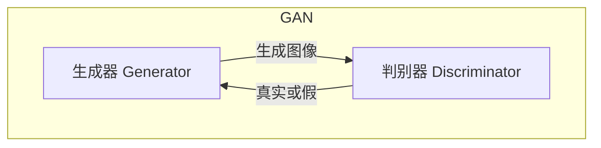
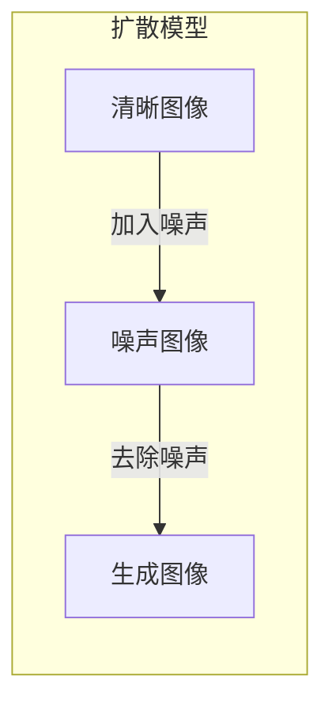
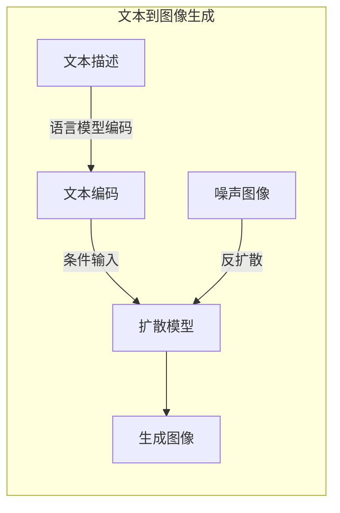

# AIGC从入门到实战：Midjourney 让我们人人都能成为设计师

## 1.背景介绍

### 1.1 人工智能生成内容(AIGC)的兴起

人工智能生成内容(AIGC)近年来迅速兴起,成为科技领域的一股新风潮。AIGC技术利用深度学习算法,可以根据文本或语音输入生成逼真的图像、视频、音频等多媒体内容。这种技术的出现,不仅为创作者提供了强大的辅助工具,也让普通用户能够轻松创作出高质量的视觉内容。

### 1.2 Midjourney:开创AIGC图像生成新纪元

在AIGC图像生成领域,Midjourney无疑是当前最受欢迎和关注的工具之一。它是一款基于人工智能的图像生成工具,能够根据用户输入的文本描述生成逼真的图像。Midjourney的核心技术是使用了一种称为"扩散模型"(Diffusion Model)的深度学习算法,通过迭代优化的方式生成图像。

### 1.3 Midjourney的独特优势

相比其他AIGC图像生成工具,Midjourney具有以下几个独特优势:

1. **生成质量高**:Midjourney生成的图像质量出众,色彩丰富、细节丰富、构图合理,能够生成逼真的人物、场景、物品等图像。

2. **交互性强**:用户可以通过不断优化文本描述,指导Midjourney生成满意的图像,体验过程十分互动和有趣。

3. **多样性丰富**:Midjourney能够生成多种风格的图像,包括现实主义、卡通、概念艺术、抽象艺术等,满足不同用户的需求。

4. **易用性高**:Midjourney的使用门槛较低,只需要在社交平台(如Discord)上输入文本描述即可生成图像,操作简单便捷。

由于这些优势,Midjourney迅速获得了广泛的关注和应用,不仅为专业设计师和艺术家提供了强大的辅助工具,也让普通用户能够尝试图像创作的乐趣。

## 2.核心概念与联系

### 2.1 生成式对抗网络(GAN)

要理解Midjourney的核心算法原理,我们首先需要了解生成式对抗网络(Generative Adversarial Networks,简称GAN)这一重要概念。GAN是一种由两个神经网络组成的框架,包括生成器(Generator)和判别器(Discriminator)。

生成器的目标是生成逼真的数据(如图像),而判别器的目标是区分生成的数据和真实数据。两个网络相互对抗,生成器不断努力生成更逼真的数据以欺骗判别器,而判别器也在不断努力提高区分能力。通过这种对抗训练,最终可以得到一个能够生成逼真数据的生成器模型。

### 2.2 扩散模型(Diffusion Model)

Midjourney采用的是一种新型的生成模型,称为扩散模型(Diffusion Model)。扩散模型的核心思想是通过一系列扩散(diffusion)和反扩散(reverse diffusion)步骤,从随机噪声中生成所需的数据。

具体来说,扩散过程将一张清晰的图像逐步加入噪声,直到完全变成噪声图像;而反扩散过程则是从噪声图像出发,逐步去除噪声,最终重建出原始的清晰图像。通过学习这个扩散和反扩散的过程,模型就能够从任意噪声图像出发,生成所需的图像数据。

扩散模型相比GAN模型有以下优势:

1. 更稳定的训练过程
2. 更高的样本多样性
3. 更好的图像质量

因此,Midjourney选择了扩散模型作为其核心生成算法。

### 2.3 文本到图像生成(Text-to-Image Generation)

Midjourney所实现的是将文本描述转化为图像的任务,即文本到图像生成(Text-to-Image Generation)。这需要将文本和图像两种不同的数据模态建立有效的映射关系。

Midjourney通过预训练的大型语言模型(如CLIP)来编码文本描述,并将其作为条件输入到扩散模型中,指导模型生成所需的图像数据。具体来说,在反扩散的每一步,模型会根据当前的噪声图像和文本编码,预测应该去除多少噪声,以最终生成符合文本描述的图像。

通过这种方式,Midjourney能够将任意文本描述转化为相应的图像输出,实现了强大的文本到图像生成能力。

## 3.核心算法原理具体操作步骤 

### 3.1 扩散过程

Midjourney的扩散模型算法包括两个主要过程:扩散(diffusion)和反扩散(reverse diffusion)。我们先来看扩散过程的具体步骤:

1. 从训练数据集中采样一张清晰的图像 $x_0$。

2. 对于每个时间步 $t=1,2,...,T$:
   a. 从高斯噪声分布 $\mathcal{N}(0,1)$ 中采样噪声 $\epsilon_t$。
   b. 根据预定义的扩散过程,计算 $\alpha_t$ 和 $\bar{\alpha}_t$。
   c. 计算扩散后的图像 $x_t$:
      $$x_t = \sqrt{\bar{\alpha}_t}x_{t-1} + \sqrt{1-\bar{\alpha}_t}\epsilon_t$$

3. 重复步骤2,直到 $t=T$,此时 $x_T$ 就是一张纯噪声图像。

在这个过程中,原始清晰图像 $x_0$ 被逐步加入高斯噪声,直到变为纯噪声图像 $x_T$。扩散过程的参数 $\alpha_t$ 和 $\bar{\alpha}_t$ 控制了噪声的加入程度,需要预先定义好。

### 3.2 反扩散过程

反扩散过程的目标是从噪声图像 $x_T$ 出发,逐步去除噪声,最终重建出清晰的图像 $x_0$。具体步骤如下:

1. 从扩散过程中获取噪声图像 $x_T$。

2. 对于每个时间步 $t=T,T-1,...,1$:
   a. 使用训练好的扩散模型,根据 $x_t$ 和条件(如文本描述)预测 $\epsilon_\theta(x_t,c)$,即应该去除的噪声分量。
   b. 计算反扩散后的图像:
      $$x_{t-1} = \frac{1}{\sqrt{\bar{\alpha}_t}}\left(x_t - \frac{1-\bar{\alpha}_t}{\sqrt{1-\bar{\alpha}_t}}\epsilon_\theta(x_t,c)\right)$$

3. 重复步骤2,直到 $t=1$,此时 $x_0$ 就是生成的清晰图像。

在这个过程中,模型需要学习预测每个时间步应该去除的噪声分量 $\epsilon_\theta(x_t,c)$,以逐步重建出清晰的图像。模型的训练目标是最小化预测噪声和真实噪声之间的均方差损失函数。

通过上述扩散和反扩散过程,Midjourney能够从任意噪声图像出发,生成符合文本描述的图像输出。

## 4.数学模型和公式详细讲解举例说明

在上一节中,我们介绍了Midjourney扩散模型算法的核心步骤。现在,我们将更深入地探讨其中的数学模型和公式。

### 4.1 扩散过程的数学模型

扩散过程的目标是将清晰图像 $x_0$ 逐步转化为噪声图像 $x_T$。这个过程可以用马尔可夫链来建模:

$$q(x_t|x_{t-1}) = \mathcal{N}(x_t;\sqrt{\bar{\alpha}_t}x_{t-1},\sigma_t^2\mathbf{I})$$

其中:

- $\alpha_t = \bar{\alpha}_{t-1}$,是一个预定义的递减序列,控制噪声的加入程度。
- $\sigma_t^2 = 1 - \bar{\alpha}_t$,是噪声方差。
- $\mathbf{I}$是单位矩阵。

通过上述马尔可夫链,我们可以得到从 $x_0$ 到 $x_t$ 的联合概率分布:

$$q(x_1,...,x_T|x_0) = \prod_{t=1}^Tq(x_t|x_{t-1})$$

这就是扩散过程的数学模型,描述了如何从清晰图像生成噪声图像的过程。

### 4.2 反扩散过程的数学模型

反扩散过程的目标是从噪声图像 $x_T$ 出发,重建出清晰图像 $x_0$。我们可以使用贝叶斯公式来建模这个过程:

$$p_\theta(x_{t-1}|x_t,c) = \frac{p_\theta(x_t|x_{t-1},c)p_\theta(x_{t-1}|c)}{p_\theta(x_t|c)}$$

其中:

- $p_\theta(x_{t-1}|x_t,c)$是我们想要学习的反扩散过程的条件概率分布,用于从 $x_t$ 和条件 $c$ 预测 $x_{t-1}$。
- $p_\theta(x_t|x_{t-1},c)$是扩散过程的已知条件概率分布,即 $q(x_t|x_{t-1})$。
- $p_\theta(x_{t-1}|c)$和 $p_\theta(x_t|c)$分别是 $x_{t-1}$ 和 $x_t$ 在给定条件 $c$ 下的边缘概率分布,可以通过扩散过程的数学模型计算得到。

通过上述贝叶斯公式,我们可以从已知的扩散过程概率分布推导出反扩散过程的条件概率分布。具体来说,我们需要训练一个神经网络模型 $\epsilon_\theta(x_t,c)$ 来近似预测噪声 $\epsilon_t$,从而实现反扩散过程。

### 4.3 损失函数和训练目标

为了训练反扩散模型 $\epsilon_\theta(x_t,c)$,我们需要定义一个合适的损失函数。通常采用的是简单的均方差损失函数:

$$\mathcal{L}_t(\theta) = \mathbb{E}_{x_0,\epsilon}\left[\left\|\epsilon - \epsilon_\theta(x_t,c)\right\|_2^2\right]$$

其中,期望是在训练数据集和噪声分布上计算的。目标是最小化这个损失函数,使得模型预测的噪声 $\epsilon_\theta(x_t,c)$ 尽可能接近真实噪声 $\epsilon$。

在实际训练中,我们可以对所有时间步的损失函数求和,得到总体损失函数:

$$\mathcal{L}(\theta) = \sum_{t=1}^T\lambda(t)\mathcal{L}_t(\theta)$$

其中,权重系数 $\lambda(t)$ 用于平衡不同时间步的损失贡献。通过最小化总体损失函数,我们就可以训练出一个高质量的反扩散模型。

### 4.4 实例分析:文本到图像生成

现在,我们来看一个具体的例子,分析Midjourney如何将文本描述转化为图像。假设我们输入了这样一个文本描述:"一只蓝色的小鸟站在树枝上,背景是一片金色的落日余晖"。

1. 首先,Midjourney会使用预训练的语言模型(如CLIP)将文本描述编码为一个向量表示 $c$。

2. 然后,Midjourney从一张纯噪声图像 $x_T$ 出发,开始反扩散过程。在每