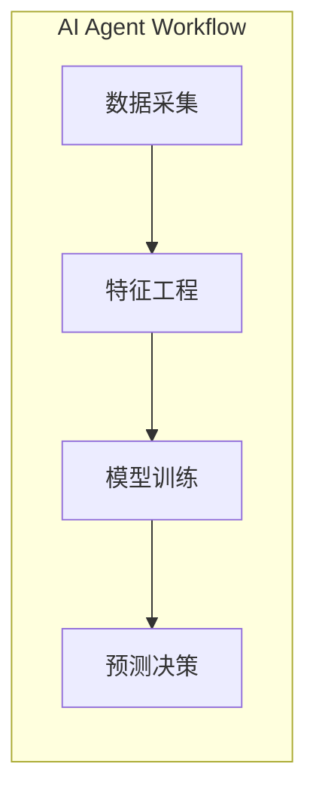
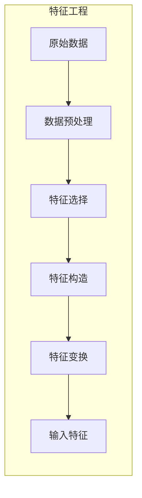
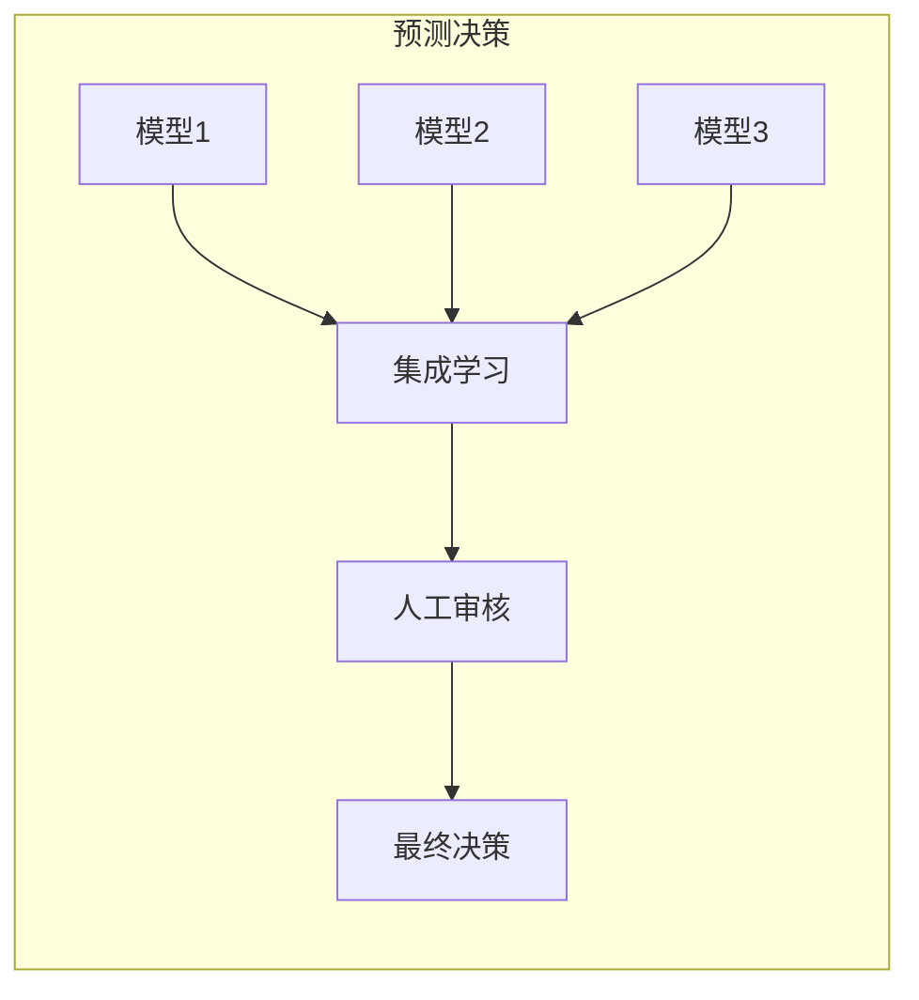

# AI人工智能代理工作流 AI Agent Workflow：在重大事件预测中的应用

## 1.背景介绍

### 1.1 重大事件预测的重要性

在当今快节奏的世界中,重大事件如自然灾害、金融危机、政治动荡等往往会对社会、经济和人民生活产生深远影响。及时准确地预测这些事件的发生及其影响范围,对于政府、企业和个人来说都至关重要。它可以帮助相关部门制定应对策略,减少损失,保护生命和财产安全。

### 1.2 传统预测方法的局限性

传统的重大事件预测方法主要依赖于人工分析和统计模型,存在以下局限性:

- 数据量大、多源异构,人工分析效率低下
- 模型假设条件过于简单,难以捕捉复杂的非线性关系
- 缺乏主动发现潜在风险的能力,只能被动预测

### 1.3 AI代理工作流的优势

AI代理工作流(AI Agent Workflow)是一种基于人工智能技术的新型预测范式,它能够克服传统方法的不足,为重大事件预测提供更加智能、高效、准确的解决方案。其主要优势包括:

- 利用深度学习等AI算法自动从海量数据中提取特征,发现潜在模式
- 建模复杂非线性系统,捕捉多变量之间的高阶相关性
- 主动发现异常和风险信号,实现早期预警
- 工作流程自动化,提高预测的效率和一致性

## 2.核心概念与联系

### 2.1 AI代理(AI Agent)

AI代理是指具备一定智能,能够感知环境、学习知识并根据目标做出决策的软件实体。在重大事件预测中,AI代理需要具备以下关键能力:

- 数据采集:从多源异构数据中实时获取相关信息
- 特征提取:自动识别对预测任务有意义的特征
- 模式挖掘:发现数据中潜在的模式和规律
- 决策推理:基于学习到的知识做出情景预测和决策
- 人机交互:以人类可解释的方式呈现预测结果

### 2.2 工作流(Workflow)

工作流指的是将多个任务按照一定逻辑顺序自动化地组织在一起,实现高效协作的过程。AI代理工作流将上述AI代理能力按照数据采集、特征工程、模型训练、预测决策等环节组织成流程化的工作流程,从而实现端到端的重大事件预测。



### 2.3 人机协作

AI代理工作流并非是一个完全自动化的黑箱系统,而是需要与人类专家紧密协作的。人类专家可以:

- 指定预测目标,提供领域知识
- 审查数据质量,调整特征工程策略
- 分析模型性能,优化算法超参数
- 解释预测结果,把控风险

通过人机协作,可以充分发挥AI的数据处理能力和人类的经验判断能力,提高预测的可靠性和可解释性。

## 3.核心算法原理具体操作步骤

### 3.1 数据采集

数据采集是AI代理工作流的基础环节,需要从各种来源实时获取与预测目标相关的数据,包括:

- 新闻报道、社交媒体等文本数据
- 卫星遥感、视频监控等图像视频数据
- 气象、经济、人口等数值数据

常用的数据采集方法有网络爬虫、API接口、物联网传感器等。

### 3.2 特征工程

特征工程旨在从原始数据中提取对预测任务有意义的特征,是AI算法学习的基础。主要步骤包括:

1. **数据预处理**:清洗缺失异常数据、去重、标准化等
2. **特征选择**:利用统计方法(如卡方检验)或嵌入式方法(如Lasso回归)选择重要特征
3. **特征构造**:基于领域知识构造特征,如文本主题模型、图像边缘检测等
4. **特征变换**:对特征进行归一化、降维等变换,以满足模型要求



### 3.3 模型训练

模型训练环节的目标是基于标注好的历史数据,学习出能够预测未来事件的模型。常用的机器学习算法包括:

- 监督学习: 逻辑回归、支持向量机、随机森林等
- 深度学习: 卷积神经网络(CNN)、递归神经网络(RNN)、注意力机制等
- 集成学习: 随机森林、Boosting、Bagging等

模型训练过程需要反复调整超参数(如学习率、正则化系数等),以达到最优的性能指标(如准确率、F1分数等)。

### 3.4 预测决策

训练好的模型可以对新的数据样本进行预测,得到事件发生的概率值或分类标签。但是,对于重大事件预测这样的高风险任务,单一的模型预测结果往往不够可靠。

因此,预测决策环节需要融合多个模型的预测结果,并结合人工经验判断,综合做出最终的决策。这可以通过集成学习技术(如Boosting、Bagging等)或多模型投票的方式实现。



## 4.数学模型和公式详细讲解举例说明

在AI代理工作流中,数学模型和公式扮演着至关重要的角色,我们将详细介绍其中几个核心模型。

### 4.1 逻辑回归

逻辑回归是一种广泛应用的监督学习算法,可用于二分类和多分类问题。它的数学原理是通过对数几率(logit)函数将线性回归的输出值映射到(0,1)区间,从而得到事件发生的概率估计。

对于二分类问题,设输入特征向量为$\boldsymbol{x}=(x_1,x_2,...,x_n)$,对应的标签为$y\in\{0,1\}$,逻辑回归模型可表示为:

$$P(y=1|\boldsymbol{x})=\frac{1}{1+e^{-(\boldsymbol{w}^T\boldsymbol{x}+b)}}$$

其中,$\boldsymbol{w}$和$b$为模型参数,通过最大似然估计的方法进行学习:

$$\mathcal{L}(\boldsymbol{w},b)=\sum_{i=1}^{m}\left[y^{(i)}\log P\left(y^{(i)}=1|\boldsymbol{x}^{(i)}\right)+(1-y^{(i)})\log\left(1-P\left(y^{(i)}=1|\boldsymbol{x}^{(i)}\right)\right)\right]$$

对于多分类问题,可以使用Softmax回归,将线性函数的输出归一化为和为1的概率分布:

$$P(y=j|\boldsymbol{x})=\frac{e^{\boldsymbol{w}_j^T\boldsymbol{x}+b_j}}{\sum_{k=1}^Ke^{\boldsymbol{w}_k^T\boldsymbol{x}+b_k}}$$

其中,$K$为类别数。

### 4.2 卷积神经网络

卷积神经网络(CNN)是一种常用于计算机视觉任务的深度学习模型,它可以自动从图像或视频中提取出对分类或检测有意义的特征。CNN由卷积层、池化层和全连接层等构成。

以图像分类为例,设输入图像为$\boldsymbol{X}$,卷积层的计算过程为:

$$\boldsymbol{X}_j^l=f\left(\sum_{i\in\mathcal{M}_j}\boldsymbol{X}_{i}^{l-1}*\boldsymbol{K}_{ij}^l+\boldsymbol{b}_j^l\right)$$

其中,$\boldsymbol{X}_j^l$为第$l$层第$j$个特征图,$\boldsymbol{K}_{ij}^l$为卷积核,$\boldsymbol{b}_j^l$为偏置项,$f$为激活函数(如ReLU),$\mathcal{M}_j$为输入特征图集合。

池化层则用于降低特征维度,常用的是最大池化:

$$\boldsymbol{X}_j^l=\max\limits_{\boldsymbol{X}_{p,q}^{l-1}\in\mathcal{R}_j}\boldsymbol{X}_{p,q}^{l-1}$$

其中,$\mathcal{R}_j$为第$j$个池化区域。

通过多层卷积和池化操作,CNN可以自动学习出对目标任务有意义的高级语义特征。

### 4.3 长短期记忆网络

长短期记忆网络(LSTM)是一种常用于序列数据建模的循环神经网络(RNN)变体,它能够有效解决普通RNN存在的梯度消失/爆炸问题。LSTM通过设计特殊的门控机制,可以选择性地保留或遗忘历史信息,从而更好地捕捉长期依赖关系。

LSTM的核心是一个记忆细胞状态$\boldsymbol{c}_t$,它在每个时间步通过遗忘门$\boldsymbol{f}_t$、输入门$\boldsymbol{i}_t$和输出门$\boldsymbol{o}_t$进行更新:

$$\begin{aligned}
\boldsymbol{f}_t&=\sigma\left(\boldsymbol{W}_f\cdot[\boldsymbol{h}_{t-1},\boldsymbol{x}_t]+\boldsymbol{b}_f\right)\\
\boldsymbol{i}_t&=\sigma\left(\boldsymbol{W}_i\cdot[\boldsymbol{h}_{t-1},\boldsymbol{x}_t]+\boldsymbol{b}_i\right)\\
\boldsymbol{o}_t&=\sigma\left(\boldsymbol{W}_o\cdot[\boldsymbol{h}_{t-1},\boldsymbol{x}_t]+\boldsymbol{b}_o\right)\\
\boldsymbol{c}_t&=\boldsymbol{f}_t\odot\boldsymbol{c}_{t-1}+\boldsymbol{i}_t\odot\tanh\left(\boldsymbol{W}_c\cdot[\boldsymbol{h}_{t-1},\boldsymbol{x}_t]+\boldsymbol{b}_c\right)\\
\boldsymbol{h}_t&=\boldsymbol{o}_t\odot\tanh\left(\boldsymbol{c}_t\right)
\end{aligned}$$

其中,$\boldsymbol{W}$和$\boldsymbol{b}$为权重和偏置,$\sigma$为sigmoid函数,$\odot$为元素乘积。

LSTM广泛应用于自然语言处理、时间序列预测等领域,在重大事件预测中也可以用于处理文本、视频等序列数据。

## 5.项目实践: 代码实例和详细解释说明

为了更好地理解AI代理工作流在重大事件预测中的应用,我们将通过一个实际项目案例来演示具体的代码实现。这个项目旨在预测重大自然灾害事件的发生,如地震、台风等。

### 5.1 数据采集

我们将从以下几个数据源采集相关数据:

- 地震数据: 从USGS(美国地质勘探局)网站获取历史地震目录数据
- 气象数据: 从NOAA(美国国家海洋和大气管理局)获取气象观测数据
- 新闻数据: 使用网络爬虫从主流新闻网站采集相关新闻报道

以获取地震数据为例,我们可以使用Python的requests库发送HTTP请求:

```python
import requests

# 构造请求参数
params = {
    'format': 'geojson',
    'starttime': '2022-01-01',
    'endtime': '2022-12-31',
    'minmagnitude': 5.0
}

# 发送请求并获取响应
response = requests.get('https://earthquake.usgs.gov/fdsnws/event/1/query', params=params)

# 解析GeoJSON格式的地震数据
earthquakes = response.json()['features']
```

### 5.2 特征工