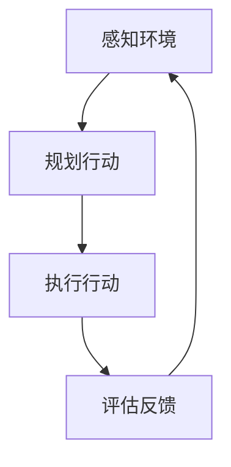

# AI人工智能代理工作流AI Agent WorkFlow：在电子商务中应用AI代理的策略

## 1.背景介绍

### 1.1 电子商务的重要性

在当今时代,电子商务已经成为商业活动的重要组成部分。随着互联网和移动技术的不断发展,电子商务为企业和消费者提供了前所未有的机遇和便利。企业可以通过在线渠道扩大销售范围,而消费者则可以方便地比较产品、查看评论并完成购买。

### 1.2 人工智能(AI)在电子商务中的作用

人工智能技术在电子商务领域发挥着越来越重要的作用。AI可以帮助企业优化产品推荐、个性化用户体验、提高客户服务质量、实现智能定价等。同时,AI也为消费者带来了更加智能和人性化的购物体验。

### 1.3 AI代理的概念

AI代理是指具有一定自主性的软件实体,能够根据特定目标和环境进行感知、规划和行动。在电子商务场景中,AI代理可以代表用户或企业,协助完成各种任务,如产品搜索、价格比较、订单处理等。

## 2.核心概念与联系

### 2.1 AI代理的工作流程

AI代理在电子商务中的工作流程可以概括为以下几个关键步骤:

1. **感知环境**:AI代理需要感知当前的电子商务环境,包括用户需求、产品信息、市场趋势等。
2. **规划行动**:根据感知到的环境信息,AI代理需要制定行动计划,以实现特定目标。
3. **执行行动**:AI代理执行规划好的行动,如搜索产品、比较价格、下订单等。
4. **评估反馈**:AI代理需要评估执行行动的结果,并根据反馈调整后续的行为。



### 2.2 AI代理的关键技术

实现高效的AI代理工作流程需要多种AI技术的支持,包括:

1. **自然语言处理(NLP)**: 用于理解用户需求和产品描述。
2. **机器学习(ML)**: 用于构建个性化推荐系统、预测用户行为等。
3. **规划算法**: 用于制定最优行动计划。
4. **多智能体系统**: 用于协调多个AI代理之间的交互。

## 3.核心算法原理具体操作步骤

### 3.1 自然语言处理(NLP)

自然语言处理是AI代理理解用户需求和产品信息的关键技术。常用的NLP算法包括:

1. **词向量表示**: 将文本转换为向量形式,如Word2Vec、GloVe等。
2. **序列标注**: 识别文本中的命名实体,如产品名称、品牌等。
3. **语义分析**: 理解文本的语义含义,如情感分析、意图识别等。

NLP在AI代理工作流程中的应用步骤如下:

1. **文本预处理**: 对用户查询和产品描述进行分词、去停用词等预处理。
2. **特征提取**: 使用词向量表示和序列标注算法提取文本特征。
3. **语义理解**: 使用语义分析算法理解用户意图和产品属性。
4. **查询构建**: 根据语义理解的结果构建查询,用于搜索相关产品。

### 3.2 机器学习(ML)

机器学习算法在AI代理中有广泛的应用,如个性化推荐、用户行为预测等。常用的ML算法包括:

1. **协同过滤**: 基于用户的历史行为对产品进行推荐,如矩阵分解、近邻算法等。
2. **深度学习**: 使用神经网络模型从大量数据中学习特征,如卷积神经网络、递归神经网络等。
3. **强化学习**: 通过不断试错来优化决策策略,如Q-Learning、策略梯度等。

ML在AI代理工作流程中的应用步骤如下:

1. **数据采集**: 收集用户行为数据、产品数据等相关信息。
2. **特征工程**: 从原始数据中提取有用的特征,如用户偏好、产品属性等。
3. **模型训练**: 使用机器学习算法在训练数据上训练模型。
4. **模型应用**: 将训练好的模型应用于推荐、预测等任务。

### 3.3 规划算法

规划算法用于制定AI代理的行动计划,以实现特定目标。常用的规划算法包括:

1. **启发式搜索**: 使用评估函数指导搜索过程,如A*算法、最佳优先搜索等。
2. **约束满足问题(CSP)**: 在满足一系列约束条件的前提下寻找解,如回溯搜索、局部搜索等。
3. **马尔可夫决策过程(MDP)**: 在不确定环境中寻找最优策略,如值迭代、策略迭代等。

规划算法在AI代理工作流程中的应用步骤如下:

1. **问题建模**: 将AI代理的目标和环境建模为规划问题。
2. **算法选择**: 根据问题特点选择合适的规划算法。
3. **求解过程**: 使用选定的算法求解规划问题,获得行动计划。
4. **执行计划**: 根据求解得到的行动计划执行相应的操作。

## 4.数学模型和公式详细讲解举例说明

### 4.1 词向量表示

词向量表示是自然语言处理中一种将词语映射到连续向量空间的技术,常用的模型包括Word2Vec和GloVe。

#### 4.1.1 Word2Vec

Word2Vec是一种基于神经网络的词向量表示模型,包括两种模型架构:连续词袋模型(CBOW)和Skip-Gram模型。

**CBOW模型**:给定上下文词$c_1,c_2,...,c_C$,预测目标词$w_t$的条件概率为:

$$P(w_t|c_1,c_2,...,c_C) = \frac{e^{v_{w_t}^TV}}{\sum_{w=1}^{V}e^{v_w^TV}}$$

其中,$V=\frac{1}{C}\sum_{i=1}^{C}v_{c_i}$是上下文词向量的平均值,$v_w$和$v_{w_t}$分别是词$w$和$w_t$的词向量。

**Skip-Gram模型**:给定目标词$w_t$,预测上下文词$c_i$的条件概率为:

$$P(c_i|w_t) = \frac{e^{v_{c_i}^Tv_{w_t}}}{\sum_{w=1}^{V}e^{v_w^Tv_{w_t}}}$$

通过最大化上述概率,可以学习到词向量表示。

#### 4.1.2 GloVe

GloVe(Global Vectors for Word Representation)是另一种基于词共现统计信息的词向量表示模型。它的目标是让词向量的点积能够很好地刻画词与词之间的共现概率:

$$w_i^Tw_j+b_i+b_j=\log(X_{ij})$$

其中,$w_i$和$w_j$分别是词$i$和词$j$的词向量,$b_i$和$b_j$是偏置项,$X_{ij}$是词$i$和词$j$的共现次数。通过最小化加权最小二乘损失函数,可以学习到词向量表示。

### 4.2 协同过滤

协同过滤是一种常用的个性化推荐算法,根据用户的历史行为对产品进行推荐。

#### 4.2.1 基于用户的协同过滤

基于用户的协同过滤通过计算用户之间的相似度,找到与目标用户$u$最相似的$K$个用户$N(u)$,然后根据这些相似用户对产品$i$的评分,预测目标用户对产品$i$的评分:

$$r_{u,i} = \overline{r_u} + \frac{\sum_{v\in N(u)}sim(u,v)(r_{v,i}-\overline{r_v})}{\sum_{v\in N(u)}sim(u,v)}$$

其中,$\overline{r_u}$和$\overline{r_v}$分别是用户$u$和$v$的平均评分,$sim(u,v)$是用户$u$和$v$的相似度,通常使用余弦相似度或皮尔逊相关系数计算。

#### 4.2.2 基于项目的协同过滤

基于项目的协同过滤类似,不过是通过计算产品之间的相似度,找到与目标产品$i$最相似的$K$个产品$N(i)$,然后根据目标用户$u$对这些相似产品的评分,预测用户$u$对产品$i$的评分:

$$r_{u,i} = \overline{r_i} + \frac{\sum_{j\in N(i)}sim(i,j)(r_{u,j}-\overline{r_j})}{\sum_{j\in N(i)}sim(i,j)}$$

其中,$\overline{r_i}$和$\overline{r_j}$分别是产品$i$和$j$的平均评分,$sim(i,j)$是产品$i$和$j$的相似度。

### 4.3 马尔可夫决策过程(MDP)

马尔可夫决策过程是一种用于求解序列决策问题的数学模型,常用于强化学习等领域。

一个MDP可以表示为元组$(S, A, P, R, \gamma)$,其中:

- $S$是状态集合
- $A$是动作集合
- $P(s'|s,a)$是状态转移概率,表示在状态$s$执行动作$a$后,转移到状态$s'$的概率
- $R(s,a,s')$是奖励函数,表示在状态$s$执行动作$a$后,转移到状态$s'$获得的奖励
- $\gamma\in[0,1)$是折现因子,用于权衡即时奖励和长期奖励

在MDP中,我们希望找到一个策略$\pi:S\rightarrow A$,使得期望的累积折现奖励最大化:

$$\max_\pi E\left[\sum_{t=0}^\infty\gamma^tR(s_t,a_t,s_{t+1})\right]$$

其中,$s_t$和$a_t$分别是第$t$个时刻的状态和动作。

常用的求解MDP的算法包括值迭代和策略迭代等。

## 5.项目实践:代码实例和详细解释说明

在这一部分,我们将通过一个实际的电子商务推荐系统项目,展示如何将上述算法和模型应用于AI代理的工作流程中。

### 5.1 项目概述

我们将构建一个基于协同过滤和深度学习的个性化商品推荐系统。该系统的AI代理需要根据用户的历史购买记录和浏览行为,推荐感兴趣的商品。

### 5.2 数据准备

我们使用一个开源的电子商务数据集,包含用户的购买记录、浏览记录和商品元数据等信息。首先,我们需要对数据进行预处理和特征工程,提取出有用的特征,如用户偏好、商品类别等。

```python
import pandas as pd

# 加载数据
purchases = pd.read_csv('purchases.csv')
views = pd.read_csv('views.csv')
products = pd.read_csv('products.csv')

# 特征工程
user_prefs = purchases.groupby('user_id')['product_id'].count().reset_index()
user_prefs.columns = ['user_id', 'purchase_count']

product_categories = products[['product_id', 'category']]
```

### 5.3 协同过滤推荐

我们使用基于用户的协同过滤算法,为每个用户推荐感兴趣的商品。

```python
from sklearn.metrics.pairwise import cosine_similarity

# 计算用户相似度矩阵
user_sim = cosine_similarity(user_prefs['purchase_count'].values.reshape(-1, 1))

# 为目标用户推荐商品
def recommend_products(user_id, topn=10):
    # 找到与目标用户最相似的其他用户
    user_idx = user_prefs[user_prefs['user_id'] == user_id].index[0]
    sim_users = np.argsort(user_sim[user_idx])[::-1][1:]
    
    # 计算推荐分数
    product_scores = defaultdict(float)
    for sim_user in sim_users:
        user_purchases = purchases[purchases['user_id'] == user_prefs.iloc[sim_user]['user_id']]['product_id']
        for product in user_purchases:
            product_scores[product] += user_sim[user_idx, sim_user]
            
    #