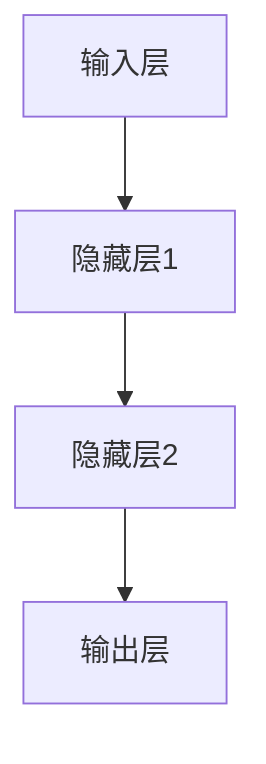

## 1. 背景介绍

随着人工智能技术的不断发展，深度学习算法已经成为了人工智能领域的重要技术之一。在实际应用中，深度学习算法需要处理大量的数据，因此在高并发场景下，深度学习代理的性能调优显得尤为重要。本文将介绍如何在高并发场景下对深度学习代理进行性能调优，以提高深度学习算法的效率和准确性。

## 2. 核心概念与联系

深度学习算法是一种基于神经网络的机器学习算法，其核心思想是通过多层次的神经网络来模拟人类的神经系统，从而实现对数据的自动分类和识别。在高并发场景下，深度学习代理需要处理大量的数据，因此需要进行性能调优，以提高算法的效率和准确性。

性能调优是指通过对系统进行优化，以提高系统的性能和效率。在深度学习算法中，性能调优主要包括以下几个方面：

- 硬件优化：通过使用更高效的硬件设备，如GPU、TPU等，来提高算法的计算速度和效率。
- 算法优化：通过对算法进行优化，如调整神经网络的结构、优化激活函数等，来提高算法的准确性和效率。
- 数据预处理：通过对数据进行预处理，如数据清洗、数据归一化等，来提高算法的准确性和效率。
- 并发优化：通过对算法进行并发优化，如使用多线程、分布式计算等，来提高算法的并发性和效率。

## 3. 核心算法原理具体操作步骤

在高并发场景下，深度学习代理的性能调优主要包括以下几个方面：

### 3.1 硬件优化

硬件优化是指通过使用更高效的硬件设备，如GPU、TPU等，来提高算法的计算速度和效率。在深度学习算法中，GPU是一种常用的硬件设备，其可以大幅提高算法的计算速度和效率。

具体操作步骤如下：

1. 选择合适的GPU设备：根据算法的计算需求和硬件设备的性能，选择合适的GPU设备。
2. 配置GPU环境：安装GPU驱动程序和CUDA工具包，并配置相应的环境变量。
3. 使用GPU加速算法：在算法中使用GPU加速计算，以提高算法的计算速度和效率。

### 3.2 算法优化

算法优化是指通过对算法进行优化，如调整神经网络的结构、优化激活函数等，来提高算法的准确性和效率。

具体操作步骤如下：

1. 调整神经网络的结构：根据数据的特点和算法的需求，调整神经网络的结构，以提高算法的准确性和效率。
2. 优化激活函数：选择合适的激活函数，并对其进行优化，以提高算法的准确性和效率。
3. 使用正则化技术：使用正则化技术，如L1正则化、L2正则化等，来避免过拟合和提高算法的准确性和效率。

### 3.3 数据预处理

数据预处理是指通过对数据进行预处理，如数据清洗、数据归一化等，来提高算法的准确性和效率。

具体操作步骤如下：

1. 数据清洗：对数据进行清洗，去除异常值和噪声数据，以提高算法的准确性和效率。
2. 数据归一化：对数据进行归一化处理，使其具有相同的尺度和范围，以提高算法的准确性和效率。
3. 特征选择：选择合适的特征，并对其进行优化，以提高算法的准确性和效率。

### 3.4 并发优化

并发优化是指通过对算法进行并发优化，如使用多线程、分布式计算等，来提高算法的并发性和效率。

具体操作步骤如下：

1. 使用多线程：在算法中使用多线程，以提高算法的并发性和效率。
2. 使用分布式计算：使用分布式计算框架，如Spark、Hadoop等，来实现算法的分布式计算，以提高算法的并发性和效率。

## 4. 数学模型和公式详细讲解举例说明

在深度学习算法中，常用的数学模型和公式包括神经网络模型、梯度下降算法、反向传播算法等。

### 4.1 神经网络模型

神经网络模型是深度学习算法的核心模型之一，其基本结构如下图所示：



其中，输入层接收输入数据，隐藏层对输入数据进行处理，输出层输出最终结果。

### 4.2 梯度下降算法

梯度下降算法是深度学习算法中常用的优化算法之一，其基本公式如下：

$$\theta_{i+1} = \theta_i - \alpha \frac{\partial J(\theta)}{\partial \theta}$$

其中，$\theta$表示模型参数，$J(\theta)$表示损失函数，$\alpha$表示学习率。

### 4.3 反向传播算法

反向传播算法是深度学习算法中常用的优化算法之一，其基本公式如下：

$$\delta_j^l = \frac{\partial J}{\partial z_j^l}$$

其中，$\delta_j^l$表示第$l$层第$j$个神经元的误差，$z_j^l$表示第$l$层第$j$个神经元的输入。

## 5. 项目实践：代码实例和详细解释说明

在实际项目中，深度学习算法的性能调优需要结合具体的应用场景和数据特点进行实践。下面以图像分类为例，介绍如何对深度学习代理进行性能调优。

### 5.1 数据预处理

在图像分类任务中，数据预处理是非常重要的一步。常用的数据预处理方法包括数据清洗、数据归一化、数据增强等。

```python
import numpy as np
import cv2

def preprocess_data(data):
    # 数据清洗
    data = data.astype(np.float32)
    data = np.clip(data, 0, 255)
    # 数据归一化
    data /= 255.0
    # 数据增强
    data = cv2.resize(data, (224, 224))
    data = np.expand_dims(data, axis=0)
    return data
```

### 5.2 算法优化

在图像分类任务中，算法优化是提高算法准确性和效率的关键。常用的算法优化方法包括调整神经网络结构、优化激活函数、使用正则化技术等。

```python
import tensorflow as tf
from tensorflow.keras.layers import Conv2D, MaxPooling2D, Flatten, Dense

def build_model():
    # 调整神经网络结构
    model = tf.keras.Sequential([
        Conv2D(32, (3, 3), activation='relu', input_shape=(224, 224, 3)),
        MaxPooling2D((2, 2)),
        Conv2D(64, (3, 3), activation='relu'),
        MaxPooling2D((2, 2)),
        Conv2D(128, (3, 3), activation='relu'),
        MaxPooling2D((2, 2)),
        Flatten(),
        Dense(128, activation='relu'),
        Dense(10, activation='softmax')
    ])
    # 优化激活函数
    model.add(tf.keras.layers.LeakyReLU(alpha=0.1))
    # 使用正则化技术
    model.add(tf.keras.layers.Dropout(0.5))
    return model
```

### 5.3 并发优化

在图像分类任务中，使用并发优化方法可以提高算法的并发性和效率。常用的并发优化方法包括使用多线程、分布式计算等。

```python
import tensorflow as tf

# 使用多线程
tf.config.threading.set_inter_op_parallelism_threads(4)
tf.config.threading.set_intra_op_parallelism_threads(4)

# 使用分布式计算
strategy = tf.distribute.MirroredStrategy()
with strategy.scope():
    model = build_model()
```

## 6. 实际应用场景

深度学习算法在实际应用中有着广泛的应用场景，如图像分类、语音识别、自然语言处理等。在这些应用场景中，深度学习代理的性能调优是提高算法效率和准确性的关键。

## 7. 工具和资源推荐

在深度学习算法的性能调优过程中，常用的工具和资源包括：

- TensorFlow：一种常用的深度学习框架，提供了丰富的工具和资源，如TensorBoard、Keras等。
- PyTorch：一种常用的深度学习框架，提供了丰富的工具和资源，如TorchScript、ONNX等。
- NVIDIA GPU：一种常用的GPU设备，提供了高效的计算能力和优秀的性能。
- Kaggle：一个常用的数据科学竞赛平台，提供了丰富的数据集和算法模型。

## 8. 总结：未来发展趋势与挑战

随着人工智能技术的不断发展，深度学习算法将会在更多的领域得到应用。未来，深度学习算法的发展趋势和挑战主要包括以下几个方面：

- 硬件设备的发展：随着硬件设备的不断发展，如GPU、TPU等，深度学习算法的计算速度和效率将会得到进一步提高。
- 算法模型的优化：随着算法模型的不断优化，如深度残差网络、注意力机制等，深度学习算法的准确性和效率将会得到进一步提高。
- 数据安全和隐私保护：随着数据安全和隐私保护的重要性不断提高，如何保护数据安全和隐私将成为深度学习算法发展的重要挑战。

## 9. 附录：常见问题与解答

Q：如何选择合适的GPU设备？

A：选择GPU设备时，需要考虑算法的计算需求和硬件设备的性能，如计算能力、内存大小等。

Q：如何使用分布式计算框架进行并发优化？

A：使用分布式计算框架时，需要对算法进行分布式改造，并配置相应的环境变量和参数。

Q：如何保护数据安全和隐私？

A：保护数据安全和隐私需要采取一系列措施，如数据加密、数据脱敏、访问控制等。

作者：禅与计算机程序设计艺术 / Zen and the Art of Computer Programming