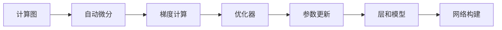

# AI开发框架原理与代码实战案例讲解

## 1. 背景介绍
随着人工智能技术的飞速发展，AI开发框架已成为支撑起整个行业的基石。从TensorFlow、PyTorch到Keras，这些框架极大地降低了AI技术的门槛，使得研究者和开发者能够专注于模型的设计与优化，而不必过多地关注底层的实现细节。本文将深入探讨AI开发框架的核心原理，并通过代码实战案例，帮助读者更好地理解和应用这些框架。

## 2. 核心概念与联系
AI开发框架的核心概念包括计算图、自动微分、优化器、层和模型等。计算图为模型的结构提供了清晰的可视化表示，自动微分则简化了梯度计算过程，优化器负责模型参数的更新，层和模型则是构建复杂网络的基本单元。这些概念相互联系，共同构成了AI开发框架的基础。



## 3. 核心算法原理具体操作步骤
AI开发框架的核心算法原理包括前向传播、反向传播和参数优化。前向传播用于计算损失函数，反向传播通过链式法则计算梯度，参数优化则根据梯度更新模型参数。具体操作步骤如下：

1. 定义模型结构和损失函数。
2. 初始化模型参数。
3. 进行前向传播，计算损失函数值。
4. 执行反向传播，计算梯度。
5. 使用优化器更新模型参数。
6. 重复步骤3-5直到模型收敛。

## 4. 数学模型和公式详细讲解举例说明
以多层感知机（MLP）为例，其数学模型可以表示为一系列线性变换和非线性激活函数的组合。例如，一个两层的MLP可以表示为：

$$
\mathbf{h} = \sigma(\mathbf{W}_1\mathbf{x} + \mathbf{b}_1)
$$
$$
\mathbf{y} = \mathbf{W}_2\mathbf{h} + \mathbf{b}_2
$$

其中，$\mathbf{x}$ 是输入向量，$\mathbf{h}$ 是隐藏层向量，$\mathbf{y}$ 是输出向量，$\mathbf{W}_1, \mathbf{W}_2$ 是权重矩阵，$\mathbf{b}_1, \mathbf{b}_2$ 是偏置向量，$\sigma$ 是激活函数（如ReLU或Sigmoid）。

## 5. 项目实践：代码实例和详细解释说明
以TensorFlow为例，构建一个简单的MLP模型的代码如下：

```python
import tensorflow as tf

# 定义模型参数
W1 = tf.Variable(tf.random.normal([input_size, hidden_size]))
b1 = tf.Variable(tf.zeros([hidden_size]))
W2 = tf.Variable(tf.random.normal([hidden_size, output_size]))
b2 = tf.Variable(tf.zeros([output_size]))

# 定义模型结构
def mlp(x):
    h = tf.nn.relu(tf.matmul(x, W1) + b1)
    y = tf.matmul(h, W2) + b2
    return y

# 定义损失函数和优化器
loss_fn = tf.keras.losses.SparseCategoricalCrossentropy(from_logits=True)
optimizer = tf.keras.optimizers.Adam()

# 训练步骤
def train_step(x, y):
    with tf.GradientTape() as tape:
        predictions = mlp(x)
        loss = loss_fn(y, predictions)
    gradients = tape.gradient(loss, [W1, b1, W2, b2])
    optimizer.apply_gradients(zip(gradients, [W1, b1, W2, b2]))
    return loss
```

## 6. 实际应用场景
AI开发框架广泛应用于图像识别、自然语言处理、游戏AI、机器人控制等多个领域。例如，在自然语言处理中，可以使用框架快速搭建一个序列到序列的模型，用于机器翻译或文本摘要。

## 7. 工具和资源推荐
- TensorFlow：一个综合性的机器学习框架，支持多种平台。
- PyTorch：一个动态计算图框架，适合研究和原型开发。
- Keras：一个高层次的神经网络API，运行在TensorFlow之上，易于上手。

## 8. 总结：未来发展趋势与挑战
AI开发框架未来的发展趋势将更加注重易用性、性能优化和跨平台能力。同时，随着模型的不断增大和复杂化，框架的可扩展性和高效的分布式计算能力也将成为重要的挑战。

## 9. 附录：常见问题与解答
Q1: 如何选择合适的AI开发框架？
A1: 需要根据项目需求、团队熟悉度和社区支持等因素综合考虑。

Q2: 如何提高模型的训练效率？
A2: 可以通过模型简化、数据预处理、合理的批量大小和并行计算等方法来提高效率。

作者：禅与计算机程序设计艺术 / Zen and the Art of Computer Programming