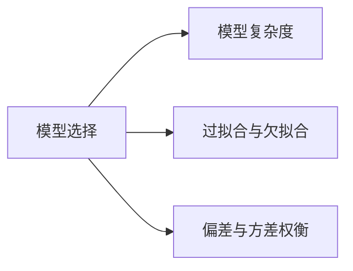
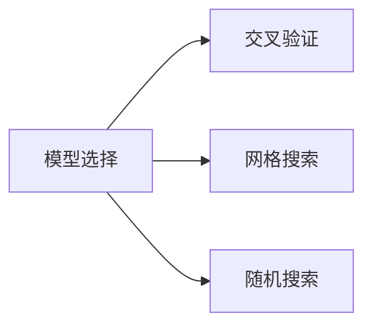

## 1.背景介绍

人工智能（AI）已经成为现代科技领域的一个重要研究方向，其应用广泛，涵盖了从自动驾驶、语音识别到医疗诊断等多个领域。然而，要使AI真正发挥其潜力，选择合适的AI模型至关重要。本文将深入探讨AI模型选择的原理，并通过实战案例进行讲解。

## 2.核心概念与联系

AI模型选择涉及到的核心概念有模型复杂度、过拟合与欠拟合、偏差与方差权衡等。模型的复杂度决定了模型能否捕捉到数据的复杂性，而过拟合与欠拟合则是模型复杂度的体现。偏差与方差权衡则是模型选择过程中需要考虑的一个重要因素。



## 3.核心算法原理具体操作步骤

AI模型选择的核心算法主要包括交叉验证、网格搜索和随机搜索等。交叉验证用于评估模型的泛化能力，网格搜索和随机搜索则用于寻找最优的模型参数。



## 4.数学模型和公式详细讲解举例说明

交叉验证的数学模型可以用如下公式表示：

$$
CV = \frac{1}{k}\sum_{i=1}^{k}MSE_i
$$

其中，$k$为交叉验证的折数，$MSE_i$为第$i$折的均方误差。交叉验证的目标是找到使$CV$最小的模型参数。

## 5.项目实践：代码实例和详细解释说明

下面我们将通过一个实战案例来讲解如何在Python中使用scikit-learn库进行AI模型选择。我们将使用波士顿房价数据集进行回归模型的选择。

```python
from sklearn.datasets import load_boston
from sklearn.model_selection import train_test_split
from sklearn.linear_model import LinearRegression
from sklearn.metrics import mean_squared_error

# 加载数据
boston = load_boston()
X, y = boston.data, boston.target

# 划分数据集
X_train, X_test, y_train, y_test = train_test_split(X, y, test_size=0.2, random_state=42)

# 创建模型
model = LinearRegression()

# 训练模型
model.fit(X_train, y_train)

# 预测
y_pred = model.predict(X_test)

# 计算MSE
mse = mean_squared_error(y_test, y_pred)
print('MSE:', mse)
```

## 6.实际应用场景

AI模型选择的方法在实际应用中有广泛的应用，包括但不限于：

- 自动驾驶：通过选择合适的AI模型，自动驾驶系统可以更准确地识别路面标志和行人，从而提高安全性。
- 语音识别：通过选择合适的AI模型，语音识别系统可以更准确地识别语音，从而提高用户体验。
- 医疗诊断：通过选择合适的AI模型，医疗诊断系统可以更准确地识别疾病，从而提高诊断准确率。

## 7.工具和资源推荐

推荐以下工具和资源进行AI模型选择的学习和实践：

- scikit-learn：一个强大的Python机器学习库，提供了包括模型选择在内的各种机器学习算法。
- TensorFlow：一个强大的深度学习框架，提供了包括模型选择在内的各种深度学习算法。
- Kaggle：一个数据科学竞赛平台，提供了大量的数据集和案例，可以用于模型选择的实践。

## 8.总结：未来发展趋势与挑战

AI模型选择是AI领域的一个重要研究方向，其发展趋势和挑战主要包括：

- 发展趋势：随着AI技术的发展，模型选择的方法也将越来越多样化，包括基于深度学习的模型选择方法等。
- 挑战：随着数据的增长，如何在大规模数据上进行高效的模型选择将成为一个重要的挑战。

## 9.附录：常见问题与解答

Q1：为什么要进行模型选择？

A1：模型选择可以帮助我们找到最适合数据的模型，从而提高模型的泛化能力。

Q2：过拟合和欠拟合是什么？

A2：过拟合是模型过于复杂，以至于捕捉到了数据中的噪声；欠拟合则是模型过于简单，无法捕捉到数据的复杂性。

Q3：如何避免过拟合和欠拟合？

A3：可以通过正则化、早停、增加数据等方法来避免过拟合和欠拟合。

作者：禅与计算机程序设计艺术 / Zen and the Art of Computer Programming