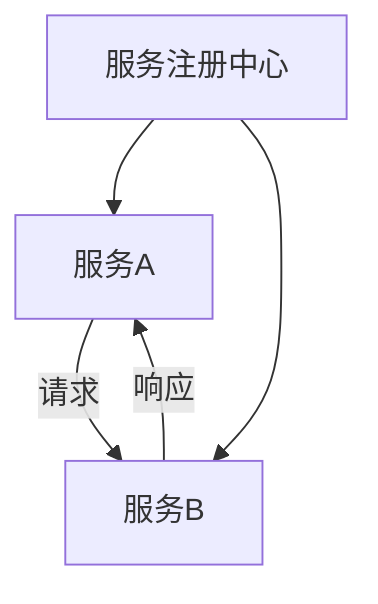
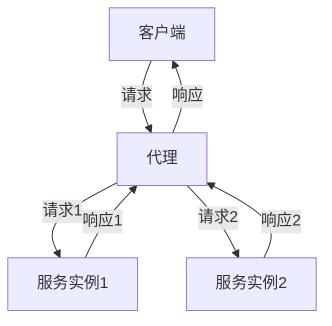
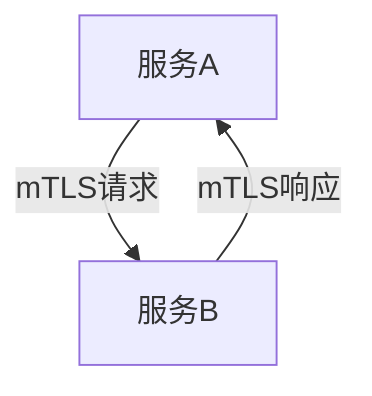

# AI系统Service Mesh原理与代码实战案例讲解

## 1.背景介绍

在现代分布式系统中，微服务架构已经成为主流。微服务架构通过将单一的应用程序拆分成多个小型、独立的服务，使得开发、部署和扩展变得更加灵活。然而，随着微服务数量的增加，服务之间的通信、监控和管理变得愈加复杂。Service Mesh作为一种新兴的技术，旨在解决这些问题。本文将深入探讨Service Mesh的原理、核心算法、数学模型，并通过实际代码示例展示其在AI系统中的应用。

## 2.核心概念与联系

### 2.1 什么是Service Mesh

Service Mesh是一种用于处理微服务之间通信的基础设施层。它通过在每个服务实例旁边部署一个轻量级代理（sidecar），来管理服务之间的通信、负载均衡、安全性和监控等功能。

### 2.2 Service Mesh的组成部分

- **数据平面（Data Plane）**：由一组代理（sidecar）组成，负责处理服务之间的网络请求。
- **控制平面（Control Plane）**：负责管理和配置数据平面的代理，提供服务发现、配置管理和策略控制等功能。

### 2.3 Service Mesh与AI系统的联系

在AI系统中，模型训练、推理和数据处理通常需要多个服务协同工作。Service Mesh可以帮助管理这些服务之间的通信，确保系统的高可用性和安全性。

## 3.核心算法原理具体操作步骤

### 3.1 服务发现

服务发现是Service Mesh的核心功能之一。它允许服务自动发现并与其他服务通信，而无需手动配置。



### 3.2 负载均衡

Service Mesh通过代理实现负载均衡，将请求分发到多个服务实例，以提高系统的可靠性和性能。



### 3.3 安全性

Service Mesh通过mTLS（Mutual TLS）实现服务之间的安全通信，确保数据在传输过程中不被篡改或窃取。



## 4.数学模型和公式详细讲解举例说明

### 4.1 负载均衡算法

负载均衡算法是Service Mesh的关键组件之一。常见的负载均衡算法包括轮询（Round Robin）、最少连接（Least Connections）和加权轮询（Weighted Round Robin）。

#### 4.1.1 轮询算法

轮询算法将请求依次分发到每个服务实例。假设有 $n$ 个服务实例，第 $i$ 个请求将被分发到第 $(i \mod n)$ 个实例。

$$
i \mod n
$$

#### 4.1.2 最少连接算法

最少连接算法将请求分发到当前连接数最少的服务实例。设 $C_i$ 为第 $i$ 个实例的当前连接数，则请求将被分发到满足以下条件的实例：

$$
\min(C_i)
$$

#### 4.1.3 加权轮询算法

加权轮询算法为每个服务实例分配一个权重 $w_i$，权重越高的实例将接收更多的请求。第 $i$ 个请求将被分发到满足以下条件的实例：

$$
i \mod \sum_{j=1}^{n} w_j
$$

### 4.2 服务发现模型

服务发现可以建模为一个图，其中节点表示服务，边表示服务之间的通信。服务发现的目标是找到从源服务到目标服务的最短路径。

$$
\text{最短路径} = \min(\sum_{i=1}^{n} d_i)
$$

其中，$d_i$ 表示第 $i$ 条边的权重。

## 5.项目实践：代码实例和详细解释说明

### 5.1 环境准备

在本节中，我们将使用Istio作为Service Mesh的实现，并在Kubernetes集群中部署一个简单的AI系统。

### 5.2 部署Istio

首先，安装Istio：

```bash
curl -L https://istio.io/downloadIstio | sh -
cd istio-1.9.0
export PATH=$PWD/bin:$PATH
istioctl install --set profile=demo
```

### 5.3 部署AI服务

创建一个简单的AI服务：

```yaml
apiVersion: v1
kind: Service
metadata:
  name: ai-service
spec:
  selector:
    app: ai-service
  ports:
  - protocol: TCP
    port: 80
    targetPort: 8080
---
apiVersion: apps/v1
kind: Deployment
metadata:
  name: ai-service
spec:
  replicas: 3
  selector:
    matchLabels:
      app: ai-service
  template:
    metadata:
      labels:
        app: ai-service
    spec:
      containers:
      - name: ai-service
        image: my-ai-service:latest
        ports:
        - containerPort: 8080
```

### 5.4 配置Service Mesh

为AI服务启用Istio sidecar注入：

```bash
kubectl label namespace default istio-injection=enabled
kubectl apply -f ai-service.yaml
```

### 5.5 测试和验证

通过Istio的控制平面，监控AI服务的通信和性能：

```bash
istioctl dashboard kiali
```

## 6.实际应用场景

### 6.1 模型训练

在AI系统中，模型训练通常需要大量的数据处理和计算资源。Service Mesh可以帮助管理训练任务的分布式执行，确保任务的高效和可靠。

### 6.2 模型推理

模型推理需要低延迟和高并发的服务支持。Service Mesh通过负载均衡和流量管理，确保推理服务的高性能和稳定性。

### 6.3 数据处理

数据处理是AI系统的基础。Service Mesh可以帮助管理数据处理服务之间的通信，确保数据的安全和一致性。

## 7.工具和资源推荐

### 7.1 Istio

Istio是一个开源的Service Mesh实现，提供了丰富的功能和强大的控制平面。

### 7.2 Kubernetes

Kubernetes是一个开源的容器编排平台，常用于部署和管理微服务架构。

### 7.3 Prometheus

Prometheus是一个开源的监控系统，常用于监控和告警Service Mesh中的服务。

## 8.总结：未来发展趋势与挑战

Service Mesh作为一种新兴的技术，正在迅速发展。未来，Service Mesh将进一步集成AI技术，提供更智能的流量管理和安全控制。然而，Service Mesh的复杂性和性能开销也是需要解决的挑战。

## 9.附录：常见问题与解答

### 9.1 Service Mesh的性能开销如何？

Service Mesh引入了额外的代理层，可能会带来一定的性能开销。然而，通过优化代理和控制平面的实现，可以将开销降到最低。

### 9.2 如何选择合适的Service Mesh实现？

选择Service Mesh实现时，需要考虑系统的需求和现有的技术栈。Istio是一个功能丰富的选择，但也有其他轻量级的实现，如Linkerd和Consul。

### 9.3 Service Mesh如何与现有的监控系统集成？

Service Mesh通常提供与Prometheus等监控系统的集成，允许用户监控服务的性能和健康状态。

---

作者：禅与计算机程序设计艺术 / Zen and the Art of Computer Programming