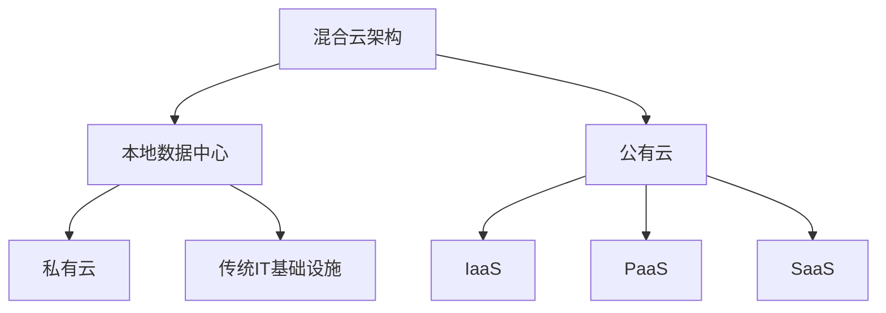

# AI系统混合云管理原理与代码实战案例讲解

## 1.背景介绍

在当今数字化转型的大潮中,人工智能(AI)系统的应用越来越广泛。然而,由于AI系统通常需要大量的计算资源和海量数据,因此单一的本地数据中心或云环境往往无法满足其需求。为了解决这一问题,混合云架构应运而生,它将传统的本地基础设施与公有云资源相结合,提供了更大的灵活性、可扩展性和成本效益。

混合云管理是指有效地管理和协调这种跨本地和云环境的资源,以确保AI系统的高效运行。它涉及多个关键方面,包括资源供给、工作负载管理、数据治理、安全合规性等。有效的混合云管理对于充分发挥AI系统的潜力至关重要。

## 2.核心概念与联系

### 2.1 混合云架构

混合云架构是将本地私有云或传统IT基础设施与公有云资源相结合的模式。它允许组织灵活地在内部和外部环境之间分配工作负载,以满足不同的业务需求、性能要求、合规性和成本约束。

### 2.2 AI系统需求

AI系统对计算资源和数据的需求通常是巨大的。例如,深度学习模型的训练过程需要大量的GPU资源,而推理过程则需要高并发的CPU资源。此外,AI系统还需要存储和处理海量的训练数据和模型文件。

### 2.3 混合云管理

混合云管理旨在协调跨本地和云环境的资源,以满足AI系统的需求。它包括以下几个关键方面:

1. **资源供给**: 根据AI系统的需求,在本地和云环境之间动态分配计算、存储和网络资源。
2. **工作负载管理**: 根据资源利用率、性能要求和成本约束,在不同环境之间调度和迁移AI工作负载。
3. **数据治理**: 确保训练数据和模型文件在不同环境之间的安全传输、存储和访问。
4. **安全合规性**: 满足不同环境的安全和合规性要求,如数据隐私、访问控制等。
5. **监控和优化**: 持续监控资源利用率和系统性能,并进行优化以提高效率和降低成本。

## 3.核心算法原理具体操作步骤

混合云管理涉及多种算法和技术,以实现资源调度、工作负载管理和数据治理等目标。以下是一些核心算法原理和具体操作步骤:

### 3.1 资源调度算法

资源调度算法旨在根据AI系统的需求,在本地和云环境之间动态分配计算、存储和网络资源。常用的算法包括:

1. **基于约束的算法**: 根据资源约束(如CPU、内存、GPU等)和工作负载特征(如计算密集型、IO密集型等),将工作负载分配到合适的资源上。
2. **基于成本优化的算法**: 考虑资源成本和性能要求,在本地和云环境之间进行成本优化的资源分配。
3. **基于负载均衡的算法**: 根据资源利用率和工作负载,在多个节点之间进行负载均衡,以提高整体系统性能。

具体操作步骤如下:

1. 收集资源利用率、工作负载特征和成本信息等监控数据。
2. 根据算法模型,计算出最优的资源分配方案。
3. 通过资源管理工具(如Kubernetes、OpenStack等),在本地和云环境之间调度和迁移工作负载。
4. 持续监控并根据需要重新调度资源。

### 3.2 工作负载管理算法

工作负载管理算法旨在根据资源利用率、性能要求和成本约束,在不同环境之间调度和迁移AI工作负载。常用的算法包括:

1. **基于规则的算法**: 根据预定义的规则(如资源利用率阈值、成本约束等),决定何时迁移工作负载。
2. **基于机器学习的算法**: 使用机器学习模型,根据历史数据和当前状态,预测未来的资源需求并进行工作负载迁移。
3. **基于优化理论的算法**: 将工作负载迁移建模为优化问题,求解最优的迁移策略。

具体操作步骤如下:

1. 收集工作负载特征、资源利用率、性能指标和成本信息等监控数据。
2. 根据算法模型,计算出最优的工作负载迁移策略。
3. 通过容器编排工具(如Kubernetes)或虚拟机管理工具,在本地和云环境之间迁移工作负载。
4. 持续监控并根据需要重新调度工作负载。

### 3.3 数据治理算法

数据治理算法旨在确保训练数据和模型文件在不同环境之间的安全传输、存储和访问。常用的算法包括:

1. **基于加密的算法**: 使用加密技术(如对称加密、非对称加密等)保护数据在传输和存储过程中的安全性。
2. **基于访问控制的算法**: 通过身份认证、授权和审计等机制,控制对数据的访问权限。
3. **基于版本控制的算法**: 跟踪数据和模型文件的版本变化,方便回滚和恢复。

具体操作步骤如下:

1. 根据数据敏感性和安全要求,选择合适的加密算法和密钥管理策略。
2. 设计并实施细粒度的访问控制策略,包括身份认证、授权和审计机制。
3. 建立数据和模型文件的版本控制系统,记录变更历史和元数据信息。
4. 在本地和云环境之间传输和存储数据时,应用相应的加密、访问控制和版本控制措施。
5. 持续监控数据访问和变更情况,及时发现和处理安全风险。

## 4.数学模型和公式详细讲解举例说明

在混合云管理中,数学模型和公式常用于资源调度、工作负载管理和优化等领域。以下是一些典型的数学模型和公式,以及相关的详细讲解和举例说明。

### 4.1 资源调度模型

资源调度模型旨在将有限的资源分配给不同的工作负载,以优化某些目标函数,如最大化资源利用率或最小化成本。常用的数学模型包括:

1. **整数规划模型**:

$$
\begin{aligned}
\max \quad & \sum_{i=1}^{n} \sum_{j=1}^{m} r_{ij} x_{ij} \\
\text{s.t.} \quad & \sum_{j=1}^{m} x_{ij} = 1, \quad \forall i \in \{1, \ldots, n\} \\
& \sum_{i=1}^{n} c_{ij} x_{ij} \leq C_j, \quad \forall j \in \{1, \ldots, m\} \\
& x_{ij} \in \{0, 1\}, \quad \forall i \in \{1, \ldots, n\}, \forall j \in \{1, \ldots, m\}
\end{aligned}
$$

其中:
- $n$ 是工作负载的数量
- $m$ 是资源节点的数量
- $r_{ij}$ 是将工作负载 $i$ 分配给节点 $j$ 的收益
- $x_{ij}$ 是决策变量,表示是否将工作负载 $i$ 分配给节点 $j$
- $c_{ij}$ 是将工作负载 $i$ 分配给节点 $j$ 所需的资源消耗
- $C_j$ 是节点 $j$ 的资源容量

该模型旨在最大化总收益,同时满足每个工作负载只能分配给一个节点,以及每个节点的资源容量约束。

2. **向量装箱模型**:

$$
\begin{aligned}
\min \quad & \sum_{j=1}^{m} y_j \\
\text{s.t.} \quad & \sum_{j=1}^{m} x_{ij} = 1, \quad \forall i \in \{1, \ldots, n\} \\
& \sum_{i=1}^{n} c_{ij} x_{ij} \leq C y_j, \quad \forall j \in \{1, \ldots, m\} \\
& x_{ij} \in \{0, 1\}, \quad \forall i \in \{1, \ldots, n\}, \forall j \in \{1, \ldots, m\} \\
& y_j \in \{0, 1\}, \quad \forall j \in \{1, \ldots, m\}
\end{aligned}
$$

其中:
- $y_j$ 是决策变量,表示是否使用节点 $j$
- 其他符号与整数规划模型相同

该模型旨在最小化使用的节点数量,同时满足每个工作负载只能分配给一个节点,以及每个节点的资源容量约束。

这些模型可以通过求解器(如CPLEX、Gurobi等)来求解,并得到最优的资源分配方案。

### 4.2 工作负载迁移模型

工作负载迁移模型旨在确定何时以及将工作负载迁移到何处,以优化某些目标函数,如最小化迁移成本或最大化性能。常用的数学模型包括:

1. **马尔可夫决策过程模型**:

$$
V(s) = \max_{a} \left\{ R(s, a) + \gamma \sum_{s'} P(s' | s, a) V(s') \right\}
$$

其中:
- $s$ 是系统的当前状态
- $a$ 是可选的行动(如迁移工作负载)
- $R(s, a)$ 是在状态 $s$ 下采取行动 $a$ 的即时回报
- $P(s' | s, a)$ 是从状态 $s$ 采取行动 $a$ 转移到状态 $s'$ 的概率
- $\gamma$ 是折现因子,用于权衡即时回报和未来回报
- $V(s)$ 是在状态 $s$ 下的最优值函数

该模型旨在找到一个最优策略,使得在考虑了即时成本和未来收益的情况下,最大化总体收益。

2. **线性规划模型**:

$$
\begin{aligned}
\min \quad & \sum_{i=1}^{n} \sum_{j=1}^{m} c_{ij} x_{ij} \\
\text{s.t.} \quad & \sum_{j=1}^{m} x_{ij} = 1, \quad \forall i \in \{1, \ldots, n\} \\
& \sum_{i=1}^{n} r_{ij} x_{ij} \leq C_j, \quad \forall j \in \{1, \ldots, m\} \\
& x_{ij} \in \{0, 1\}, \quad \forall i \in \{1, \ldots, n\}, \forall j \in \{1, \ldots, m\}
\end{aligned}
$$

其中:
- $c_{ij}$ 是将工作负载 $i$ 迁移到节点 $j$ 的成本
- $r_{ij}$ 是将工作负载 $i$ 分配给节点 $j$ 所需的资源消耗
- 其他符号与资源调度模型相同

该模型旨在最小化工作负载迁移的总成本,同时满足每个工作负载只能分配给一个节点,以及每个节点的资源容量约束。

这些模型可以通过动态规划、线性规划求解器等方法来求解,并得到最优的工作负载迁移策略。

### 4.3 数据治理模型

数据治理模型旨在确保数据在传输、存储和访问过程中的安全性和合规性。常用的数学模型包括:

1. **加密模型**:

$$
C = E_K(P)
$$

其中:
- $P$ 是明文数据
- $K$ 是加密密钥
- $E_K$ 是加密算法
- $C$ 是密文数据

加密模型通过将明文数据与密钥进行特定的数学运算,生成密文数据,从而保护数据的机密性。常用的加密算法包括对称加密算法(如AES、DES等)和非对称加密算法(如RSA等)。

2. **访问控制模型**:

$$
\begin{aligned}
\text{CanAccess}(u, o, p) = & \exists r \in R, \\
& (u, o, p) \in \mathcal{A}(r