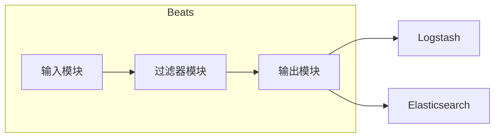
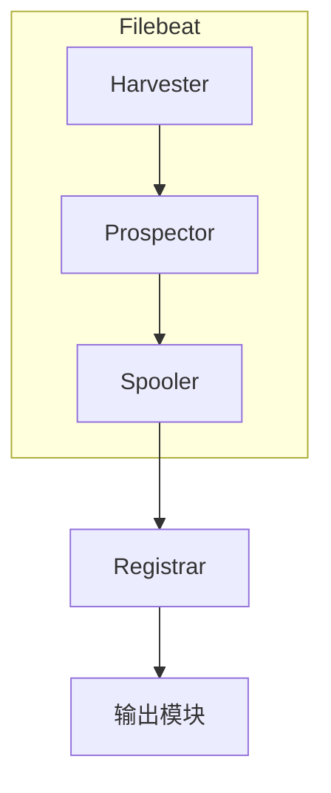

# Beats原理与代码实例讲解

## 1.背景介绍

在现代分布式系统中,日志数据是非常重要的资源。它不仅记录了系统的运行状态和错误信息,还可以用于系统监控、故障排查和业务分析等多种用途。然而,传统的日志收集方式存在一些问题,例如:

- 日志数据分散在各个节点上,难以集中管理和分析
- 日志传输效率低下,容易导致数据丢失或延迟
- 日志格式不统一,难以进行数据处理和分析

为了解决这些问题,Elastic推出了Beats这一轻量级的日志数据传输工具。Beats可以轻松地收集各种数据源(如文件、Metrics和网络数据),并将其发送到Logstash或Elasticsearch进行后续处理。它具有以下优点:

- 轻量级:只有几兆字节大小,资源占用极小
- 模块化:支持多种数据输入模块,易于扩展
- 高效传输:使用内存缓存和批量发送,提高传输效率
- 集中管理:支持从一个中心节点管理所有Beats实例

Beats已经成为Elastic Stack中重要的一员,广泛应用于日志收集、指标监控、网络数据分析等多个领域。

## 2.核心概念与联系

Beats由多个独立的数据采集模块组成,每个模块都有自己的用途和配置方式。目前,Beats家族包括以下主要成员:

1. **Filebeat**: 用于收集和转发日志文件数据。
2. **Metricbeat**: 用于收集系统、服务和服务器指标。
3. **Packetbeat**: 用于监控网络流量数据。
4. **Winlogbeat**: 用于收集Windows事件日志数据。
5. **Auditbeat**: 用于收集Linux审计数据。
6. **Heartbeat**: 用于主动监测服务的运行状况。
7. **Functionbeat**: 用于收集云端无服务器函数的日志数据。

这些Beats模块可以单独使用,也可以组合使用,从而构建一个完整的数据收集管道。它们通过输入、过滤器和输出三个主要组件来工作:



1. **输入模块**负责从各种数据源(如文件、Metrics、网络等)收集数据。
2. **过滤器模块**用于对收集的数据进行转换、修改和丰富,例如添加元数据、解析特定格式等。
3. **输出模块**将处理后的数据发送到指定的目的地,如Logstash、Elasticsearch或其他存储系统。

Beats的模块化设计使得它非常灵活和可扩展。用户可以根据需求选择合适的Beats模块,并对其进行定制配置,从而构建出满足特定需求的数据收集解决方案。

## 3.核心算法原理具体操作步骤

Beats的核心算法原理包括以下几个关键步骤:

### 3.1 数据采集

Beats通过不同的输入模块从各种数据源采集数据。以Filebeat为例,它的采集过程如下:



1. **Prospector**负责管理多个Harvester,并根据文件路径模式查找符合条件的文件。
2. **Harvester**从每个文件中读取新的数据行,并将它们发送到Spooler。
3. **Spooler**在内存中缓存事件,并将它们分批发送到输出模块。
4. **Registrar**用于持久化每个Harvester的读取状态,以防止重复读取或数据丢失。

这种设计使得Filebeat能够高效、可靠地从文件中读取数据,并将其发送到后续处理管道。

### 3.2 数据处理

Beats的过滤器模块用于对采集的数据进行处理和转换。常见的处理操作包括:

- 添加元数据(如主机名、时间戳等)
- 解析特定格式的日志(如JSON、XML等)
- 基于正则表达式进行字段提取
- 使用Grok模式进行结构化
- 删除或重命名字段
- 基于条件进行字段操作

这些操作可以通过配置文件或者过滤器插件来实现。例如,在Filebeat中,我们可以使用以下配置来添加主机名元数据并解析JSON格式的日志:

```yaml
filebeat.inputs:
- type: log
  paths:
    - /var/log/*.log
  json.keys_under_root: true

processors:
- add_host_metadata: ~
- decode_json_fields:
    fields: ["message"]
    target: ""
```

### 3.3 数据输出

处理后的数据将被发送到输出模块指定的目的地。Beats支持多种输出方式,包括:

- Elasticsearch
- Logstash
- Kafka
- Redis
- Cloud (如AWS CloudWatch Logs)

输出模块使用内存缓存和批量发送机制,以提高传输效率并降低后端系统的负载。同时,它还提供了重试、负载均衡和模板管理等高级功能,以确保数据的可靠传输。

以Elasticsearch输出为例,Beats会自动创建索引模板,并使用批量API将数据发送到Elasticsearch集群。如果发生错误,它会自动重试,并支持对Elasticsearch节点进行负载均衡。

```yaml
output.elasticsearch:
  hosts: ["http://es1:9200", "http://es2:9200"]
  bulk_max_size: 1024
  timeout: 30
  max_retries: 3
```

通过这种方式,Beats可以高效、可靠地将数据发送到目标存储系统,为后续的数据分析和可视化奠定基础。

## 4.数学模型和公式详细讲解举例说明 

在Beats的数据处理过程中,常常需要使用一些数学模型和公式来对数据进行转换和计算。以下是一些常见的数学模型和公式:

### 4.1 指数平滑模型

指数平滑模型是一种常用的时间序列预测模型,它可以用于平滑和预测时间序列数据,例如系统指标和网络流量。指数平滑模型的公式如下:

$$
S_t = \alpha X_t + (1 - \alpha) S_{t-1}
$$

其中:
- $S_t$是时间$t$的平滑值
- $X_t$是时间$t$的实际观测值
- $\alpha$是平滑系数,取值范围为$0 < \alpha < 1$
- $S_{t-1}$是时间$t-1$的平滑值

平滑系数$\alpha$决定了新数据对平滑值的影响程度。$\alpha$越大,新数据的影响越大;$\alpha$越小,历史数据的影响越大。

在Metricbeat中,我们可以使用指数平滑模型来平滑和预测系统指标,从而更好地监控系统状态并发现异常情况。

### 4.2 信号检测模型

在网络流量分析中,常常需要检测异常信号,以发现潜在的安全威胁或性能问题。常用的信号检测模型包括CUSUM和EWMA等。

**CUSUM模型**的公式如下:

$$
S_t = \max(0, S_{t-1} + X_t - \mu_0 - k)
$$

其中:
- $S_t$是时间$t$的CUSUM统计量
- $X_t$是时间$t$的观测值
- $\mu_0$是目标均值
- $k$是允许的偏移量

当$S_t$超过预设的阈值时,就认为检测到了异常信号。

**EWMA模型**的公式如下:

$$
Z_t = \lambda X_t + (1 - \lambda) Z_{t-1}
$$

其中:
- $Z_t$是时间$t$的EWMA统计量
- $X_t$是时间$t$的观测值
- $\lambda$是衰减系数,取值范围为$0 < \lambda < 1$
- $Z_{t-1}$是时间$t-1$的EWMA统计量

当$Z_t$超过预设的阈值时,就认为检测到了异常信号。

在Packetbeat中,我们可以使用这些信号检测模型来监控网络流量,及时发现异常活动,如DDoS攻击、横向移动等。

### 4.3 相似性计算模型

在日志分析中,常常需要计算不同日志消息之间的相似性,以进行日志聚类、异常检测等操作。常用的相似性计算模型包括编辑距离、Jaccard相似系数等。

**编辑距离**是计算两个字符串之间的最小编辑操作次数,包括插入、删除和替换操作。编辑距离越小,两个字符串越相似。

$$
d(i,j) = \begin{cases}
0 & \text{if } i=j=0 \\
i & \text{if } j=0 \\
j & \text{if } i=0 \\
\min \begin{cases}
d(i-1,j)+1 \\
d(i,j-1)+1 \\
d(i-1,j-1)+1_{(s_i \neq t_j)}
\end{cases} & \text{otherwise}
\end{cases}
$$

其中$s_i$和$t_j$分别表示两个字符串中的第$i$和第$j$个字符。

**Jaccard相似系数**是计算两个集合的交集与并集的比值,用于衡量两个集合的相似程度。对于字符串,我们可以将其视为字符集合。

$$
J(A, B) = \frac{|A \cap B|}{|A \cup B|}
$$

其中$A$和$B$分别表示两个字符串对应的字符集合。

在Filebeat中,我们可以使用这些相似性计算模型来对日志消息进行聚类和异常检测,从而更好地理解和管理日志数据。

## 5.项目实践:代码实例和详细解释说明

为了更好地理解Beats的工作原理,我们来看一个使用Filebeat收集Nginx访问日志的实例。

### 5.1 Filebeat配置

首先,我们需要配置Filebeat的输入、过滤器和输出模块。以下是一个示例配置文件:

```yaml
filebeat.inputs:
- type: log
  paths:
    - /var/log/nginx/access.log
  fields:
    app: nginx

processors:
- add_host_metadata: ~
- decode_json_fields:
    fields: ["message"]
    target: "nginx"
- drop_fields:
    fields: ["message"]

output.elasticsearch:
  hosts: ["http://elasticsearch:9200"]
  indices:
    - index: "filebeat-%{+yyyy.MM.dd}"
```

在这个配置中:

1. `filebeat.inputs`部分指定了要读取的日志文件路径,并添加了一个`app`字段,用于标识日志来源。
2. `processors`部分定义了三个过滤器:
   - `add_host_metadata`添加主机元数据,如主机名、IP地址等。
   - `decode_json_fields`将日志消息解析为JSON格式,并将结果存储在`nginx`字段中。
   - `drop_fields`删除原始的`message`字段,因为我们已经将其解析为结构化数据。
3. `output.elasticsearch`部分配置了Elasticsearch作为输出目的地,并使用基于日期的索引模式。

### 5.2 Nginx访问日志格式

假设Nginx的访问日志格式如下:

```
{"@timestamp":"2023-05-25T14:25:53.000Z","remote_ip":"192.168.1.1","remote_user":"-","request":"GET /index.html HTTP/1.1","response":200,"bytes":1024,"referer":"-","agent":"Mozilla/5.0 (Windows NT 10.0; Win64; x64) AppleWebKit/537.36 (KHTML, like Gecko) Chrome/58.0.3029.110 Safari/537.3"}
```

这是一种JSON格式的日志,包含了请求的时间戳、客户端IP、请求方法和URL、响应状态码、响应字节数、引荐URL和用户代理等信息。

### 5.3 Filebeat运行

启动Filebeat后,它会根据配置文件中的设置读取Nginx访问日志,并将其发送到Elasticsearch。我们可以在Elasticsearch中查看收集的日志数据:

```json
{
  "_index": "filebeat-2023.05.25",
  "_type": "_doc",
  "_id": "QXJETHoBY0GVv_UWyL7e",
  "_score": 1,
  "_source": {
    "@timestamp": "2023-05-25T14:25:53.000Z",
    "host": {
      "name": "web01.example.com"
    },
    "nginx": {
      "@