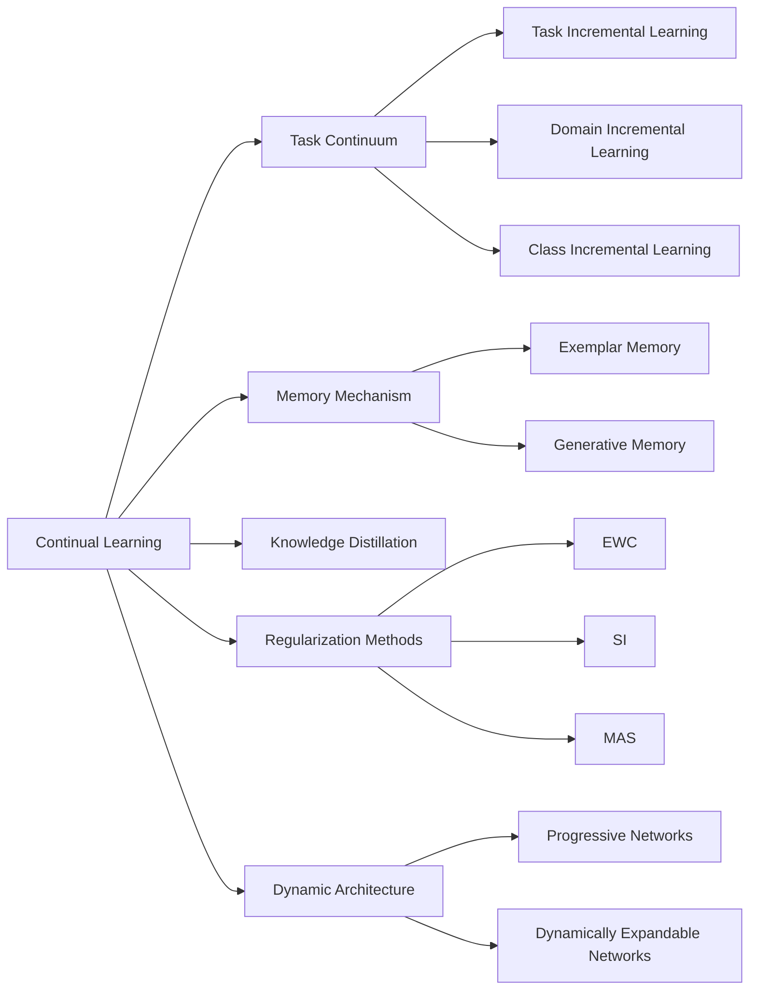

# Continual Learning原理与代码实例讲解

## 1. 背景介绍
### 1.1 Continual Learning的定义
Continual Learning(持续学习)，也称为Lifelong Learning(终身学习)或Incremental Learning(增量学习)，是一种旨在使机器学习模型能够持续学习和适应新任务的方法，同时保留先前学习到的知识，避免灾难性遗忘(Catastrophic Forgetting)。

### 1.2 Continual Learning的重要性
在现实世界中，数据通常是连续到达的，环境也在不断变化。传统的机器学习模型在学习新任务时，往往会遗忘之前学习到的知识，导致性能下降。Continual Learning旨在解决这一问题，使得模型能够在连续学习的过程中不断积累和保留知识，提高模型的适应性和鲁棒性。

### 1.3 Continual Learning的挑战
Continual Learning面临着几个关键挑战：
1. 灾难性遗忘：在学习新任务时，模型可能会遗忘之前学习到的知识。
2. 知识共享和转移：如何在不同任务之间共享和转移知识，提高学习效率。
3. 资源受限：在资源(如内存、计算)受限的情况下，如何高效地进行持续学习。

## 2. 核心概念与联系
### 2.1 任务连续性(Task Continuum)
任务连续性指的是模型面临的一系列任务的性质和关系。根据任务之间的相关性和顺序，可以分为以下三种类型：
1. 任务增量学习(Task Incremental Learning)：任务之间相互独立，按顺序到达。
2. 域增量学习(Domain Incremental Learning)：任务之间共享相同的标签空间，但数据分布不同。
3. 类增量学习(Class Incremental Learning)：任务之间共享相同的数据分布，但标签空间不断扩展。

### 2.2 记忆机制(Memory Mechanism)
为了缓解灾难性遗忘问题，Continual Learning通常引入记忆机制，用于存储和回放之前学习到的样本或知识。记忆机制可以分为以下两种类型：
1. 示例记忆(Exemplar Memory)：存储一部分之前学习到的样本，在学习新任务时与新样本一起训练。
2. 生成记忆(Generative Memory)：学习一个生成模型，用于生成之前学习到的样本或特征表示。

### 2.3 知识蒸馏(Knowledge Distillation)
知识蒸馏是一种将知识从一个模型(教师模型)转移到另一个模型(学生模型)的技术。在Continual Learning中，知识蒸馏可以用于将之前学习到的知识传递给新模型，减少灾难性遗忘。

### 2.4 正则化方法(Regularization Methods)
正则化方法通过在损失函数中引入额外的正则化项，来约束模型参数的更新，减少对之前学习到的知识的遗忘。常用的正则化方法包括:
1. EWC(Elastic Weight Consolidation)：根据参数的重要性对其进行约束。
2. SI(Synaptic Intelligence)：根据参数的重要性对其进行约束，并考虑参数的历史更新情况。
3. MAS(Memory Aware Synapses)：根据参数对之前任务的重要性对其进行约束。

### 2.5 动态架构(Dynamic Architecture)
动态架构方法通过动态调整模型的架构，来适应新任务的学习，同时保留之前学习到的知识。常见的动态架构方法包括：
1. Progressive Networks：为每个新任务添加一个新的子网络，并与之前的子网络进行连接。
2. Dynamically Expandable Networks：根据任务的需求动态扩展网络的宽度和深度。

下图展示了Continual Learning的核心概念及其关系：



## 3. 核心算法原理具体操作步骤
### 3.1 EWC算法
EWC(Elastic Weight Consolidation)是一种基于正则化的Continual Learning方法，通过约束模型参数的更新来减少灾难性遗忘。其核心思想是对之前任务中重要的参数施加更大的约束，使其在学习新任务时更难被改变。

EWC算法的具体步骤如下：
1. 在任务 $t$ 上训练模型，得到参数 $\theta^*_t$。
2. 计算Fisher Information Matrix $F_t$，用于衡量每个参数对任务 $t$ 的重要性。
3. 在学习新任务 $t+1$ 时，引入EWC正则化项：
   
   $L_{EWC}(\theta) = L_{t+1}(\theta) + \sum_i \frac{\lambda}{2} F_{t,i} (\theta_i - \theta^*_{t,i})^2$

   其中，$L_{t+1}(\theta)$ 是新任务的损失函数，$\lambda$ 是平衡因子，$F_{t,i}$ 是参数 $\theta_i$ 的Fisher Information。
4. 通过优化 $L_{EWC}(\theta)$ 来更新模型参数，得到新的参数 $\theta^*_{t+1}$。
5. 重复步骤1-4，直到所有任务学习完成。

### 3.2 GEM算法
GEM(Gradient Episodic Memory)是一种基于示例记忆的Continual Learning方法，通过存储一部分之前任务的样本，并在学习新任务时使用这些样本来约束梯度更新，以减少灾难性遗忘。

GEM算法的具体步骤如下：
1. 初始化记忆 $\mathcal{M} = \emptyset$。
2. 对于每个任务 $t$：
   1. 在任务 $t$ 上训练模型，得到参数 $\theta^*_t$。
   2. 从任务 $t$ 中随机选择一部分样本加入记忆 $\mathcal{M}$。
   3. 在学习新任务 $t+1$ 时，对于每个批次的数据：
      1. 计算新任务的梯度 $g$。
      2. 对于记忆 $\mathcal{M}$ 中的每个样本 $(x, y)$，计算梯度 $g_k$。
      3. 求解二次规划问题，得到梯度更新方向 $\tilde{g}$：
         
         $\min_{\tilde{g}} \frac{1}{2} \|\tilde{g} - g\|^2_2$
         
         $s.t. \langle \tilde{g}, g_k \rangle \geq 0, \forall k$
      4. 使用 $\tilde{g}$ 更新模型参数。
3. 重复步骤2，直到所有任务学习完成。

### 3.3 iCaRL算法
iCaRL(Incremental Classifier and Representation Learning)是一种基于知识蒸馏和示例记忆的Continual Learning方法，用于解决类增量学习问题。iCaRL通过知识蒸馏来保留之前学习到的知识，并使用示例记忆来帮助新类别的学习。

iCaRL算法的具体步骤如下：
1. 初始化记忆 $\mathcal{M} = \emptyset$。
2. 对于每个任务 $t$：
   1. 使用当前模型 $\theta_t$ 对新类别的数据进行特征提取。
   2. 使用提取的特征和记忆 $\mathcal{M}$ 中的样本训练一个最近邻分类器。
   3. 使用知识蒸馏损失和分类损失训练新模型 $\theta_{t+1}$：
      
      $L = L_{CE}(y, \hat{y}) + \lambda L_{KD}(q, \hat{q})$
      
      其中，$L_{CE}$ 是交叉熵损失，$L_{KD}$ 是知识蒸馏损失，$q$ 和 $\hat{q}$ 分别是旧模型和新模型的输出。
   4. 从新类别中选择一部分样本加入记忆 $\mathcal{M}$，同时从 $\mathcal{M}$ 中移除一部分旧样本。
3. 重复步骤2，直到所有任务学习完成。

## 4. 数学模型和公式详细讲解举例说明
### 4.1 Fisher Information Matrix
Fisher Information Matrix(FIM)是EWC算法中用于衡量参数重要性的关键概念。对于任务 $t$，参数 $\theta_i$ 的Fisher Information定义为：

$F_{t,i} = \mathbb{E}_{x \sim D_t} \left[ \left( \frac{\partial \log p(y|x, \theta^*_t)}{\partial \theta_i} \right)^2 \right]$

其中，$D_t$ 是任务 $t$ 的数据分布，$\theta^*_t$ 是在任务 $t$ 上训练得到的最优参数。

直观地理解，Fisher Information衡量了参数 $\theta_i$ 对任务 $t$ 的模型输出分布的影响程度。如果改变 $\theta_i$ 会导致输出分布发生较大变化，则说明 $\theta_i$ 对任务 $t$ 很重要，应该受到更大的约束。

在实践中，Fisher Information通常通过经验估计来计算：

$F_{t,i} \approx \frac{1}{N_t} \sum_{n=1}^{N_t} \left( \frac{\partial \log p(y_n|x_n, \theta^*_t)}{\partial \theta_i} \right)^2$

其中，$N_t$ 是任务 $t$ 的样本数，$(x_n, y_n)$ 是第 $n$ 个样本。

### 4.2 知识蒸馏损失
知识蒸馏损失用于将知识从教师模型(旧模型)转移到学生模型(新模型)。设教师模型的输出为 $q$，学生模型的输出为 $\hat{q}$，知识蒸馏损失定义为：

$L_{KD}(q, \hat{q}) = -\sum_i q_i \log \hat{q}_i$

其中，$q_i$ 和 $\hat{q}_i$ 分别是教师模型和学生模型对第 $i$ 个类别的输出概率。

知识蒸馏损失可以看作是教师模型和学生模型输出分布之间的交叉熵。通过最小化这个损失，学生模型可以学习到教师模型的知识，同时保留自己的学习能力。

在Continual Learning中，知识蒸馏损失通常与任务特定的损失(如交叉熵损失)一起使用，以实现知识保留和新知识学习的平衡。

### 4.3 梯度约束
GEM算法中使用梯度约束来防止新任务的学习破坏之前学习到的知识。设新任务的梯度为 $g$，记忆中样本 $(x_k, y_k)$ 的梯度为 $g_k$，GEM算法求解以下二次规划问题：

$\min_{\tilde{g}} \frac{1}{2} \|\tilde{g} - g\|^2_2$

$s.t. \langle \tilde{g}, g_k \rangle \geq 0, \forall k$

其中，$\tilde{g}$ 是约束后的梯度更新方向。

这个优化问题的目标是找到一个与原梯度 $g$ 尽可能接近的更新方向 $\tilde{g}$，同时满足与所有记忆样本梯度 $g_k$ 的内积非负。这个约束确保了更新方向 $\tilde{g}$ 不会增大记忆样本上的损失，从而防止对之前知识的遗忘。

## 5. 项目实践：代码实例和详细解释说明
下面我们通过一个简单的示例来演示如何使用PyTorch实现EWC算法。

```python
import torch
import torch.nn as nn
import torch.optim as optim

class EWC(object):
    def __init__(self, model, dataset, lambda_ewc):
        self.model = model
        self.dataset = dataset
        self.lambda_ewc = lambda_ewc
        self.params = {n: p for n, p in self.model.named_parameters() if p.requires_grad}
        self.fisher = {}
        self.optpar = {}

    def compute_fisher(self):
        self.fisher = {}
        for n, p in self.params.items():
            self.fisher[n] = p.data.clone().zero_()

        self.model.eval()
        for x, y in self.