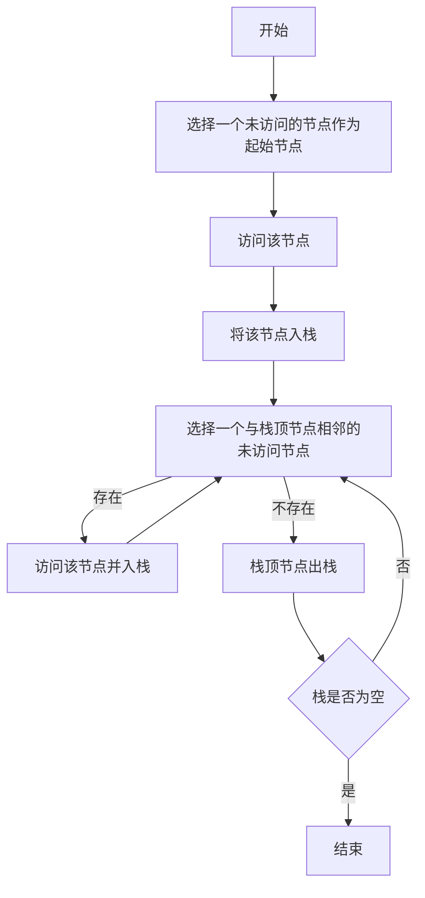

# Depth-First Search 算法原理与代码实现

## 1. 背景介绍

深度优先搜索（Depth-First Search，简称DFS）是图论中的经典算法，广泛应用于各类图的遍历问题。它的核心思想是尽可能深地搜索图的分支，直到达到末端，然后回溯到上一个分叉点继续探索未被遍历的路径。DFS算法不仅在理论研究中占有重要地位，而且在实际应用中也极为广泛，如解决迷宫问题、拓扑排序、寻找连通分量等。

## 2. 核心概念与联系

在深入探讨DFS算法之前，我们需要明确几个核心概念：

- **图(Graph)**：由节点（Vertex）和边（Edge）组成的集合。
- **节点(Vertex)**：图的基本单位，可以包含相关的属性。
- **边(Edge)**：连接两个节点的线，可以是有向的也可以是无向的。
- **路径(Path)**：由边依次连接的一系列节点。
- **栈(Stack)**：一种后进先出（LIFO）的数据结构，用于记录访问路径。
- **回溯(Backtracking)**：在遍历过程中，返回上一个分叉点继续探索的过程。

## 3. 核心算法原理具体操作步骤

DFS算法的操作步骤可以用以下流程图表示：



## 4. 数学模型和公式详细讲解举例说明

在DFS算法中，我们可以将图表示为邻接矩阵或邻接表。以邻接矩阵为例，图可以表示为一个二维数组 $G$，其中 $G[i][j]=1$ 表示节点 $i$ 和节点 $j$ 之间存在边，否则 $G[i][j]=0$。

DFS算法的时间复杂度为 $O(V+E)$，其中 $V$ 是节点的数量，$E$ 是边的数量。在最坏的情况下，每个节点和每条边都会被访问一次。

## 5. 项目实践：代码实例和详细解释说明

以下是DFS算法的Python代码实现：

```python
def dfs(graph, start, visited=None):
    if visited is None:
        visited = set()
    visited.add(start)
    print(start)  # 可以替换为其他对节点的操作
    for next in graph[start] - visited:
        dfs(graph, next, visited)
    return visited

# 示例图的邻接表表示
graph = {
    'A': set(['B', 'C']),
    'B': set(['A', 'D', 'E']),
    'C': set(['A', 'F']),
    'D': set(['B']),
    'E': set(['B', 'F']),
    'F': set(['C', 'E'])
}

dfs(graph, 'A')
```

在这段代码中，`graph` 是一个字典，表示图的邻接表。`dfs` 函数递归地遍历图，`visited` 集合记录已访问的节点。

## 6. 实际应用场景

DFS算法在许多领域都有应用，例如：

- **迷宫求解**：通过DFS可以找到迷宫的出路。
- **拓扑排序**：在有向无环图中，DFS可以帮助进行拓扑排序。
- **寻找连通分量**：在无向图中，DFS可以用来寻找所有的连通分量。

## 7. 工具和资源推荐

- **图形化工具**：如Gephi，可以帮助可视化图和DFS过程。
- **编程语言库**：如Python的NetworkX，提供了图论相关的算法实现。

## 8. 总结：未来发展趋势与挑战

DFS算法虽然简单高效，但在处理大规模图数据时仍面临挑战。未来的发展趋势可能包括优化算法的空间效率，以及并行化处理以应对大数据的需求。

## 9. 附录：常见问题与解答

- **问：DFS和BFS（广度优先搜索）有什么区别？**
- 答：DFS是深度优先，尽可能深地搜索；而BFS是广度优先，逐层遍历。

- **问：DFS算法是否总能找到解？**
- 答：在有限图中，DFS总能找到解，但不一定是最优解。

- **问：DFS算法的空间复杂度是多少？**
- 答：DFS的空间复杂度为 $O(V)$，主要是因为需要存储访问状态。

作者：禅与计算机程序设计艺术 / Zen and the Art of Computer Programming