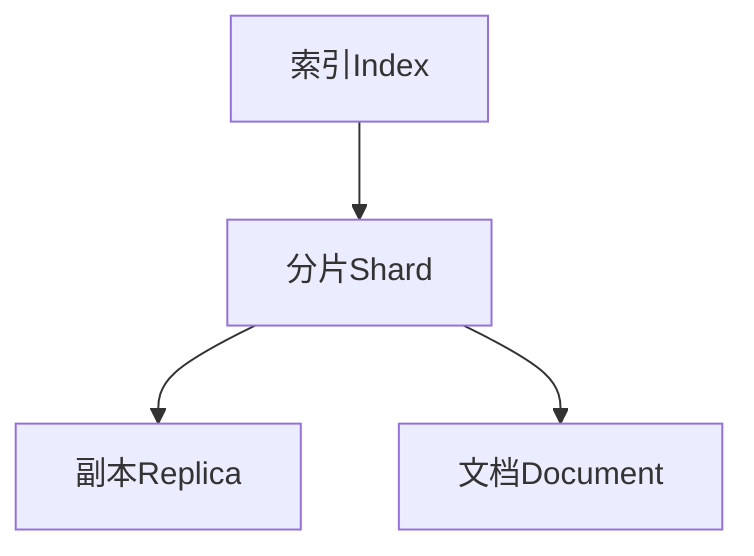
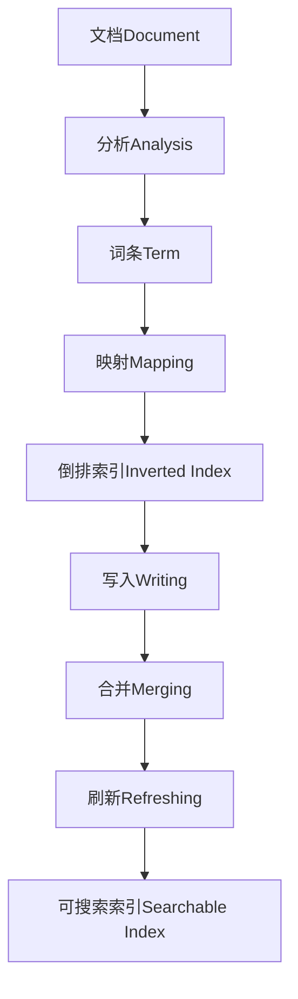

# ES索引原理与代码实例讲解

## 1.背景介绍

在当今大数据时代，数据的爆炸式增长已成为一个不争的事实。无论是企业内部的业务数据、社交媒体上的用户内容,还是物联网设备产生的海量数据,都需要高效、可扩展的解决方案来存储和检索。这就是Elasticsearch(ES)大显身手的时候。

Elasticsearch是一个分布式、RESTful风格的搜索和数据分析引擎,基于Apache Lucene构建。它能够以近乎实时的速度存储、搜索和分析大量数据。凭借其简单且强大的数据探索能力、分布式多租户功能以及高可用性,Elasticsearch已成为许多公司的不二之选。

在本文中,我们将深入探讨Elasticsearch的索引原理,并通过代码示例来加深理解。无论您是数据工程师、开发人员还是架构师,了解Elasticsearch的索引机制都将助您充分发挥其强大功能,提高数据处理效率。

## 2.核心概念与联系

在开始讲解索引原理之前,我们先来了解一些Elasticsearch中的核心概念:

### 2.1 索引(Index)

索引是Elasticsearch中的逻辑数据空间,用于存储相关的文档。它类似于关系数据库中的数据库,但更加灵活和高效。一个索引可以包含多种类型的文档,每个文档都有自己的数据结构。

### 2.2 文档(Document)

文档是Elasticsearch中的最小数据单元,类似于关系数据库中的一行记录。它由若干个键值对组成,并使用JSON格式进行序列化。每个文档都属于一个索引,并且有自己的唯一ID。

### 2.3 分片(Shard)

为了实现水平扩展和高可用性,Elasticsearch将每个索引细分为多个分片。每个分片实际上是一个底层Apache Lucene实例,可以独立存储和处理数据。分片可以分布在不同的节点上,从而提高整体系统的吞吐量和容错能力。

### 2.4 副本(Replica)

为了实现高可用性和容错,Elasticsearch会为每个分片创建一个或多个副本。副本是分片的精确拷贝,可以在主分片出现故障时提供数据冗余和自动故障转移。副本还可以提高搜索性能,因为搜索请求可以在主分片和副本之间进行负载均衡。

这些核心概念相互关联,共同构建了Elasticsearch的分布式架构。索引由多个分片组成,每个分片都有一个或多个副本,而文档则存储在分片中。理解这些概念有助于我们深入探讨Elasticsearch的索引原理。



## 3.核心算法原理具体操作步骤

Elasticsearch的索引过程包括以下几个关键步骤:

1. **文档分析(Document Analysis)**

   在将文档存储到索引之前,Elasticsearch首先需要对文档进行分析。这个过程包括:
   - 字符过滤器(Character Filters)
   - 分词器(Tokenizers)
   - 词单元过滤器(Token Filters)

   分析过程的目的是将文档内容转换为一系列规范化的词条(Term),以便于后续的索引和搜索操作。

2. **词条到分片的映射(Term-to-Shard Mapping)**

   Elasticsearch使用一种称为路由(Routing)的机制,将词条映射到特定的分片上。默认情况下,Elasticsearch使用文档ID的哈希值对分片数量取模,以确定该文档应该存储在哪个分片上。这种映射机制可以确保相关的文档被存储在同一个分片中,从而提高搜索效率。

3. **倒排索引构建(Inverted Index Creation)**

   Elasticsearch的核心是基于Apache Lucene的倒排索引。倒排索引是一种数据结构,它将词条与包含该词条的文档ID相关联。在索引构建过程中,Elasticsearch会为每个分片创建一个独立的倒排索引。

4. **索引写入(Index Writing)**

   倒排索引构建完成后,Elasticsearch会将其写入磁盘。为了提高写入效率,Elasticsearch采用了一种称为段(Segment)的数据结构。每个段包含一个独立的倒排索引,并且可以被单独刷新和合并。

5. **索引合并(Index Merging)**

   随着时间的推移,每个分片会累积越来越多的段。为了维护索引的性能,Elasticsearch会定期将较小的段合并成较大的段。这个过程称为索引合并,可以减少磁盘空间的使用,并优化搜索性能。

6. **索引刷新(Index Refreshing)**

   当新的文档被索引后,它们并不会立即对搜索可见。Elasticsearch会定期执行一个称为刷新(Refresh)的操作,将新索引的数据从内存缓冲区刷新到磁盘上的可搜索数据结构中。

这些步骤共同构成了Elasticsearch的索引过程。理解这些原理有助于我们优化索引性能,并更好地利用Elasticsearch的强大功能。



## 4.数学模型和公式详细讲解举例说明

在Elasticsearch的索引过程中,有一些重要的数学模型和公式值得深入探讨。

### 4.1 词条频率(Term Frequency, TF)

词条频率(TF)是指一个词条在文档中出现的次数。它是一个衡量词条重要性的重要指标。词条频率的计算公式如下:

$$TF(t,d) = \frac{n_{t,d}}{\sum_{t' \in d} n_{t',d}}$$

其中:
- $t$ 表示词条
- $d$ 表示文档
- $n_{t,d}$ 表示词条 $t$ 在文档 $d$ 中出现的次数
- $\sum_{t' \in d} n_{t',d}$ 表示文档 $d$ 中所有词条出现次数的总和

例如,如果一个文档包含10个词条,其中"elasticsearch"出现了3次,那么"elasticsearch"的词条频率就是 $\frac{3}{10} = 0.3$。

### 4.2 逆向文档频率(Inverse Document Frequency, IDF)

逆向文档频率(IDF)是一种衡量词条在整个文档集合中的重要性的指标。它反映了一个词条的稀有程度。IDF的计算公式如下:

$$IDF(t) = \log \frac{N}{df_t}$$

其中:
- $t$ 表示词条
- $N$ 表示文档集合中文档的总数
- $df_t$ 表示包含词条 $t$ 的文档数量

例如,如果我们有一个包含10,000,000个文档的集合,其中1,000,000个文档包含"elasticsearch",那么"elasticsearch"的IDF就是 $\log \frac{10,000,000}{1,000,000} = 2.3$。

### 4.3 TF-IDF

TF-IDF是一种综合了词条频率(TF)和逆向文档频率(IDF)的权重计算公式,用于衡量一个词条对于文档和文档集合的重要程度。TF-IDF的计算公式如下:

$$\text{TF-IDF}(t,d,D) = TF(t,d) \times IDF(t)$$

其中:
- $t$ 表示词条
- $d$ 表示文档
- $D$ 表示文档集合

TF-IDF被广泛应用于信息检索、文本挖掘和自然语言处理等领域。在Elasticsearch中,TF-IDF也被用于相关性评分,以确定搜索结果的排序。

通过理解这些数学模型和公式,我们可以更好地掌握Elasticsearch的索引和搜索机制,并优化其性能。

## 5.项目实践:代码实例和详细解释说明

为了加深对Elasticsearch索引原理的理解,我们将通过一个实际项目来演示相关的代码示例。在本例中,我们将使用Python和Elasticsearch官方客户端库来创建和管理索引。

### 5.1 安装Elasticsearch和客户端库

首先,我们需要安装Elasticsearch和Python客户端库。可以使用Docker快速启动一个Elasticsearch实例:

```bash
docker run -d --name elasticsearch -p 9200:9200 -e "discovery.type=single-node" elasticsearch:7.17.3
```

然后,使用pip安装Python客户端库:

```bash
pip install elasticsearch
```

### 5.2 创建索引

现在,让我们创建一个名为"books"的索引,用于存储图书信息。我们将定义一个映射,指定文档的数据结构:

```python
from elasticsearch import Elasticsearch

# 创建Elasticsearch客户端实例
es = Elasticsearch()

# 定义映射
mapping = {
    "properties": {
        "title": {"type": "text"},
        "author": {"type": "text"},
        "year": {"type": "integer"}
    }
}

# 创建索引
es.indices.create(index="books", body={"mappings": mapping})
```

在上面的代码中,我们首先创建一个Elasticsearch客户端实例。然后,我们定义了一个映射,指定了文档中的三个字段:"title"(标题)、"author"(作者)和"year"(出版年份)。最后,我们使用`es.indices.create()`方法创建了一个名为"books"的索引,并应用了我们定义的映射。

### 5.3 索引文档

接下来,我们将向"books"索引中添加一些文档。每个文档都是一个Python字典,包含了图书的标题、作者和出版年份:

```python
# 索引文档
docs = [
    {"title": "The Hitchhiker's Guide to the Galaxy", "author": "Douglas Adams", "year": 1979},
    {"title": "Brave New World", "author": "Aldous Huxley", "year": 1932},
    {"title": "1984", "author": "George Orwell", "year": 1949},
    {"title": "Frankenstein", "author": "Mary Shelley", "year": 1818}
]

for doc in docs:
    res = es.index(index="books", body=doc)
    print(res["result"])
```

在上面的代码中,我们定义了一个包含四个文档的列表。然后,我们使用`es.index()`方法将每个文档索引到"books"索引中。`es.index()`方法返回一个响应字典,其中包含了索引操作的结果。我们打印了`res["result"]`以确认每个文档是否成功索引。

### 5.4 搜索文档

现在,我们可以使用Elasticsearch的搜索API来查询索引中的文档。下面是一个简单的示例,演示如何搜索作者为"George Orwell"的图书:

```python
# 搜索文档
query = {
    "query": {
        "match": {
            "author": "George Orwell"
        }
    }
}

res = es.search(index="books", body=query)

for hit in res["hits"]["hits"]:
    print(hit["_source"])
```

在上面的代码中,我们定义了一个查询字典,使用`match`查询来搜索作者为"George Orwell"的文档。然后,我们使用`es.search()`方法执行搜索,并遍历搜索结果中的每个命中文档,打印出它们的`_source`字段(即原始文档数据)。

### 5.5 删除索引

最后,如果我们不再需要"books"索引,可以使用`es.indices.delete()`方法将其删除:

```python
# 删除索引
es.indices.delete(index="books")
```

通过这个实际项目,我们演示了如何使用Python和Elasticsearch客户端库来创建和管理索引,以及如何索引和搜索文档。这些代码示例有助于加深对Elasticsearch索引原理的理解,并为您在实际项目中使用Elasticsearch奠定基础。

## 6.实际应用场景

Elasticsearch的索引功能在各种场景下都有广泛的应用,包括但不限于:

### 6.1 电子商务网站

在电子商务网站中,Elasticsearch可以用于构建高效的产品搜索引擎。通过索引产品信息,如标题、描述、价格和类别,Elasticsearch可以为用户提供准确且实时的搜索结果。此外,Elasticsearch还可以支持自动补全、相关产品推荐等高级功能,提升用户体验。

### 6.2 日志分析

在大型分布式系统中,日志分析是一项关键的任务。Elasticsearch可以用于索引和搜索海量日志数据,帮助开发人员快速定位和诊断问题。通