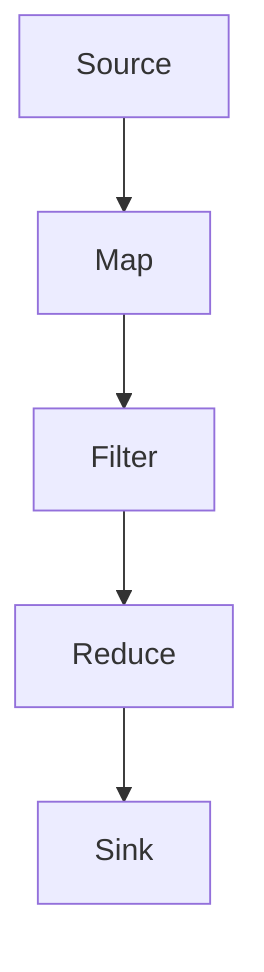

# Flink原理与代码实例讲解

## 1.背景介绍

Apache Flink 是一个开源的流处理框架，专为分布式数据流和批处理而设计。它提供了高吞吐量、低延迟和精确一次的处理语义，使其成为处理实时数据流的理想选择。Flink 的核心是一个分布式流处理引擎，能够在大规模集群上高效地执行数据流计算。

Flink 的出现解决了传统批处理系统和流处理系统之间的鸿沟。传统的批处理系统如 Hadoop MapReduce 主要处理静态数据集，而流处理系统如 Apache Storm 则专注于处理实时数据流。Flink 通过统一的编程模型和执行引擎，能够同时处理批处理和流处理任务。

## 2.核心概念与联系

### 2.1 数据流

在 Flink 中，数据流是数据处理的基本单位。数据流可以是无界的（无限长度）或有界的（有限长度）。无界数据流通常用于实时数据处理，而有界数据流则用于批处理任务。

### 2.2 数据源与数据汇

数据源（Source）是数据流的起点，数据汇（Sink）是数据流的终点。Flink 支持多种数据源和数据汇，包括文件系统、数据库、消息队列等。

### 2.3 算子

算子（Operator）是数据流处理的基本单元。常见的算子包括 Map、Filter、Reduce、Join 等。算子可以组合成复杂的数据处理拓扑。

### 2.4 状态管理

Flink 提供了强大的状态管理功能，允许用户在流处理过程中维护和更新状态。状态可以是有状态算子的内部状态，也可以是外部存储系统中的状态。

### 2.5 时间语义

Flink 支持三种时间语义：事件时间（Event Time）、处理时间（Processing Time）和摄取时间（Ingestion Time）。事件时间是数据生成的时间，处理时间是数据处理的时间，摄取时间是数据进入系统的时间。

### 2.6 窗口

窗口（Window）是将无界数据流划分为有限数据块的机制。常见的窗口类型包括滚动窗口（Tumbling Window）、滑动窗口（Sliding Window）和会话窗口（Session Window）。

## 3.核心算法原理具体操作步骤

### 3.1 数据流处理模型

Flink 的数据流处理模型基于有向无环图（DAG），每个节点表示一个算子，每条边表示数据流。数据流从源节点开始，经过一系列算子处理，最终到达汇节点。



### 3.2 状态管理与检查点

Flink 的状态管理基于键控状态（Keyed State）和操作状态（Operator State）。键控状态是按键分区的状态，每个键有独立的状态。操作状态是算子级别的状态，所有并行实例共享同一个状态。

Flink 通过检查点（Checkpoint）机制实现状态的容错。检查点是数据流处理过程中状态的快照，定期保存到外部存储系统。当任务失败时，Flink 可以从最近的检查点恢复状态，继续处理数据。

### 3.3 时间语义与窗口

Flink 的时间语义通过时间戳和水印（Watermark）实现。时间戳是数据生成的时间，水印是数据流中的特殊标记，表示某个时间点之前的数据已经到达。

窗口是将无界数据流划分为有限数据块的机制。滚动窗口按固定时间间隔划分数据，滑动窗口按固定时间间隔滑动，生成重叠的窗口，会话窗口根据数据的活动时间动态划分。

## 4.数学模型和公式详细讲解举例说明

### 4.1 数据流模型

Flink 的数据流模型可以用数学公式表示。假设数据流 $D$ 是一个无界序列，$D = \{d_1, d_2, \ldots, d_n, \ldots\}$，每个数据元素 $d_i$ 包含一个时间戳 $t_i$ 和一个值 $v_i$，即 $d_i = (t_i, v_i)$。

### 4.2 窗口函数

窗口函数将无界数据流划分为有限数据块。假设窗口大小为 $W$，窗口函数 $W(D)$ 将数据流 $D$ 划分为多个窗口，每个窗口包含 $W$ 个数据元素。

$$
W(D) = \{ \{d_1, \ldots, d_W\}, \{d_{W+1}, \ldots, d_{2W}\}, \ldots \}
$$

### 4.3 状态管理

状态管理可以用状态转移函数表示。假设状态 $S$ 是一个有界集合，状态转移函数 $f$ 将当前状态 $S_t$ 和输入数据 $d_t$ 映射到下一个状态 $S_{t+1}$，即 $S_{t+1} = f(S_t, d_t)$。

### 4.4 检查点机制

检查点机制可以用状态快照表示。假设检查点间隔为 $C$，检查点函数 $C(D)$ 将数据流 $D$ 划分为多个检查点，每个检查点包含 $C$ 个数据元素。

$$
C(D) = \{ \{d_1, \ldots, d_C\}, \{d_{C+1}, \ldots, d_{2C}\}, \ldots \}
$$

## 5.项目实践：代码实例和详细解释说明

### 5.1 环境搭建

首先，我们需要搭建 Flink 的开发环境。可以通过以下步骤安装 Flink：

1. 下载 Flink 安装包：
   ```bash
   wget https://archive.apache.org/dist/flink/flink-1.13.2/flink-1.13.2-bin-scala_2.11.tgz
   ```

2. 解压安装包：
   ```bash
   tar -xzf flink-1.13.2-bin-scala_2.11.tgz
   ```

3. 启动 Flink 集群：
   ```bash
   cd flink-1.13.2
   ./bin/start-cluster.sh
   ```

### 5.2 代码实例

以下是一个简单的 Flink 代码实例，演示如何读取数据源、处理数据流并将结果写入数据汇。

```java
import org.apache.flink.api.common.functions.MapFunction;
import org.apache.flink.api.java.tuple.Tuple2;
import org.apache.flink.streaming.api.datastream.DataStream;
import org.apache.flink.streaming.api.environment.StreamExecutionEnvironment;

public class FlinkExample {
    public static void main(String[] args) throws Exception {
        // 创建执行环境
        final StreamExecutionEnvironment env = StreamExecutionEnvironment.getExecutionEnvironment();

        // 读取数据源
        DataStream<String> text = env.readTextFile("path/to/input/file");

        // 处理数据流
        DataStream<Tuple2<String, Integer>> counts = text
            .flatMap(new LineSplitter())
            .keyBy(0)
            .sum(1);

        // 将结果写入数据汇
        counts.writeAsCsv("path/to/output/file");

        // 执行程序
        env.execute("Flink Example");
    }

    public static final class LineSplitter implements FlatMapFunction<String, Tuple2<String, Integer>> {
        @Override
        public void flatMap(String value, Collector<Tuple2<String, Integer>> out) {
            // 将行拆分为单词
            String[] words = value.split("\\s+");
            for (String word : words) {
                out.collect(new Tuple2<>(word, 1));
            }
        }
    }
}
```

### 5.3 详细解释

1. 创建执行环境：`StreamExecutionEnvironment` 是 Flink 程序的入口，负责管理程序的执行。
2. 读取数据源：`readTextFile` 方法从文件中读取数据，生成数据流。
3. 处理数据流：`flatMap` 方法将每行文本拆分为单词，`keyBy` 方法按单词分组，`sum` 方法计算每个单词的出现次数。
4. 将结果写入数据汇：`writeAsCsv` 方法将结果写入 CSV 文件。
5. 执行程序：`execute` 方法启动 Flink 程序。

## 6.实际应用场景

### 6.1 实时数据分析

Flink 可以用于实时数据分析，如实时日志分析、实时点击流分析等。通过处理实时数据流，用户可以及时获取数据洞察，做出快速决策。

### 6.2 机器学习

Flink 可以与机器学习库集成，进行实时机器学习模型训练和预测。例如，可以使用 Flink 处理实时数据流，训练在线机器学习模型，并实时预测结果。

### 6.3 数据管道

Flink 可以用于构建数据管道，将数据从多个数据源收集、处理并写入数据汇。例如，可以使用 Flink 从 Kafka 读取数据，进行数据清洗和转换，并将结果写入 HDFS 或数据库。

### 6.4 事件驱动应用

Flink 可以用于构建事件驱动应用，如实时监控、告警系统等。通过处理实时事件流，用户可以及时检测异常情况，触发相应的处理逻辑。

## 7.工具和资源推荐

### 7.1 开发工具

- IntelliJ IDEA：一款流行的 Java 开发工具，支持 Flink 开发。
- Visual Studio Code：一款轻量级的代码编辑器，支持多种编程语言和插件。

### 7.2 资源推荐

- [Flink 官方文档](https://ci.apache.org/projects/flink/flink-docs-release-1.13/): Flink 的官方文档，详细介绍了 Flink 的使用方法和最佳实践。
- [Flink GitHub 仓库](https://github.com/apache/flink): Flink 的源码仓库，可以查看和学习 Flink 的实现细节。
- [Flink 社区](https://flink.apache.org/community.html): Flink 的社区资源，包括邮件列表、论坛、博客等。

## 8.总结：未来发展趋势与挑战

Flink 作为一个强大的流处理框架，已经在多个领域得到了广泛应用。未来，Flink 的发展趋势和挑战主要包括以下几个方面：

### 8.1 统一的流批处理

Flink 的一个重要发展方向是实现流处理和批处理的统一。通过统一的编程模型和执行引擎，用户可以在同一个框架中处理实时数据流和静态数据集。

### 8.2 更高的性能和扩展性

随着数据量的不断增长，Flink 需要不断提升性能和扩展性。通过优化执行引擎、改进状态管理和检查点机制，Flink 可以在大规模