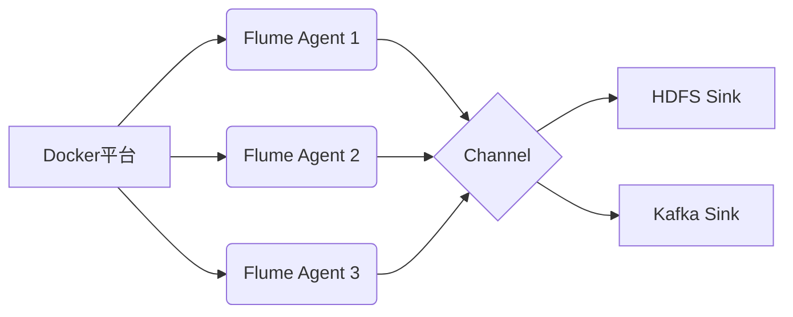

# Flume与Docker集成原理与实例

## 1. 背景介绍

### 1.1 大数据处理的挑战
在当今大数据时代,海量数据的实时收集、处理和分析已成为企业的核心竞争力。然而,传统的数据处理架构面临着诸多挑战,如数据源的多样性、数据量的急剧增长、数据处理的实时性要求等。为了应对这些挑战,需要引入高效、灵活、可扩展的大数据处理工具。

### 1.2 Flume的优势
Apache Flume是一个分布式、可靠、高可用的海量日志采集、聚合和传输的系统。它支持各种各样的数据源,如日志文件、事件流、数据库等,能够实时地将数据导入到Hadoop生态系统中,如HDFS、HBase、Kafka等,为后续的数据处理和分析提供了便利。Flume采用了灵活的架构设计,具有高度的可配置性和可扩展性。

### 1.3 Docker容器化技术
Docker是一种开源的容器化平台,它允许开发者将应用程序及其依赖打包到一个可移植的容器中,实现了应用的快速部署、扩展和管理。Docker容器与宿主机之间提供了一定程度的隔离,保证了应用运行环境的一致性,同时也大大提高了资源利用率。将应用容器化后,可以方便地在不同环境中迁移和部署,实现了"一次构建,到处运行"。

### 1.4 Flume与Docker集成的意义
将Flume与Docker进行集成,可以充分发挥二者的优势,实现灵活高效的大数据采集和传输:
- Docker化的Flume部署更加简单快捷,避免了复杂的环境依赖
- 基于Docker的弹性伸缩,可以动态调整Flume的数量,适应数据量的变化
- 容器化使Flume的部署和升级变得更加标准化,提高了运维效率
- 借助Docker平台的编排能力,实现Flume集群的统一管理和调度

本文将深入探讨Flume与Docker集成的原理,并给出详细的实践步骤和代码示例,帮助读者掌握这一利器,应对大数据时代的挑战。

## 2. 核心概念与联系

### 2.1 Flume核心概念
#### 2.1.1 Event
Event是Flume数据传输的基本单元。它由Header和Body两部分组成:Header用于存放一些元数据,如时间戳、数据源等;Body是实际的数据载荷,以字节数组的形式存在。

#### 2.1.2 Source 
Source是数据的来源,负责将不同类型的数据封装成Event,并将其传递给Channel。常见的Source类型有:
- Exec Source:从标准输入流中读取数据
- Spooling Directory Source:监控指定目录,读取新增的文件
- Kafka Source:从Kafka消息队列中读取数据
- HTTP Source:接收HTTP请求,将请求体作为Event

#### 2.1.3 Channel
Channel是Source和Sink之间的缓冲区,用于临时存储传输中的Event。常见的Channel类型有:
- Memory Channel:使用内存作为存储,速度快但可靠性较差
- File Channel:使用磁盘文件作为存储,速度慢但可靠性高
- Kafka Channel:使用Kafka作为存储,提供了可靠性和解耦能力

#### 2.1.4 Sink
Sink负责将Channel中的Event传输到目标存储系统。常见的Sink类型有:
- HDFS Sink:将数据写入HDFS
- Hive Sink:将数据写入Hive表
- Kafka Sink:将数据发送到Kafka
- HTTP Sink:将数据通过HTTP请求发送到其他系统

#### 2.1.5 Agent
Agent是一个独立的进程,由Source、Channel和Sink三个组件构成,负责数据的采集、缓存和传输。一个完整的数据传输流程为:Source接收数据并转换为Event,将Event放入Channel,Sink从Channel中取出Event并传输到目标存储。

### 2.2 Docker核心概念
#### 2.2.1 镜像(Image)
Docker镜像是一个只读的模板,包含了应用运行所需的文件系统和配置,是创建容器的基础。镜像是分层构建的,每一层代表了一次修改。Docker镜像存储在镜像仓库中,可以被推送、拉取和标记版本。

#### 2.2.2 容器(Container)
Docker容器是镜像的一个运行实例,代表了一个独立的应用运行环境。容器与宿主机之间共享内核,但拥有自己独立的文件系统、网络和进程空间。容器的创建、启动、停止和销毁都十分轻量级,可以实现快速的应用部署和扩展。

#### 2.2.3 仓库(Registry)
Docker仓库用于存储和分发Docker镜像,分为公共仓库和私有仓库。Docker Hub是默认的公共仓库,提供了大量的官方和第三方镜像。私有仓库可以搭建在内部,用于存储企业内部的镜像,提高了安全性和网络传输效率。

#### 2.2.4 编排(Orchestration)
Docker编排工具如Docker Compose、Kubernetes等,用于定义和管理多个容器组成的应用。通过编排工具,可以定义容器间的依赖关系、网络连接、数据卷挂载等,实现应用的快速部署、扩展和管理。

### 2.3 Flume与Docker的关系



如上图所示,Flume与Docker的集成主要体现在:
1. Flume Agent作为Docker容器运行,实现快速部署和弹性扩展
2. 多个Flume容器共享Channel,实现负载均衡和高可用
3. Sink将数据输出到HDFS、Kafka等存储,与外部系统解耦
4. Docker平台提供了统一的管理和调度,简化了Flume集群的运维

## 3. 核心算法原理具体操作步骤

Flume的数据传输流程可以分为三个主要步骤:数据接收、数据缓存和数据输出。下面详细介绍每个步骤的原理和操作。

### 3.1 数据接收
1. Source接收外部数据,如日志、事件流等
2. 将原始数据封装成Event对象,添加必要的Header信息
3. 调用Channel的put方法,将Event放入Channel

### 3.2 数据缓存
1. Channel接收Source发来的Event,并存入内部的队列或缓冲区
2. 根据Channel的类型,Event可能存储在内存、文件或外部系统中
3. Sink调用Channel的take方法,从Channel中取出Event

### 3.3 数据输出
1. Sink从Channel中批量读取Event
2. 根据Sink的类型,将Event输出到HDFS、Kafka、HBase等存储系统
3. 如果输出成功,则删除Channel中的对应Event;如果失败,则重试或记录错误日志

## 4. 数学模型和公式详细讲解举例说明

Flume的数据传输可以用队列模型来描述。假设数据的到达率为λ,处理率为μ,队列长度为k,则可以用M/M/1/k模型来分析。

根据排队论,M/M/1/k模型的状态转移方程为:

$$
\begin{aligned}
\lambda p_0 &= \mu p_1 \\
(\lambda + \mu) p_i &= \lambda p_{i-1} + \mu p_{i+1}, \quad 0 < i < k \\
\mu p_k &= \lambda p_{k-1}
\end{aligned}
$$

其中,$p_i$表示队列中有i个元素的概率。

求解状态转移方程,可以得到:

$$
p_i = \begin{cases}
\frac{1-\rho}{1-\rho^{k+1}} \rho^i, & \rho \neq 1 \\
\frac{1}{k+1}, & \rho = 1
\end{cases}
$$

其中,$\rho = \frac{\lambda}{\mu}$,表示系统的利用率。

根据上述公式,可以计算出系统的各项性能指标:
- 平均队列长度:$\overline{N} = \sum_{i=0}^{k} i p_i$
- 平均等待时间:$\overline{W} = \frac{\overline{N}}{\lambda}$
- 系统吞吐量:$\lambda(1-p_k)$

举例说明:假设Flume的Source接收数据的速率为1000条/秒,Channel的处理速率为1200条/秒,Channel的容量为10000条,则$\lambda=1000,\mu=1200,k=10000$。

代入公式,可以得到:

$$
\begin{aligned}
\rho &= \frac{1000}{1200} = 0.83 \\
p_0 &= \frac{1-0.83}{1-0.83^{10001}} = 0.00017 \\
\overline{N} &= \frac{0.83}{1-0.83} - \frac{10001 \times 0.83^{10001}}{1-0.83^{10001}} = 4.88 \\
\overline{W} &= \frac{4.88}{1000} = 0.00488 \text{ 秒} \\
\lambda(1-p_k) &= 1000 \times (1-0.83^{10000}) = 1000 \text{ 条/秒}
\end{aligned}
$$

可以看出,在给定的参数下,平均有4.88条数据在Channel中等待,平均等待时间为4.88毫秒,系统的实际吞吐量为1000条/秒,与数据的到达率相同,能够满足实时处理的需求。

## 5. 项目实践:代码实例和详细解释说明

下面以一个具体的例子来说明如何使用Docker部署Flume,并实现日志数据的采集和传输。

### 5.1 准备工作
1. 安装Docker环境,参考官方文档
2. 准备Flume配置文件flume.conf
```properties
# 定义Agent名称
a1.sources = s1
a1.channels = c1
a1.sinks = k1

# 配置Source
a1.sources.s1.type = spooldir
a1.sources.s1.spoolDir = /opt/logs
a1.sources.s1.fileHeader = true
a1.sources.s1.channels = c1

# 配置Channel
a1.channels.c1.type = memory
a1.channels.c1.capacity = 10000
a1.channels.c1.transactionCapacity = 1000

# 配置Sink
a1.sinks.k1.type = org.apache.flume.sink.kafka.KafkaSink
a1.sinks.k1.kafka.topic = test
a1.sinks.k1.kafka.bootstrap.servers = kafka:9092
a1.sinks.k1.kafka.flumeBatchSize = 20
a1.sinks.k1.kafka.producer.acks = 1
a1.sinks.k1.channel = c1
```

3. 准备Dockerfile
```dockerfile
FROM apache/flume

COPY flume.conf /opt/flume/conf/

EXPOSE 44444

ENTRYPOINT ["flume-ng", "agent", "-c", "/opt/flume/conf", "-f", "/opt/flume/conf/flume.conf", "-n", "a1", "-Dflume.root.logger=INFO,console"]
```

### 5.2 构建镜像
使用如下命令构建Flume镜像:
```bash
docker build -t flume:latest .
```

### 5.3 启动容器
使用如下命令启动Flume容器:
```bash
docker run -d --name flume -p 44444:44444 -v /path/to/logs:/opt/logs flume:latest
```

这里通过`-v`参数将宿主机的日志目录挂载到容器的`/opt/logs`目录,与flume.conf中的配置相对应。

### 5.4 验证
1. 在`/path/to/logs`目录下新增一个日志文件
2. 查看Kafka消费者,可以看到新增的日志数据
```bash
kafka-console-consumer --bootstrap-server kafka:9092 --topic test --from-beginning
```

### 5.5 代码解释
- flume.conf中定义了一个名为a1的Agent,包含一个Source、一个Channel和一个Sink
- Source的类型为spooldir,监控`/opt/logs`目录,将新增的文件解析为Event
- Channel的类型为memory,容量为10000条,事务容量为1000条
- Sink的类型为KafkaSink,将数据发送到Kafka的test主题,并配置了Kafka的连接参数
- Dockerfile基于官方的flume镜像,将flume.conf复制到镜像中,并启动Flume进程
- 启动容器时,通过数据卷挂载的方式,将宿主机的日志目录映射到容器中,便于Flume采