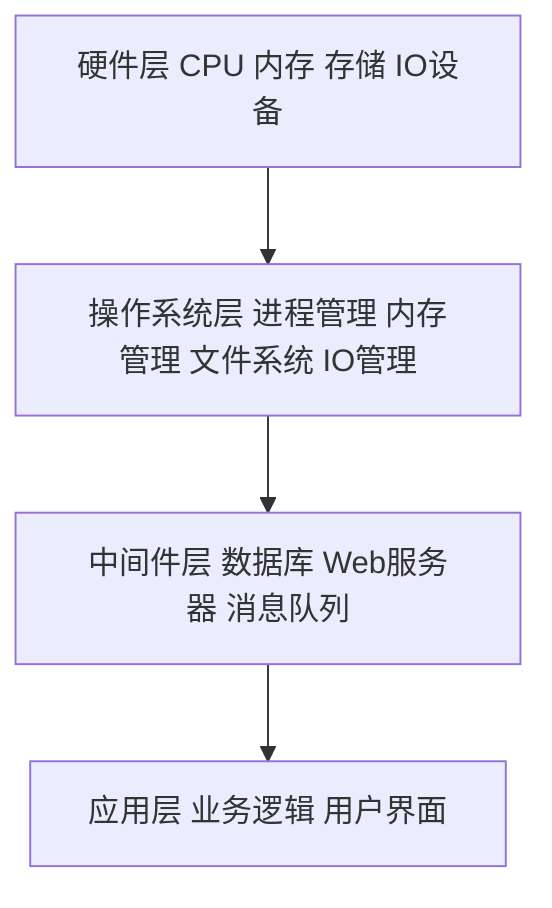
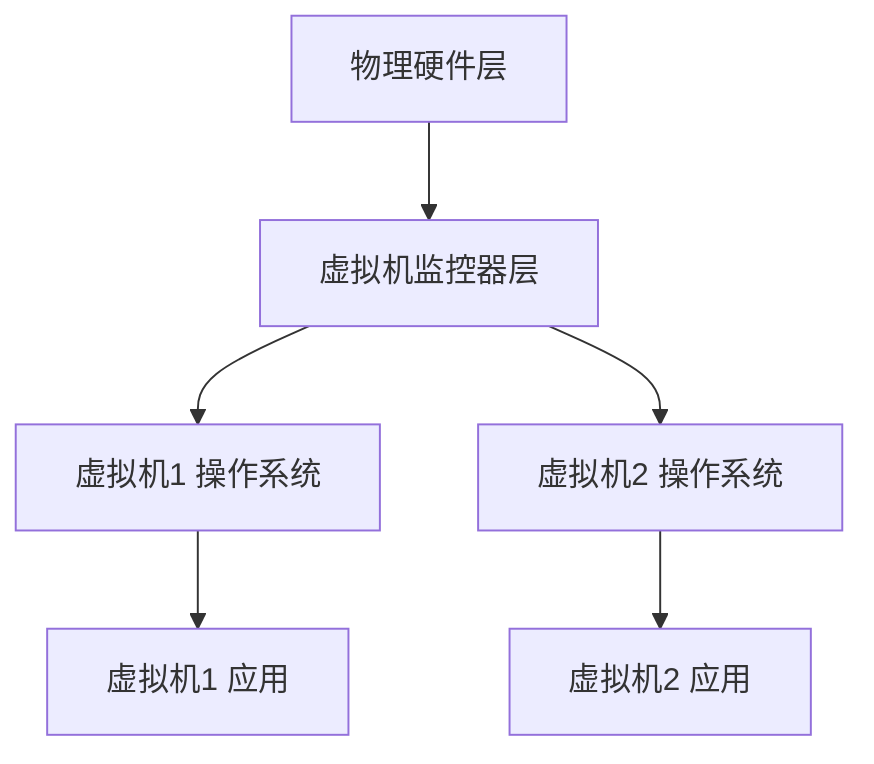
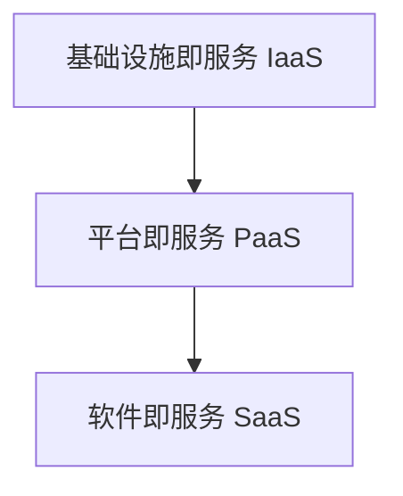

# IT基础资源（硬软件）运行流程

## 1. 背景介绍

### 1.1 IT基础资源的重要性

在当今数字化时代,IT基础资源(包括硬件和软件)已成为各行各业不可或缺的重要组成部分。无论是个人、企业还是政府机构,都依赖于IT基础设施来支持日常运营、提高效率和创新发展。深入理解IT基础资源的运行流程,对于优化资源配置、提升系统性能和确保业务连续性至关重要。

### 1.2 硬件和软件的协同运作 

IT基础资源的运行离不开硬件和软件的紧密协作。硬件为软件提供物理基础和计算资源,而软件则赋予硬件以灵活的可编程性和丰富的功能。两者相辅相成,共同构建了IT系统的基石。了解硬件和软件在不同层面的交互机制,有助于我们优化系统架构,提高资源利用效率。

### 1.3 IT基础资源运行流程概览

IT基础资源的运行流程涉及多个层面,从底层硬件到上层应用,每一层都发挥着不可替代的作用。本文将从以下几个方面深入探讨IT基础资源的运行流程:

- 硬件层:计算机系统的物理组成和工作原理
- 操作系统层:系统资源管理和服务支持
- 中间件层:提供通用服务,连接操作系统和应用 
- 应用层:实现业务逻辑和用户交互

通过对各层的剖析,我们将揭示IT基础资源运行的内在机制,为优化系统性能和保障业务连续性提供理论指导。

## 2. 核心概念与联系

### 2.1 硬件资源

#### 2.1.1 处理器(CPU)

处理器是计算机的核心组件,负责执行指令和进行数据运算。现代CPU采用复杂的微架构,包括多级缓存、多核、超线程等技术,以提升性能和并行处理能力。

#### 2.1.2 内存(RAM)

内存用于存储CPU当前执行的程序指令和数据。它的速度远快于外部存储,但容量有限且掉电易失。内存的性能对系统的整体性能有决定性影响。

#### 2.1.3 存储设备

存储设备用于永久保存数据和程序,即使断电也不会丢失。常见的存储设备包括硬盘(HDD)、固态硬盘(SSD)、光盘等。不同存储设备在容量、速度、可靠性等方面各有特点。

#### 2.1.4 I/O设备  

I/O设备负责计算机系统与外部环境的信息交换,如鼠标、键盘、显示器、打印机、网卡等。它们通过标准接口与系统相连,由操作系统和设备驱动程序管理。

### 2.2 软件资源

#### 2.2.1 操作系统

操作系统是管理和配置计算机硬件与软件资源的基础性软件。它为上层应用提供标准的编程接口和运行环境,屏蔽了硬件差异,极大地方便了应用开发。

#### 2.2.2 中间件 

中间件是位于操作系统和应用之间的一类基础软件。它为应用提供通用服务,如数据库、消息队列、Web服务器等,简化了应用的开发和部署。

#### 2.2.3 应用软件

应用软件是实现特定业务功能的程序,如办公软件、数据库管理系统、企业管理软件等。它直接服务于最终用户,是IT系统的价值所在。

### 2.3 硬件与软件的交互

硬件为软件提供物理基础设施,而软件则控制和协调硬件工作。它们在以下几个方面密切配合:

- CPU执行程序指令,对数据进行运算和处理
- 内存存储当前运行的程序和数据,供CPU快速访问  
- I/O设备在操作系统和设备驱动程序的控制下进行数据交换
- 文件系统组织和管理存储设备上的数据,提供统一的访问接口
- 网络协议栈实现了跨网络的数据通信和资源共享

只有硬件和软件紧密配合,才能发挥IT基础设施的最大效能。理解两者的交互机制,是优化IT系统不可或缺的基础。

## 3. 核心运行流程

### 3.1 计算机启动过程

#### 3.1.1 上电自检(POST)

计算机加电后,BIOS(基本输入输出系统)首先对硬件进行自检,确保关键组件功能正常。

#### 3.1.2 引导加载

BIOS根据设定的启动顺序,从引导设备(如硬盘)加载操作系统的引导程序(如GRUB),并将控制权交给它。

#### 3.1.3 加载内核 

引导程序加载操作系统内核到内存,并执行初始化操作,如探测硬件、加载驱动等。

#### 3.1.4 启动初始化进程

内核启动初始化进程(如systemd),后者根据配置文件启动各种系统服务,最终呈现用户界面。

### 3.2 进程管理

#### 3.2.1 进程的创建与终止

进程是操作系统资源分配和调度的基本单位。进程由其父进程创建,执行完毕后由操作系统回收其资源。

#### 3.2.2 进程调度

操作系统根据一定的调度策略(如优先级、时间片轮转),决定CPU执行哪个进程,以实现进程间的并发执行。

#### 3.2.3 进程间通信

进程间通过操作系统提供的机制(如管道、消息队列、共享内存)实现信息交换和同步。

### 3.3 内存管理

#### 3.3.1 内存分配与回收

操作系统负责将内存分配给各个进程,并在进程终止后回收内存,以避免内存泄漏。

#### 3.3.2 虚拟内存

现代操作系统普遍采用虚拟内存技术,允许进程使用超过物理内存的地址空间。操作系统负责在物理内存与磁盘间进行页面换入换出。

#### 3.3.3 内存保护

操作系统通过页表机制实现内存保护,防止进程非法访问其他进程的内存空间。

### 3.4 I/O管理

#### 3.4.1 缓冲

操作系统在内存中维护缓冲区,用于暂存I/O数据,减少对慢速I/O设备的访问。

#### 3.4.2 设备驱动

设备驱动程序实现了操作系统与硬件设备的交互。它将设备的细节封装起来,为上层软件提供标准接口。

#### 3.4.3 中断处理

I/O设备通过中断机制通知CPU,操作系统在中断处理程序中对I/O事件进行处理,如接收网络数据、响应鼠标点击等。

### 3.5 文件管理

#### 3.5.1 文件系统

文件系统定义了文件的存储方式和组织结构。常见的文件系统有FAT、NTFS、Ext4等。

#### 3.5.2 目录结构

文件系统采用树状的目录结构组织文件,方便文件的检索和管理。目录项记录了文件的元数据信息。

#### 3.5.3 文件操作

操作系统为应用程序提供了创建、读写、删除等文件操作的系统调用,并负责维护文件的一致性。

## 4. 硬软件系统架构

### 4.1 经典的硬软件系统架构

如上图所示,IT基础资源按照自底向上的方式分为硬件层、操作系统层、中间件层和应用层。下层为上层提供服务,上层通过标准接口调用下层功能。这种分层架构具有良好的模块化特性,有利于系统的开发、维护和演进。

### 4.2 虚拟化架构

虚拟化技术引入了虚拟机监控器(Hypervisor)这一层。Hypervisor在物理硬件之上提供了多个虚拟机(VM),每个VM都拥有独立的操作系统和应用,如同一台独立的计算机。这种架构实现了硬件资源的复用和隔离,提高了资源利用率和系统安全性。

### 4.3 云计算架构

云计算架构从底层到上层提供三种服务模式:

- IaaS:用户可以自由使用虚拟机、存储、网络等基础资源
- PaaS:云平台提供开发、测试、部署等应用托管环境
- SaaS:用户直接使用云端提供的应用软件

云计算架构实现了IT资源的集中管理和弹性伸缩,用户可以根据需求灵活调整资源配置,极大提高了资源利用效率和业务敏捷性。

## 5. 实践案例:Web应用的部署流程

下面以一个典型的Web应用为例,讲解其在IT基础设施上的部署流程。

### 5.1 准备硬件资源

根据Web应用的规模和性能需求,准备服务器、存储和网络等硬件资源。可以选择物理机、虚拟机或云主机。

### 5.2 安装操作系统

在准备好的硬件上安装适合的操作系统,如Linux、Windows Server等。操作系统为Web应用提供基本的运行环境。

### 5.3 搭建中间件环境

在操作系统之上,搭建Web应用所需的中间件环境,常见的有:

- Web服务器:如Apache、Nginx,负责处理HTTP请求
- 应用服务器:如Tomcat、JBoss,提供Java应用的运行容器
- 数据库:如MySQL、Oracle,存储业务数据

### 5.4 部署应用程序

将编译好的应用程序部署到应用服务器,如将Java应用的war包部署到Tomcat的webapps目录。

### 5.5 配置网络和安全

配置Web服务器的虚拟主机、监听端口等网络参数,确保外部可以访问。同时要注意安全加固,如配置防火墙规则、修改默认口令等。

### 5.6 测试与运维

Web应用部署完成后,需要进行功能测试和性能测试,确保其可以正常工作。后期还需要持续的运维,如监控系统状态、日志分析、故障处理等。

可见,Web应用的部署流程涉及了IT基础资源的方方面面,需要开发、运维等多方协同配合,共同保障Web应用的可用性和性能。

## 6. IT基础资源管理的最佳实践

### 6.1 资源规划与分配

- 根据业务需求,合理规划计算、存储、网络等资源的配置
- 分析资源利用率,动态调整资源分配,提高资源利用效率
- 使用资源配额和优先级机制,保障关键业务的资源需求

### 6.2 容量管理

- 定期评估现有IT资源的容量,判断是否满足业务增长需求 
- 使用容量规划工具,基于历史数据和增长趋势预测未来容量需求
- 制定容量扩展方案,如硬件升级、平台迁移等

### 6.3 配置管理

- 统一管理IT资源的配置信息,包括硬件配置、软件版本、参数设置等
- 使用自动化配置管理工具,如Ansible、Puppet,确保配置的一致性和可重复性
- 建立配置