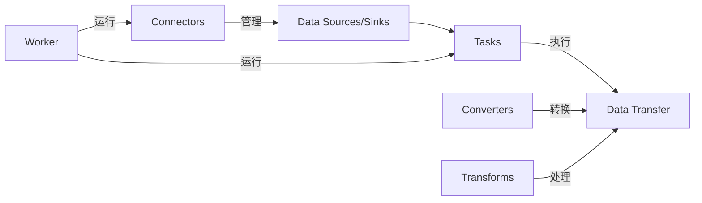

# Kafka Connect原理与代码实例讲解

## 1. 背景介绍
在现代数据密集型应用中，数据的实时集成和处理变得至关重要。Apache Kafka作为一个高吞吐量、可扩展、高可用性的分布式消息系统，已经成为企业数据架构中不可或缺的一部分。Kafka Connect是Kafka生态系统中的一个组件，它简化了将数据导入和导出Kafka的过程。本文将深入探讨Kafka Connect的原理，并通过代码实例详细讲解其使用方法。

## 2. 核心概念与联系
Kafka Connect基于几个核心概念：Connectors、Tasks、Converters、Transforms和Worker。Connectors负责管理数据源和目标系统之间的连接；Tasks执行数据的实际传输工作；Converters处理数据格式的转换；Transforms允许对数据进行简单的转换；Worker则是运行Connectors和Tasks的进程。



## 3. 核心算法原理具体操作步骤
Kafka Connect的核心算法原理是分布式数据复制和流处理。操作步骤包括：配置Connector，启动Worker，Worker根据配置创建Tasks，Tasks执行数据的复制或流处理。

## 4. 数学模型和公式详细讲解举例说明
Kafka Connect的性能可以通过数学模型来评估，例如，吞吐量（TPS）可以用以下公式表示：

$$ TPS = \frac{Total Messages}{Total Time} $$

其中，Total Messages是在特定时间内成功处理的消息总数，Total Time是处理这些消息所花费的总时间。

## 5. 项目实践：代码实例和详细解释说明
以一个简单的文件到Kafka的Connector为例，我们可以通过以下步骤实现数据的导入：

1. 创建Connector配置文件`file-source.properties`：

```properties
name=file-source-connector
connector.class=FileStreamSource
tasks.max=1
file=test.txt
topic=test-topic
```

2. 使用Kafka Connect的REST API启动Connector：

```bash
curl -X POST -H "Content-Type: application/json" --data '@file-source.properties' http://localhost:8083/connectors
```

3. Kafka Connect将会读取`test.txt`文件的内容，并将数据发布到`test-topic`主题。

## 6. 实际应用场景
Kafka Connect广泛应用于日志收集、数据库同步、云服务集成等场景。例如，它可以用于实时同步MySQL数据库到Elasticsearch，以便进行实时搜索和分析。

## 7. 工具和资源推荐
- Confluent Platform：提供Kafka Connect的企业级支持和额外的Connector。
- Kafka Connect Hub：一个收集了社区开发的Connectors的地方。
- Kafka Connect UI：一个用于管理Kafka Connect的Web界面工具。

## 8. 总结：未来发展趋势与挑战
Kafka Connect作为数据集成的关键组件，其未来的发展趋势包括更多的云原生支持、更强的流处理能力和更丰富的Connector生态。同时，它也面临着数据一致性、容错性和扩展性等挑战。

## 9. 附录：常见问题与解答
Q1: Kafka Connect和Kafka Streams的区别是什么？
A1: Kafka Connect主要用于数据集成，而Kafka Streams是一个流处理库。

Q2: 如何监控Kafka Connect的性能？
A2: 可以使用JMX监控或Confluent Control Center等工具来监控性能指标。

Q3: Kafka Connect支持哪些数据格式？
A3: Kafka Connect支持多种数据格式，包括JSON、Avro、Protobuf等。

作者：禅与计算机程序设计艺术 / Zen and the Art of Computer Programming