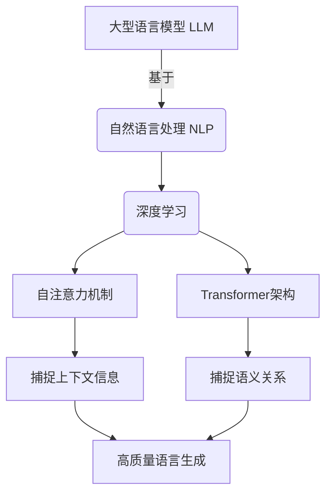
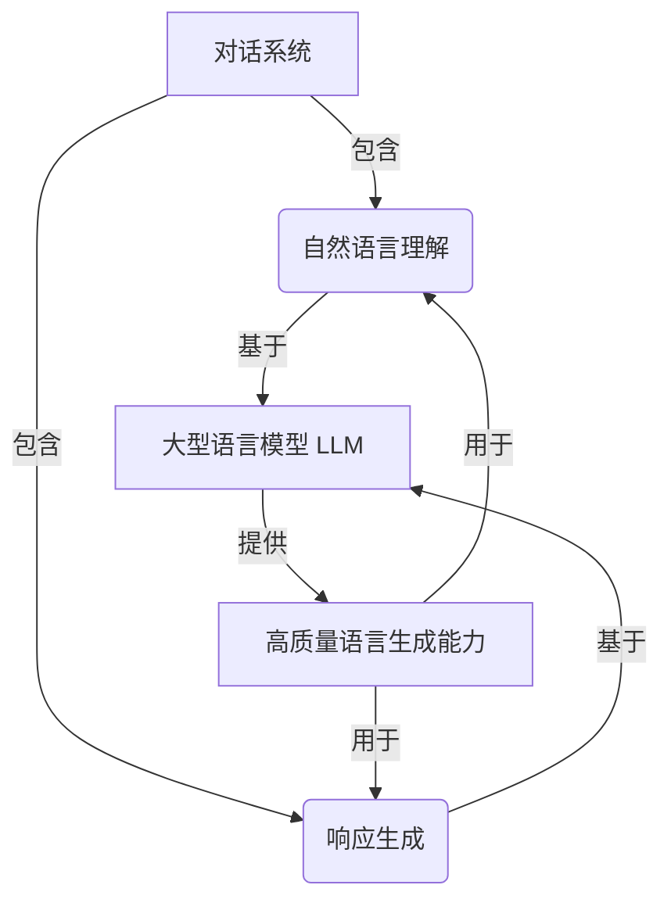
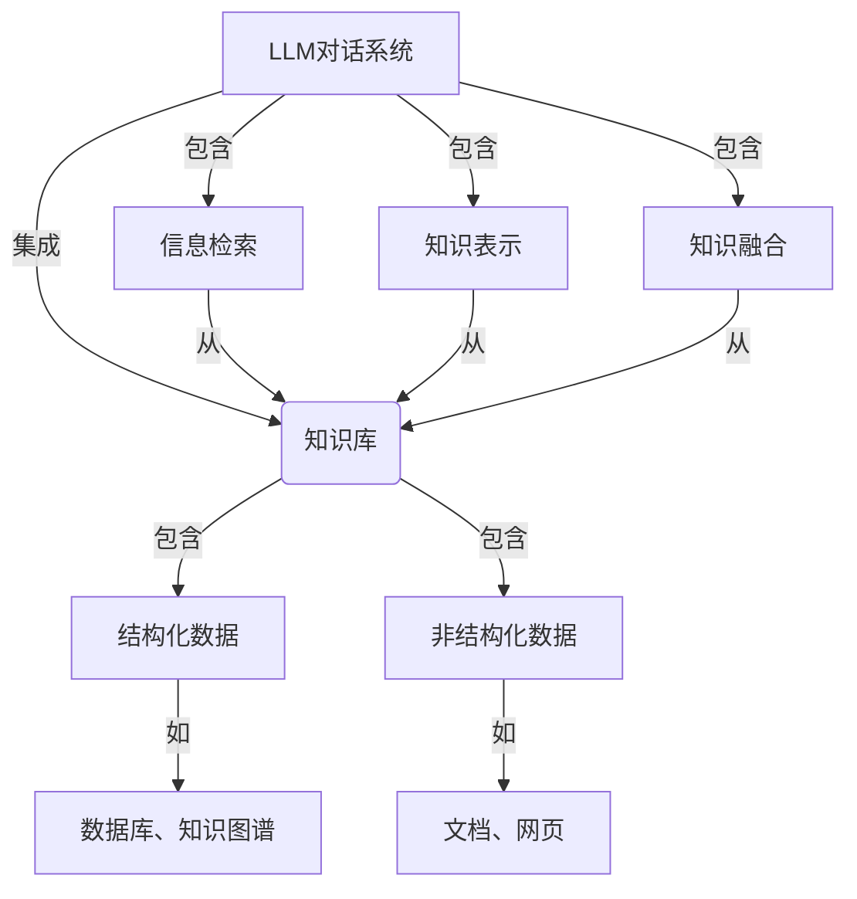
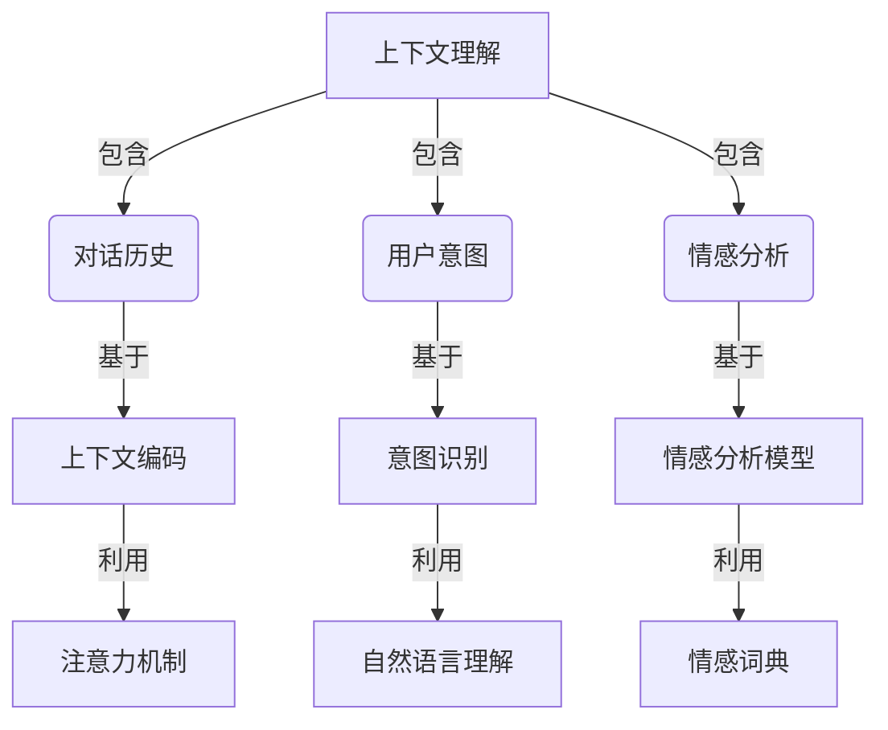
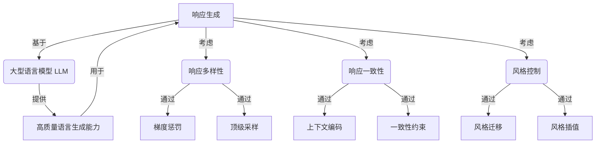

# LLM-based Chatbot System Implementation

## 1. 背景介绍

在当今数字时代,人工智能技术的发展正在改变着我们的生活和工作方式。其中,基于大型语言模型(Large Language Model,LLM)的对话系统已经成为一种热门的应用场景。LLM通过从海量文本数据中学习,能够生成看似人类写作的自然语言响应,为用户提供智能化的对话交互体验。

LLM驱动的对话系统在客户服务、教育、医疗等多个领域发挥着重要作用。它们可以回答用户的各种问题,提供个性化的建议和指导,甚至进行多轮对话。与传统的基于规则或检索的对话系统相比,LLM对话系统具有更强的理解和生成能力,可以产生更加自然流畅的响应。

随着LLM模型的不断进化,如GPT-3、PaLM等,对话系统的性能也在持续提升。然而,构建一个高质量的LLM对话系统仍然是一个巨大的挑战,需要解决诸多技术难题,如信息检索、知识库集成、上下文理解、响应生成等。本文将探讨LLM对话系统的实现细节,分享相关的核心概念、算法原理、最佳实践和未来发展趋势。

## 2. 核心概念与联系

在深入探讨LLM对话系统的实现之前,让我们先了解一些核心概念及其相互关系。

### 2.1 大型语言模型 (LLM)

大型语言模型是一种基于深度学习的自然语言处理(NLP)模型,通过从大量文本数据中学习,能够生成看似人类写作的自然语言响应。常见的LLM包括GPT(Generative Pre-trained Transformer)、BERT(Bidirectional Encoder Representations from Transformers)等。这些模型通过自注意力机制和transformer架构,捕捉文本中的上下文信息和语义关系,从而实现高质量的语言生成能力。

### 2.2 对话系统

对话系统是一种能够与用户进行自然语言交互的智能系统。它可以理解用户的输入,并生成相应的自然语言响应。传统的对话系统通常基于规则或检索,而LLM对话系统则利用大型语言模型的强大生成能力,产生更加自然流畅的响应。

### 2.3 知识库集成

为了提高对话系统的知识覆盖面和响应质量,通常需要将外部知识库与LLM集成。知识库可以是结构化数据(如数据库、知识图谱)或非结构化数据(如文档、网页)。集成知识库的关键在于建立LLM与知识库之间的桥梁,实现信息检索、知识表示和融合等功能。

### 2.4 上下文理解

对话系统需要理解用户输入的上下文,包括对话历史、用户意图、情感等,才能生成恰当的响应。上下文理解是实现自然流畅对话的关键,可以通过上下文编码、注意力机制等技术来实现。

### 2.5 响应生成

响应生成是对话系统的核心功能,需要根据用户输入和上下文信息生成自然、恰当的语言响应。这可以通过LLM的语言生成能力来实现,同时还需要考虑响应的多样性、一致性、风格控制等因素。

通过上述核心概念及其关系,我们可以更好地理解LLM对话系统的整体架构和工作原理。接下来,我们将深入探讨系统实现的具体细节。

## 3. 核心算法原理具体操作步骤

实现一个高质量的LLM对话系统需要解决多个关键技术问题,包括信息检索、知识表示、上下文理解、响应生成等。下面我们将介绍一些核心算法原理和具体操作步骤。

### 3.1 信息检索

为了从知识库中获取相关信息,需要进行有效的信息检索。常用的算法包括BM25、TF-IDF等基于词袋模型的方法,以及基于神经网络的语义检索模型,如双编码器(Dual Encoder)、交互式检索(Interactive Retrieval)等。

**BM25算法步骤**:

1. 对文档和查询进行分词和词条统计
2. 计算每个词条在文档中的TF(词频)和IDF(逆文档频率)
3. 根据BM25公式计算文档与查询的相似度分数
4. 根据分数对文档进行排序,返回最相关的Top N个文档

**双编码器语义检索步骤**:

1. 使用双塔模型对查询和文档进行编码,得到语义向量表示
2. 计算查询向量与所有文档向量的相似度(如余弦相似度)
3. 根据相似度对文档进行排序,返回最相关的Top N个文档

### 3.2 知识表示

为了更好地利用知识库中的信息,需要对知识进行有效的表示和编码。常用的方法包括:

- **结构化数据表示**: 对于结构化数据(如数据库、知识图谱),可以使用图嵌入技术将实体和关系编码为低维向量表示。
- **非结构化数据表示**: 对于非结构化数据(如文本文档),可以使用预训练语言模型(如BERT)对文本进行编码,得到上下文化的词向量表示。

### 3.3 上下文理解

对话系统需要理解用户输入的上下文,包括对话历史、用户意图、情感等。常用的上下文理解技术包括:

- **对话历史编码**: 使用序列模型(如LSTM、Transformer)对历史对话进行编码,捕捉上下文信息。
- **用户意图识别**: 使用意图分类模型(如TextCNN、BERT等)识别用户的对话意图。
- **情感分析**: 使用情感分析模型(如基于词典的方法、基于深度学习的方法)分析用户的情感状态。

### 3.4 响应生成

响应生成是对话系统的核心功能,需要根据用户输入和上下文信息生成自然、恰当的语言响应。常用的响应生成算法包括:

- **基于LLM的生成**: 使用预训练的大型语言模型(如GPT-3)直接生成响应,可能需要进行微调以适应特定领域。
- **基于检索增强的生成**: 首先从知识库中检索相关信息,然后将检索结果与用户输入拼接,作为LLM的输入进行生成。
- **基于知识增强的生成**: 将知识库中的结构化和非结构化知识融合到LLM中,通过知识注入或知识蒸馏的方式提高响应质量。

此外,还需要考虑响应的多样性、一致性、风格控制等因素,可以采用梯度惩罚、顶级采样、一致性约束、风格迁移等技术进行优化。

通过上述核心算法,我们可以构建出一个端到端的LLM对话系统。下面我们将给出一个具体的系统架构示例。

## 4. 数学模型和公式详细讲解举例说明

在LLM对话系统的实现中,有一些重要的数学模型和公式需要了解。下面我们将详细讲解其中的几个代表性模型。

### 4.1 BM25

BM25是一种常用的信息检索算法,用于计算文档与查询的相关性分数。它的公式如下:

$$
\mathrm{score}(D,Q) = \sum_{i=1}^{n} \mathrm{IDF}(q_i) \cdot \frac{f(q_i,D) \cdot (k_1+1)}{f(q_i,D)+k_1\cdot(1-b+b\cdot\frac{|D|}{\mathrm{avgdl}})}
$$

其中:

- $D$ 表示文档
- $Q$ 表示查询
- $q_i$ 表示查询中的第 $i$ 个词条
- $f(q_i,D)$ 表示词条 $q_i$ 在文档 $D$ 中出现的次数
- $|D|$ 表示文档 $D$ 的长度
- $\mathrm{avgdl}$ 表示文档集合的平均长度
- $k_1$ 和 $b$ 是调节参数,用于控制词频和文档长度的影响程度

IDF(Inverse Document Frequency)是逆文档频率,用于衡量词条的重要性,公式如下:

$$
\mathrm{IDF}(q_i) = \log \frac{N-n(q_i)+0.5}{n(q_i)+0.5}
$$

其中:

- $N$ 表示文档集合的总文档数
- $n(q_i)$ 表示包含词条 $q_i$ 的文档数

通过BM25算法,我们可以有效地计算文档与查询的相关性分数,并根据分数对文档进行排序,从而实现高质量的信息检索。

### 4.2 双编码器语义检索

双编码器语义检索是一种基于神经网络的信息检索方法,它通过学习查询和文档的语义向量表示,来计算它们之间的相似度。

假设我们有一个查询 $q$ 和一个文档集合 $\{d_1, d_2, \dots, d_n\}$,我们的目标是找到与查询 $q$ 最相关的Top N个文档。

首先,我们使用两个独立的编码器网络 $E_q$ 和 $E_d$ 分别对查询和文档进行编码,得到它们的语义向量表示:

$$
\vec{q} = E_q(q), \quad \vec{d_i} = E_d(d_i)
$$

然后,我们计算查询向量 $\vec{q}$ 与每个文档向量 $\vec{d_i}$ 的相似度,通常使用余弦相似度:

$$
\mathrm{sim}(q, d_i) = \frac{\vec{q} \cdot \vec{d_i}}{||\vec{q}|| \cdot ||\vec{d_i}||}
$$

最后,我们根据相似度分数对文档进行排序,返回与查询最相关的Top N个文档。

在训练阶段,我们可以使用对比损失函数(Contrastive Loss)来优化编码器网