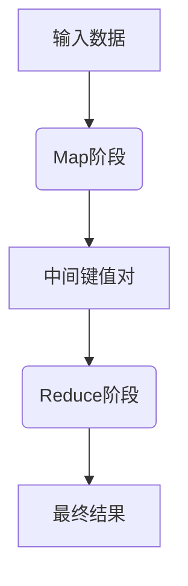

## 1.背景介绍

在处理大数据时，我们经常会面临海量数据的处理问题。传统的单机处理方式在处理大规模数据时，无法满足处理速度和存储需求。这时，我们需要一种能够在分布式环境下运行的计算模型，来处理这些大规模数据，这就是MapReduce。

MapReduce是一种编程模型，用于大规模数据集（大于1TB）的并行运算。这个模型是由Google的工程师在2004年的论文《MapReduce: Simplified Data Processing on Large Clusters》中首次提出，现在已经成为处理大数据的重要工具。

## 2.核心概念与联系

MapReduce的工作流程主要分为两个阶段：Map阶段和Reduce阶段。在Map阶段，输入的数据会被切分成一系列的键值对，然后通过用户自定义的Map函数进行处理，生成一系列的中间键值对。在Reduce阶段，这些中间键值对会被聚合，然后通过用户自定义的Reduce函数进行处理，生成最终的结果。



## 3.核心算法原理具体操作步骤

### 3.1 Map阶段

在Map阶段，MapReduce框架会将输入数据切分成一系列的键值对，然后通过用户自定义的Map函数进行处理。Map函数的输入是一个键值对，输出是一系列的中间键值对。

### 3.2 Shuffle阶段

在Map阶段之后，MapReduce框架会进行Shuffle阶段。在这个阶段，框架会将所有Map函数输出的中间键值对进行排序，然后按照键进行分组，使得所有具有相同键的键值对都在一起。

### 3.3 Reduce阶段

在Shuffle阶段之后，MapReduce框架会进行Reduce阶段。在这个阶段，框架会将每个键和对应的一组值作为输入，传递给用户自定义的Reduce函数。Reduce函数的输出是一系列的最终结果。

## 4.数学模型和公式详细讲解举例说明

在MapReduce模型中，我们可以将Map函数和Reduce函数表示为两个数学函数。设$K1$、$V1$、$K2$、$V2$分别为输入键的类型、输入值的类型、输出键的类型、输出值的类型，那么我们可以定义：

Map函数：$map: (K1, V1) \rightarrow list(K2, V2)$

Reduce函数：$reduce: (K2, list(V2)) \rightarrow list((K2, V2))$

在这个模型中，Map函数接收一个输入键值对，输出一系列的中间键值对。Reduce函数接收一个中间键和对应的一组值，输出一系列的最终键值对。

## 5.项目实践：代码实例和详细解释说明

下面我们通过一个简单的例子，来说明如何使用MapReduce进行计算。我们的任务是统计一系列文本中，每个单词出现的次数。

首先，我们需要定义Map函数和Reduce函数。Map函数将每行文本切分成单词，然后为每个单词生成一个键值对，键是单词，值是1。Reduce函数将所有具有相同单词的键值对聚合在一起，然后计算值的总和。

```python
def map_function(line):
    words = line.split()
    return [(word, 1) for word in words]

def reduce_function(word, values):
    return (word, sum(values))
```

然后，我们可以使用MapReduce框架，将这两个函数应用到我们的数据上，得到最终的结果。

```python
mapreduce = MapReduce(map_function, reduce_function)
result = mapreduce.run(data)
```

## 6.实际应用场景

MapReduce模型在处理大规模数据时，具有很好的扩展性和容错性。因此，它在许多领域都有广泛的应用，如搜索引擎、数据挖掘、机器学习等。

## 7.工具和资源推荐

对于想要使用MapReduce进行大数据处理的读者，我推荐使用Hadoop。Hadoop是一个开源的分布式计算框架，提供了MapReduce的实现，可以方便地进行大规模数据处理。

## 8.总结：未来发展趋势与挑战

随着数据规模的不断增长，MapReduce模型在未来的数据处理中将发挥越来越重要的作用。然而，MapReduce模型也面临着一些挑战，如处理实时数据、优化资源利用率等。

## 9.附录：常见问题与解答

Q: MapReduce是什么？

A: MapReduce是一种编程模型，用于大规模数据集的并行运算。

Q: MapReduce的工作流程是怎样的？

A: MapReduce的工作流程主要分为两个阶段：Map阶段和Reduce阶段。在Map阶段，输入的数据会被切分成一系列的键值对，然后通过用户自定义的Map函数进行处理，生成一系列的中间键值对。在Reduce阶段，这些中间键值对会被聚合，然后通过用户自定义的Reduce函数进行处理，生成最终的结果。

Q: MapReduce有哪些应用场景？

A: MapReduce在处理大规模数据时，具有很好的扩展性和容错性。因此，它在许多领域都有广泛的应用，如搜索引擎、数据挖掘、机器学习等。

作者：禅与计算机程序设计艺术 / Zen and the Art of Computer Programming