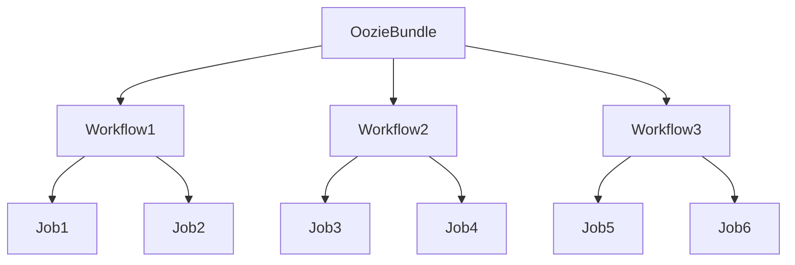

# OozieBundle在物联网领域的应用实例

## 1.背景介绍

随着物联网(IoT)技术的快速发展,越来越多的设备和传感器被连接到互联网上。这些设备会持续不断地产生大量的数据,如何高效地收集、处理和分析这些海量数据,成为了物联网领域的一个重大挑战。Apache Oozie是一款用于管理Hadoop作业(如MapReduce、Pig、Hive等)的工作流调度系统,它提供了一种强大的机制来协调和监控复杂的数据处理流程。而OozieBundle则是Oozie中一个非常有用的特性,它允许将多个Oozie工作流组合成一个逻辑单元,从而简化了对物联网数据处理流程的管理。

## 2.核心概念与联系

### 2.1 Oozie工作流

Oozie工作流是Oozie中的核心概念,它定义了一系列需要按特定顺序执行的作业。每个作业可以是MapReduce、Pig、Hive等任何可以在Hadoop上运行的程序。工作流中的作业通过控制依赖关系(如前一个作业的输出作为后一个作业的输入)来确定执行顺序。

### 2.2 OozieBundle

OozieBundle是一个更高层次的概念,它将多个相关的Oozie工作流组合成一个逻辑单元。每个Bundle中可以包含一个或多个工作流,这些工作流可以并行执行,也可以根据依赖关系按序执行。OozieBundle为管理和监控复杂的数据处理流程提供了极大的便利。

### 2.3 Mermaid流程图



上图展示了一个OozieBundle包含三个工作流(Workflow1、Workflow2和Workflow3)的示例,每个工作流中又包含多个作业(Job)。OozieBundle可以灵活地组织和协调这些工作流和作业的执行顺序。

## 3.核心算法原理具体操作步骤

OozieBundle的核心算法原理可以概括为以下几个步骤:

1. **定义工作流**:首先,需要定义OozieBundle中包含的每个工作流,包括工作流中的作业、作业之间的依赖关系等。这通常是通过编写一个XML文件来实现的。

2. **定义Bundle**:接下来,需要定义OozieBundle本身,指定它包含哪些工作流,以及工作流之间的依赖关系。同样,这也是通过编写一个XML文件来完成的。

3. **提交Bundle**:将定义好的Bundle提交到Oozie系统中,Oozie会根据Bundle中的配置信息来协调和执行各个工作流。

4. **监控执行状态**:Oozie提供了丰富的工具和接口,允许用户实时监控Bundle及其包含的工作流和作业的执行状态。

5. **错误处理**:如果某个作业或工作流执行失败,Oozie会根据预定义的策略(如重试、终止等)进行相应的处理。

6. **结果收集**:当所有工作流和作业都执行完毕后,Oozie会将最终的输出结果收集到指定的位置,供后续分析和处理使用。

这个过程可以通过编写脚本或使用Oozie提供的命令行工具来自动化执行。下面是一个简单的示例,展示了如何定义一个包含两个工作流的OozieBundle:

```xml
<bundle-app name="my-bundle" xmlns="uri:oozie:bundle:0.2">
  <coordinator name="coord1">
    <!-- 工作流1的定义 -->
  </coordinator>
  
  <coordinator name="coord2">
    <!-- 工作流2的定义 -->
  </coordinator>
</bundle-app>
```

## 4.数学模型和公式详细讲解举例说明

在处理物联网数据时,常常需要使用一些数学模型和公式来对数据进行分析和预测。以下是一些常见的数学模型和公式,以及它们在物联网领域的应用:

### 4.1 时间序列分析

时间序列分析是一种常用的数据分析方法,它通过研究过去的数据来预测未来的趋势。在物联网领域,时间序列分析可以应用于诸如设备故障预测、能源需求预测等场景。

常用的时间序列模型包括自回归移动平均模型(ARMA)和自回归综合移动平均模型(ARIMA)。ARIMA模型的基本形式如下:

$$
y_t = c + \phi_1y_{t-1} + \phi_2y_{t-2} + ... + \phi_py_{t-p} + \theta_1\epsilon_{t-1} + \theta_2\epsilon_{t-2} + ... + \theta_q\epsilon_{t-q} + \epsilon_t
$$

其中:
- $y_t$是时间t的观测值
- $\phi_i(i=1,2,...,p)$是自回归参数
- $\theta_j(j=1,2,...,q)$是移动平均参数
- $\epsilon_t$是时间t的残差项,服从均值为0、方差为$\sigma^2$的正态分布

通过估计这些参数,我们可以构建出适合观测数据的ARIMA模型,并用于预测未来的值。

### 4.2 回归分析

回归分析是另一种常用的数据分析方法,它研究因变量与一个或多个自变量之间的关系。在物联网领域,回归分析可以应用于建模分析传感器数据与环境条件之间的关系。

最简单的回归模型是一元线性回归模型:

$$
y = \beta_0 + \beta_1x + \epsilon
$$

其中:
- $y$是因变量
- $x$是自变量
- $\beta_0$是截距
- $\beta_1$是回归系数
- $\epsilon$是残差项

通过最小二乘法等方法估计$\beta_0$和$\beta_1$的值,我们可以得到拟合数据的回归直线方程。

对于存在多个自变量的情况,可以使用多元线性回归模型:

$$
y = \beta_0 + \beta_1x_1 + \beta_2x_2 + ... + \beta_kx_k + \epsilon
$$

其中$x_1, x_2, ..., x_k$是k个自变量。

以上仅是回归分析中最基本的线性模型,在实际应用中还可以使用非线性回归模型、逻辑回归模型等,以更好地拟合复杂的数据模式。

### 4.3 聚类分析

聚类分析是一种无监督学习技术,它通过对数据进行分组,发现数据内在的结构和模式。在物联网领域,聚类分析可以用于对传感器数据进行分组,从而发现异常值或识别设备的工作模式。

常用的聚类算法包括K-Means算法、层次聚类算法等。以K-Means算法为例,其目标是将n个数据点$\{x_1, x_2, ..., x_n\}$划分为k个簇$\{C_1, C_2, ..., C_k\}$,使得簇内数据点之间的平方和最小:

$$
\underset{S}{\mathrm{argmin}}\sum_{i=1}^{k}\sum_{x\in C_i}\|x-\mu_i\|^2
$$

其中$\mu_i$是簇$C_i$的质心,定义为:

$$
\mu_i = \frac{1}{|C_i|}\sum_{x\in C_i}x
$$

通过迭代计算质心并重新划分数据点,最终可以得到最优的聚类结果。

以上是一些常见的数学模型和公式,在实际应用中还可以根据具体的场景和需求,选择或开发出更加合适的模型和算法。

## 5.项目实践:代码实例和详细解释说明

为了更好地理解OozieBundle在物联网领域的应用,我们来看一个实际的项目实践案例。假设我们需要构建一个系统,用于收集和处理来自多个城市的环境监测传感器数据,并对这些数据进行分析和可视化。

### 5.1 数据收集

我们首先需要一个工作流来收集原始的传感器数据,并将其存储到HDFS中。这个工作流可以包括以下几个作业:

1. **数据抓取作业**:使用Flume或Kafka等工具,从各个城市的传感器中抓取实时数据。
2. **数据清洗作业**:对抓取到的原始数据进行清洗和格式化,去除无效或异常的数据。
3. **数据存储作业**:将清洗后的数据存储到HDFS中,为后续的分析和处理做准备。

下面是一个使用Oozie定义这个工作流的示例(data_collection.xml):

```xml
<workflow-app name="data-collection-wf" xmlns="uri:oozie:workflow:0.5">
  <start to="fetch-data"/>
  
  <action name="fetch-data">
    <flume xmlns="uri:oozie:flume-action:0.2">
      <workflow-configuration>
        <!-- Flume配置 -->
      </workflow-configuration>
    </flume>
    <ok to="clean-data"/>
    <error to="fail"/>
  </action>

  <action name="clean-data">
    <map-reduce>
      <job-tracker>${jobTracker}</job-tracker>
      <name-node>${nameNode}</name-node>
      <configuration>
        <!-- MapReduce作业配置 -->
      </configuration>
    </map-reduce>
    <ok to="store-data"/>
    <error to="fail"/>
  </action>

  <action name="store-data">
    <fs>
      <delete path="${output}"/>
      <mkdir path="${output}"/>
    </fs>
    <ok to="end"/>
    <error to="fail"/>
  </action>

  <kill name="fail">
    <message>Data collection failed!</message>
  </kill>
  <end name="end"/>
</workflow-app>
```

### 5.2 数据分析

收集到原始数据后,我们需要一个工作流来对这些数据进行分析,例如计算每个城市的空气质量指数(AQI)、温度和湿度的统计值等。这个工作流可以包括以下几个作业:

1. **数据抽取作业**:从HDFS中抽取需要分析的数据。
2. **AQI计算作业**:根据各种污染物浓度计算AQI指数。
3. **温湿度统计作业**:计算每个城市的温度和湿度的均值、方差等统计值。
4. **结果存储作业**:将分析结果存储到HDFS中,为后续的可视化做准备。

下面是一个使用Oozie定义这个工作流的示例(data_analysis.xml):

```xml
<workflow-app name="data-analysis-wf" xmlns="uri:oozie:workflow:0.5">
  <start to="extract-data"/>
  
  <action name="extract-data">
    <fs>
      <delete path="${output}"/>
      <mkdir path="${output}"/>
      <copy source="${input}" dest="${output}"/>
    </fs>
    <ok to="fork"/>
    <error to="fail"/>
  </action>

  <fork name="fork">
    <path start="calc-aqi"/>
    <path start="stats-temp-humi"/>
  </fork>

  <action name="calc-aqi">
    <map-reduce>
      <!-- AQI计算作业配置 -->
    </map-reduce>
    <ok to="join"/>
    <error to="fail"/>
  </action>

  <action name="stats-temp-humi">
    <map-reduce>
      <!-- 温湿度统计作业配置 -->
    </map-reduce>
    <ok to="join"/>
    <error to="fail"/>
  </action>

  <join name="join" to="store-results"/>

  <action name="store-results">
    <fs>
      <move source="${output}" dest="${output_final}"/>
    </fs>
    <ok to="end"/>
    <error to="fail"/>
  </action>

  <kill name="fail">
    <message>Data analysis failed!</message>
  </kill>
  <end name="end"/>
</workflow-app>
```

在这个工作流中,我们使用了`fork`和`join`节点,允许AQI计算作业和温湿度统计作业并行执行,从而提高了整体的效率。

### 5.3 数据可视化

最后,我们需要一个工作流来将分析结果进行可视化,生成易于理解的报告和图表。这个工作流可以包括以下几个作业:

1. **数据抽取作业**:从HDFS中抽取分析结果数据。
2. **报告生成作业**:根据分析结果生成PDF或HTML格式的报告。
3. **图表生成作业**:根据分析结果生成各种图表,如折线图、柱状图等。
4. **结果发布作业**:将生成的报告和图表发布到Web服务器上,供用