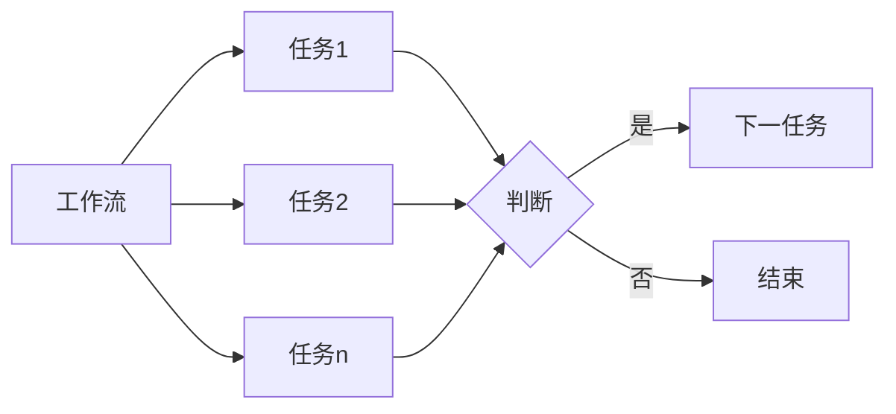

## 1. 背景介绍

在大数据处理领域，工作流的管理和自动化是至关重要的。Apache Oozie是一个用于管理Hadoop作业的工作流调度系统，它允许用户创建包含多个作业的复杂工作流，并以预定的顺序执行这些作业。Oozie可以用来触发Hadoop作业，包括MapReduce, Pig, Hive脚本，以及自定义的Java应用程序。它是一个可扩展、可靠和高度集成的系统，能够满足企业级的数据处理需求。

## 2. 核心概念与联系

Oozie的核心概念包括工作流（Workflow），协调器（Coordinator），和捆绑（Bundle）。工作流是一系列作业的集合，这些作业可以是Hadoop MapReduce任务，Pig脚本，Hive查询等。协调器用于定时启动工作流，而捆绑则是多个协调器的集合，用于跨多个工作流管理依赖关系。



## 3. 核心算法原理具体操作步骤

Oozie工作流的执行基于有向无环图（DAG），每个节点代表一个作业或者任务。工作流定义在XML文件中，遵循Oozie工作流定义语言（Workflow Definition Language）。当工作流被触发时，Oozie引擎会解析XML文件，并按照定义的顺序执行每个任务。

## 4. 数学模型和公式详细讲解举例说明

Oozie的调度算法可以用图论中的拓扑排序算法来描述。拓扑排序是对有向无环图（DAG）的顶点的线性排序，使得对于任何来自顶点U到顶点V的边，U在排序中都出现在V之前。

$$
\forall (U, V) \in Edges, \text{index}(U) < \text{index}(V)
$$

其中，$Edges$ 是图中所有边的集合，$\text{index}(V)$ 是顶点V在拓扑排序中的位置。

## 5. 项目实践：代码实例和详细解释说明

以下是一个简单的Oozie工作流XML示例，它定义了一个MapReduce作业：

```xml
<workflow-app xmlns="uri:oozie:workflow:0.5" name="map-reduce-wf">
    <start to="map-reduce-node"/>
    <action name="map-reduce-node">
        <map-reduce>
            <job-tracker>${jobTracker}</job-tracker>
            <name-node>${nameNode}</name-node>
            <configuration>
                <property>
                    <name>mapred.job.queue.name</name>
                    <value>${queueName}</value>
                </property>
            </configuration>
        </map-reduce>
        <ok to="end"/>
        <error to="fail"/>
    </action>
    <kill name="fail">
        <message>MapReduce failed, error message[${wf:errorMessage(wf:lastErrorNode())}]</message>
    </kill>
    <end name="end"/>
</workflow-app>
```

在这个例子中，`<start>` 标签定义了工作流的起点，`<action>` 标签定义了一个MapReduce作业，`<ok>` 和 `<error>` 标签定义了作业成功或失败后的流程。

## 6. 实际应用场景

Oozie广泛应用于数据仓库的数据ETL过程，机器学习模型的训练和评估，以及基于时间或数据可用性的报表生成等场景。

## 7. 工具和资源推荐

- Oozie官方文档：提供详细的安装指南、用户手册和开发者指南。
- Hue：一个开源的Hadoop用户界面，支持通过Web界面创建和监控Oozie工作流。
- Oozie Workflow Generator：一个可以帮助生成Oozie工作流XML的工具。

## 8. 总结：未来发展趋势与挑战

随着云计算和容器化技术的发展，Oozie需要适应更加动态和弹性的计算环境。此外，Oozie的用户界面和错误诊断功能也需要进一步改进，以提高用户体验。

## 9. 附录：常见问题与解答

Q1: Oozie工作流可以并行执行任务吗？
A1: 是的，Oozie工作流支持并行任务执行，可以通过定义fork和join节点来实现。

Q2: 如何在Oozie工作流中处理依赖关系？
A2: 可以使用协调器来定义工作流的依赖关系，并根据时间或数据的可用性来触发工作流的执行。

作者：禅与计算机程序设计艺术 / Zen and the Art of Computer Programming