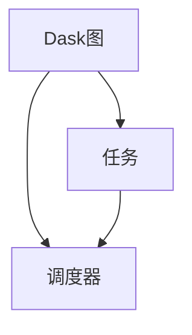

## 1.背景介绍

随着大数据和机器学习的发展，处理大规模数据集的需求日益增长。而Python作为一种广泛使用的编程语言，其生态系统中的许多库（如Numpy和Pandas）并未为大规模数据处理做优化。这就是Dask应运而生的原因。

Dask是一个灵活的并行计算库，它可以无缝地集成到Python生态系统中。Dask提供了一种在大型数据集上进行计算的方法，而无需离开你熟悉的Python环境。本文将深入探讨Dask的核心概念，算法原理，以及如何在实际项目中使用Dask。

## 2.核心概念与联系

Dask的核心概念包括Dask图、任务和调度器。Dask图是一种描述计算任务的数据结构，它是一个由任务组成的有向无环图（DAG）。任务是Dask图中的一个节点，它代表一个计算步骤。调度器则负责执行Dask图，它可以根据任务之间的依赖关系并行地执行任务。



## 3.核心算法原理具体操作步骤

Dask的核心算法原理包括任务划分和任务调度。任务划分是将大规模数据计算任务划分为多个小任务的过程，这些小任务可以在多个处理器上并行执行。任务调度是确定任务执行顺序的过程，它需要考虑任务之间的依赖关系和处理器的状态。

以下是一个简单的例子，说明如何使用Dask进行大规模数据计算：

```python
import dask.array as da

# 创建一个大型数组
x = da.random.random((10000, 10000), chunks=(1000, 1000))

# 进行一些计算
y = x + x.T
z = y[::2, 5000:].mean(axis=1)

# 计算结果
z.compute()
```

## 4.数学模型和公式详细讲解举例说明

在上述例子中，我们首先创建了一个大小为10000x10000的大型数组x，然后对x进行了一些计算。这些计算包括加法、转置和平均值计算。

在数学上，这些计算可以表示为以下公式：

$$
y = x + x^T
$$

$$
z = mean(y_{2i,5000:})
$$

其中，$x^T$表示x的转置，$y_{2i,5000:}$表示y的每隔一行从第5000列开始到最后的部分，$mean(\cdot)$表示求平均值。

## 5.项目实践：代码实例和详细解释说明

在实际项目中，我们可以使用Dask进行大规模数据处理和机器学习。以下是一个使用Dask进行线性回归的例子：

```python
from dask_ml.datasets import make_regression
from dask_ml.linear_model import LinearRegression

# 创建一个大型回归数据集
X, y = make_regression(n_samples=1000000, n_features=100, chunks=10000)

# 创建一个线性回归模型
lr = LinearRegression()

# 训练模型
lr.fit(X, y)

# 预测
y_pred = lr.predict(X)
```

在这个例子中，我们首先创建了一个大型的回归数据集，然后创建了一个线性回归模型，接着训练了这个模型，最后进行了预测。

## 6.实际应用场景

Dask在许多实际应用场景中都发挥了重要作用。例如，它可以用于处理大规模的日志文件，进行大规模的数据分析和可视化，以及训练大规模的机器学习模型。Dask的分布式计算能力使得它能够在单机上处理TB级别的数据，也可以在集群上处理PB级别的数据。

## 7.工具和资源推荐

如果你想更深入地学习和使用Dask，我推荐以下工具和资源：

- Dask官方文档：这是学习Dask的最好资源，它包含了详细的教程和API文档。
- Dask-ML：这是一个基于Dask的机器学习库，它提供了许多并行和分布式的机器学习算法。
- Dask-Examples：这是一个包含了许多Dask使用例子的GitHub仓库，你可以从中学习到如何在实际项目中使用Dask。

## 8.总结：未来发展趋势与挑战

随着大数据和机器学习的发展，Dask的重要性将会越来越大。然而，Dask也面临着一些挑战，例如如何提高计算效率，如何处理更大规模的数据，以及如何提供更丰富的机器学习算法。

## 9.附录：常见问题与解答

1. **问：Dask和Spark有什么区别？**
   
   答：Dask和Spark都是大规模数据处理框架，但它们有一些区别。首先，Dask是Python库，而Spark是Java库，这意味着Dask可以无缝集成到Python生态系统中，而Spark则需要通过PySpark接口来使用。其次，Dask更加灵活，它可以处理更复杂的计算任务，而Spark更适合处理批处理任务。最后，Dask的设计更加轻量级，它可以在单机上运行，也可以在集群上运行，而Spark则通常在集群上运行。

2. **问：Dask如何处理大规模数据？**
   
   答：Dask通过任务划分和任务调度来处理大规模数据。任务划分是将大规模数据计算任务划分为多个小任务的过程，这些小任务可以在多个处理器上并行执行。任务调度是确定任务执行顺序的过程，它需要考虑任务之间的依赖关系和处理器的状态。

3. **问：Dask适合做什么样的计算任务？**
   
   答：Dask适合做大规模的数据处理和机器学习任务。例如，你可以使用Dask处理大规模的日志文件，进行大规模的数据分析和可视化，以及训练大规模的机器学习模型。

作者：禅与计算机程序设计艺术 / Zen and the Art of Computer Programming