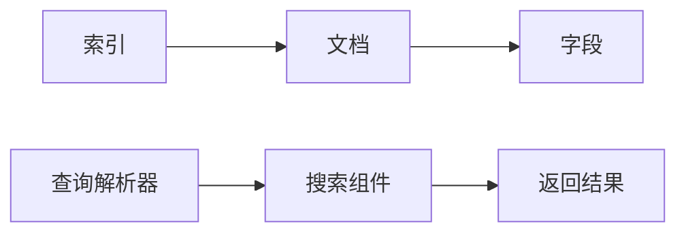

# Solr原理与代码实例讲解

## 1. 背景介绍

Apache Solr是一个开源的搜索平台，基于Lucene项目。它具备全文搜索、高亮显示、分面搜索、动态聚类、数据库集成以及富文本（如Word、PDF）处理能力。Solr广泛应用于企业级搜索领域，因其出色的可伸缩性、分布式搜索和索引复制功能而受到青睐。

## 2. 核心概念与联系

Solr的核心概念包括索引、文档、字段、查询解析器和搜索组件。索引是存储数据的地方，文档是索引中的基本单位，字段是文档的属性。查询解析器负责解析用户输入的查询语句，搜索组件则执行搜索操作并返回结果。



## 3. 核心算法原理具体操作步骤

Solr的核心算法基于Lucene，其操作步骤包括文档添加、索引创建、查询处理和结果返回。文档添加时，Solr会将文档内容转换为可索引的格式。索引创建过程中，Solr会对文档进行分词、索引和存储。查询处理时，Solr解析查询语句并搜索索引。最后，Solr根据搜索结果构建响应并返回给用户。

## 4. 数学模型和公式详细讲解举例说明

Solr的相关性打分模型基于TF-IDF算法，其中TF（Term Frequency）表示词频，IDF（Inverse Document Frequency）表示逆文档频率。打分公式如下：

$$
Score(q,d) = \sum_{t \in q} (TF(t,d) \times IDF(t,D))
$$

其中，$q$ 是查询，$d$ 是文档，$D$ 是文档集合，$t$ 是查询中的词项。

## 5. 项目实践：代码实例和详细解释说明

以下是一个Solr的Java API使用示例，展示了如何添加文档到Solr索引中：

```java
public void addDocumentToSolr(SolrClient client, String collection, SolrInputDocument doc) throws SolrServerException, IOException {
    UpdateResponse response = client.add(collection, doc);
    client.commit(collection);
    System.out.println("文档添加状态：" + response.getStatus());
}
```

这段代码创建了一个SolrInputDocument对象，通过SolrClient将其添加到指定的collection中，并提交更改。

## 6. 实际应用场景

Solr被广泛应用于电子商务网站的商品搜索、企业内部文档检索、新闻网站的内容检索等场景。它能够处理大量数据，并提供快速的搜索响应。

## 7. 工具和资源推荐

- Apache Lucene: Solr的核心搜索库。
- Solr官方文档: 提供详细的安装、配置和使用指南。
- Solr in Action: 一本深入讲解Solr使用的书籍。

## 8. 总结：未来发展趋势与挑战

Solr的未来发展趋势包括更加智能的查询解析、更好的数据分析能力和更强的分布式处理能力。挑战则包括处理更大规模的数据集、提高系统的稳定性和安全性。

## 9. 附录：常见问题与解答

Q1: Solr和Elasticsearch有什么区别？
A1: Solr和Elasticsearch都是基于Lucene的搜索服务器，但在分布式架构、实时搜索等方面有所不同。

Q2: Solr如何实现高可用性？
A2: Solr通过SolrCloud提供高可用性，它支持分片、复制和分布式索引。

作者：禅与计算机程序设计艺术 / Zen and the Art of Computer Programming