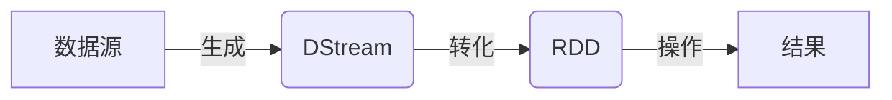

## 1.背景介绍

Spark Streaming 是 Apache Spark 的一个扩展组件，它能够对实时数据流进行处理。它的设计目标是提供一种高效、可扩展、容错的实时数据处理框架。它不仅支持各种数据源，如 Kafka、Flume、Kinesis 或 TCP 套接字，而且可以与 Spark 的机器学习和图形处理库进行无缝集成。

## 2.核心概念与联系

Spark Streaming 的核心概念是 Discretized Stream (DStream)，它是一系列连续的 RDD (Resilient Distributed Dataset)。每个 RDD 包含了一段时间内的数据。DStream 可以通过从数据源直接创建，也可以通过对其他 DStream 进行高级函数操作得到。在内部，DStream 的操作会被转化为 RDD 操作。



## 3.核心算法原理具体操作步骤

Spark Streaming 的工作流程可以概括为以下几个步骤：

1. **数据接收**：Spark Streaming 从数据源接收数据，并将其划分为小批次。
2. **转化和处理**：这些小批次被转化为 RDD，然后使用 Spark 的转化操作进行处理。
3. **输出操作**：处理后的数据可以通过输出操作推送到外部系统，或者进行持久化。

## 4.数学模型和公式详细讲解举例说明

在 Spark Streaming 中，一个关键的参数是批次间隔，它决定了生成 RDD 的频率。假设批次间隔为 $T$，那么在时间 $t$ 到 $t + T$ 之间的数据将被组合成一个 RDD。这可以表示为：

$$
RDD_t = \{x | t \leq time(x) < t + T\}
$$

其中 $time(x)$ 表示数据元素 $x$ 的时间戳。

## 5.项目实践：代码实例和详细解释说明

下面是一个简单的 Spark Streaming 代码示例，它从 TCP 套接字接收数据，并计算每个批次的字数。

```scala
import org.apache.spark._
import org.apache.spark.streaming._

val conf = new SparkConf().setAppName("WordCount")
val ssc = new StreamingContext(conf, Seconds(1))

val lines = ssc.socketTextStream("localhost", 9999)
val words = lines.flatMap(_.split(" "))
val pairs = words.map(word => (word, 1))
val wordCounts = pairs.reduceByKey(_ + _)

wordCounts.print()

ssc.start()
ssc.awaitTermination()
```

## 6.实际应用场景

Spark Streaming 可以应用于多种实时数据处理场景，例如：

- 实时日志处理：从日志服务器实时收集日志，进行错误检测或实时分析。
- 实时机器学习：对实时数据进行预测，例如信用卡欺诈检测、实时推荐等。

## 7.工具和资源推荐

- [Apache Spark 官方网站](https://spark.apache.org/)
- [Spark Streaming 官方文档](https://spark.apache.org/docs/latest/streaming-programming-guide.html)
- [Spark Streaming GitHub](https://github.com/apache/spark/tree/master/streaming)

## 8.总结：未来发展趋势与挑战

随着大数据和实时处理的需求日益增长，Spark Streaming 的重要性也在提升。但同时，它也面临一些挑战，例如如何处理大规模的实时数据，如何保证数据处理的实时性和准确性，以及如何提高系统的稳定性和可用性。

## 9.附录：常见问题与解答

**问题1：Spark Streaming 和 Storm 有什么区别？**

虽然 Spark Streaming 和 Storm 都是实时数据处理框架，但它们的设计理念和使用场景有所不同。Storm 更适合需要低延迟的实时处理，而 Spark Streaming 则更适合需要高吞吐量的批处理。

**问题2：如何选择合适的批次间隔？**

批次间隔的选择需要考虑多个因素，包括数据的速率、处理时间以及系统的延迟要求。一般来说，如果数据速率快或处理时间长，需要选择较大的批次间隔；反之，如果系统对延迟有严格要求，需要选择较小的批次间隔。

作者：禅与计算机程序设计艺术 / Zen and the Art of Computer Programming