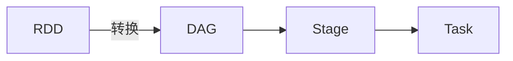

# Spark Task原理与代码实例讲解

## 1. 背景介绍
Apache Spark是一个开源的分布式计算系统，广泛应用于大数据处理和分析。Spark的核心优势在于其高效的内存计算能力和易用的编程模型。在Spark中，任务（Task）是执行的基本单位，理解其原理对于开发高效的Spark应用至关重要。

## 2. 核心概念与联系
在深入Spark Task之前，我们需要明确几个核心概念及其联系：

- **RDD（弹性分布式数据集）**：Spark的基本数据结构，支持分布式的数据集合。
- **DAG（有向无环图）**：RDD之间的转换操作形成的图。
- **Stage**：DAG中的一组任务，它们可以并行执行。
- **Task**：Stage中的最小执行单元，对应于对RDD的一次转换或动作。



## 3. 核心算法原理具体操作步骤
Spark的任务调度是基于DAGScheduler和TaskScheduler的协作完成的。DAGScheduler负责将用户程序转换成DAG，并将DAG划分为多个Stage。TaskScheduler负责将Stage中的Task分配给集群中的工作节点执行。

操作步骤如下：

1. **DAG构建**：用户代码中的RDD转换操作被转换为DAG。
2. **Stage划分**：DAGScheduler根据宽依赖将DAG划分为多个Stage。
3. **Task生成**：每个Stage中会生成对应的Task。
4. **任务调度**：TaskScheduler将Task分配给集群中的节点执行。

## 4. 数学模型和公式详细讲解举例说明
在Spark中，任务调度可以用图论中的DAG来表示。每个节点代表一个RDD，每条边代表一个转换操作。宽依赖（ShuffleDependency）会导致Stage的划分。数学模型可以表示为：

$$
G = (V, E)
$$

其中，$G$ 是DAG，$V$ 是RDD的集合，$E$ 是转换操作的集合。宽依赖的存在意味着：

$$
\exists e \in E, \text{使得} \; |e_{downstream}| > 1
$$

这里，$e_{downstream}$ 表示依赖于边 $e$ 的后续操作的数量。

## 5. 项目实践：代码实例和详细解释说明
让我们通过一个简单的Spark应用来理解Task的执行过程。假设我们要计算一个文本文件中单词的频率。

```scala
val textFile = sc.textFile("hdfs://...")
val counts = textFile.flatMap(line => line.split(" "))
                     .map(word => (word, 1))
                     .reduceByKey(_ + _)
counts.saveAsTextFile("hdfs://...")
```

在这个例子中，`flatMap`、`map` 和 `reduceByKey` 是转换操作，它们构建了DAG。`saveAsTextFile` 是一个动作操作，触发了任务的执行。

## 6. 实际应用场景
Spark Task的原理和操作在多个场景下都有应用，例如：

- **批量数据处理**：如日志分析、数据清洗等。
- **实时数据流处理**：如Spark Streaming应用。
- **机器学习**：如使用MLlib进行模型训练和预测。

## 7. 工具和资源推荐
为了更好地开发和调试Spark应用，以下是一些推荐的工具和资源：

- **Spark官方文档**：提供了详细的API参考和指南。
- **IntelliJ IDEA**：支持Scala和Spark的集成开发环境。
- **Zeppelin**：一个基于Web的笔记本，支持交互式数据分析。

## 8. 总结：未来发展趋势与挑战
Spark的未来发展趋势在于提高性能、增强稳定性和扩展生态系统。挑战包括处理更大规模的数据、优化资源管理和提升实时处理能力。

## 9. 附录：常见问题与解答
**Q1**: Spark Task和Stage的区别是什么？
**A1**: Stage是根据宽依赖划分的任务集合，而Task是Stage中的单个执行单元。

**Q2**: 如何优化Spark任务的性能？
**A2**: 可以通过调整并行度、优化数据分区和使用内存缓存等方式来优化性能。

**Q3**: Spark和Hadoop的关系是什么？
**A3**: Spark是Hadoop生态系统中的一个计算框架，它可以运行在Hadoop之上，使用HDFS进行数据存储。

---

作者：禅与计算机程序设计艺术 / Zen and the Art of Computer Programming