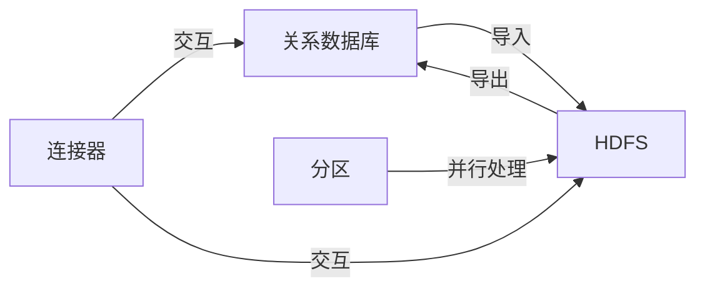

# Sqoop原理与代码实例讲解

## 1. 背景介绍
在大数据时代，数据的迁移与整合成为了数据分析不可或缺的一部分。Apache Sqoop是一个用于在Apache Hadoop和关系数据库服务器之间高效传输大量数据的工具。它的主要功能是在Hadoop的HDFS和关系型数据库之间进行数据的双向传输。Sqoop通过使用MapReduce来实现数据的并行处理，有效地解决了数据迁移过程中的性能瓶颈问题。

## 2. 核心概念与联系
Sqoop的核心概念包括连接器（Connectors）、导入（Import）、导出（Export）和分区（Partitioning）。连接器负责与外部数据库进行交互，导入功能将数据从关系数据库导入到HDFS，而导出功能则是将数据从HDFS导出到关系数据库。分区则是在导入过程中对数据进行分片，以实现并行处理。



## 3. 核心算法原理具体操作步骤
Sqoop的核心算法原理是基于MapReduce框架的。在导入过程中，Sqoop会根据指定的分区键将数据分片，每个分片由一个Map任务处理。Map任务连接数据库，执行SQL查询并将结果写入HDFS。在导出过程中，Sqoop将HDFS中的数据分成多个部分，每部分由一个Reduce任务处理，Reduce任务将数据写回数据库。

操作步骤如下：
1. 确定数据源和目标位置。
2. 选择合适的连接器。
3. 配置导入或导出任务的参数。
4. 执行Sqoop命令，启动MapReduce任务。
5. 监控任务执行状态，直至完成。

## 4. 数学模型和公式详细讲解举例说明
在Sqoop的数据导入过程中，数据分区是一个关键的数学模型。例如，如果我们有一个包含10亿条记录的表，我们可以根据某个数值型字段进行分区。假设这个字段是ID，范围从1到10亿，我们可以将这个范围分成100个分区，每个分区包含1000万条记录。

$$
\text{分区数} = \frac{\text{最大ID} - \text{最小ID}}{\text{每个分区的记录数}}
$$

$$
\text{分区数} = \frac{10^9 - 1}{10^7} = 100
$$

每个分区将由一个Map任务处理，这样可以并行地从数据库中读取数据并写入HDFS。

## 5. 项目实践：代码实例和详细解释说明
假设我们需要从MySQL数据库中导入一个名为`employees`的表到HDFS。以下是一个Sqoop导入命令的示例：

```shell
sqoop import \
--connect jdbc:mysql://localhost/dbname \
--username dbuser --password dbpass \
--table employees \
--target-dir /user/hadoop/employees \
--split-by id \
--m 4
```

这个命令将`employees`表导入到HDFS的`/user/hadoop/employees`目录中，使用`id`字段进行分区，并且启动4个Map任务进行数据导入。

## 6. 实际应用场景
Sqoop在数据仓库的构建、数据迁移、数据备份和灾难恢复等场景中有广泛的应用。例如，企业可以定期使用Sqoop将业务系统中的数据导入到Hadoop平台进行深度分析和挖掘。

## 7. 工具和资源推荐
- Apache Sqoop官方文档：提供详细的安装和使用指南。
- Hadoop：Sqoop的数据导入导出依赖于Hadoop环境。
- 数据库驱动：根据不同的数据库选择合适的JDBC驱动。

## 8. 总结：未来发展趋势与挑战
随着数据量的不断增长，Sqoop需要不断优化其性能和扩展性。未来的发展趋势可能包括更智能的数据分区策略、更高效的数据传输机制以及更紧密的云服务集成。挑战则包括处理更复杂的数据类型和结构、保证数据迁移的安全性以及提高容错能力。

## 9. 附录：常见问题与解答
- Q: Sqoop如何处理数据的增量导入？
- A: Sqoop提供了`--incremental`参数来支持增量导入，可以根据指定的列如时间戳或ID来导入更新的数据。

- Q: Sqoop是否支持所有的数据库？
- A: Sqoop通过JDBC连接器支持多种关系数据库，但是具体的数据库驱动和连接器可能需要用户根据数据库类型进行选择和配置。

作者：禅与计算机程序设计艺术 / Zen and the Art of Computer Programming