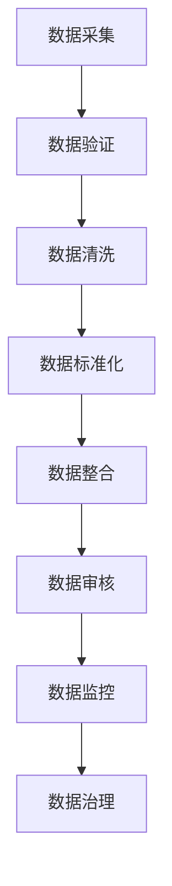

# The Role of Accuracy in Customer Relationship Management

## 1. 背景介绍

在当今竞争激烈的商业环境中,客户关系管理(Customer Relationship Management, CRM)已经成为企业保持竞争优势的关键因素之一。CRM系统旨在帮助企业更好地了解客户需求,提高客户满意度,并建立长期的客户关系。然而,CRM系统的成功在很大程度上依赖于数据的准确性和完整性。

准确的客户数据对于制定有效的营销策略、个性化客户体验以及优化业务流程至关重要。不准确的数据不仅会导致营销活动的低效率,还可能损害企业与客户之间的信任关系。因此,确保CRM系统中的数据准确性成为了企业面临的一大挑战。

## 2. 核心概念与联系

### 2.1 客户数据准确性

客户数据准确性是指CRM系统中存储的客户信息与实际客户信息之间的一致性程度。准确的客户数据包括:

- 基本信息(姓名、地址、联系方式等)
- 购买历史记录
- 偏好和兴趣爱好
- 人口统计学特征(年龄、性别、收入水平等)
- 互动记录(销售线索、投诉、支持请求等)

### 2.2 数据质量管理

数据质量管理(Data Quality Management, DQM)是确保CRM系统中数据准确性的关键过程。它包括以下几个方面:

- 数据采集和输入
- 数据验证和清洗
- 数据标准化和整合
- 数据审核和监控
- 数据治理和策略制定

### 2.3 客户体验和营销效率

准确的客户数据对于提供优质的客户体验和提高营销效率至关重要。具体包括:

- 个性化营销和推荐
- 精准目标客户群定位
- 提高营销活动的转化率
- 改善客户服务和支持质量
- 优化产品开发和定价策略

## 3. 核心算法原理具体操作步骤

确保CRM系统中客户数据的准确性需要采取一系列措施,包括数据采集、验证、清洗、标准化和监控等步骤。以下是一个典型的数据质量管理流程:



1. **数据采集**: 从各种来源(如网站表单、移动应用、客户服务中心等)收集客户数据。确保数据采集过程中的准确性和完整性。

2. **数据验证**: 使用各种验证规则和技术(如正则表达式、地址验证API等)检查数据的格式、完整性和合法性。

3. **数据清洗**: 处理数据中的错误、重复、不一致和缺失值。常见的清洗技术包括数据解析、数据转换、数据合并和数据补全等。

4. **数据标准化**: 将数据转换为统一的格式和编码,以便于存储、检索和分析。例如,将地址标准化为特定的格式。

5. **数据整合**: 将来自不同来源的数据集成到CRM系统中,并解决数据冲突和重复问题。

6. **数据审核**: 定期审核数据质量,识别潜在的问题和错误,并采取纠正措施。

7. **数据监控**: 持续监控数据质量指标,如准确性、完整性、一致性和及时性等,以确保数据质量保持在可接受的水平。

8. **数据治理**: 制定数据质量政策和标准,明确数据所有权和责任,并建立数据质量管理的组织架构和流程。

## 4. 数学模型和公式详细讲解举例说明

在评估和优化客户数据准确性时,我们可以借助一些数学模型和公式。以下是一些常见的指标和模型:

### 4.1 准确性评估指标

准确性评估指标用于衡量数据与实际值之间的差异程度。常见的指标包括:

1. **准确率(Accuracy)**: 正确记录的数量与总记录数量之比。

$$
\text{Accuracy} = \frac{\text{Number of correct records}}{\text{Total number of records}}
$$

2. **错误率(Error Rate)**: 错误记录的数量与总记录数量之比。

$$
\text{Error Rate} = \frac{\text{Number of incorrect records}}{\text{Total number of records}}
$$

3. **精确度(Precision)**: 正确识别的正例数量与所有识别为正例的数量之比。

$$
\text{Precision} = \frac{\text{True Positives}}{\text{True Positives + False Positives}}
$$

4. **召回率(Recall)**: 正确识别的正例数量与所有实际正例的数量之比。

$$
\text{Recall} = \frac{\text{True Positives}}{\text{True Positives + False Negatives}}
$$

5. **F1分数(F1 Score)**: 精确度和召回率的调和平均值,用于平衡两者之间的权衡。

$$
\text{F1 Score} = 2 \times \frac{\text{Precision} \times \text{Recall}}{\text{Precision} + \text{Recall}}
$$

### 4.2 数据匹配和去重算法

在数据整合和去重过程中,我们需要使用数据匹配算法来识别和合并重复的客户记录。常见的算法包括:

1. **字符串相似度算法**: 用于比较两个字符串的相似程度,如Levenshtein距离、Jaro-Winkler距离等。

2. **概率记录链接算法**: 基于多个属性的相似度计算,使用概率模型来确定两条记录是否指向同一个实体。

3. **规则匹配算法**: 根据预定义的规则和阈值来判断两条记录是否匹配。

4. **机器学习算法**: 使用监督或无监督的机器学习模型来自动学习数据模式并进行匹配。

以下是一个简单的基于字符串相似度的记录匹配示例:

```python
import jellyfish

def match_records(record1, record2, threshold=0.8):
    name1, name2 = record1['name'], record2['name']
    address1, address2 = record1['address'], record2['address']
    
    name_sim = jellyfish.jaro_winkler(name1, name2)
    address_sim = jellyfish.jaro_winkler(address1, address2)
    
    combined_sim = (name_sim + address_sim) / 2
    
    if combined_sim >= threshold:
        return True  # Records match
    else:
        return False  # Records do not match
```

在这个示例中,我们使用Jaro-Winkler距离来计算姓名和地址的相似度,然后取平均值作为综合相似度。如果综合相似度高于给定的阈值,则认为两条记录匹配。

## 5. 项目实践: 代码实例和详细解释说明

为了更好地理解如何在实践中提高客户数据准确性,我们可以通过一个示例项目来演示。假设我们有一个电子商务网站,需要整合来自不同渠道(网站、移动应用、客户服务中心等)的客户数据,并确保数据的准确性和一致性。

### 5.1 数据采集和验证

首先,我们需要从各个渠道采集客户数据,并进行初步的验证。以下是一个使用Python和Pandas库的示例代码:

```python
import pandas as pd

# 从网站表单采集数据
website_data = pd.read_csv('website_data.csv')
website_data = website_data.dropna(subset=['email', 'name'])  # 删除缺失关键字段的记录
website_data['email'] = website_data['email'].str.lower()  # 将电子邮件地址转换为小写

# 从移动应用采集数据
app_data = pd.read_json('app_data.json')
app_data = app_data[app_data['phone'].str.contains(r'^\d{10}$')]  # 过滤无效的手机号码

# 从客户服务中心采集数据
service_data = pd.read_excel('service_data.xlsx', sheet_name='customers')
service_data = service_data[~service_data['address'].str.contains('invalid')]  # 过滤无效地址
```

在这个示例中,我们从不同的数据源读取客户数据,并进行一些基本的验证和清理操作,如删除缺失关键字段的记录、过滤无效的手机号码和地址等。

### 5.2 数据清洗和标准化

接下来,我们需要对数据进行进一步的清洗和标准化,以提高数据质量。以下是一个使用Python和pandas库的示例代码:

```python
import pandas as pd
import re
import usaddress

# 合并数据
all_data = pd.concat([website_data, app_data, service_data], ignore_index=True)

# 清洗和标准化姓名
all_data['name'] = all_data['name'].str.split().str.join(' ')  # 删除多余空格
all_data['name'] = all_data['name'].str.replace(r'[^a-zA-Z\s]', '', regex=True)  # 删除非字母字符

# 清洗和标准化地址
all_data['address'] = all_data['address'].str.replace(r'\n', ' ', regex=True)  # 替换换行符
all_data['address'] = all_data['address'].apply(lambda x: usaddress.parse(x))  # 使用usaddress库解析地址
all_data['address'] = all_data['address'].apply(lambda x: ' '.join([y for y in x if y]))  # 重新组合地址字符串

# 标准化电话号码
all_data['phone'] = all_data['phone'].str.replace(r'[^0-9]', '', regex=True)  # 删除非数字字符
all_data['phone'] = all_data['phone'].str.slice(start=-10)  # 保留最后10位数字
```

在这个示例中,我们对姓名、地址和电话号码进行了清洗和标准化操作,如删除多余空格、替换特殊字符、使用地址解析库等。这些操作有助于提高数据的一致性和质量。

### 5.3 数据匹配和去重

最后,我们需要进行数据匹配和去重,以消除重复的客户记录。以下是一个使用Python和记录链接库py_dedupe的示例代码:

```python
import pandas as pd
import dedupe

# 准备数据
data = all_data[['name', 'address', 'phone', 'email']]
data = data.rename(columns={'name': 'name_str', 'address': 'address_str', 'phone': 'phone_str', 'email': 'email_str'})

# 初始化记录链接对象
deduper = dedupe.Dedupe(fields=['name_str', 'address_str', 'phone_str', 'email_str'])

# 训练模型
deduper.train(data.sample(10000, random_state=42))

# 进行聚类和去重
clustered_dupes = deduper.cluster(data)

# 合并重复记录
deduped_data = data.merge(clustered_dupes, on=data.columns.tolist(), how='left', indicator=True)
deduped_data = deduped_data[deduped_data['_merge'] == 'both'].drop('_merge', axis=1)
deduped_data = deduped_data.drop_duplicates(subset=['name_str', 'address_str', 'phone_str', 'email_str'], keep='first')
```

在这个示例中,我们使用py_dedupe库进行记录链接和去重操作。首先,我们初始化一个记录链接对象,并使用一部分数据进行模型训练。然后,我们对整个数据集进行聚类和去重。最后,我们合并重复记录,并删除重复的行。

通过这些步骤,我们可以获得一个更加准确和一致的客户数据集,为后续的客户关系管理和营销活动奠定基础。

## 6. 实际应用场景

准确的客户数据在多个领域都有着广泛的应用场景,包括但不限于:

1. **营销和广告**: 基于准确的客户数据,企业可以进行更有针对性的营销活动,提高营销效率和投资回报率(ROI)。例如,通过精准的客户细分和个性化推荐,企业可以提高转化率和客户保留率。

2. **客户服务和支持**: 准确的客户数据有助于企业更好地了解客户需求,提供更加个性化和高效的客户服务和支持。例如,通过分析客户的购买历史和偏好,企业可以提供更加贴合客户需求的解决方案。

3. **产品开发和定价**: 准确的客户数据可以帮助企业更好地了解市场需求和客户偏好,从而优化产品开发和定价策略。例如,通过分析客户的人口统计学特征和购买行